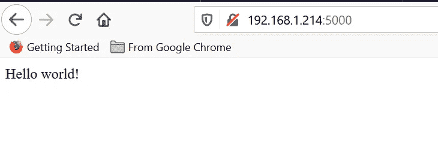
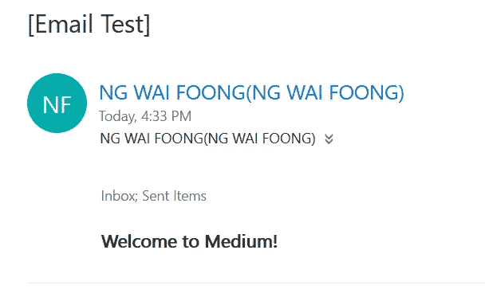
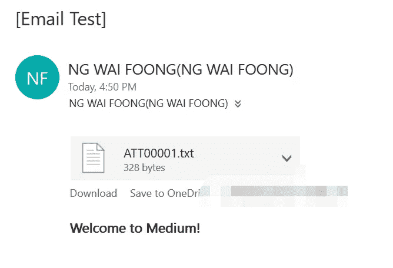
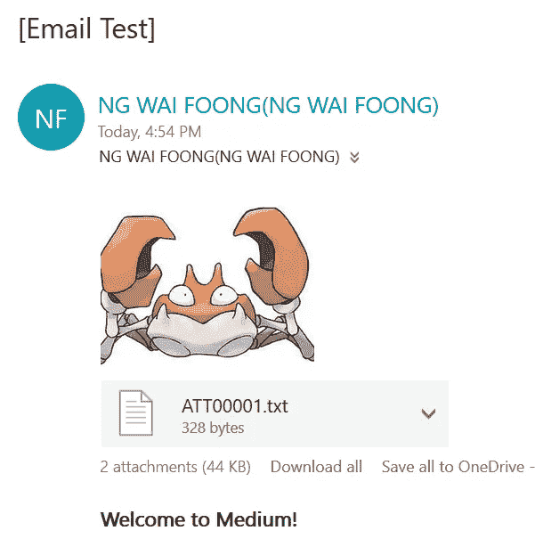

# 如何用 Python 发送带附件的电子邮件

> 原文：<https://betterprogramming.pub/how-to-send-an-email-with-attachments-in-python-abe3b957ecf3>

## 利用“smtplib”发送图像和文本电子邮件


照片由 [Thanh Mai Nguyen](https://unsplash.com/@thanhy_99?utm_source=unsplash&utm_medium=referral&utm_content=creditCopyText) 在 [Unsplash](https://unsplash.com/s/photos/email?utm_source=unsplash&utm_medium=referral&utm_content=creditCopyText) 上拍摄

通过阅读本文，您将了解用 Python 发送一封简单电子邮件所需的基本步骤。我们将使用一个名为`smtplib`的内置模块。这意味着不需要额外的设置或安装。基于[官方文件](https://docs.python.org/3/library/smtplib.html)，该模块:

> “…定义一个 SMTP 客户端会话对象，该对象可用于向任何装有 SMTP 或 ESMTP 侦听器守护程序的互联网计算机发送邮件。有关 SMTP 和 ESMTP 操作的详细信息，请参考 [**RFC 821**](https://tools.ietf.org/html/rfc821.html) (简单邮件传输协议)和[**RFC 1869**](https://tools.ietf.org/html/rfc1869.html)(SMTP 服务扩展)。”

本教程有三个部分

1.  Flask 服务器
2.  履行
3.  结论

让我们继续下一节来设置 Flask 服务器。

# 1.Flask 服务器(可选)

强烈建议您在继续之前设置一个虚拟环境。请注意，运行`smtplib`模块不需要烧瓶。在我写这篇文章的时候，我正在测试通过`Flask`服务器发送电子邮件。如果您喜欢更简洁的设置和实现，请继续阅读`Implementation`部分。激活您的虚拟环境，并通过以下代码安装 Flask:

```
pip install flask
```

创建一个 Python 文件，并添加以下代码来创建一个简单的服务器。我将把它命名为`test.py`。

```
from flask import Flask, request, jsonifyapp = Flask(__name__)@app.route('/')
def hello_world():
    return "Hello world!"if __name__ == "__main__":
    app.run('0.0.0.0',port=5000)
```

保存文件，并使用下面的代码运行它。相应地替换文件的名称。这个教程我用的是`test.py`。

```
python test.py
```

打开一个浏览器，根据你机器的 IP 访问它。你可以打开一个命令行并输入`ipconfig`来识别你的机器的地址。您应该能够看到以下输出。



作者图片

继续下一部分，开始使用`smtplib`模块。

# 2.履行

## SMTP 对象

首先，在 Python 文件的顶部添加以下导入声明。

```
import smtplib
from email.mime.multipart import MIMEMultipart
from email.mime.text import MIMEText
from email.mime.image import MIMEImage
```

需要模块来处理电子邮件消息。这是遗留模块的一部分，仍然非常有用。如果您打算创建复杂的电子邮件，请随意使用其他模块。

SMTP 对象接受两个输入参数:

*   服务器名称
*   港口

请注意，我使用 Outlook 作为 SMTP 服务器，连接是基于 TLS 的。事实上，您可以使用自己的 SMTP 服务器或第三方服务，如 Gmail 或 Outlook。您必须根据将要使用的 SMTP 服务器的设置来修改参数。您必须允许第三方服务访问您的电子邮件。Outlook 的设置如下。如果您使用的是另一台 SMTP 服务器，请相应地修改它们。


作者图片

用下面的代码创建一个`SMTP`对象。将`smtp.office365.com`替换为您的 SMTP 服务器的服务器名称。

```
smtpObj = smtplib.SMTP('smtp.office365.com', 587)
```

继续追加以下代码以开始身份验证:

```
smtpObj.ehlo()
smtpObj.starttls()
smtpObj.login("sender@email.com", "password")
```

## 哑剧

下一步是创建电子邮件。让我们创建一个名为`send_test_mail`的函数，并定义发送者和接收者的电子邮件。你可以用你自己的电子邮件作为发送者和接收者来测试它。我添加了一个额外的字符串输入，名为`body`。这将是我们在电子邮件中发送的主要内容。

```
def send_test_mail(body):
    sender_email = "sender@email.com"
    receiver_email = "receiver@email.com"
```

在函数内部，创建一个负责存储所有`MIMEText`和`MIMEImage`对象的`MIMEMultipart`对象。

```
msg = MIMEMultipart()
msg['Subject'] = '[Email Test]'
msg['From'] = sender_email
msg['To'] = receiver_email
```

接下来，使用我们之前定义的输入参数创建`MIMEText`对象。我们将在 HTML 字符串中格式化它。将其附加到`MIMEMultipart`对象上。

```
msgText = MIMEText('<b>%s</b>' % (body), 'html')
msg.attach(msgText)
```

最后一步是调用`sendemail`函数。建议将其包裹在`try`挡块内。我将使用 with context manager 将整个 smtpObj 移动到这个块中，因为它将有助于自己调用`quit`。

```
try:
  with smtplib.SMTP('smtp.office365.com', 587) as smtpObj:
    smtpObj.ehlo()
    smtpObj.starttls()
    smtpObj.login("sender@email.com", "password")
    smtpObj.sendmail(sender_email, receiver_email, msg.as_string())
except Exception as e:
  print(e)
```

为了测试它，您需要调用`send_test_mail`函数。最简单的方法是在 main 函数内部完成。请随意更改输入文本。

```
if __name__ == "__main__":
    send_test_mail("Welcome to Medium!")
    app.run('0.0.0.0',port=5000)
```

运行服务器，你应该会在邮箱里看到下面的邮件。



作者图片

## 文本附件

您可以通过下面的代码轻松地将附件(如 CSV 或 TXT 文件)添加到电子邮件中。只需指定正确的路径，并在一个`MIMEText`中打开它。

```
filename = "example.txt"
msg.attach(MIMEText(open(filename).read()))
```

你应该能得到下面的结果。



作者图片

## 图像附件

对于图像附件，你必须使用`MIMEImage`对象。您可以通过添加标题`Content-Disposition`来更改附件的名称。

```
with open('example.jpg', 'rb') as fp:
    img = MIMEImage(fp.read())
    img.add_header('Content-Disposition', 'attachment', filename="example.jpg")
    msg.attach(img)
```

运行服务器后，您应该会得到以下结果。



作者图片

## 二元附件

如果你要发送 pdf 或 ppt，MIMEApplication 是你的正确选择，因为它有助于阅读八进制流。按如下方式导入它:

```
from email.mime.application import MIMEApplication
```

使用 rb 模式从文件中读取二进制数据。

```
pdf = MIMEApplication(open('123.pdf', 'rb').read())
```

然后，添加相应的头，并将其附加到 MIMEMultipart 对象。

```
pdf.add_header('Content-Disposition','attachment','123.pdf')
msg.attach(pdf)
```

请随意查看以下[链接](https://gist.github.com/wfng92/a36729f5d8a43652abe46b9ab944d64a)中的完整代码。

# 3.结论

让我们回顾一下今天所学的内容。我们从一个 Flask 服务器的简单安装开始。

然后，我们继续初始化`SMTP`对象，它负责认证并允许我们登录自己的电子邮件。

之后，我们使用`MIMEText`和`MIMEImage`精心制作了电子邮件消息。这允许我们以文本文件和图像的形式发送附件。

感谢你阅读这篇文章。希望在下一篇文章中再见到你！

# 参考

1.  [Outlook.com 的 POP、IMAP 和 SMTP 设置](https://support.office.com/en-us/article/POP-IMAP-and-SMTP-settings-for-Outlook-com-d088b986-291d-42b8-9564-9c414e2aa040)
2.  [smtplib 的文档](https://docs.python.org/3.8/library/smtplib.html)