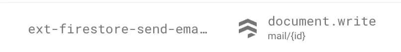
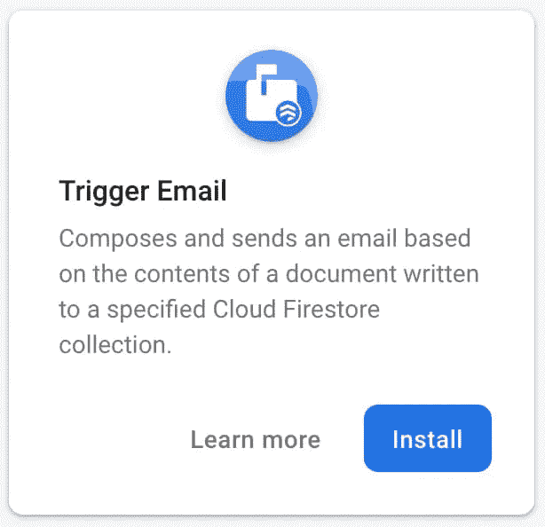
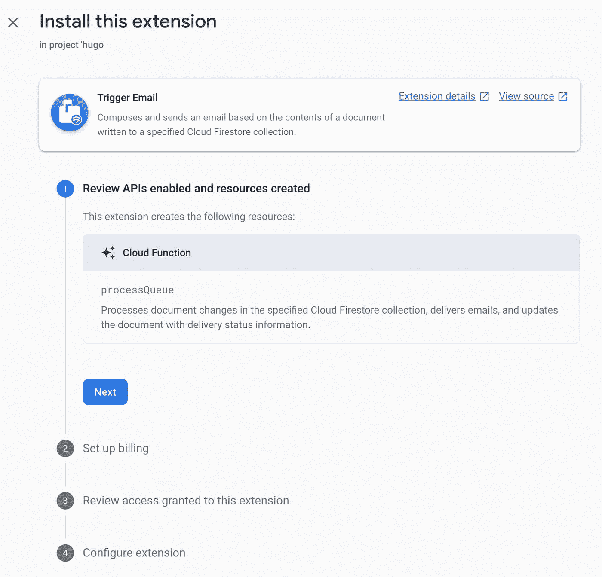
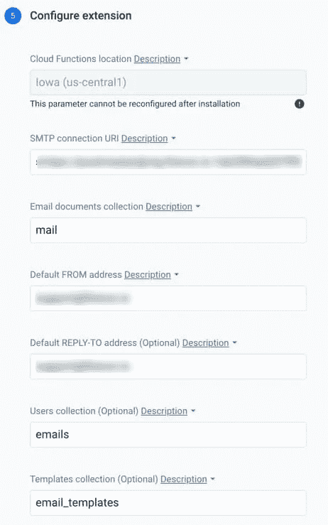
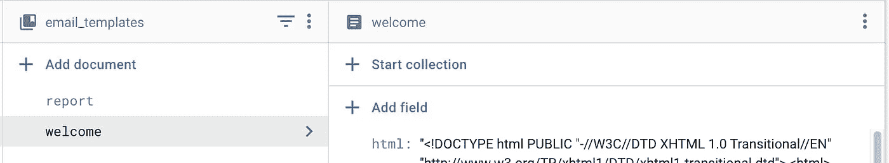

# 如何使用触发电子邮件扩展从 Firebase 发送电子邮件

> 原文：<https://betterprogramming.pub/how-to-send-emails-from-firebase-with-the-trigger-email-extension-27c593ca1157>

## 通过电子邮件和 Firebase 通知您的用户


在 [Unsplash](https://unsplash.com/s/photos/paper-airplane?utm_source=unsplash&utm_medium=referral&utm_content=creditCopyText) 上 [NeONBRAND](https://unsplash.com/@neonbrand?utm_source=unsplash&utm_medium=referral&utm_content=creditCopyText) 拍摄的照片

我们都做过 1000 次了:你构建了一个新的应用程序，需要添加动态电子邮件功能。但似乎每次你重新发明轮子的时候。建立一个新的电子邮件提供商，安装[手柄](https://handlebarsjs.com/)(如果你没有使用手柄，你真的应该使用)，记录等等。

Firebase 团队最近引入了一个稍微简单一点的电子邮件流程，我发现它消除了大约 20%的痛苦:[触发电子邮件扩展](https://firebase.google.com/products/extensions/firestore-send-email)。它是预建函数扩展套件的一部分。注意:该扩展正式处于测试阶段，但是我们已经在 Ayrshare 成功地使用了它，没有出现任何问题

# 好的，不太好的

在我们开始设置触发电子邮件之前，我将强调一下我喜欢这个扩展的什么地方，以及什么是痛苦。

## 好人

*   易于设置和使用
*   支持文本和 HTML 电子邮件，加上车把模板
*   保留一个集合中所有电子邮件的记录，并记录发送和错误

## 不太好的人

*   电子邮件发件人提供的功能丧失。例如，Mailgun 支持延迟发送时间。使用扩展无法做到这一点。
*   存储在集合中的车把模板。这需要额外的步骤来插入/更新集合。我已经忘记了几次，想知道为什么我的电子邮件没有反映我最近的变化。
*   可能会有额外的费用，因为你每次发邮件都要访问数据库和运行云功能。如果你要发送大量的邮件，这可能会产生一大笔费用。

# 触发电子邮件扩展如何工作

事实上，很简单。您要将想要发送的电子邮件插入 Firestore 数据库和一个在文档写入时运行的云功能(由 Firebase 团队提供)。该函数获取电子邮件数据，应用 handle 模板(如果适用)，并通过您在设置期间指定的电子邮件提供商发送。

您甚至可以在 Firebase 控制台的“功能”选项卡下看到列出的功能。



# 设置触发电子邮件扩展

1.  点击 Firebase 控制台左下角的扩展链接。


2.选择触发电子邮件卡上的安装，或选择“了解更多”以获得扩展的完整概述。



3.你会发现自己处于四步向导中。如果你好奇的话，可以查看这个函数的[源代码](https://github.com/firebase/extensions/tree/master/firestore-send-email)。该向导的重要部分是设置计费(这意味着如果您在 Spark 计划中，您需要升级到 Blaze 计划)，授予访问电子邮件功能的权限，以及配置扩展(见下面的 4)。



4.配置扩展需要您有一个电子邮件提供商，比如 [Sendgrid](https://sendgrid.com/docs/API_Reference/SMTP_API/getting_started_smtp.html) 、 [Mailgun](https://help.mailgun.com/hc/en-us/articles/203380100-Where-Can-I-Find-My-API-Key-and-SMTP-Credentials-) 或[邮戳](https://postmarkapp.com/developer/user-guide/sending-email/sending-with-smtp)。在你的电子邮件提供商那里，获取 SMTP URI。这通常包含提供者的域和 API 密钥。从您的提供商那里获得 SMTP URI 后，将其插入字段`SMTP connection URI`。如果遇到问题，请查阅您的提供商的文档。

接下来，设置电子邮件文档集，你将在那里写你要发送的电子邮件(大多数人只使用“邮件”)。不要担心提前创建“邮件”集合。它将在您第一次写入时自动创建。



您还需要设置您的发件人电子邮件地址和回复电子邮件地址。

快速提示:最新版本的邮件触发功能允许您指定发件人姓名，如“约翰·史密斯”只需在“发件人”字段中使用以下格式:

```
John Smith <john@smith.com>
```

最后，您可以选择提供一个用户集合或一个模板集合。

**用户集合:**以用户 UID 为关键字的文档集合。如果在添加的电子邮件文档中使用了`toUids`、`ccUids`和/或`bccUids`收件人选项，则该扩展会基于在该集合中的查找将电子邮件发送到`email`字段。

**模板集合:**以名称为关键字的电子邮件模板集合。如果在添加的电子邮件文档中指定了模板，该扩展可以使用[把手](https://handlebarsjs.com/)模板呈现电子邮件。

稍后我们将详细讨论模板集合。此外，有关可用字段，请参见下面的参考部分。

仅此而已。您的触发电子邮件已设置。

# 发送您的第一封邮件

现在是时候发送你的第一封电子邮件了。让我们从一封简单的文本/HTML 邮件开始。我们将从服务器端或云功能给出一个例子。

在本例中，我们将电子邮件存储在“mail”集合中，作为包含“to”字符串(或者数组，如果有多封电子邮件)的对象，以及包含电子邮件主题和 HTML 内容的“message”对象。

一旦你将你的电子邮件储存在收藏中，你就完成了。触发电子邮件云功能将拾取电子邮件，处理它，并将其发送到您的邮件提供商。

# 添加车把模板

让我们更进一步，使用把手模板，这是发送动态邮件的最佳方式。

1.  将您的电子邮件创建为把手模板。如果您需要帮助，请遵循[指南](https://mandrill.zendesk.com/hc/en-us/articles/205582537-Using-Handlebars-for-Dynamic-Content)。
2.  创建一个名为`email_templates`的新 Firestore 集合，并在集合中创建一个名为`welcome`的文档。正如您所猜测的，我们将首先发送一封欢迎电子邮件。
3.  在 Firestore `welcome`文档中，创建一个名为`html`的新字符串字段，并将该值设置为手柄模板的内容。此外，添加第二个字段`subject`,并将值设置为您希望的电子邮件主题。你也可以在主题中使用车把表达...}}.



4.现在，您可以发送电子邮件了。这里有一个例子，也是在服务器端。

Trigger Email 将寻找模板`welcome`并传入`data`对象以应用于车把表达式。您的电子邮件已发送。

# 电子邮件安全性

正如 Firebase 团队所说:

> *“此扩展可用于直接从客户端应用程序触发电子邮件发送。但是，您应该小心控制客户端对* `*mail*` *集合的访问，以避免潜在的滥用(您不希望用户能够从您公司的地址发送任意的电子邮件！)."*

我发现最好的方法是使用模板，只从服务器端发送邮件。您可以编写一个通用函数，使用 UID 和模板名称来限制谁可以收到电子邮件以及可以发送什么。

# Firebase 触发器电子邮件参考

可用的发件人和收件人字段:

*   `from`:发件人的电子邮件地址。如果文档中未指定，则使用配置的“默认自地址”参数。
*   `replyTo`:回复邮件地址。如果文档中未指定，则使用配置的“默认回复地址”参数。
*   `to`:单个收件人电子邮件地址或包含多个收件人电子邮件地址的数组。
*   `toUids`:包含收件人 uid 的数组。
*   cc:单个收件人电子邮件地址或包含多个收件人电子邮件地址的数组。
*   `ccUids`:包含抄送收件人 uid 的数组。
*   `bcc`:单个收件人电子邮件地址或包含多个收件人电子邮件地址的数组。
*   `bccUids`:包含密件抄送收件人 uid 的数组。
*   `headers`:附加表头字段的对象(例如:`{"X-Custom-Header": "value", "X-Second-Custom-Header": "value"}`)。

注意:`toUids`、`ccUids`和`bccUids`选项根据云 Firestore 文档中电子邮件地址的用户 uid 发送电子邮件。要使用这些收件人选项，您需要为扩展的“用户集合”参数指定一个云 Firestore 集合。然后，扩展可以读取在`toUids`、`ccUids`和/或`bccUids`字段中指定的每个 UID 的`email`字段。

# 模板中可用的字段

模板文档可以包括以下任何字段:

*   `subject`:邮件主题的模板字符串
*   `text`:邮件明文内容的模板字符串
*   `html`:电子邮件 HTML 内容的模板字符串
*   `amp`:邮件内容 [AMP4EMAIL](https://amp.dev/documentation/guides-and-tutorials/learn/email-spec/amp-email-format/) 的模板字符串

感谢您的阅读。

# 关于作者

[杰弗里·伯恩](https://medium.com/u/b9f9190a52ae?source=post_page-----27c593ca1157--------------------------------)是 [**艾尔沙雷**](https://www.ayrshare.com) 的联合创始人，这是一个 API 第一的平台，用几行代码就能让你的社交媒体帖子自动化。