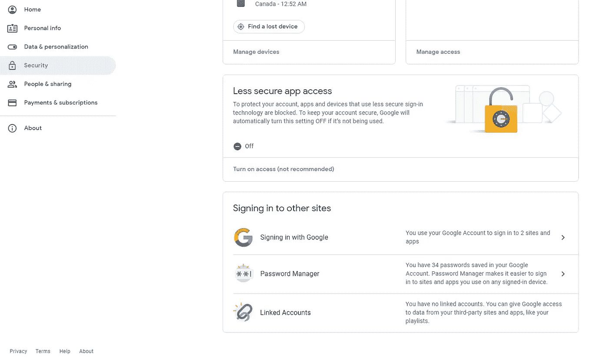

# 如何使用 Python 发送电子邮件(2021 年更新)

> 原文：<https://betterprogramming.pub/how-to-send-emails-using-python-updated-for-2021-5ad483bb5c90>

## 在不到 20 行代码中，我将向您展示如何使用 Python 向任何人发送电子邮件


Solen Feyissa 在 [Unsplash](https://unsplash.com/?utm_source=unsplash&utm_medium=referral&utm_content=creditCopyText) 拍摄的照片

最近，我发现了一种独特的方法来自动化我的 Python 脚本，使它们在每天特定的时间运行。事实上，我写了一篇关于它的文章。

[](https://towardsdatascience.com/how-to-automate-your-python-scripts-for-free-2021-98ac71b0c360) [## 如何免费自动化你的 Python 脚本(2021)

### 我将向您展示如何将 Python 脚本设置为在每天的特定时间、每周或每月运行

towardsdatascience.com](https://towardsdatascience.com/how-to-automate-your-python-scripts-for-free-2021-98ac71b0c360) 

这非常有用，但还不够。你看，我想真正实现整个过程的自动化，这样当一个脚本运行完成时，结果会立即发送给我。一个简单有效的解决方案是让 Python 脚本通过电子邮件发送结果。

事实证明这在 Python 中非常容易做到。你只需要一个 Gmail 账户，就可以搭载谷歌的简单邮件传输协议(SMTP)服务器。

因此，让我向您展示如何使用 Python 发送电子邮件。

# 导入包

第一步是导入内置的 Python 包，它将为我们完成大部分工作:

```
import smtplib, ssl
from email.mime.text import MIMEText
```

`smtplib`是内置的 Python SMTP 协议客户端，允许我们连接到我们的电子邮件帐户并通过 SMTP 发送邮件。

MIME(多用途互联网邮件扩展)是一种标准，用于格式化要通过互联网发送的文件，以便可以在浏览器或电子邮件应用程序中查看这些文件。

我们将使用的 MIME 包是 MIMEText。这个软件包将使我们能够发送纯文本的电子邮件。要查看其他类型的 MIME 消息(例如，MIMEAudio、MIMEImage ),请查看 [Python email.mime docs](https://docs.python.org/2/library/email.mime.html) 。

# 发件人、收件人、电子邮件正文

要创建一封 MIME 邮件，我们首先需要决定谁在发送邮件，谁在接收邮件，以及邮件的内容是什么。

```
sender = ‘your_email@email.com’
receivers = [‘recipient1@recipient.com’, ‘recipient2@recipient.com’]
body_of_email = ‘Text to be displayed in the email’
```

复制上面的代码块，并用适当的信息替换变量。

# 创建邮件、主题行、发件人和收件人

接下来，我们必须创建我们的消息，并提供一些关于电子邮件的必要细节。

为了创建包含文本的消息，我们使用了导入的包 MIMEText。然后，我们必须提供电子邮件的主题行，并确认谁在发送电子邮件，谁在接收它。这些将是上一节中的发送者和接收者变量。

```
msg = MIMEText(body_of_email, ‘html’)
msg[‘Subject’] = ‘Subject line goes here’
msg[‘From’] = sender
msg[‘To’] = ‘,’.join(receivers)
```

# 连接到 Gmail SMTP 服务器

既然邮件已经完成，我们必须连接到 Gmail SMTP 服务器。简单来说，这实际上就是登录到您的 Gmail 帐户，这样它就可以生成并发送从上一部分创建的邮件。

我们用主机`‘smtp.gmail.com’`和端口 465 连接到 Gmail SMTP 服务器。使用您的 Gmail 帐户详细信息登录，然后将发送包含以下信息的电子邮件:

```
s = smtplib.SMTP_SSL(host = ‘smtp.gmail.com’, port = 465)
s.login(user = ‘your_username’, password = ‘your_password’)
s.sendmail(sender, receivers, msg.as_string())
s.quit()
```

# 最后一步:打开不太安全的应用程序

最后一步，你需要更改你的 Gmail 账户，以允许访问“不太安全的应用程序”这是必要的，这样你的 Python 脚本就可以访问你的帐户并从它发送电子邮件。

为此，请转到您的 Gmail 帐户的安全设置。在那里，向下滚动，直到你看到一个标题为“不太安全的应用程序访问”的框



当你点击它，你应该看到一个开关。翻转它以打开不太安全的应用程序。


恭喜你！如果你做的一切都是正确的，你现在应该能够使用 Python 向任何人发送电子邮件。

# 迷茫？在视频中看到这篇文章

如果你在阅读这篇文章时有一些困惑，你可以看看我在 YouTube 频道上发布的一步一步的教程。

该视频还包括其他内容，如如何发送带有附件的电子邮件。

# 访问此代码的干净版本

如果你想获得创建这篇文章所使用的代码的完全清理和评论版本，你可以加入我的群**“Clean Code Z”**，通过加入，你将获得我在所有文章和视频中使用的代码的清理版本。

感受感受加入这里: [**洁码 Z**](http://wondrous-originator-2391.ck.page/christopherzita/cleancodez)