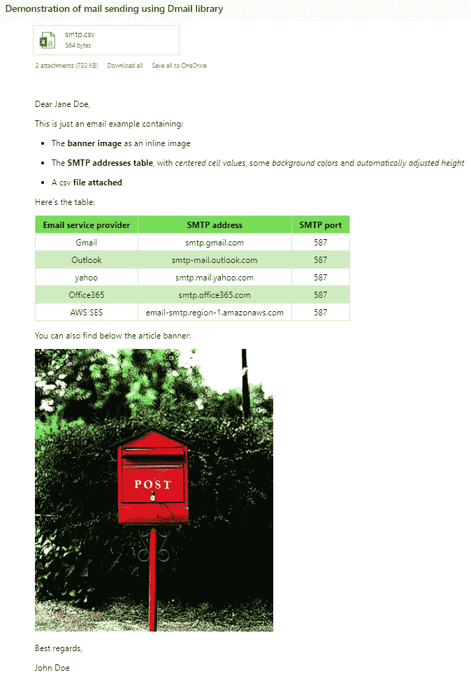
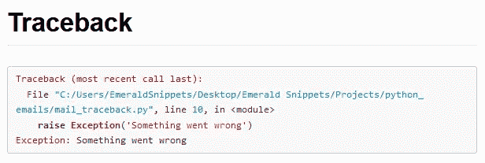

# 如何使用 Python 发送带附件的电子邮件

> 原文：<https://betterprogramming.pub/how-to-send-emails-with-attachments-using-python-dd37c4b6a7fd>

## 发送带有降价/HTML 模板的电子邮件

作者: [SMTP 设置](https://medium.com/u/d38873cbc5aa#example-configurations)中查找。

要检查您是否有正确的服务器地址和端口，您可以尝试下面的代码，其中第一行使用上下文管理器启动与服务器的连接，第二行执行`NOOP`，这是一个基本上不做任何事情的低级命令。

如果你运行这个并得到一个`TimeoutError`，很有可能你得到了错误的地址/端口。

## 安全连接

现在我们可以使用 TLS，**T5，这是另一个协议(安全层)来使连接更加安全。别担心，这只是在前面的代码中添加了三行代码:**

还有另一种加密协议(TLS 的废弃前身)可以用于 Python，并且仍然受到大多数电子邮件服务提供商的支持，它就是 SSL。如果你想使用`SMTP_SSL`，可以参考 Python [文档](https://docs.python.org/3/library/smtplib.html)。

## 登录

要使用 Python 发送电子邮件，您需要像在浏览器上一样进行身份验证，否则任何人都可以使用您的帐户发送电子邮件。

请注意，您可能会遇到某些电子邮件服务提供商的身份验证错误，在这种情况下，您有两种选择(以下链接与 Gmail 相关):

1.确保您启用了“[不太安全的应用程序访问](https://support.google.com/accounts/answer/6010255)”选项。

2.尝试使用[双因素认证](https://support.google.com/accounts/answer/185839)并生成[应用程序密码](https://support.google.com/mail/answer/185833)。

除此之外，它只是多了一行代码:

```
smtp.login(EMAIL_ADDRESS, EMAIL_PASSWORD)
```

# 2.如何发送电子邮件

现在我们开始有趣的部分:发送实际的电子邮件。

## 发送纯文本

绝对没有什么比以纯文本形式发送电子邮件更简单的了。您可以使用方法`sendmail`来发送纯文本:

如果你尝试过，你会发现在之前的邮件中没有邮件主题，它可能会出现在你的垃圾邮件中，因为应该包含你的电子邮件地址的 FROM 头没有指定。为了解决这个问题，我们可以稍微修改一下我们的消息，并添加一个标题:

如果你不熟悉 [f-strings](https://www.python.org/dev/peps/pep-0498/#abstract) (字符串文字/双引号前的 *f* )，这只是一种格式化字符串和用字符串中的值替换变量的方法。只有在使用 Python 3.6 或更高版本时才有效。

## 发送格式化的 HTML 文本

有点失望，你不能用以前的方法发送带有漂亮图片的大胆消息？不用担心，你也可以发送 HTML 格式的电子邮件，正如你可能知道的，可以按照你想要的样式定制。

这部分可以用 Python 的 `email.mime`模块，有点低级。相反，我们将使用一个稍微简单一点的替代方法，它也在 Python 的标准库中: `email.message`

要定义信息，我们应该遵循以下简单步骤:

1.  实例化一个`EmailMessage`对象。
2.  添加一个包含主题、发件人和收件人地址的邮件头，还可能包含一个抄送字段。
3.  以纯文本格式设置您的邮件内容。(如果您的收件人电子邮件服务提供商不支持 HTML(这种情况不太可能发生),就会显示出来。)
4.  添加您的 HTML 代码作为替代。

让我们看看如何在代码中实现这一点:

现在是发送部分。这和我们之前做的略有不同。我们没有使用 `sendmail`方法，而是使用了 `send_message`，它与我们的消息对象兼容:

## 发送附件

使用 `EmailMessage`类，给你的邮件添加附件也非常简单。

要添加附件，我们需要指定其 MIME 类型(多用途互联网邮件扩展), Mozilla 的 web docs 将其定义为:

> 媒体类型(也称为多用途互联网邮件扩展或 MIME 类型)是一种标准，它指示文档、文件或字节分类的性质和格式。它在 IETF 的 RFC 6838 中进行了定义和标准化。

Python 的 `mimetypes`模块提供了一个简洁的方法，试图根据文件的 URL/路径猜测文件的 MIME 类型。你可以在一般的环境中使用它，或者如果你已经知道的话，你可以硬编码你的`mimetype`。

剩下要做的就是尝试用下面的例子发送一个文件:

# 如何使用 Dmail 发送降价模板

在这一部分，我们将向你展示如何发送以 Markdown 格式(个人最喜欢的格式)撰写的电子邮件。我们将使用的 Python 邮件库叫做 [Dmail](https://pypi.org/project/Dmail/) ，是我和我的合著者定制的。它的优势在于提供非常简单的用户体验。您可以通过在命令行中键入以下命令来安装它:

```
pip install Dmail
```

重要的事情先来。我们从创建模板开始:

除了 Markdown 格式选项，还可以使用 Python 属性`.style`来个性化表格的外观。下面你可以找到不同的格式选项来激发你的灵感，你还可以在这个[样式用户指南](https://pandas.pydata.org/pandas-docs/stable/user_guide/style.html)中找到更多。

如果你不知道[熊猫](https://pandas.pydata.org/)或者不想设计你的表格，你仍然可以使用标准的表格减价语法。例如，你可以查看[文档](https://pypi.org/project/Dmail/)。

现在，要发送您的电子邮件，您只需:

电子邮件应该是这样的:



# 额外收获:发送电子邮件追溯你的代码

想象一下，您有一个在生产服务器上远程运行的代码，并且您不能不断地监督它。你可以做的是给你的团队/自己发一封邮件，告诉他们发生的异常及其追溯，以防出错。这样，一旦出现致命错误，您就会得到通知，并且您可能不必检查日志文件来了解到底发生了什么，因为电子邮件包含异常详细信息。这样，你可以很快修复它(就像什么都没发生一样)。

Dmail 让这变得非常简单。你要做的就是这个:

你会收到一封类似这样的邮件:



如果您希望回溯/代码的语法高亮显示，不要忘记安装带有高亮显示扩展的 Dmail:

```
pip install Dmail[CodeHighlight]
```

# 最后，汇编好的(现成的)代码

如果您想要完整的现成代码(针对本文中使用的每种方法)，您可以在这个 [GitHub 资源库](https://github.com/amal-hasni/python_emails)中找到它。

现在，您已经了解了使用 Python 发送电子邮件的所有内容，您应该能够闭着眼睛也能做到。使用 HTML 或 Markdown 提供的选项，不要犹豫尝试你的电子邮件格式。

此外，如果您想查看我需要使用 Dmail 库的实际用例，您可以查看我们的 Kayak web 抓取文章“[如果 Selenium 能比您的旅行社做得更好会怎样？](https://medium.com/analytics-vidhya/what-if-selenium-could-do-a-better-job-than-your-travel-agency-5e4e74de08b0)”

感谢您的关注，注意安全，下一篇文章再见！

# 参考

[1]:[https://docs.python.org/3/library/smtplib.html](https://docs.python.org/3/library/smtplib.html)
【2】:[https://docs.gitlab.com/omnibus/settings/smtp.html](https://docs.gitlab.com/omnibus/settings/smtp.html#example-configurations)
【3】:[https://en.wikipedia.org/wiki/Transport_Layer_Security](https://en.wikipedia.org/wiki/Transport_Layer_Security)
【4】:[https://realpython.com/python-send-email](https://realpython.com/python-send-email)
【5】:
【6】:[https://pypi.org/project/Dmail/](https://pypi.org/project/Dmail/)
【7】:[https://pandas . pydata . org/pandas-docs/stable/user _ guide/style . html](https://pandas.pydata.org/pandas-docs/stable/user_guide/style.html)