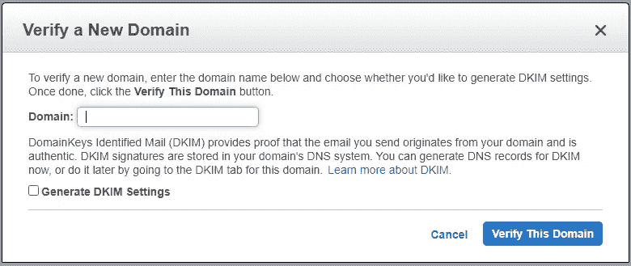
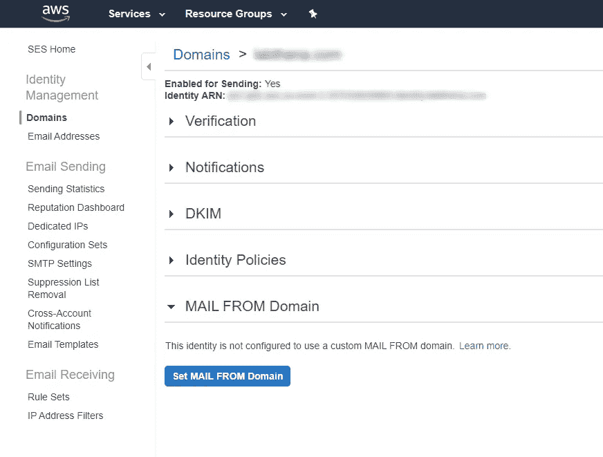
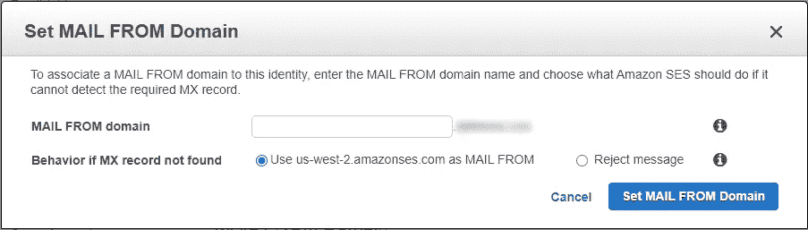
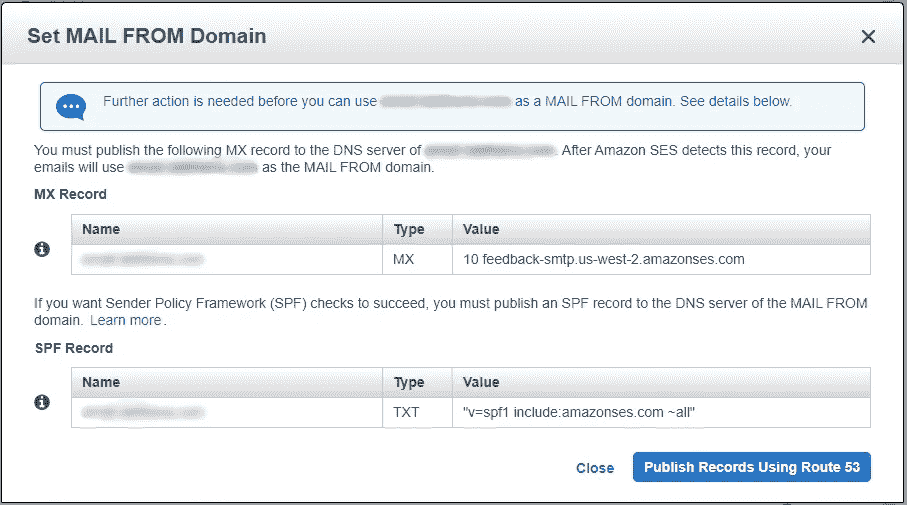
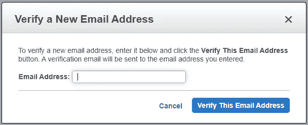
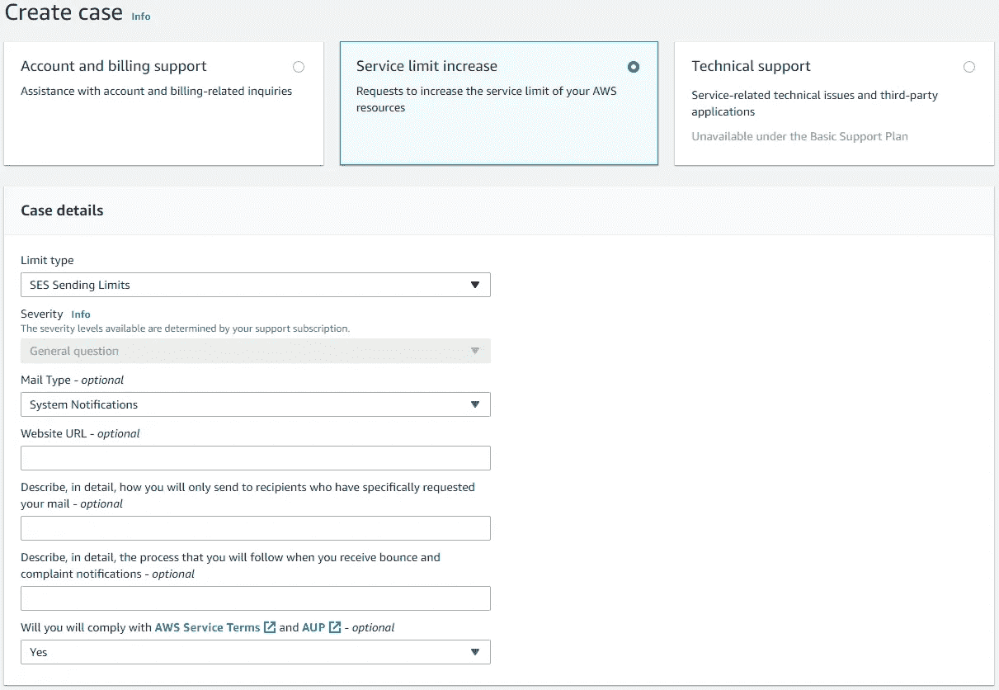
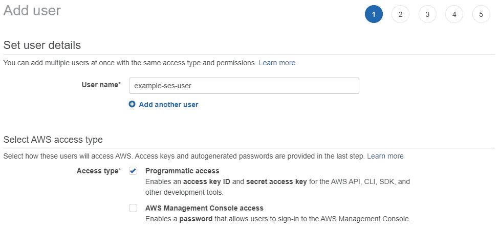
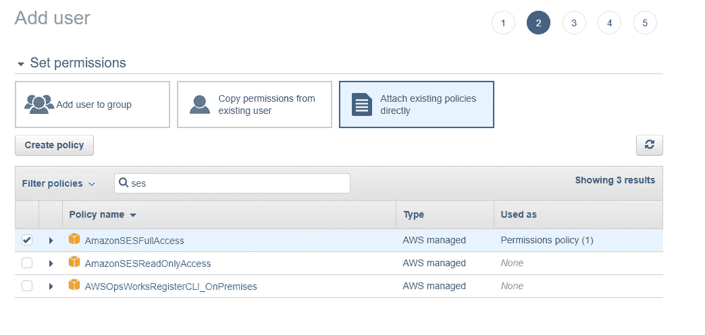
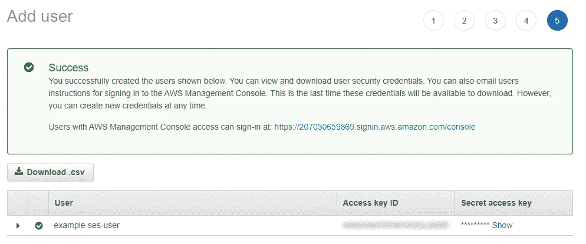
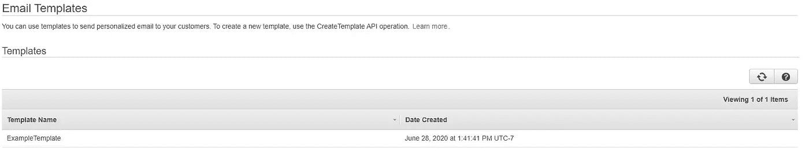

# 如何使用亚马逊 SES 通过 Node.js 发送电子邮件

> 原文：<https://betterprogramming.pub/how-to-send-emails-with-node-js-using-amazon-ses-8ae38f6312e4>

## 通过 Node.js 和 AWS 从您自己的域发送电子邮件比您想象的要容易


由[在线打印机](https://unsplash.com/@onlineprinters?utm_source=unsplash&utm_medium=referral&utm_content=creditCopyText)在 [Unsplash](/s/photos/email?utm_source=unsplash&utm_medium=referral&utm_content=creditCopyText) 上拍摄的照片

发送高质量的电子邮件对任何在线平台都至关重要。幸运的是，有了 Node.js 和 Amazon SES，这非常简单。我在下面列出了教程结构，所以你可以随意跳过。

```
1\. [Setting Up Your AWS Account to Yse SES](#45d1)
2\. [Integrating Amazon SES Into Your Node.js App](#525e)
```

# 设置您的 AWS 帐户

在设置 Amazon SES 之前，您需要做一些事情。

*   AWS 帐户
*   你拥有的域名

如果您还没有 AWS 帐户，您可以在这里创建一个[。否则，第一步就完成了。](https://aws.amazon.com/)

如果你没有自己的域名，很容易也很容易买到。有很多服务可以用来购买你自己的域名——我在下面列出了一些比较流行的服务。

获得您自己的域名的服务:

*   [谷歌域名](https://domains.google/)
*   [Domain.com](https://www.domain.com/)
*   [主持人](https://www.hostgator.com/)
*   [名字便宜](https://www.namecheap.com/)

一旦你有了自己的域名，你就可以设置亚马逊 SES 了。

# 设置 Amazon SES

设置 Amazon SES 有几个步骤。

1.  使用 AWS 验证您的域。
2.  从域注册邮件。
3.  验证您的发件人电子邮件。
4.  从 SES 沙盒环境中删除您的 AWS 帐户。
5.  创建具有 SES 权限的 AWS IAM 用户。

## **使用 AWS 验证您的域名**

要使用 SES 验证您的域，请在此处打开 SES 控制台。在那里，从侧面菜单导航到域，并选择“验证一个新的域。”您应该会看到类似下面的提示。



Amazon SES 验证新域提示

继续键入您的完整域名——您不需要包括`https://`。我强烈推荐生成 DKIM 设置。这将允许您的电子邮件得到认证，验证在传输过程中没有数据被访问和更改。验证后，可能需要几分钟时间。现在，您可以从域中添加邮件了。

## **注册来自域的邮件**

您的邮件发件人域是在所有电子邮件中显示为发件人的地址。如果你没有指定你自己的邮件发件域，亚马逊会根据你所在的地区给你分配一个。这不是一个大问题，但是如果这个域和电子邮件是用于商业或更专业的设置，我强烈建议设置一个来自域的邮件。

要从域中设置您的邮件，请选择您新验证的域，您将被重定向到如下页面。



亚马逊 SES 域名页面

选择“从域设置邮件”，您应该会看到以下提示。



亚马逊 SES 从域提示设置邮件

您的邮件发件人域名可以是您喜欢的任何子域。我主要用`mail.<your-domain>`或者`email.<your-domain>`，不过也可能是你喜欢的随便。

对于“如果没有找到 MX 记录的行为”，我建议使用您所在地区的默认亚马逊地址，但您也可以选择拒绝该电子邮件。

一旦你从域设置了你的邮件，你会被提示 MX 记录必须被添加到托管 DNS 服务器的网站。



来自域的邮件的 Amazon SES MX 记录集

如果您使用 Amazon Route 53 来托管您的站点，这些记录可以使用显示的按钮自动添加。如果你在另一个服务上托管你的网站，这个[亚马逊指南](https://docs.aws.amazon.com/ses/latest/DeveloperGuide/mail-from.html)提供了一个表格，上面有如何为各种服务添加这些记录的链接。

## **验证发件人邮件**

为了从某个地址发送电子邮件，您需要验证您拥有该电子邮件地址。为此，请访问 SES 电子邮件地址页面[此处](https://console.aws.amazon.com/ses/home#verified-senders-email:)。单击“验证新的电子邮件地址”，您应该会看到如下提示。



Amazon SES 验证新的电子邮件地址提示

只需输入您希望验证的电子邮件地址。您将在该电子邮件地址收到一封电子邮件，其中包含验证您地址的链接。点击链接，一切就绪。

## **从 SES 沙盒环境中删除您的 AWS 帐户**

现在，您的域已验证，您的“发件人”域已设置，并且您的发件人电子邮件已验证，您可以发送电子邮件了。但在你可以向任何你喜欢的地址发送电子邮件之前，你需要离开 SES 沙盒环境。

为了走出 SES 沙箱，您需要创建一个支持案例。这可以在[这里](https://console.aws.amazon.com/support/home#/case/create.)完成。



亚马逊 SES 服务限制增加

选择“服务限额增加”案例，并将限额类型设置为“SES 发送限额”填写剩余的字段，并提交您的请求。

对于有关发送报价和发送率的问题，请为每项设置您想要的金额；然而，亚马逊通常默认发送报价最低为 50，000，发送速率为 14 封邮件/秒。您应该会在一两天内收到一封电子邮件，通知您您的发送限额。

## **创建具有 SES 权限的 AWS IAM 用户**

设置 Amazon SES 的最后一步是创建一个具有 SES 权限的 IAM 用户。这将允许您更好地控制您的帐户的安全性，并允许您访问 AWS SDK。

导航到 IAM 服务下的[用户页面](https://console.aws.amazon.com/iam/home#/users)，添加一个新用户:



Amazon IAM 添加用户页面

设置您喜欢的任何用户名，并将访问类型设置为“编程访问”



Amazon IAM 设置权限页面

通过附加现有的 Amazon 策略来设置用户权限。搜索 SES 策略，并选择“AmazonSESFullAccess”如果你愿意，你可以遵守这个政策，只允许某些行为。

您可以跳过添加标签，因为它们不是必需的，但是如果您愿意，您当然可以添加它们。填写所有内容后，您可以创建具有 SES 权限的用户。



亚马逊 IAM 用户创建的页面

您将看到新用户访问 Amazon SDK 的凭证。请务必保存这些，因为一旦离开此页面，您将无法再次看到它们。

Amazon SES 现在已经完全设置好了，您可以开始研究一些代码了。

# 将 Amazon SES 集成到 Node.js 中

设置好 Amazon SES 后，剩下要做的就是使用 AWS SDK 和 SES IAM 用户以编程方式发送电子邮件。

要开始，安装官方的 AWS SDK npm 包，`npm i aws-sdk`。

我将介绍两种发送邮件的方法:一种是简单的文本邮件，另一种是模板邮件。

我已经将代码贴在下面，并将一步一步地讲解。

亚马逊 AWS SDK SES 使用 Node.js

首先，我们导入 AWS SDK npm 包。然后，我们设置配置以访问我们之前设置的 SES 配置文件。

这里的关键字段是`accessKeyID`和`secretAccessKey`。为您之前创建的 SES IAM 用户输入这些信息。地区是您的 AWS 帐户所在地区的亚马逊代码。您可以在这里找到每个地区[的代码列表。接下来，我们使用配置文件创建 SES 对象。](https://docs.aws.amazon.com/AmazonRDS/latest/UserGuide/Concepts.RegionsAndAvailabilityZones.html)

一旦我们有了 SES 对象，我们就可以发送电子邮件了。我将首先检查简单的文本电子邮件。

`sendEmail`方法使用基本方法在 ses 中发送电子邮件。这种方法可以在正文中包含 HTML 格式的文本和组件，因此可以随意创建带有图像和所有内容的格式精美的电子邮件。

然而，如果你想要更复杂的电子邮件，你会重复使用，这可能是更方便的使用第二种方法，模板电子邮件。模板电子邮件将您的电子邮件模板保存到您的 SES 个人资料中，以便您可以轻松地反复使用它们。首先，您需要创建一个模板。为此，创建一个文本文件，并输入以下 JSON。

Amazon SES 电子邮件模板 JSON 文件

这是 SES 电子邮件模板的基本格式。你可以根据自己的需要让它们变得复杂或简单。

保存好模板 JSON 后，打开命令提示符，执行下面的 AWS CLI 命令:`aws ses create-template --cli-input-json file://emailTemplate.json`。

如果你的系统上没有安装 AWS CLI，你可以按照这个[亚马逊指南](https://docs.aws.amazon.com/cli/latest/userguide/cli-chap-welcome.html)来做。配置 AWS CLI 时，请确保使用 SES IAM 用户凭据。

执行后，您应该会在您的 SES 档案中看到您的新模板[这里](https://console.aws.amazon.com/ses/home#email-templates-list:)。



亚马逊 SES 电子邮件模板页面

一旦创建了模板，您就可以通过 SES `sendTemplatedEmail`方法自由使用它。在这种方法中，需要注意的重要字段是`TemplateData`。确保在模板中包含所有需要的变量。

AWS SDK 可以调用所有方法作为承诺，这对于 Node.js 来说非常好。这些方法可以直接放在一个路由或一个单独的电子邮件控制器中，就像我在本教程中所做的那样。

要获得更多关于特定 SES 方法的信息或查看 AWS SDK 中所有其他很酷的功能，请务必查看亚马逊文档[这里](https://docs.aws.amazon.com/AWSJavaScriptSDK/latest/AWS/SES.html)。

我希望这篇教程对你有所帮助。