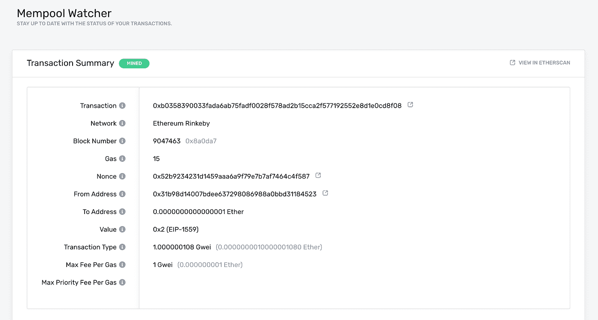

# 如何使用 Web3 发送以太坊交易

> 原文：<https://betterprogramming.pub/how-to-send-ethereum-transactions-using-web3-d05e0c95f820>

## 使用 Web3 和 Node.js 执行事务的快速指南


[rupixen.com](https://unsplash.com/@rupixen?utm_source=medium&utm_medium=referral)在 [Unsplash](https://unsplash.com?utm_source=medium&utm_medium=referral) 上拍照

向以太坊区块链发送交易有三个主要步骤:创建、签名和广播。

我们将浏览所有三个，希望能回答您可能有的任何问题！在本教程中，我们将使用炼金术将我们的交易发送到以太坊链，所以你可以[创建一个免费帐户开始](https://alchemy.com/?a=035d6ae2d0)。

注意:本指南用于在你的应用程序的后端签署你的交易，如果你想集成在前端签署你的交易，你需要集成一个[浏览器提供者与 Web3](https://docs.alchemy.com/alchemy/documentation/alchemy-web3#with-a-browser-provider) 。​

# 基础知识

像大多数刚开始工作的区块链开发人员一样，您可能已经对如何发送事务做了一些研究(这应该很简单),并遇到了过多的指南，每个指南都说了不同的事情，让您有点不知所措和困惑。

如果你在那条船上，不要担心；我们都曾有过这样的时刻！所以，在我们开始之前，让我们弄清楚一些事情。

## 1.Alchemy 不会存储您的私钥

*   这意味着 Alchemy 不能代表您签署和发送交易。这样做的原因是出于安全目的。Alchemy 从不要求您共享私钥，您也不应该与托管节点(或任何人)共享您的私钥。
*   您可以使用 Alchemy 的核心 API 从区块链中读取数据，但是要向其中写入数据，您需要在通过 Alchemy 发送事务之前使用某种东西对其进行签名。

## 2.什么是“签名者”？

*   签名者将使用您的私钥为您签署交易。在本教程中，我们将使用 Alchemy web3 来签署我们的交易，但您也可以使用任何其他 web3 库。
*   在前端，签名者的一个很好的例子是[元掩码](https://metamask.io/)，它将代表您签署和发送事务。

## 3.为什么我需要签署我的交易？

*   每个想要在以太网上发送交易的用户必须首先对交易进行签名，以验证交易的发起者是其所声称的那个人。
*   保护这个私钥是非常重要的，因为拥有它的访问权就可以完全控制你的以太坊账户，允许你(或任何有访问权的人)代表你进行交易。

## 4.如何保护我的私钥？

*   有许多方法可以保护你的私钥，并使用它来发送交易。在本教程中，我们将使用一个`.env`文件。但是，您也可以使用存储私钥的独立提供程序、使用密钥库文件或其他选项。

## 5.eth_sendTransaction 和 eth_sendRawTransaction 有什么区别？

`eth_sendTransaction`和`eth_sendRawTransaction`都是以太坊 API 函数，它们向以太坊网络广播一个事务，因此它将被添加到未来块中。它们在处理交易签名的方式上有所不同。

*   `[eth_sendTransaction](https://web3js.readthedocs.io/en/v1.2.0/web3-eth.html#eth-sendtransaction)`用于发送未签名的交易，这意味着您要发送的节点必须管理您的私钥，以便它可以在将交易广播到链之前对交易进行签名。因为 Alchemy 不持有用户的私钥，所以我们不支持这种方法。
*   `[eth_sendRawTransaction](https://docs.alchemyapi.io/documentation/alchemy-api-reference/json-rpc#eth_sendrawtransaction)`用于广播已经签署的交易。这意味着您首先必须使用`[signTransaction(tx, private_key)](https://web3js.readthedocs.io/en/v1.2.0/web3-eth.html#signtransaction)`，然后将结果传入`eth_sendRawTransaction`。

使用 web3 时，通过调用函数 [](https://web3js.readthedocs.io/en/v1.2.0/web3-eth.html#sendsignedtransaction) `[web3.eth.sendSignedTransaction](https://web3js.readthedocs.io/en/v1.2.0/web3-eth.html#sendsignedtransaction)`访问`eth_sendRawTransaction`。这是我们将在教程中使用的。

## 6.什么是 web3 库？

*   Web3 是围绕标准 JSON-RPC 调用的包装器库，在以太坊开发中非常常用。
*   不同的语言有许多不同的 web3 库。在本教程中，我们将使用用 JavaScript 编写的 Alchemy web3。你可以点击查看其他选项[。](https://docs.alchemy.com/alchemy/introduction/getting-started#other-web3-libraries)

好了，现在我们已经解决了一些问题，让我们继续学习教程。

注意:本指南假设你有一个[炼金术账户](https://alchemy.com/?a=035d6ae2d0)，一个以太坊地址或元掩码钱包，NodeJs，并且安装了 npm。如果没有，请创建一个并遵循以下步骤:

1.  [创建一个元掩码账户](https://metamask.io/)(或者获得一个以太坊账户)
2.  [安装节点 JS 和 NPM](https://docs.alchemy.com/alchemy/guides/alchemy-for-macs#1-install-nodejs-and-npm)

接下来，我们将了解如何通过几个步骤发送您的交易。

## 1.在 Rinkeby testnet 上创建一个炼金术应用程序

导航到你的 [Alchemy Dashboard](https://dashboard.alchemyapi.io/) 并创建一个新的应用程序，为你的网络选择 Rinkeby(实际上，你可以使用你选择的任何一个`testnet`，但是对于本指南，我们坚持使用 Rinkeby)。

## 2.从 Rinkeby 水龙头请求 Eth

[按照水龙头主页上的说明](https://faucet.rinkeby.io/)接收 Eth。你必须在社交媒体上分享你对这个特定水龙头的公开地址。确保包含您的 Rinkeby 以太坊地址(来自 Metamask ),而不是其他网络。按照说明操作后，仔细检查你的钱包是否收到了 Eth。

## 3.设置新的项目目录

从命令行创建一个新的项目目录，并导航到该目录:

```
mkdir sendtx-example
cd sendtx-example
```

## 4.安装 Alchemy Web3(或任何 Web3 库)

在项目目录中运行以下命令:

```
npm install @alch/alchemy-web3
```

## 5.安装 dotenv

我们将使用一个. env 文件来安全地存储我们的 API 密钥和私有密钥。

```
npm install dotenv — save
```

## 6.创建。环境文件

在您的项目目录中创建一个`.env`文件，并添加以下内容(替换`your-api-key`和`your-private-key`

*   要找到你的炼金术`API URL`，导航到你刚刚在仪表板上创建的应用程序的应用程序详细信息页面，点击右上角的“查看密钥”，并获取 HTTP URL。
*   要使用元掩码找到您的私钥，请查看本[指南](https://metamask.zendesk.com/hc/en-us/articles/360015289632-How-to-Export-an-Account-Private-Key)。

```
API_URL = “https://eth-rinkeby.alchemyapi.io/v2/your-api-key"
PRIVATE_KEY = “your-private-key”
```

## 7.创建 sendTx.js 文件

很好，现在我们已经在一个`.env`文件中保护了我们的敏感数据，让我们开始编码吧。对于我们的发送事务示例，我们将把 Eth 发送回 Rinkeby 水龙头。

创建一个`sendTx.js`文件，我们将在其中配置和发送我们的示例事务，并向其中添加以下代码行:

请确保将第 6 行的地址替换为您自己的公共地址。

现在，在我们开始运行这段代码之前，让我们先来讨论一下这里的一些组件:

*   nonce 规范用于跟踪从您的地址发送的交易数量。出于安全目的，我们需要这样做，以防止[重放攻击](https://docs.alchemy.com/alchemy/resources/blockchain-glossary#account-nonce)。我们使用 [](https://docs.alchemy.com/alchemy/documentation/apis/ethereum#eth_gettransactioncount) `[getTransactionCount](https://docs.alchemy.com/alchemy/documentation/apis/ethereum#eth_gettransactioncount)`来获取从您的地址发送的交易数量。
*   `transaction`:交易对象有几个方面我们需要指定
*   `to`:这是我们要发送 Eth 的地址。在这种情况下，我们会将 Eth 发送回我们最初请求的 [Rinkeby 水龙头](https://faucet.rinkeby.io/)。
*   `value`:这是我们希望发送的金额，在`wei`中指定，其中`10¹⁸ wei = 1 ETH`
*   有很多种方法可以确定你的交易中应该包含多少汽油。Alchemy 甚至有一个[气价 webhook](https://docs.alchemy.com/alchemy/guides/using-notify#address-activity-1) 来通知你气价何时降到某个阈值以内。对于`mainnet`交易来说，检查像 [Eth 加油站](https://ethgasstation.info/)这样的气体评估员是一个好的做法，以确定要包括的气体的正确数量。21000 是以太坊操作使用的最小气体量，所以为了确保我们的交易被执行，我们在这里放了 30000。
*   `maxFeePerGas`:这是您愿意为执行交易支付的每份天然气的金额。由于 EIP 1559 这个字段或`maxPriorityFeePerGas`字段是必需的。
*   `nonce`:参见上面的随机数定义。Nonce 从零开始计数。
*   `data`:这是可选的，用于随转账发送附加信息，或调用智能合约，余额转账不需要，请查看下面的注释。
*   `signedTx`:为了签署我们的交易对象，我们将使用`signTransaction`方法和我们的`PRIVATE_KEY`
*   `sendSignedTransaction`:一旦我们有了一个已签名的事务，我们可以通过使用`sendSignedTransaction`将它发送到后续的块中

## **关于数据的注释**

以太坊中可以发送两种主要类型的交易:

*   **余额转移:**将 eth 从一个地址发送到另一个地址。没有数据字段是必需的，但是，如果您想在交易的同时发送附加信息，您可以在此字段中包含十六进制格式的信息。例如，假设我们想将 IPFS 文档的散列写到以太坊链中，以便给它一个不可变的时间戳。我们的数据字段应该看起来像`data: web3.utils.toHex(‘IPFS hash‘)`。现在任何人都可以查询该链，并查看该文档是何时添加的。
*   **智能联系交易:**在链上执行一些智能合约代码。在这种情况下，数据字段应该包含您希望执行的智能功能，以及任何参数。一个实际的例子，看看这个 [Hello World 教程](https://docs.alchemy.com/alchemy/tutorials/hello-world-smart-contract#step-8-create-the-transaction)中的步骤 8。

## 8.使用节点 sendTx.js 运行代码

导航回您的终端或命令行并运行:

```
node sendTx.js
```

## 9.在内存池中查看您的事务

在你的 Alchemy dashboard 中打开 [Mempool 页面](https://dashboard.alchemyapi.io/mempool)，通过你创建的应用程序进行过滤，找到你的交易。在这里，我们可以看到我们的事务从 pending 状态转换到 mined 状态(如果成功)或者 dropped 状态(如果不成功)。

确保将其保持在“All”上，以便捕获“mined”、“pending”和“dropped”事务。您也可以通过查找发送到地址`0x31b98d14007bdee637298086988a0bbd31184523`(替换为您的地址)的交易来搜索您的交易。

找到交易后，要查看交易的详细信息，请选择 tx hash，这将带您进入如下所示的视图:



在 Alchemy Mempool Watcher 上查看您的交易

在这里，您可以通过点击用红色圈出的图标在 Etherscan 上查看您的交易！

恭喜你。您刚刚使用炼金术发送了您的第一笔以太坊交易。

*本文原载于* [*炼金术*](https://docs.alchemy.com/alchemy/tutorials/sending-txs) *。*