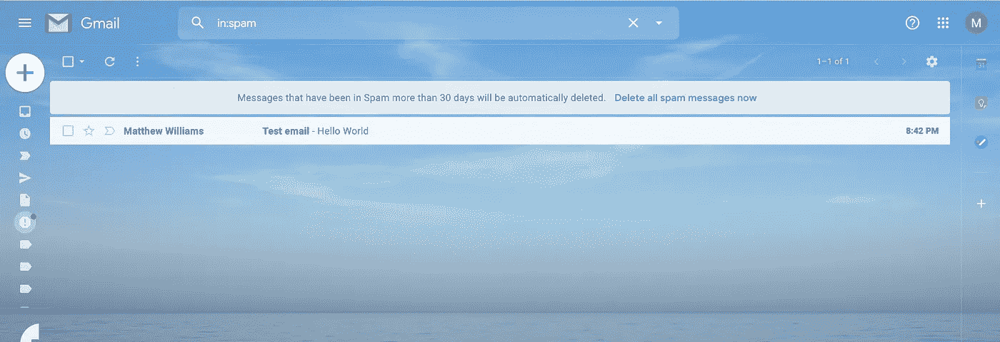
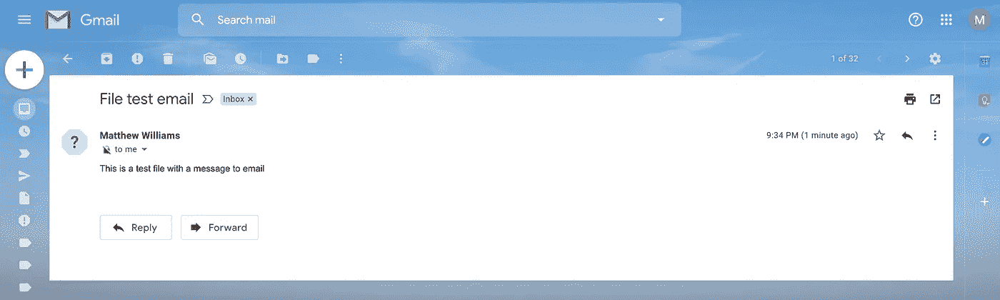

# 如何从 MacOS 终端发送邮件

> 原文：<https://betterprogramming.pub/how-to-send-mail-from-the-macos-terminal-dad1756b166f>

## 自动发送电子邮件—无需安装


[Webaroo.com.au](https://unsplash.com/@webaroo?utm_source=unsplash&utm_medium=referral&utm_content=creditCopyText)在 [Unsplash](https://unsplash.com/s/photos/email?utm_source=unsplash&utm_medium=referral&utm_content=creditCopyText) 上拍照

你是否曾经写过一个脚本，并希望在脚本失败时收到自动发送的电子邮件？或者您是命令行的新手，并且正在寻找比仅仅改变目录和列出文件更令人兴奋的事情吗？

好吧，如果你在 Mac 上工作，你就拥有了从命令行直接发送电子邮件到你选择的收件箱所需的一切。

# 发送您的第一封邮件

您的 Mac 应该已经设置为开箱即可发送电子邮件，因此您甚至不需要进行任何配置。你只需要确保你登录到一个用户帐户，Mac 将处理发送电子邮件。

要发送您的第一封电子邮件，请打开终端并运行:

```
echo "Hello World" | mail -s "Test email" someone@example.com
```

显然，您需要将`someone@example.com`替换为您想要发送邮件的实际电子邮件地址。

运行上面的命令后，检查你发送邮件的账户，你的邮件应该到了。请务必检查您的垃圾邮件收件箱，因为您的电子邮件提供商很可能会认为该邮件不安全。



容易得很

好了，这就是开始的全部步骤。现在，让我们更深入地研究一些命令，这样我们就可以在终端中生成更深入的电子邮件。

# 写邮件正文的方法

有很多方法可以用来创建电子邮件的正文。消息的长度和您喜欢使用命令行的方式可能会影响您最终使用以下哪种方法:

## 命令行方法

编写邮件正文最简单的方法是简单地调用`mail`并逐行输入。当 mail 没有预定义的信息时，它将默认为终端的标准输入。

您可以按 enter 添加任意多的行，当您的消息完整时，您可以按`Ctrl + D`结束(是的，控制，而不是命令)。

使用这个基本版本的语法如下:

```
mail someone@example.com
```

使用此默认版本时,“终端”会提示您输入主题行。值得注意的是，下面的方法不会提示主题行，但是仍然可以使用下面讨论的选项添加主题行。

## 回声法

信不信由你，如果你运行了第一个示例命令，你已经使用了这种方法。向上滚动，再次查看该命令。您可以看到它是以`echo`而不是`mail`开始的，我们使用管道操作符`|`将消息从命令的第一部分发送到第二部分。

我们可以`echo`我们喜欢的任何文本，然后使用`mail`命令将其发送到邮件正文中:

```
echo "This is not the same message as before" | mail -s "Echo test email" someone@example.com
```

## Cat 方法

最后，既然我们现在知道我们能够将结果通过管道传输到`mail`命令，我们可以使用`cat`命令将文件的内容作为消息复制。如果您想要发送错误日志或已经包含在文件中的内容，这将非常有用。

为了演示，首先，让我们创建一个包含一些内容的新文本文件:

```
echo "This is a test file with a message to email" > file.txt
```

之后，我们能够将`cat`的结果通过管道传输到`mail`，将文件内容发送到我们的电子邮件:

```
cat file.txt | mail -s "File test email" someone@example.com
```

检查收件箱中的邮件，我们可以看到该文件已成功复制到电子邮件的正文中。



非常管用！

# 改变话题

任何电子邮件的一个重要方面是主题行。如前所述，echo 和 cat 方法不会提示您输入主题。对于那些一直密切关注的人，你会看到上面的电子邮件示例都有不同的主题行，因为我们传递给`-s`选项的值不同。

此选项允许我们轻松创建电子邮件的主题行，同样，我们可以使用以下语法将其更改为我们喜欢的任何内容:

```
mail -s "Enter your subject here" someone@example.com
```

# 抄送和密件抄送给其他地址

有时，您会希望在发送邮件时包含多个电子邮件地址。终端的`mail`功能允许使用命令行选项发送抄送和密件抄送。

## 抄送给某人

为了抄送给某人，添加`-c`选项，后跟逗号分隔的电子邮件地址列表，如下所示:

```
echo "Hello World" | mail -s "CC Testing email" someone@example.com -c second@example.com, third@example.com
```

## 密件抄送有人在吗

为了密件抄送给某人，添加`-b`选项，后跟一个逗号分隔的电子邮件地址列表，如下所示:

```
echo "Hello World" | mail -s "BCC Testing email" someone@example.com -b second@example.com, third@example.com
```

# 结论

这样你就有了:从终端发送邮件的简单方法，不需要安装或配置任何东西。显然，使用命令行并不是定期创建和发送电子邮件的最有效方式，此处显示的设置在电子邮件加密和验证方面存在问题，经常会将您的邮件发送到垃圾邮件收件箱。

然而，如果你想将地址加入白名单，并通过 Mac 上的脚本自动发送一些电子邮件，这是一个简单的发送邮件的方法。同样，如果你只是喜欢在命令行上尝试新的东西，这是一个非常简单的开始使用终端的方法，而不仅仅是列出文件和目录。

# 资源

不幸的是，关于这些命令的在线资源并不多。然而，你可以运行`man mail`看看有什么可能。

如果您发现任何其他资源或任何令人兴奋的命令用法，请将它们写在下面的评论中，让其他人看到。