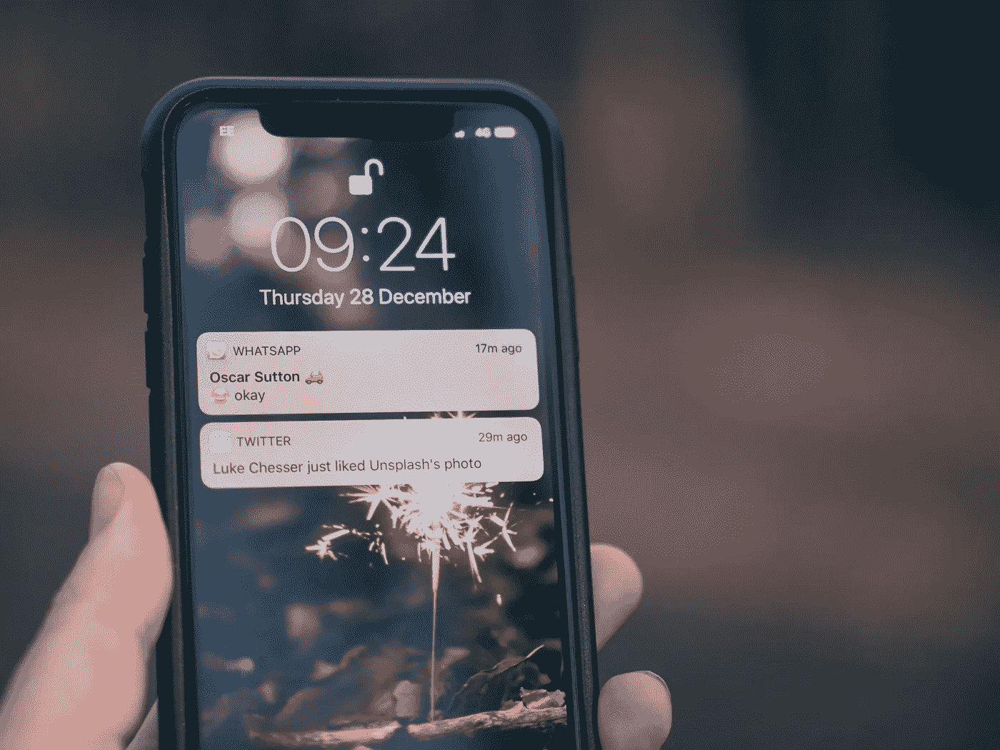
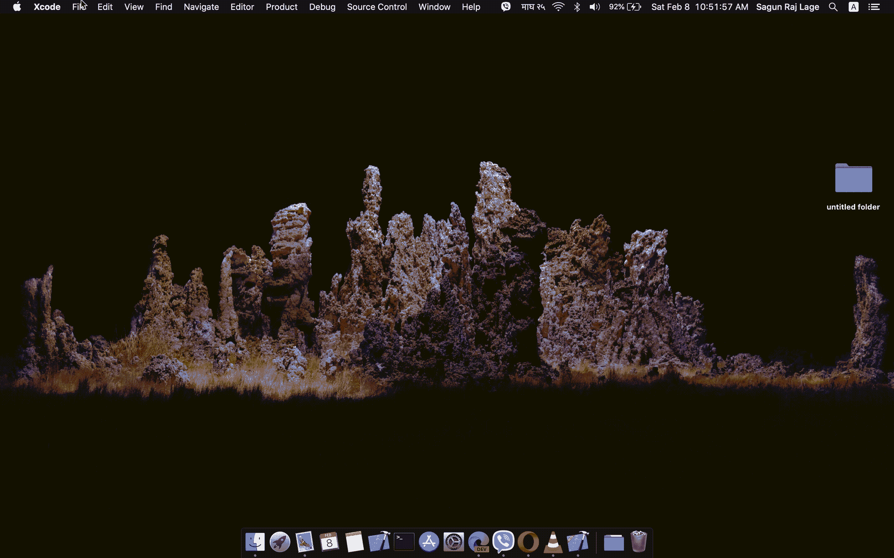
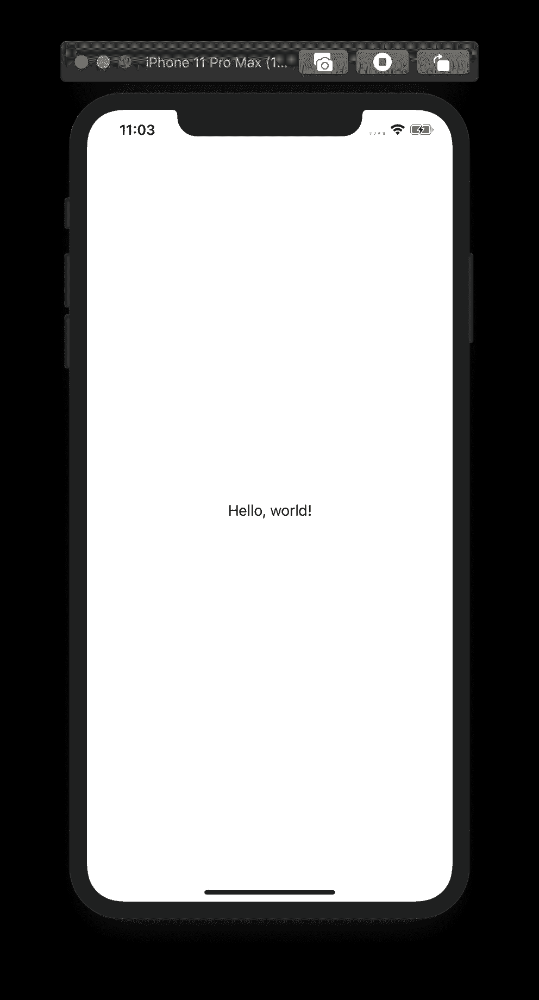
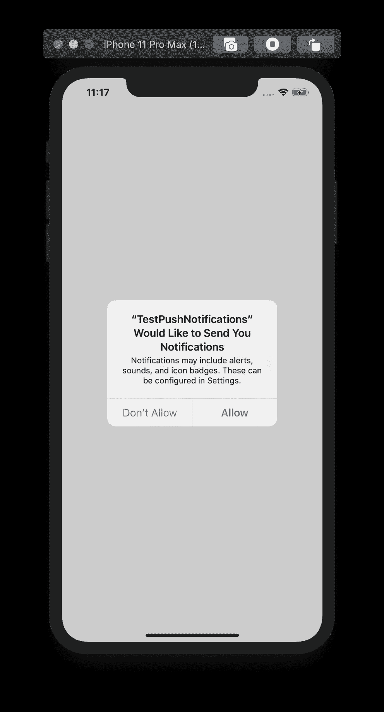
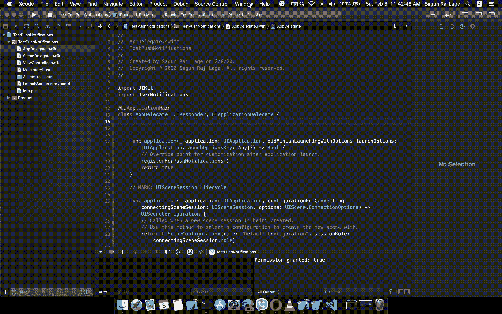
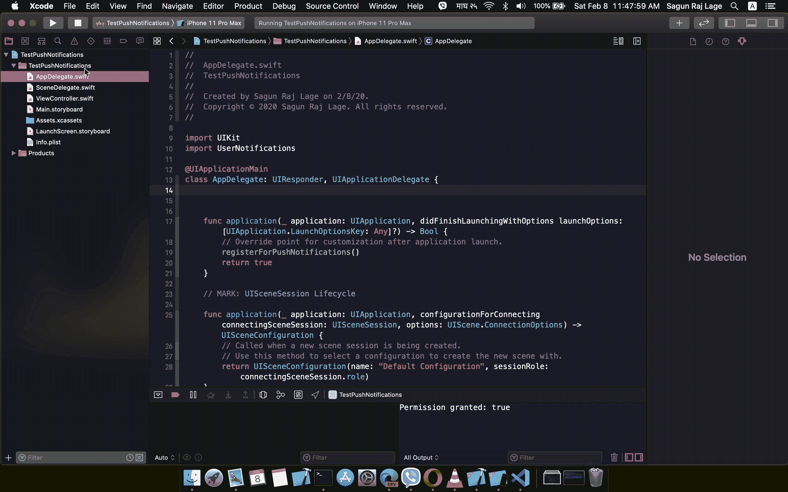
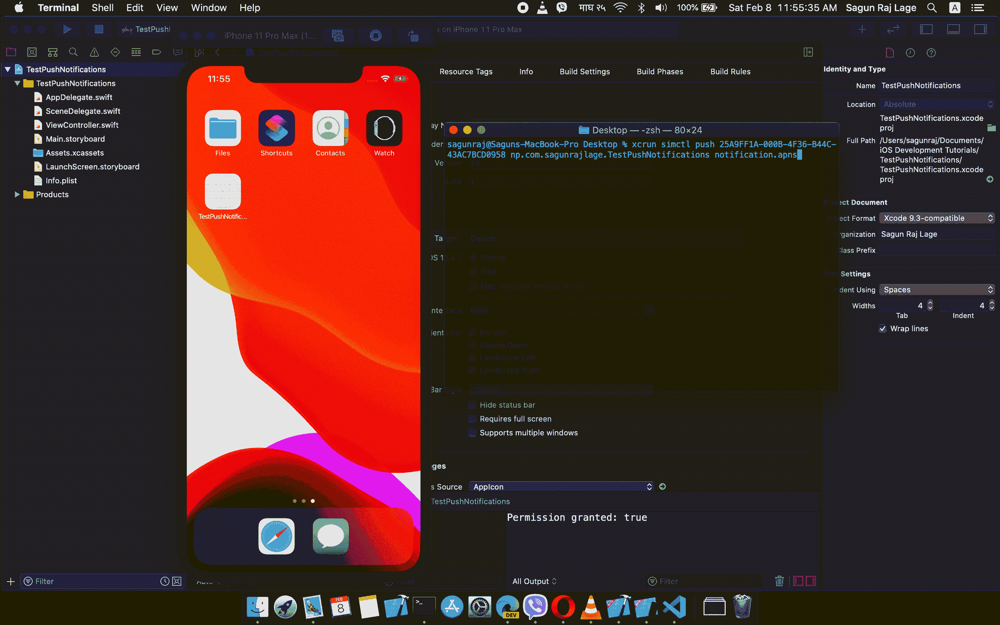
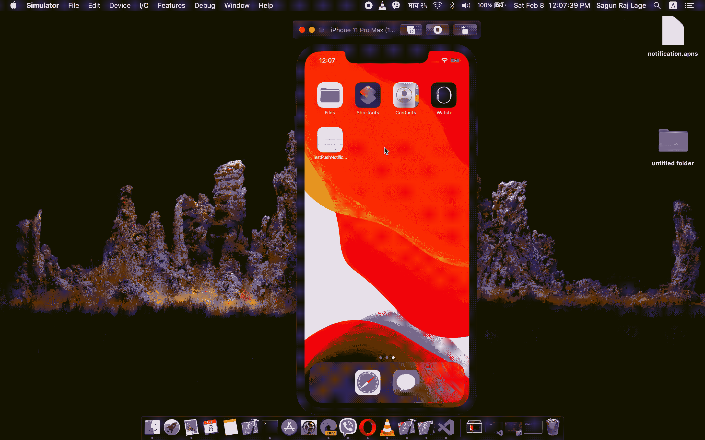

# 如何向 iOS 模拟器发送推送通知

> 原文：<https://betterprogramming.pub/how-to-send-push-notifications-to-the-ios-simulator-2988092ba931>

## 截至 Xcode 11.4 beta，可以！



照片由[杰米街](https://unsplash.com/@jamie452?utm_source=unsplash&utm_medium=referral&utm_content=creditCopyText)在 [Unsplash](https://unsplash.com/s/photos/notification?utm_source=unsplash&utm_medium=referral&utm_content=creditCopyText) 上拍摄

推送通知是开发者让用户参与到他们的应用中最受欢迎的方式之一。在 iOS 应用程序中，可以通过使用苹果推送通知服务(APNs)来合并推送通知。

然而，这并不像听起来那么简单，因为设置它需要做很多事情。另外，更糟糕的是，我们必须使用真实的设备来测试推送通知是否有效，因为 Xcode 的 iOS 模拟器不支持推送通知。

但是我有好消息要告诉你。Xcode 11.4 测试版已经发布，对我来说这个版本最好的部分是我们终于可以在 iOS 模拟器中测试推送通知了！

Xcode 11.4 测试版的[发行说明](https://developer.apple.com/documentation/xcode_release_notes/xcode_11_4_beta_release_notes)包含一个部分，内容如下:

> 模拟器支持模拟远程推送通知，包括后台内容获取通知。在模拟器中，将 APNs 文件拖放到目标模拟器上。该文件必须是 JSON 文件，具有有效的 Apple 推送通知服务有效负载，包括“aps”密钥。它还必须包含一个顶级“模拟器目标包”，其字符串值与目标应用程序的包标识符相匹配。
> 
> `simctl`还支持发送模拟推送通知。如果文件包含“模拟器目标包”，则包标识符不是必需的，否则您必须将其作为参数提供(8164566):
> 
> `$ xcrun simctl push <device> com.example.my-app ExamplePush.apns`

我们将在文章的后半部分深入探讨这意味着什么。但是现在，让我们感到高兴，因为必须使用真实设备来测试推送通知的麻烦终于消失了。

# 我们怎么做呢？

那么，现在，让我们看看如何使用 Xcode 11.4 beta 的这个新特性。为此，您显然需要 Xcode 11.4 beta 或更高版本。我目前有 Xcode 11.4 测试版。


现在，让我们创建一个新项目。我把它命名为 *TestPushNotifications* ，我选择的用户界面是 Storyboard。如果你愿意，你可以选择 SwiftUI。



创建新项目

只是为了让应用看起来更好(虽然这不会有什么帮助……)，我添加了一个`UILabel`，上面写着“你好，世界！”在`Main.storyboard`的`View Controller`。

现在，当我们在模拟器中运行该应用程序时，在这种情况下，它看起来像这样:



这就是乐趣的开始！让我们转到`AppDelegate.swift`文件，在`import UIKit`下面添加下面一行来导入苹果的`UserNotifications`框架。

```
import UserNotifications
```

现在，在`AppDelegate`类中，让我们创建一个函数`registerForPushNotifications()`，请求用户允许应用程序发送推送通知。

在`AppDelegate`类中添加的 registerForPushNotifications()函数

让我们从`AppDelegate`的`application(_:didFinishLaunchingWithOptions:)`方法调用刚刚创建的函数。

为此，在`return true`语句上方添加`registerForPushNotifications()`。您的`AppDelegate.swift`文件看起来会像这样:

AppDelegate.swift 文件的最终版本

当我们运行应用程序时，我们会收到一个对话框，要求允许应用程序发送推送通知。轻击*允许*。



要求用户允许应用程序发送推送通知的对话框

Xcode 11.4 测试版的发行说明说:

> "`simctl`还支持发送模拟推送通知。如果文件包含“模拟器目标包”，则包标识符不是必需的，否则，您必须将其作为参数提供(8164566):
> 
> `$ xcrun simctl push <device> com.example.my-app ExamplePush.apns`

现在，让我们试试它说什么。为此，我们需要一个带有有效苹果推送通知服务有效负载的 JSON 文件。

苹果公司的文档名为“[生成远程通知](https://developer.apple.com/documentation/usernotifications/setting_up_a_remote_notification_server/generating_a_remote_notification)”，清楚地说明了我们如何创建这样一个文件。我正在我的桌面上创建一个名为`notification.apns`的文件，并在其中添加以下内容:

创建文件后，我们可以打开终端并使用发行说明中给出的命令:

```
$ xcrun simctl push <device> com.example.my-app ExamplePush.apns
```

这里，`<device>`将被替换为设备标识符，`com.example.my-app`将被替换为项目的包标识符，`ExamplePush.apns`将被替换为我们的`apns`文件的文件名。

请注意，如果您在`apns`文件中使用`“Simulator Target Bundle”`键添加包标识符，那么包标识符在命令中不是必需的。

您可以按照下面 GIF 中显示的步骤检索模拟器的设备标识符:



查找我们正在使用的模拟器的设备标识符(本例中是 iPhone 11 Pro Max)

您可以按照下面 GIF 中显示的步骤检索项目的包标识符:



查找项目的包标识符

在执行命令之前，我们必须先将应用程序发送到后台。这就是推送通知可见的方式。

> 注意:如果你想让推送通知在前台也可见，你可以让`AppDelegate`符合`UNUserNotificationCenterDelegate`并实现它的`userNotificationCenter(_:willPresent:withCompletionHandler:)`方法。并且确保在调用`application(_:didFinishLaunchingWithOptions:)`方法中的`registerForPushNotifications()`之前已经包含了下面一行:
> 
> `UNUserNotificationCenter.current().delegate = self`
> 
> 感谢 [Rajan Maheshwari](https://medium.com/u/3f4b70046055?source=post_page-----2988092ba931--------------------------------) 的[回应](https://medium.com/@rajanmaheshwari1990/sagun-raj-lage-i-havent-tried-that-504a66af000f)。

现在，让我们执行命令。在我的例子中，命令是:

```
$ xcrun simctl push 25A9FF1A-000B-4F36-B44C-43AC7BCD0958 np.com.sagunrajlage.TestPushNotifications notification.apns
```

一旦它被执行，这就是我们在模拟器中看到的—一个推送通知:



模拟器中的推送通知

这就是我们如何在模拟器中运行命令来显示推送通知！

但是等等，如果你不太习惯使用终端，还有另一种方法。还记得发行说明上说的吗？

> “在模拟器中，将 APNs 文件拖放到目标模拟器上。该文件必须是 JSON 文件，具有有效的 Apple 推送通知服务有效负载，包括“aps”密钥。它还必须包含顶级“模拟器目标包”，其字符串值与目标应用程序的包标识符相匹配。

我们可以简单地将我们的`apns`文件拖放到模拟器中来获得推送通知。但是为此，我们必须在`apns`文件中做一些修改。

在我们之前创建的`notification.apns`文件中，让我们再添加一个键`"Simulator Target Bundle”`，它将保存我们的包标识符的值，在我的例子中是`“np.com.sagunrajlage.TestPushNotifications”`。

因此，该文件将如下所示:

现在，将这个文件拖放到模拟器上，看看其中的神奇之处吧！



这是在 iOS 模拟器中测试推送通知的另一种方式。

这是对即将到来的 Xcode 版本的一个很好的补充，因为它为我们省去了很多麻烦。保持下去，苹果！

向我的导师们大喊，Prakshapan Shrestha 、 [Nutan Niraula](https://www.linkedin.com/in/nutan-niraula/) 和 [Ashwin Shrestha](https://www.linkedin.com/in/ashwin-shrestha-7545a2101/) ，感谢他们激励、鼓励和支持我！

编码快乐！

如果你觉得这篇文章有用，并且愿意支持我，请"[给我买杯咖啡](https://www.buymeacoffee.com/sagunraj)"

[](https://www.buymeacoffee.com/sagunraj) [## Sagun Raj Lage 正在撰写博客和书籍，并免费教授编程。

### 我是一名 iOS 开发人员，有从事各种领域相关项目的经验，如交通和…

www.buymeacoffee.com](https://www.buymeacoffee.com/sagunraj)