# 如何为 AWS Amplify 部署发送松弛通知

> 原文：<https://betterprogramming.pub/how-to-send-slack-notifications-for-aws-amplify-deployments-99278a778ff7>

## 为您的前端项目节省时间并设置时差通知

亚历克斯·库利科夫在 [Unsplash](https://unsplash.com?utm_source=medium&utm_medium=referral) 上的照片

Amplify 是一项将前端应用程序部署到 AWS 云的出色服务。但当涉及到监控您的部署时，Amplify 只提供了一个基本的通知系统。虽然它允许您发送电子邮件通知，但将它们发送到您的 Slack 频道并不是一项简单的任务。

这篇短文揭示了在 5 分钟内为您的 AWS Amplify 部署设置 Slack 通知应该知道的秘密。

要做到这一点，您需要完成以下步骤:

*   设置社交网络话题
*   设置松弛的传入 Webhook
*   创建 Lambda 函数

# 1.设置社交网络话题

在你的 AWS 控制台，去放大。

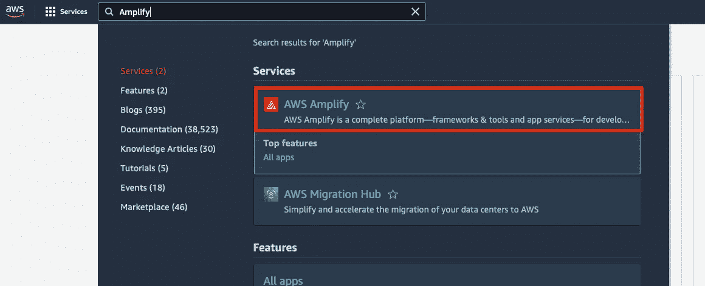

选择要在其中设置时差通知的应用程序。

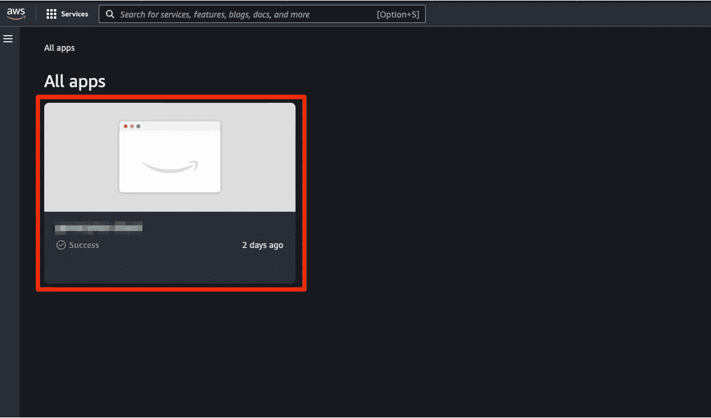

由于 Amplify 在默认情况下不会创建 SNS 主题，因此我们需要通过向通知添加电子邮件订阅来触发此操作。为此，请转到“通知”部分并添加您的电子邮件地址。

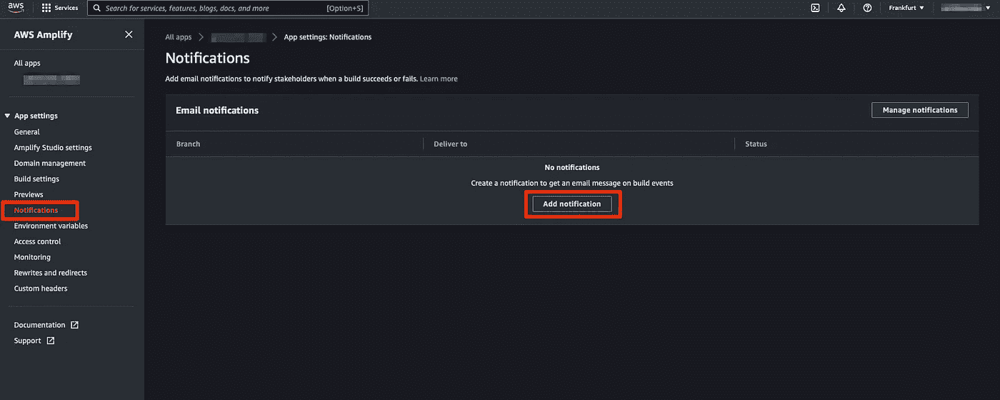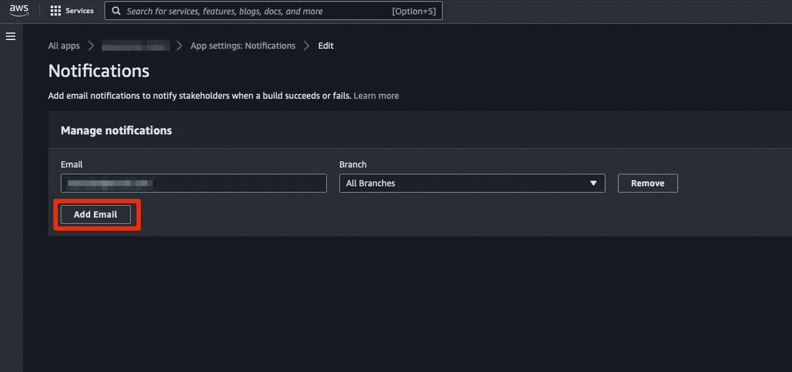

如果您不想接收有关部署的电子邮件，可以在之后立即删除订阅。我们需要这个来揭示社交网站的话题。

# 2.设置松弛的传入 Webhook

下一步是在你的 Slack 上设置一个**传入 Webhook** ，我们将使用它来发送消息。你可以在[官方教程](https://api.slack.com/messaging/webhooks)中了解更多这方面的内容。

转到[页面](https://slack.com/apps/A0F7XDUAZ-incoming-webhooks)并点击“添加到时差”。

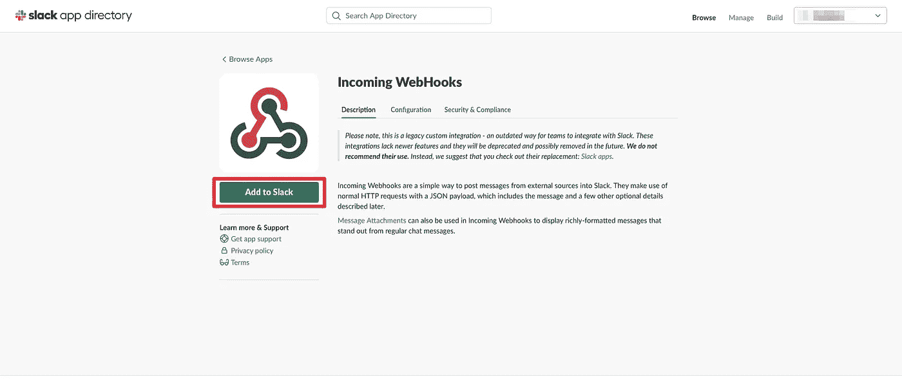

选择你想发布通知的频道后，将用户名改为“AWS Amplify”，上传一个漂亮的 Amplify 标志，保存你的设置。

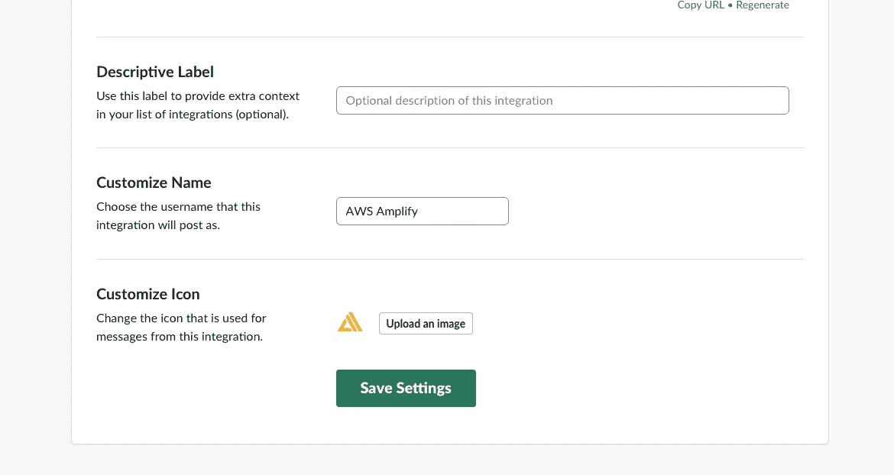

复制 Webhook URL，我们将在下一步需要它。

# 3.创建 Lambda 函数

现在我们需要创建一个 **Lambda 函数**，它将在 Amplify 发送通知时运行。然后，该函数将处理通知事件，并向您的 Slack 通道发送一条消息。

在 AWS 控制台中，转到 Lambda。

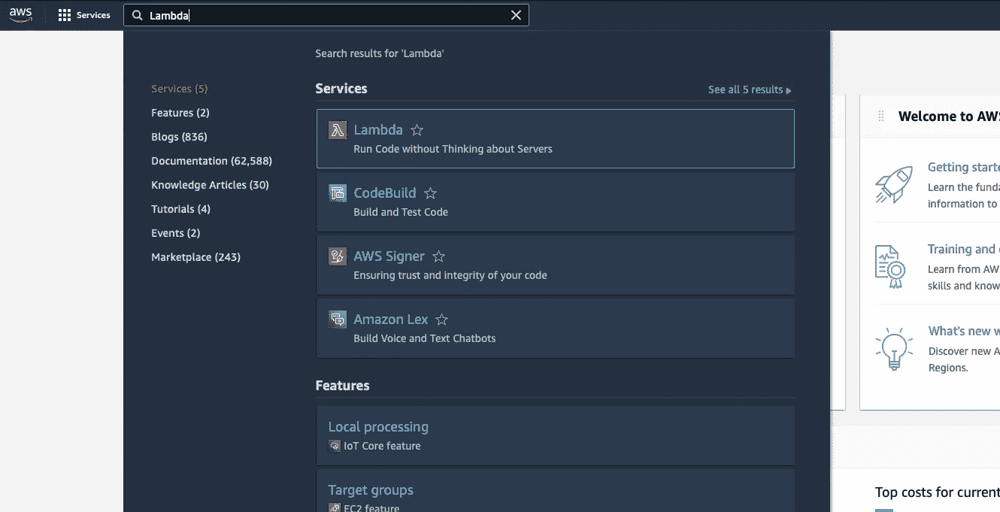

选择具有以下属性的“创建函数”:

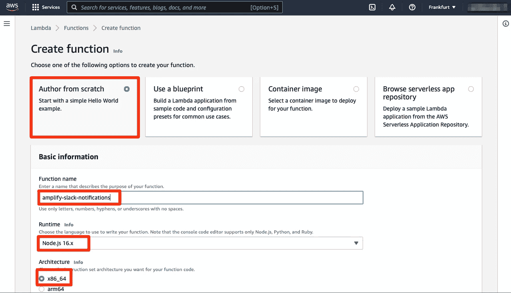

将以下代码传递到您的 **index.js** 文件，然后单击“部署”:

将 webhookUrl 值更改为创建 Slack 传入 Webhook 时获得的值。

之后，在功能概述中点击“添加触发器”。

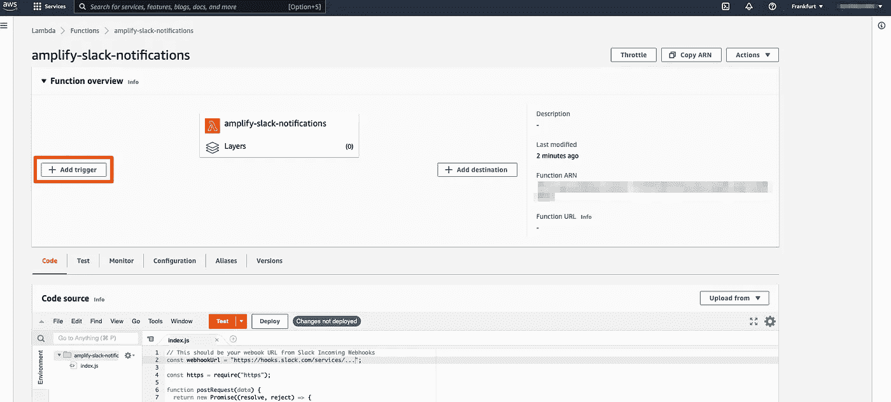

选择 SNS 作为触发器，然后选择在我们向通知添加电子邮件时由 AWS Amplify 创建的 SNS 主题。

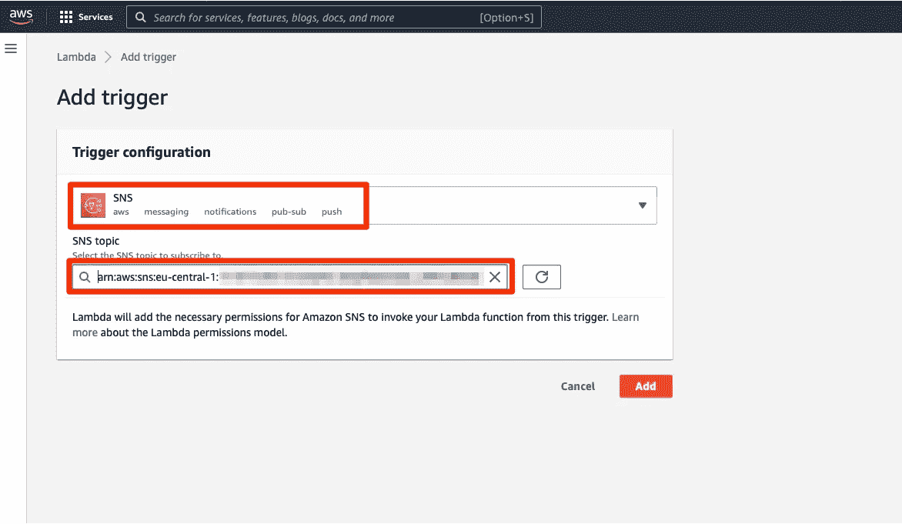

如果一切顺利，你将能够在 AWS 的 Lambda 页面上找到你新安装的函数。

仅此而已！现在，当您部署到 AWS Amplify 时，您应该会收到延迟通知。要检查一切是否正常，请转到 Amplify 应用程序，然后单击“重新部署此版本”。

您应该很快会在 Slack 上收到一条消息。

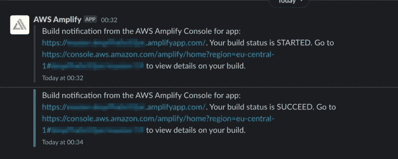

我希望本指南已经帮助您节省了时间，并为您的前端项目设置了时差通知。