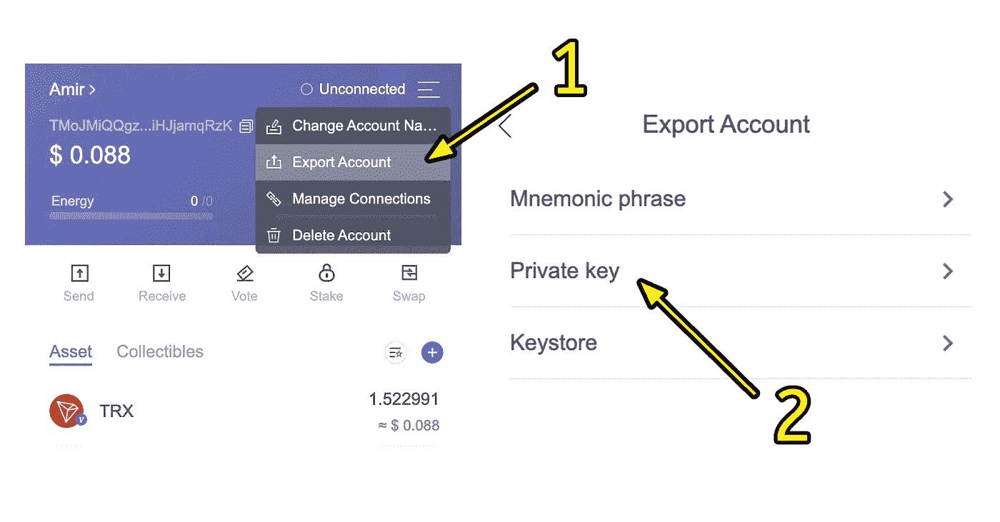

# 如何用 Python 发送 Tron 加密货币

> 原文：<https://betterprogramming.pub/how-to-send-tron-cryptocurrency-with-python-5d842bc8f9cd>

## 使用 python 创建钱包和进行交易


[信用](https://www.google.com/url?sa=i&url=https%3A%2F%2Fresearch.binance.com%2Fen%2Fprojects%2Ftron&psig=AOvVaw1zPjCYrV3vmJe_putOBMB5&ust=1643099494946000&source=images&cd=vfe&ved=0CA0Q3YkBahcKEwj40Pfh_Mn1AhUAAAAAHQAAAAAQAw)

是一个 python 库，可用于与创区块链交互。该库包括修改区块链状态的函数(创建和授权交易和钱包)以及不改变状态的函数(查询余额、块细节、交易等)。

# 安装软件包

要安装`tronpy`库包，使用 pip install 命令。

```
pip3 install tronpy
```

安装完成后，导入库，如下所示。

```
from tronpy import Tron
```

# 与创·区块链的联系

为了连接到任何区块链网络，您要么必须在您的机器上本地运行一个节点，要么使用一个远程节点提供者，比如 [NOWNodes](https://nownodes.io/) 。

然而，`tronpy`图书馆让我们变得更容易。该库包含一个名为`Tron()`的类，它让我们无需任何额外的设置就可以访问 Tron 区块链。

下面的代码片段将我们连接到 Tron 主网络(实际的 Tron 网络)。就这么简单！

```
client = Tron()
```

如果您想连接到一个定制的节点提供者(比如一个测试网)，您可以输入带有 HTTP API 端点的`Tron()`类。

```
**from** **tronpy** **import** Tron
**from** **tronpy.providers** **import** HTTPProvider*# Use private network as HTTP API endpoint*
client = Tron(HTTPProvider("http://127.0.0.1:8090"))
```

# 创建钱包

有两种方法可以打造一个`Tron`钱包。第一种方法涉及到`tronpy`库。见下面的函数。

```
**Input**create_wallet()**Output**Wallet address: TRfffNywtDL6wEamxg8V46LJfyR8Fvy7nu
Private Key:    ********effeda9ec01f9404a841c59698
```

`create_wallet()`函数生成一对私钥和一个钱包地址。私钥由钱包所有者用于创建交易，不应与任何人或任何网站共享。但是钱包地址可以和其他人分享来接收付款。

第二种也是更受欢迎的方法是使用加密钱包。拥有一个加密钱包的好处是，你不仅可以在多个设备上访问它，而且你可以享受应用程序的用户友好性和图形用户界面。

[Tronlink](https://www.tronlink.org/) 是最著名的 Tron 加密钱包。它可以在 IOS、Android 和 Chrome 上使用。

# 验证 Tron 地址

在将您的 Tron 发送到某个地址之前，您应该检查该地址是否实际存在，或者它是否是一个无效的地址。验证是至关重要的，因为否则，你会赔钱。使用`is_valid()`功能进行 Tron 地址验证。

```
**Input**isAddress = is_valid('TRfffNywtDL6wEamxg8V46LJfyR8Fvy7nu')
print(isAddress)**Output**True
```

# 发送创

好了，现在您已经创建了一个 Tron wallet 并验证了接收者的地址，您可以更进一步，在 Tron mainnet 中创建一个实际的交易。

要做到这一点，你必须有你的钱包地址以及它的私人密钥。

如果您使用`tronpy`生成了一个钱包，那么您已经有了这个信息。

但是，如果您创建了 Tronlink 钱包，则需要导出私钥。下图说明了如何从您的 Tronlink 钱包中导出私钥。



从 Tronlink 导出私钥

`send_tron()`功能的工作原理如下:

创建交易->用内网广播的**私钥** - >签名- >(等到交易通过)- >查询并打印交易回单

```
**Input**recipient_address = 'TPhBQKbg3WqZnxCeiDw9ZtsaYutkvHqeWS'
amount = 1000000send_tron(recipient_address, amount)**Output***# returns the transaction receipt*{
'id': '5182b96bc0d74f416d6ba8e22380e5920d8627f8fb5ef5a6a11d4df030459132', 'blockNumber': 6415370, 
'blockTimeStamp': 1591951155000, 
'contractResult': [''], 
'receipt': {'net_usage': 283}
}
```

**注意**“金额”单位为**微**，意味着 1，000，000 对应 1 TRX。

# 账户结余

在区块链，所有的账户细节和交易在任何时候对每个人都是透明的。个人可以检查一个帐户地址持有多少特定令牌，或者查看其完整的交易历史。

这同样可以在`tronpy`功能的帮助下完成:

```
**Input**account = 'TMoJMiQQgzneoGimdJjZtxcPiHJjamqRzK'
print(account_balance(account))**Output**127.075003 (TRX)
```

# 交易明细

同样，通过将交易散列输入到下面的函数中，可以检查特定交易的细节。

```
**Input**trx_hash = '55f8e8b09b44042fdb22c9679a1bb6c4bc0b62707c28492d4f95a5012f9fb0c5'
print(transaction_detail(trx_hash))**Output**{
       'address': 'TMoJMiQQgzneoGimdJjZtxcPiHJjamqRzK', 
       'create_time': 1642490133000, 
       'latest_opration_time': 1642932975000, 
       'free_net_usage': 250, 
       'latest_consume_free_time': 1642932975000, 
       'account_resource': {}, 
}
```

# 用我的免费创来验证

既然您已经阅读了这篇文章这么久，我将提供少量的 Tron。你可以用这笔钱来测试功能，看看代码是否运行完美。

请在评论区写下你的 Tron 钱包地址，我会尽快给你发一些 TRX。