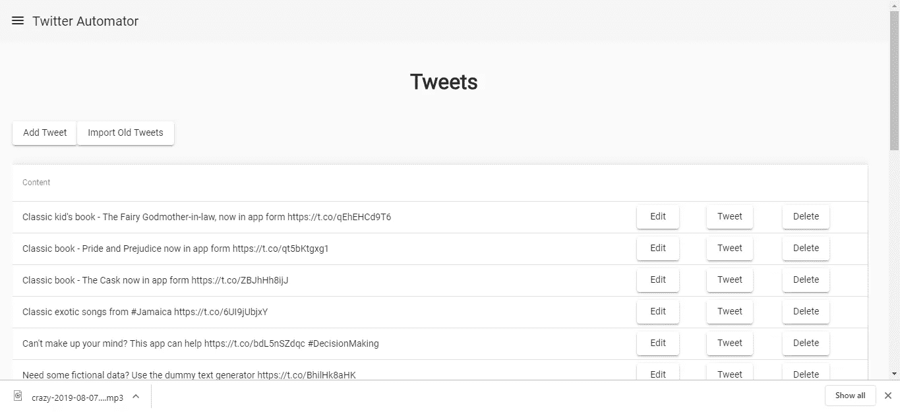

# 如何使用 Twitter API 从您的应用程序发送推文

> 原文：<https://betterprogramming.pub/how-to-send-tweets-from-your-app-with-the-twitter-api-5bb9f24e0896>

## 使用 twit 模块发送推文并获取推文历史


照片由[萨拉·库菲](https://unsplash.com/@stereophototyp?utm_source=unsplash&utm_medium=referral&utm_content=creditCopyText)在 [Unsplash](https://unsplash.com/search/photos/twitter?utm_source=unsplash&utm_medium=referral&utm_content=creditCopyText) 拍摄

如果您已经按照步骤[构建 Twitter 登录到您的应用程序](https://medium.com/better-programming/how-to-add-twitter-sign-in-to-your-node-js-back-end-with-angular-app-as-the-front-end-d90213f95703)，您可以登录到您的 Twitter 帐户并获得 OAuth 请求令牌和密码。

现在我们可以用它来做很多伟大的事情，比如发送推文和接收你过去在推文上发布的消息。

后端用 [Express](https://expressjs.com/) 打造，前端用 Angular 打造。在那篇教程中，我们构建了 Twitter 应用程序的基本部分。它具有注册、登录和 Twitter 登录功能。

现在，我们需要添加 Twitter 功能，以便该应用程序是有用的。

为了实现这个功能，我们可以使用 [twit](https://www.npmjs.com/package/twit) Node.js 模块。我们通过运行`npm i twit`来下载它。

由于 Twitter tweets 有 280 个字符的限制，我们还需要使用一个链接缩短器来缩短我们的链接。我们通过运行`npm i bitly`来添加[节点包。](https://www.npmjs.com/package/bitly)

由于我们现有的应用程序使用 [Sequelize](https://www.npmjs.com/package/sequelize) 作为我们的 ORM，我们可以运行数据库迁移来改变我们数据库的结构。这里有一篇关于如何使用 Sequelize 的文章，包括制作模型和表关系。

为了让事情变得简单，如果你是从你在之前构建的[应用继续，我们移除一些东西并重新开始。如果您在生产环境中，您必须进行迁移和添加或更改，以实现相同的数据库结构。](https://medium.com/better-programming/how-to-add-twitter-sign-in-to-your-node-js-back-end-with-angular-app-as-the-front-end-d90213f95703)

我们进行迁移并添加以下内容:

```
'use strict';
module.exports = {
  up: (queryInterface, Sequelize) => {
    return queryInterface.createTable('Users', {
      id: {
        allowNull: false,
        autoIncrement: true,
        primaryKey: true,
        type: Sequelize.INTEGER
      },
      userName: {
        type: Sequelize.STRING
      },
      email: {
        type: Sequelize.STRING
      },
      hashedPassword: {
        type: Sequelize.STRING
      },
      hashedOauthRequestToken: {
        type: Sequelize.STRING
      },
      hashOauthRequestTokenSecret: {
        type: Sequelize.STRING
      },
      createdAt: {
        allowNull: false,
        type: Sequelize.DATE
      },
      updatedAt: {
        allowNull: false,
        type: Sequelize.DATE
      }
    });
  },
  down: (queryInterface, Sequelize) => {
    return queryInterface.dropTable('Users');
  }
};
```

进行另一次迁移，并添加:

```
'use strict';
module.exports = {
  up: (queryInterface, Sequelize) => {
    return queryInterface.createTable('Tweets', {
      id: {
        allowNull: false,
        autoIncrement: true,
        primaryKey: true,
        type: Sequelize.INTEGER
      },
      content: {
        type: Sequelize.TEXT
      },
      usersId: {
        type: Sequelize.INTEGER
      },
      createdAt: {
        allowNull: false,
        type: Sequelize.DATE
      },
      updatedAt: {
        allowNull: false,
        type: Sequelize.DATE
      }
    });
  },
  down: (queryInterface, Sequelize) => {
    return queryInterface.dropTable('Tweets');
  }
};
```

然后，在模型中，如果我们遵循如何使用 Twitter 登录构建应用程序的教程，它应该存在，我们将它放在`models/users.js`:

```
'use strict';
module.exports = (sequelize, DataTypes) => {
  const User = sequelize.define('User', {
    userName: DataTypes.STRING,
    email: DataTypes.STRING,
    hashedPassword: DataTypes.STRING,
    hashedOauthAccessToken: DataTypes.STRING,
    hashedOauthAccessTokenSecret: DataTypes.STRING,
    activated: DataTypes.BOOLEAN,
    passwordResetToken: DataTypes.STRING
  }, {});
  User.associate = function (models) {
    User.hasMany(models.Tweet, {
      foreignKey: 'userId',
      sourceKey: 'id'
    });
  };
  return User;
};
```

并将以下内容放入`tweet.js`:

```
'use strict';module.exports = (sequelize, DataTypes) => {
  const Tweet = sequelize.define('Tweet', {
    content: DataTypes.TEXT,
    userId: DataTypes.INTEGER,
    scheduled: DataTypes.BOOLEAN
  }, {});
  Tweet.associate = function (models) {
    Tweet.hasMany(models.TweetRecord, {
      foreignKey: 'tweetId',
      sourceKey: 'id'
    }); Tweet.belongsTo(models.User, {
      foreignKey: 'userId',
      targetKey: 'id'
    });
  }; return Tweet;
};
```

运行`npx sequelize db:migrate`之后，我们已经有了构建应用程序的模型和数据库结构。

我们制作了一个新的控制器来存储 Twitter 的 tweet 逻辑。创建一个名为`tweetsController.js`的文件，放入以下内容:

```
const express = require('express');
const models = require('../models');
const jwt = require('jsonwebtoken');
const Twit = require('twit');
const Op = require('sequelize').Op;
const CryptoJS = require("crypto-js");
const shortUrl = require('node-url-shortener');
const router = express.Router();
import { authCheck } from '../middlewares/authCheck';
import { saveTweetRecord, saveTweet } from '../services/tweetService';
import { BitlyClient } from 'bitly';
const bitly = new BitlyClient(process.env.BITLY_TOKEN, {});const urlRegex = /https?:\/\/(www\.)?[-a-zA-Z0-9@:%._\+~#=]{1,256}\.[a-zA-Z0-9()]{1,6}\b([-a-zA-Z0-9()@:%_\+.~#?&//=]*)/;router.get('/get/:id', authCheck, async (req, res) => {
    try {
        const id = req.params.id;
        const tweets = await models.Tweet.findAll({ where: { id } });
        return res.send(tweets[0]);
    }
    catch (ex) {
        return res.send(ex, 500);
    }});router.get('/list', authCheck, async (req, res) => {
    const page = req.params.page;
    const token = req.headers.authorization;
    const decoded = jwt.verify(token, process.env.JWT_SECRET);
    const userId = decoded.data.userId;
    const tweets = await models.Tweet.findAll({
        where: {
            userId,
            [Op.or]: [
                { deleted: false },
                { deleted: null }
            ]
        }
    });
    res.send({
        tweets,
        count: tweets.length
    });});router.post('/post', authCheck, async (req, res) => {
    const token = req.headers.authorization;
    const decoded = jwt.verify(token, process.env.JWT_SECRET);
    const userId = decoded.data.userId;
    try {
        let content = req.body.content;
        let urls = content.match(urlRegex) || [];
        urls = urls.filter(u => u && u.startsWith('http') && !u.includes('bit.ly'));
        for await (const u of urls) {
            const urlResult = await bitly.shorten(u);
            content = content.replace(u, urlResult.url);
        }
        await models.Tweet.create({
            ...req.body,
            content,
            userId
        })
        return res.send({ message: 'Successfully created tweet' });
    }
    catch (ex) {
        return res.send(ex, 500);
    }});router.put('/update/:tweetId', authCheck, async (req, res) => {
    try {
        const token = req.headers.authorization;
        const tweetId = req.params.tweetId;
        const decoded = jwt.verify(token, process.env.JWT_SECRET);
        const userId = decoded.data.userId;
        let content = req.body.content;
        let urls = content.match(urlRegex) || [];
        urls = urls.filter(u => u && u.startsWith('http') && !u.includes('bit.ly'));
        for await (const u of urls) {
            const urlResult = await bitly.shorten(u);
            content = content.replace(u, urlResult.url);
        }
        await models.Tweet.update({
            ...req.body,
            content,
            userId
        }, {
                where: {
                    id: tweetId
                }
            })
        return res.send({ message: 'Successfully updated tweet' });
    }
    catch (ex) {
        console.log(ex);
        return res.send(ex, 500);
    }});router.delete('/delete/:id', authCheck, async (req, res) => {
    const id = req.params.id;
    try {
        await models.Tweet.update(
            {
                deleted: true
            }, {
                where: { id }
            }
        )
        return res.send({ message: 'Successfully deleted tweet' });
    }
    catch (ex) {
        return res.send(ex, 500);
    }
});router.post('/sendTweet/:id', authCheck, async (req, res) => {
    const id = req.params.id;
    const token = req.headers.authorization;
    try {
        const tweets = await models.Tweet.findAll({
            where: { id }
        })
        const tweet = tweets[0];
        const decoded = jwt.verify(token, process.env.JWT_SECRET);
        const userId = decoded.data.userId;
        const users = await models.User.findAll({
            where: { id: userId }
        })
        const user = users[0];
        const accessTokenBytes = CryptoJS.AES.decrypt(user.hashedOauthAccessToken, process.env.OAUTH_SECRET);
        const oauthAccessToken = accessTokenBytes.toString(CryptoJS.enc.Utf8);const accessTokenSecretBytes = CryptoJS.AES.decrypt(user.hashedOauthAccessTokenSecret, process.env.OAUTH_SECRET);
        const oauthAccessTokenSecret = accessTokenSecretBytes.toString(CryptoJS.enc.Utf8);const T = new Twit({
            consumer_key: process.env.TWITTER_CONSUMER_KEY,
            consumer_secret: process.env.TWITTER_CONSUMER_SECRET,
            access_token: oauthAccessToken,
            access_token_secret: oauthAccessTokenSecret,
            timeout_ms: 60 * 1000,
            strictSSL: true
        })
        T.post('statuses/update', { status: tweet.content }, (err, data, response) => {
            saveTweetRecord(id);
            res.send({ message: 'Successfully sent tweet' });
        })
    }
    catch (ex) {
        return res.send(ex, 500);
    }});router.get('/importOldTweets', authCheck, async (req, res) => {
    const token = req.headers.authorization;
    try {
        const decoded = jwt.verify(token, process.env.JWT_SECRET);
        const userId = decoded.data.userId;
        const users = await models.User.findAll({
            where: { id: userId }
        })
        const user = users[0];
        const accessTokenBytes =            CryptoJS.AES.decrypt(user.hashedOauthAccessToken, process.env.OAUTH_SECRET);
        const oauthAccessToken = accessTokenBytes.toString(CryptoJS.enc.Utf8);const accessTokenSecretBytes = CryptoJS.AES.decrypt(user.hashedOauthAccessTokenSecret, process.env.OAUTH_SECRET);
        const oauthAccessTokenSecret = accessTokenSecretBytes.toString(CryptoJS.enc.Utf8); const T = new Twit({
            consumer_key: process.env.TWITTER_CONSUMER_KEY,
            consumer_secret: process.env.TWITTER_CONSUMER_SECRET,
            access_token: oauthAccessToken,
            access_token_secret: oauthAccessTokenSecret,
            timeout_ms: 60 * 1000,
            strictSSL: true
        })
        T.get('statuses/user_timeline', {}, (err, data, response) => 
            res.send({ message: 'Successfully imported tweets' });
        })
    }
    catch (ex) {
        return res.send(ex, 500);
    }});module.exports = router;
```

`’/get/:id’`路线是我们获取存储在本地数据库中的推文的地方。`findAll`是一个从序列表中获取条目的函数。

`‘/post’`路线是我们通过 Twitter API 向我们的 Twitter 账户发送推文的地方。

我们在之前的教程中使用了`authCheck`来验证令牌，然后才允许用户发送 tweets。然后，我们从前端的授权头中获取令牌。然后，我们得到用户 ID。

在`try`块中，我们通过 Bit.ly 缩短了我们的链接。要使用`bitly`模块，我们必须注册一个 bit.ly 帐户并获得一个 API 令牌。然后，我们用 Bit.ly API 缩短所有不是 Bit.ly URL 的内容。

我们可以用`’/update/:tweetId’`路线更新现有的推文。它与`post`路线非常相似，除了您使用`tweetId`检索现有的 tweet，并在我们的数据库中更新 tweet。

`'/sendTweet/:id’`是推特魔法发生的地方。我们使用与 Twitter API 对话的`twit`模块来发送推文。

在我们需要取回数据时，`delete`路由会执行软删除。`importOldTweets` route 获取我们过去的推文历史，并将其保存到我们的数据库中。

在这个街区:

```
const accessTokenBytes = CryptoJS.AES.decrypt(user.hashedOauthAccessToken, process.env.OAUTH_SECRET);
        const oauthAccessToken = accessTokenBytes.toString(CryptoJS.enc.Utf8);const accessTokenSecretBytes = CryptoJS.AES.decrypt(user.hashedOauthAccessTokenSecret, process.env.OAUTH_SECRET);
        const oauthAccessTokenSecret = accessTokenSecretBytes.toString(CryptoJS.enc.Utf8);
```

我们获得了加密的 OAuth 访问令牌和密码，可以识别您的 Twitter 帐户，在下面的代码中，我们实例化了我们的 Twitter 客户端:

```
const T = new Twit({
  consumer_key: process.env.TWITTER_CONSUMER_KEY,
  consumer_secret: process.env.TWITTER_CONSUMER_SECRET,
  access_token: oauthAccessToken,
  access_token_secret: oauthAccessTokenSecret,
  timeout_ms: 60 * 1000,
  strictSSL: true
})
```

然后在:

```
T.post('statuses/update', { status: tweet.content }, (err, data, response) => {
  res.send({ message: 'Successfully sent tweet' });
})
```

我们将推文内容发送到我们的 Twitter 账户，让全世界都能看到你的推文。

为了散列加密我们的 OAuth 访问令牌和秘密，我们用以下内容替换了`saveAccessTokens`控制器:

```
router.get('/saveAccessTokens', authCheck, (req, res) => { consumer.getOAuthAccessToken(
        req.query.oauth_token,
        req.session.oauthRequestTokenSecret,
        req.query.oauth_verifier,
        (error, oauthAccessToken, oauthAccessTokenSecret, results) => {
            if (error) {
                logger.error(error);
                res.send(error, 500);
            }
            else {
                const token = req.headers.authorization;
                const decoded = jwt.verify(token, process.env.JWT_SECRET);
                const userId = decoded.data.userId;
                const hashedOauthAccessToken = CryptoJS.AES
                    .encrypt(oauthAccessToken, process.env.OAUTH_SECRET)
                    .toString();
                const hashedOauthAccessTokenSecret = CryptoJS.AES
                    .encrypt(oauthAccessTokenSecret, process.env.OAUTH_SECRET)
                    .toString();
                models.User.update({
                    hashedOauthAccessToken,
                    hashedOauthAccessTokenSecret
                },
                    { where: { id: userId } })
                    .then((result) => {
                        return res.send({ message: 'token saved' });
                    })
                    .catch((ex) => {
                        logger.error(ex);
                        return res.send({ error: ex }, 500);
                    })}
        });
});
```

在`app.js`中，我们必须添加两条线来访问我们添加的路线:

```
const tweets = require('./controllers/tweetsController');
```

然后补充:

```
app.use('/tweets', tweets);
```

用你其他的`app.use`台词。

在上一个教程中，我们没有加密机密访问令牌。但是，如果我们想做一个安全的应用程序，我们必须这样做。这将保存加密的凭据，而不是原始凭据。

在我们之前构建的 [Angular 应用](https://medium.com/better-programming/how-to-add-twitter-sign-in-to-your-node-js-back-end-with-angular-app-as-the-front-end-d90213f95703)中，我们必须添加一个页面来查看我们的前端应用。

我们需要将我们的推文存储在商店中，以便于集中访问。我们在`reducers`文件夹中创建一个名为`tweets-reducer.ts`的文件，然后将以下内容放入:

```
const SET_TWEETS = 'SET_TWEETS';function tweetsReducer(state, action) {
    switch (action.type) {
        case SET_TWEETS:
            state = action.payload;
            return state;
        default:
            return state
    }
}export { tweetsReducer, SET_TWEETS };
```

然后，在`reducers/index.ts`中，我们把:

```
import { menuReducer } from './menu-reducer';
import { tweetsReducer } from './tweets-reducer';export const reducers = {
  menu: menuReducer,
  tweets: tweetsReducer
};
```

在`app.module.ts`的`imports`数组中，确保我们添加了以下内容:

```
MatButtonModule,
MatCheckboxModule,
MatFormFieldModule,
MatInputModule,
MatMenuModule,
MatSidenavModule,
MatToolbarModule,
MatTableModule,
FormsModule,
HttpClientModule,
MatDialogModule,
MatDatepickerModule,
MatMomentDateModule,
MatSelectModule,
MatCardModule
```

我们运行`ng g component tweetForm`。这是输入推文的对话框。在新生成的`tweet-form.component.ts`中，我们添加了:

```
import { Component, OnInit, Inject } from '[@angular/core](http://twitter.com/angular/core)';
import { MAT_DIALOG_DATA, MatDialogRef } from '[@angular/material](http://twitter.com/angular/material)';
import { Store } from '[@ngrx/store](http://twitter.com/ngrx/store)';
import { TweetsService } from '../tweets.service';
import { SET_TWEETS } from '../reducers/tweets-reducer';
import { NgForm } from '[@angular/forms](http://twitter.com/angular/forms)';
import * as moment from 'moment';[@Component](http://twitter.com/Component)({
  selector: 'app-tweet-form',
  templateUrl: './tweet-form.component.html',
  styleUrls: ['./tweet-form.component.scss']
})
export class TweetFormComponent implements OnInit {
  tweetData: any = {};
  edit: boolean; constructor(
    public dialogRef: MatDialogRef<TweetFormComponent>,
    [@Inject](http://twitter.com/Inject)(MAT_DIALOG_DATA) public data: any,
    private tweetsService: TweetsService,
    private store: Store<any>
  ) { } ngOnInit() {
    if (this.data) {
      this.edit = this.data.edit;
      this.tweetData = this.data.tweet;
    }
  } getTweets(page: number = 1) {
    this.tweetsService.listTweets(page)
      .subscribe(res => {
        this.store.dispatch({ type: SET_TWEETS, payload: res });
        this.dialogRef.close();
      })
  } save(tweetForm: NgForm) {
    if (tweetForm.invalid) {
      return;
    }
    const data = Object.assign({}, this.tweetData);
    if (this.tweetData.scheduleDate) {
      data.scheduleDate = moment(this.tweetData.scheduleDate).format('YYYY-MM-DD');
    }
    if (!this.edit) {
      this.tweetsService.postTweet(data)
        .subscribe(res => {
          this.getTweets();
        })
    }
    else {
      this.tweetsService.updateTweet(this.tweetData.id, data)
        .subscribe(res => {
          this.getTweets();
        })
    }
  }
}
```

在`tweet-form.component.html`中，我们有:

```
<h2 mat-dialog-title>{{data.edit ? 'Edit' :'Add'}} Tweet</h2>
<mat-dialog-content>
    <form #tweetForm='ngForm' (ngSubmit)='save(tweetForm)'>
        <mat-form-field>
            <input matInput placeholder="Content" required #content='ngModel' name='content'
                [(ngModel)]='tweetData.content' maxlength="140">
            <mat-error *ngIf="content.invalid && (content.dirty || content.touched)">
                <div *ngIf="content.errors.required">
                    Content is required.
                </div>
            </mat-error>
        </mat-form-field>
    </form>
</mat-dialog-content>
<mat-dialog-actions>
    <button mat-button mat-dialog-close>Cancel</button>
    <!-- The mat-dialog-close directive optionally accepts a value as a result for the dialog. -->
    <button mat-button type='submit' (click)='save(tweetForm)'>Save</button>
</mat-dialog-actions>
```

保存成功后，对话框将更新 tweets 存储。它用于添加和编辑推文。

在`app.module.ts`的`AppModule`中添加一个`entryComponents`字段。我们补充如下:

```
TweetFormComponent
```

这允许我们的模块使用我们刚刚创建的对话框。

我们必须创建一个页面来查看推文列表。我们运行`ng g component tweetsPage`。

然后，在新创建的`tweets-page.component.ts`中，我们放入:

```
import { Component, OnInit } from '[@angular/core](http://twitter.com/angular/core)';
import { MatDialogRef, MatDialog } from '[@angular/material](http://twitter.com/angular/material)';
import { TweetFormComponent } from '../tweet-form/tweet-form.component';
import { TweetsService } from '../tweets.service';
import { Store, select } from '[@ngrx/store](http://twitter.com/ngrx/store)';
import { SET_TWEETS } from '../reducers/tweets-reducer';
import { TweetHistoryDialogComponent } from '../tweet-history-dialog/tweet-history-dialog.component';
import { SessionService } from '../session.service';[@Component](http://twitter.com/Component)({
  selector: 'app-tweets-page',
  templateUrl: './tweets-page.component.html',
  styleUrls: ['./tweets-page.component.scss']
})
export class TweetsPageComponent implements OnInit {
  tweets: any[] = [];
  displayedColumns: string[] = [
    'content',
    'edit',
    'tweet',
    'delete'
  ];  
  currentTwitterUser = {}; constructor(
    public dialog: MatDialog,
    private tweetsService: TweetsService,
    private store: Store<any>,
    private sessionService: SessionService
  ) {
    store.pipe(select('tweets'))
      .subscribe(tweets => {
        if (!tweets || !Array.isArray(tweets.tweets)) {
          return;
        }
        this.tweets = tweets.tweets;
      })
  } ngOnInit() {
    this.getTweets();
    this.getCurrentTwitterAccount();
  } openDialog(edit: boolean, index: number = null) {
    const dialogRef = this.dialog.open(TweetFormComponent, {
      width: '70vw',
      data: {
        edit,
        tweet: edit ? this.tweets[index] : {}
      }
    }) dialogRef.afterClosed().subscribe(result => {
      console.log('The dialog was closed');
    });
  } getTweets() {
    this.tweetsService.listTweets()
      .subscribe(res => {
        this.store.dispatch({ type: SET_TWEETS, payload: res });
      })
  } deleteTweet(id: number) {
    this.tweetsService.deleteTweet(id)
      .subscribe(res => {
        this.getTweets();
      })
  } sendTweet(id: number) {
    this.tweetsService.sendTweet(id)
      .subscribe(res => {
        alert('Tweet sent');
      })
  } openTweetHistory(index: number) {
    const dialogRef = this.dialog.open(TweetHistoryDialogComponent, {
      width: '70vw',
      data: this.tweets[index] || {}
    }) dialogRef.afterClosed().subscribe(result => {
      console.log('The dialog was closed');
    });
  } getCurrentTwitterAccount() {
    this.sessionService.getCurrentTwitterAccount()
      .subscribe(res => {
        this.currentTwitterUser = res;
      })
  } importOldTweets() {
    this.tweetsService.importOldTweets()
      .subscribe(res => {
        this.getTweets();
        alert('Tweets successfully imported.');
      })
  }
}
```

为了添加一个表格来显示我们的推文，我们在`tweet-page.component.html`中添加了以下内容:

```
<div class="center">
    <h1>Tweets</h1>
</div>
<br>
<button mat-raised-button (click)='openDialog(false)'>Add Tweet</button>
<button mat-raised-button (click)='importOldTweets()'>Import Old Tweets</button>
<div id='table'>
    <table mat-table [dataSource]="tweets" class="mat-elevation-z8"> <ng-container matColumnDef="content">
            <th mat-header-cell *matHeaderCellDef>
                Content
            </th>
            <td mat-cell *matCellDef="let element">{{element.content}}</td>
        </ng-container> <ng-container matColumnDef="edit">
            <th mat-header-cell *matHeaderCellDef></th>
            <td mat-cell *matCellDef="let element; let i = index">
                <button mat-raised-button (click)='openDialog(true, i)'>Edit</button>
            </td>
        </ng-container> <ng-container matColumnDef="tweet">
            <th mat-header-cell *matHeaderCellDef> </th>
            <td mat-cell *matCellDef="let element">
                <button mat-raised-button (click)='sendTweet(element.id)' [disabled]='!currentTwitterUser.id'>
                    Tweet
                </button>
            </td>
        </ng-container> <ng-container matColumnDef="delete">
            <th mat-header-cell *matHeaderCellDef> </th>
            <td mat-cell *matCellDef="let element">
                <button mat-raised-button (click)='deleteTweet(element.id)'>Delete</button>
            </td>
        </ng-container> <tr mat-header-row *matHeaderRowDef="displayedColumns"></tr>
        <tr mat-row *matRowDef="let row; columns: displayedColumns;"></tr>
    </table>
</div>
```

我们添加了一个用于发出 HTTP 请求的服务。我们运行`ng g service tweets`来生成`tweets.service.ts`。

我们放入:

```
import { Injectable } from '[@angular/core](http://twitter.com/angular/core)';
import { HttpClient } from '[@angular/common](http://twitter.com/angular/common)/http';
import { environment } from 'src/environments/environment';[@Injectable](http://twitter.com/Injectable)({
  providedIn: 'root'
})
export class TweetsService { constructor(
    private http: HttpClient
  ) { } getTweets(id: number) {
    return this.http.get(`${environment.apiUrl}/tweets/get/${id}`)
  } listTweets() {
    return this.http.get(`${environment.apiUrl}/tweets/list`)
  } postTweet(data) {
    return this.http.post(`${environment.apiUrl}/tweets/post`, data)
  } updateTweet(id, data) {
    return this.http.put(`${environment.apiUrl}/tweets/update/${id}`, data)
  } deleteTweet(id: number) {
    return this.http.delete(`${environment.apiUrl}/tweets/delete/${id}`)
  } sendTweet(id: number) {
    return this.http.post(`${environment.apiUrl}/tweets/sendTweet/${id}`, {})
  } getTweetRecord(tweetId: number) {
    return this.http.get(`${environment.apiUrl}/tweets/tweetRecord/${tweetId}`)
  } importOldTweets() {
    return this.http.get(`${environment.apiUrl}/tweets/importOldTweets`)
  }
}
```

最后，我们有:



**现在在 http://jauyeung.net/subscribe/**[](http://jauyeung.net/subscribe/)****订阅我的邮件列表。关注我在推特上的**[**https://twitter.com/AuMayeung**](https://twitter.com/AuMayeung)**