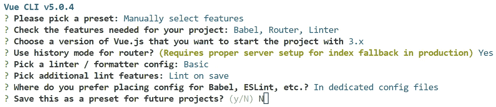
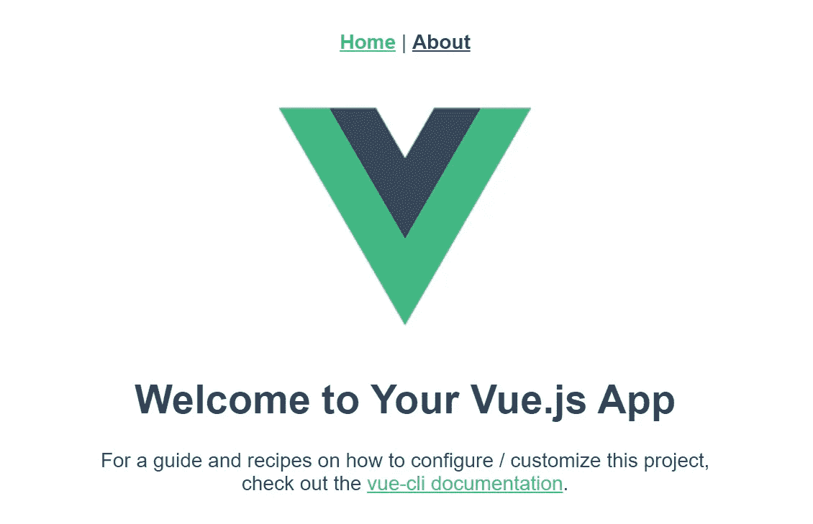
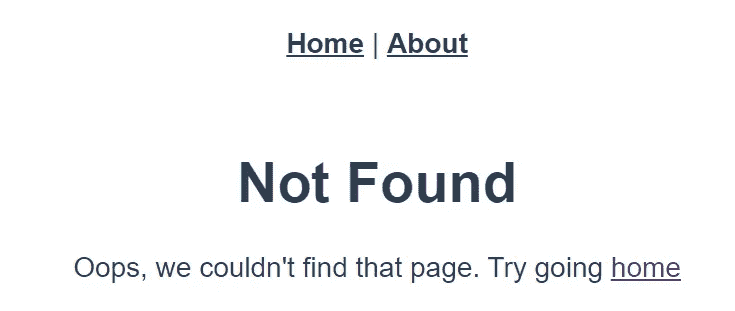

# 如何使用 Go 为单页面应用程序提供服务

> 原文：<https://betterprogramming.pub/how-to-serve-a-single-page-application-using-go-4b9a38d92987>

## 使用 Go 的标准 HTTP 服务器构建 Vue SPA 的分步指南


克里斯·里德在 [Unsplash](https://unsplash.com?utm_source=medium&utm_medium=referral) 上拍摄的照片

*完整源代码可以在* [*这里找到*](https://github.com/wolftsao/go_spa_example) *。*

## 先决条件

1.  npm
2.  Vue CLI
3.  去编译(本例中嵌入 1.16+，推荐 1.18+)
4.  (可选)Docker

# 设置我们的项目

第一件事是建立我们的项目。假设我们的项目名称是`go_spa_example`。下面是实现这一点的代码:

```
mkdir go_spa_example
cd go_spa_example# create Go module, I am using my Github here
go mod init github.com/wolftsao/go_spa_example
```

然后初始化我们的 Vue 前端:

```
# To make it simple, I just name the Vue project ui
# flag -n means no gitvue create -n ui
```

现在，Vue CLI 将询问您项目选项。Vue 路由器(因为我们正在构建 SPA)是最重要的，所以选择“手动选择功能”以下是我的配置:



我们的项目设置已经完成。让我们先处理前端。

# Vue 前端设置

我们不打算在这里创建花哨的前端的东西，只是有一个默认的 Vue 模板页面将包含以下页面可行的例子:

*   路径为`"/"`的索引页面
*   关于路径为`"/about"`的页面
*   其他内容将显示未找到页面

为此，我们需要执行以下操作:

1.  更改前端构建工件的位置
2.  添加未找到的页面
3.  设置索引页的别名并捕获未找到页的所有路由

## 更改前端工件位置

如果我们现在构建前端，输出工件将在`ui/dist`中，如下所示:

```
ui/dist
├── css
├── favicon.ico
├── index.html
└── js
```

`dist`现在是服务于前端的根文件夹，里面有各种类型的静态文件，如 js、CSS 等。，在它自己的文件夹下。

但是用 Go 的标准 HTTP 库来处理这种常见的布局有点复杂(我将在后面详细解释)。

让我们将所有静态文件聚集到一个集中的位置。

打开`ui/vue.config.js`，然后添加值为`static`的属性`assetsDir`，如下所示:

vue.config.js 中的 assetsDir

现在工件的结构将会是:

```
ui/dist
├── favicon.ico
├── index.html
└── static
    ├── css
    └── js
```

所有静态文件都在`static`文件夹下。

基于这个配置，我们的索引页面的 URL 将是:
`http://<domain>:<port>/`

而 CSS 文件会是这样的:
`http://<domain>:<port>/static/css/app.9bdcf330.css`

## 创建未找到的页面

创建包含以下内容的文件`ui/src/views/NotFound.vue`:

Vue 未找到模板

现在，我们有了一个只有模板的[单文件组件(SFC)](https://vuejs.org/guide/scaling-up/sfc.html) 。

## 添加索引页别名和全部捕获路线

最后，打开`ui/src/router/index.js`，然后:

1.  将别名`alias: ['/index.htm'],`添加到索引页面路径中(下面的第 7 行)。
    默认情况下，Vue 对待`"/"`和`"/index.html"`是不同的，所以让我们通过添加这个别名来使它更自然。
2.  在`routes`数组的末尾添加一条全部捕获路线(下面的第 20 行)。

下面是实现这一点的代码:

捕获 Vue 路由器中的所有路由

太棒了。我们已经完成了我们的 Vue 前端。让我们拥抱最激动人心的部分——Go HTTP 服务器。

# 创建 Go HTTP 后端服务器

这将是这个故事的主要部分。然而，为了使事情尽可能简单，我将在单个`main.go`文件中定义所有内容。

基本上，我们需要的是:

*   Go 嵌入包
*   转到 HTTP 服务器
*   多路复用器/路由器
*   提供前端静态文件的 HTTP 文件服务器

我还会说说从 Go 上服务 SPA 时的一些误区。

## 嵌入我们的前端工件

我们并不真的需要嵌入我们的前端文件，但是 [embed](https://pkg.go.dev/embed) 有它自己的潜在用法，所以我在这里把它作为一个练习。

(我的项目源代码还有另一个分支 noembed，它使用普通的文件系统来服务前端。你可以点击查看

使用 embed 的好处是我们可以在任何地方运行我们的 SPA，而不用担心前端工件的位置。然而，每次前端发生变化时，我们都需要重新构建我们的程序。

好的。让我们创建 Go 嵌入包文件，`ui/ui.go:`

转到嵌入包

确保文件`ui.go`位于`ui`文件夹下，而不是项目根目录下。它与其他前端文件共存。

***注意*** *:我们可以把* `*ui.go*` *放在项目根，在这个例子中把包改成 main。但是在一个更大的项目中，我们通常将文件分成不同的包，每个包都有自己的用途。* `*ui.go*` *的唯一目的是服务于前端工件。所以，我决定把它放在* `*ui*` *文件夹里，但这只是我的看法。*

这个包声明了一个用作嵌入文件系统的变量`StaticFiles`。

另外，注意 Go 指令`//go:embed all:dist`，这意味着将所有文件嵌入到`dist` 文件夹及其子文件夹中。

在 1.18 之前的 Go 版本中，embed 有一个很大的限制，不能嵌入前缀为`"."`或`"_"`的文件。一些前端捆绑工具会生成带有该模式的工件。

注意:这个[问题](https://github.com/golang/go/issues/43854)已经在 Go 1.18 中用 embed 指令中的特殊术语`all:`修复了。但是由于 Vue CLI 没有生成带有`"."`或`"_"`前缀的工件，我们不必担心这一点(如果你使用的是更早的 Go 版本，请将指令改为`//go:embed dist/*`，因为`all:`是 1.18 的特性。

因此，如果你喜欢尝试其他前端库/框架，或者如果你正在使用更早的 Go 版本，你需要更加注意这些。

## 一个简单的 Go HTTP 服务器

现在，在项目根文件夹中创建文件`main.go`来服务我们的 HTTP 服务器:

Go HTTP 服务器主要功能

*您可能需要调整 ui 包的导入路径。*

它只是一个普通的 Go HTTP 服务器(我把服务器端口硬编码为`8888`)。

同样，为了使示例尽可能简单，我将每个路由/处理程序放在一个名为`router`的函数中。我们来谈谈这个。

## 我们的多路复用器/路由器

`router`功能将处理三种路线:

1.  前端索引页(`"/"`或 index.html)
2.  前端静态文件(如 JavaScript、CSS 等。)
3.  蜜蜂

如下定义`main`功能下的`router`功能:

转到 HTTP 路由器

*   在第 5 行，我们用函数`indexHandler`处理索引页面(我稍后会处理这个)
*   在第 8 到 10 行，我们通过创建嵌入式文件系统的子文件夹来定义一个`http.FileServer`。这样，我们可以搜索以`"static"`而不是`"dist"`开头的文件(默认情况下，`http.FileServer`启用目录列表；你可以查看[这篇伟大的文章](https://www.alexedwards.net/blog/disable-http-fileserver-directory-listings)来禁用那种行为)
*   第 13 行只是一个用于演示的虚拟 API(匿名函数)

现在，您可能想知道为什么我们将索引处理器(`"/"`)从静态文件服务器(`"/static/"`)中分离出来。`index.html`不就是另一个文件吗？

假设我们只有`"/"`路径，如果我们走最简单的路径，它服务于我们的文件服务器。我们可以通过执行以下操作来完成此任务:

*   构建并运行程序
*   在地址栏中输入`http://localhost:8888`，索引页将正确显示
*   单击“关于”链接以显示带有正确 URL 的右侧页面(`http://localhost:8888/about`)

一切看起来都很好，直到你直接在地址栏中键入`http://localhost:8888/about`，然后点击 enter。嘣！用`404 page not found`清空页面。

这是怎么回事？

这个问题是双重的。

首先，Go 通过 URL 路径搜索文件系统。对于`http://localhost:8888/about`的情况。这是告诉 Go 在文件服务器中搜索`about`文件。因为我们没有这样的文件，所以 Go HTTP 服务器返回默认的 404 消息。

第二，`about`页面只存在于前端。JavaScript 为我们施展了前端路由魔法。从技术上讲，JavaScript/CSS 代码确实存在于后端，所以我们需要一个文件服务器来服务这些文件。

前端也需要一个入口点来启动 SPA，很像 Go 的`main`函数。当浏览器访问索引页面(`"/"`，入口点)时，它知道如何获取其他静态文件，启动 Vue 引擎，然后 Vue 可以为我们路由和渲染那些页面。

这就是为什么我们需要专门处理索引路径`"/"`的原因。

关于 Go 的 HTTP 路由还有最后一点。早些时候，当我们开发 Vue 时，我们在`vue.config.js`中设置了`assetsDir: 'static'`，这是面向 Go 的路由模式规则的。(如果你不熟悉 Go 的路由规则，强烈推荐你看[这个](https://lets-go.alexedwards.net/sample/02.03-routing-requests.html)。我读过的最棒的围棋书籍之一！)

对于 Go，其他处理程序不匹配的所有内容都将退回到索引路径`/`。这就是我们想要的效果，所以我们将其设置为我们的索引页面。当用户在地址栏中键入任意 URL 时，总是回退到`index.html`，然后 Vue 就可以正确的做前端路由了。

由于`"/"`索引路径已经被`indexHandler`使用，我们需要为文件服务器使用另一种模式。但是如果我们没有设置`assetsDir: 'static'`，我们需要像这样单独处理每个静态文件类型:

```
mux.Handle("/css/", httpFS)
mux.Handle("/js/", httpFS)
```

我们花了相当大的篇幅解释 Go 中的这些错误。让我们继续看最后一段代码，`indexHandler`。

## 索引页面处理程序

这样定义`router`下的`indexHandler`:

代码读取特定的嵌入文件，然后将它们写入 HTTP 响应。

但是它看起来很混乱，因为我们在这里也处理 favicon。

老实说，我对前端不太熟悉。我没有找到一种简单的方法来改变 favicon 文件的位置。Vue 中的默认位置在根`"/favicon.ico"`下，所以我直接在这里处理了。(我们可以用像`mux.Handle("/favicon.ico", faviconHandler)`这样的专用处理器来处理它)

现在我们已经完成了我们的 Go SPA。该出发了。

# 建造并运营我们的水疗中心

首先构建我们的前端，这样就有工件可以嵌入。以下是代码:

```
cd ui
npm run build
```

运行我们的 Go HTTP 服务器:

```
cd ..
go run main.go
```

让我们做一些测试。打开`[http://localhost:8888](http://localhost:8888)`(我们将端口硬编码为`8888`)，您的浏览器应该显示默认的 Vue 主页:



Vue 默认主页

点击顶部的“关于”链接，更改“关于”页面:


Vue 默认关于页面

在地址栏中键入`[http://localhost:8888/about](http://localhost:8888/about)`，然后按回车键。它应该显示相同的关于页面。

键入类似`[http://localhost:8888/login](http://localhost:8888/login)`的任意 URL 来显示未找到的页面:



找不到 Vue 页面

厉害！一切看起来都很棒。让我们使用 CURL 来测试我们的虚拟 API，使用以下命令:

```
curl -i "http://localhost:8888/api/v1/greeting"
```

输出:

```
HTTP/1.1 200 OK
Date: Fri, 20 May 2022 02:47:58 GMT
Content-Length: 13
Content-Type: text/plain; charset=utf-8Hello, there!
```

很好，让我们多测试一下。一个不存在的 API 怎么样，如果用户输入了错误的地址，就会发生这种情况。

```
curl -i "http://localhost:8888/api/v1/greting"
```

输出:

```
HTTP/1.1 200 OK
Date: Fri, 20 May 2022 02:53:18 GMT
Content-Length: 611
Content-Type: text/html; charset=utf-8<!doctype html><html lang=""><head><meta charset="utf-8"><meta http-equiv="X-UA-Compatible" content="IE=edge"><meta name="viewport" content="width=device-width,initial-scale=1"><link rel="icon" href="/favicon.ico"><title>ui</title><script defer="defer" src="/static/js/chunk-vendors.ea2100d5.js"></script><script defer="defer" src="/static/js/app.fc9d9338.js"></script><link href="/static/css/app.9bdcf330.css" rel="stylesheet"></head><body><noscript><strong>We're sorry but ui doesn't work properly without JavaScript enabled. Please enable it to continue.</strong></noscript><div id="app"></div></body></html>
```

哎呀…不存在的 API 调用是如何工作的？

仔细看，响应体其实就是我们前端的`index.html`。

问题是，我们没有任何与那个 URL 匹配的路由，所以它退回到索引路由`"/"`。

让我们添加一些保护条款来防止这种情况:

转到 HTTP 索引处理程序

*   在第 2 行，我们添加了一个方法检查，只允许 GET 方法
*   在第 8 行，如果`URL.Path`以`/api`为前缀，我们返回 not found 响应

(理想情况下，在一个组织良好的项目中，最好将这些条件放在像中间件这样的东西中)

让我们重新构建我们的程序，并再次尝试不存在的 API。这次应该会返回 404:

```
HTTP/1.1 404 Not Found
Content-Type: text/plain; charset=utf-8
X-Content-Type-Options: nosniff
Date: Fri, 20 May 2022 03:14:42 GMT
Content-Length: 19404 page not found
```

恭喜你。我们真的已经走了很长的路，并成功地用 Go 构建了我们成熟的单页面应用程序。

# 附加信息— Docker

我们也可以在 Docker 中构建我们的应用程序。

在我们的项目根目录中创建一个 docker 文件，内容如下:

去 SPA dockerfile

然后:

```
# 1\. build frontend
cd ui
npm run build# 2\. build docker image
cd ..
docker build -t go-spa:test .# 3\. (optional) remove intermediate images
docker image prune -f# 4\. run our SPA container
docker run --rm -p "8888:8888" go-spa:test
```

# 摘要

这是一个很长的故事，但如果你看完整的 Go 代码，它是非常简短和简单的。我们需要理解 Go 的 HTTP 服务器的机制和局限性，并做出一些调整。

这些原则是:

1.  了解前端构建工件的结构，找到并调整可能的配置设置，然后在 Go 中正确地提供这些文件。
2.  理解 Go 的 HTTP 处理程序的模式匹配规则和特点

在我开始写这个故事之前，我确实花了很多时间去思考如何让这个故事成功。我不是一个有经验的程序员，特别是在前端，所以请让我知道是否有更好的解决方案，或者如果这里有什么不正确的地方。

非常感谢你的阅读！