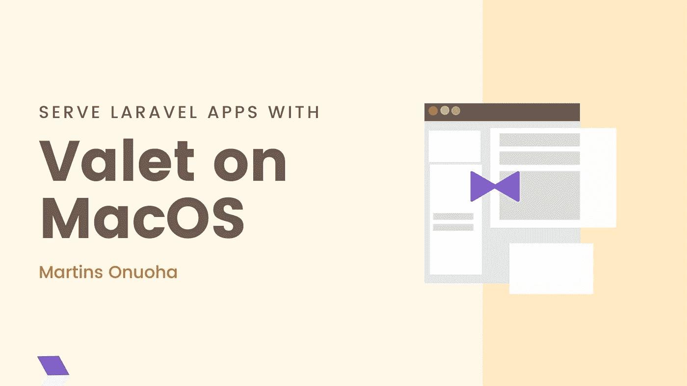
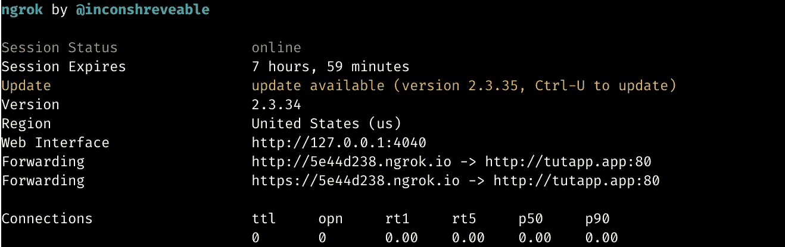

# 如何在 macOS 上使用代客服务 Laravel 应用程序

> 原文：<https://betterprogramming.pub/how-to-serve-laravel-apps-with-valet-on-macos-1f51e4fe1062>

## 在 macOS 上设置代客服务 Laravel 应用程序的快速指南



> [在](https://devjavu.space/post/how-to-serve-laravel-apps-with-valet-on-macos/)的黑暗模式下阅读这篇文章，轻松复制并粘贴代码示例，并在 [Devjavu](https://devjavu.space/) 上发现更多类似的内容。

[](https://devjavu.space/post/how-to-serve-laravel-apps-with-valet-on-macos/) [## 如何在 MacOS | Devjavu 上使用 Valet 提供 Laravel 应用程序

### 如果您在这里，您的机器上可能已经安装了 Laravel(并且您运行 macOS)。如果你没有…

devjavu.space](https://devjavu.space/post/how-to-serve-laravel-apps-with-valet-on-macos/) 

如果您在这里，您的机器上可能已经安装了 Laravel(并且您运行 macOS)。如果你没有正确设置 Laravel，并且使用不同的操作系统，我写了一个指南来帮助你设置 Laravel。

[](https://medium.com/better-programming/the-hitchhikers-guide-to-laravel-setup-6c1fd98c2670) [## Laravel 设置的搭便车指南

### 设置 Laravel 的逐步指南

medium.com](https://medium.com/better-programming/the-hitchhikers-guide-to-laravel-setup-6c1fd98c2670) 

这是专门针对 macOS 用户的，他们:

*   安装 Laravel
*   希望在单个域上运行和管理 Laravel 应用程序(如 mylaravelapp.awesome、myapp.app)
*   想在加密的 TLS (HTTP/2)上运行 Laravel 站点
*   愿意与世界分享他们的本地网站
*   只是想修补一下

# 了解代客工作方式

Valet 是一个 PHP 开发环境，适用于包括 Laravel、WordPress 等 PHP 框架。代客将你的 Mac 配置为当你的机器启动时总是在后台运行 [Nginx](https://www.nginx.com/) 服务器。

使用 [dnsmasq](https://en.wikipedia.org/wiki/Dnsmasq) ，代客代理`*.test`(这可以更改为自定义域)域上的所有请求，以指向安装在您本地机器上的站点。代客还允许你使用本地隧道公开分享你的网站。

现成的代客支持包括但不限于:

*   [拉勒维尔](https://laravel.com/)
*   [流明](https://lumen.laravel.com/)
*   [CakePHP 3](https://cakephp.org/)
*   [具体 5](https://www.concrete5.org/)
*   [Drupal](https://www.drupal.org/)
*   [Joomla](https://www.joomla.org/)
*   [Magento](https://magento.com/)
*   静态 HTML
*   [Symfony](https://symfony.com/)
*   [WordPress](https://wordpress.org/)

# 装置

代客需要 macOS 和[自制](https://brew.sh/)。在安装之前，您应该确保没有其他程序(如 Apache 或 Nginx)绑定到本地机器的端口 80。

*   安装[自制软件](https://brew.sh/)。

```
/usr/bin/ruby -e "$(curl -fsSL https://raw.githubusercontent.com/Homebrew/install/master/install)"
```

*   更新 brew。

```
brew update
```

*   安装 PHP7.3。

```
brew install php
```

*   安装编写器。

1.  将安装程序下载到当前目录。

```
php -r "copy('https://getcomposer.org/installer', 'composer-setup.php');"
```

2.验证安装者 SHA-384，你也可以在这里交叉检查[。](https://composer.github.io/pubkeys.html)

```
php -r "if (hash_file('sha384', 'composer-setup.php') === 'a5c698ffe4b8e849a443b120cd5ba38043260d5c4023dbf93e1558871f1f07f58274fc6f4c93bcfd858c6bd0775cd8d1') { echo 'Installer verified'; } else { echo 'Installer corrupt'; unlink('composer-setup.php'); } echo PHP_EOL;"
```

3.运行安装程序。

```
php composer-setup.php
```

4.移除安装程序。

```
php -r "unlink('composer-setup.php');"
```

*   用 Composer 安装代客。

```
composer global require laravel/valet
```

要让 Valet 命令在您的系统上全局可用，请确保您的系统“路径”中有`~/.composer/vendor/bin`目录。

你也可以在这里[看到如何将 bin 文件夹添加到你的路径中](https://medium.com/better-programming/the-hitchhikers-guide-to-laravel-setup-6c1fd98c2670)。

配置并安装 Valet 和 Dnsmasq，使其在启动机器时始终运行:

```
valet install
```

一旦代客安装完毕，尝试在你的终端上使用一个命令如`ping foobar.test`ping 任何一个`*.test`域。如果 Valet 安装正确，您应该在`127.0.0.1`上看到这个域响应。

# 使用自定义域

如果您想使用不同于默认域的域(。测试)，你可以简单地告诉代客使用一个新的域名:

```
valet tld new-namee.gvalet tld app
```

您应该在终端上看到一个输出，验证您的新域已经更新:

```
Restarting dnsmasq...
Valet is configured to serve for TLD [.app]
Restarting php...
Restarting nginx...
Your Valet TLD has been updated to [app].
```

代客将自动开始在`*.app`为您的项目服务。

# 服务 Laravel 站点

一旦代客安装完毕，你就可以开始服务网站了。首先，您需要配置一个文件夹，以便代客搜索您的站点。把这当成你的`htdocs`文件夹(如果你曾经使用过 Xampp 或者类似的工具)。

创建一个文件夹来存放您的 Laravel 网站:

```
mkdir ~/Laravel_Sites/
```

导航到该目录:

```
cd ~/Laravel_Sites/
```

现在运行:

```
valet park
```

park 命令会将您的当前目录注册为一个路径，以便代客搜索您的站点。

您可以在同一个文件夹中创建一个新的 Laravel 应用程序。

```
laravel new sleek_site
```

您的新网站现在应该可以在 [http://sleek_site.app](http://sleek_site.app.) 上访问了。

# 使用 TLS 保护本地站点

多亏了代客服务，你可以在 HTTPS 本地为你的网站提供服务。只需切换到您的站点目录(~/Laravel_Sites)并运行:

```
valet secure site_namee.gvalet secure sleek_site
```

您现在应该可以在[https://sleek _ site . app](https://sleek_site.app)*上访问您的 Laravel 应用程序了。*

# 共享本地网站

Valet 与 [ngrok](https://ngrok.com/) 相结合，可以在公共 URL 上分享你的本地网站。不需要安装额外的软件。要共享您的本地站点，请导航到您的项目目录并运行:

```
cd sleek_sitevalet serve
```

您应该看到一个服务器在您的终端中运行。



你可以在你的浏览器中打开网址 [http://5e44d238.ngrok.io](http://5e44d238.ngrok.io) 或者通过[https://5e 44d 238 . ngrok . io](http://5e44d238.ngrok.io)从一个安全的来源公开访问你的 Laravel 网站。

至此，我们已经成功地设置了 Valet 来本地服务 Laravel 应用程序。

干杯！