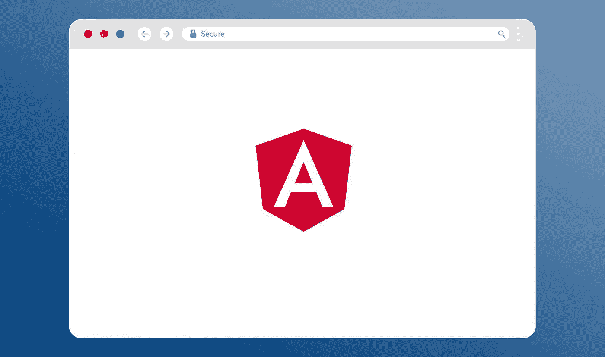
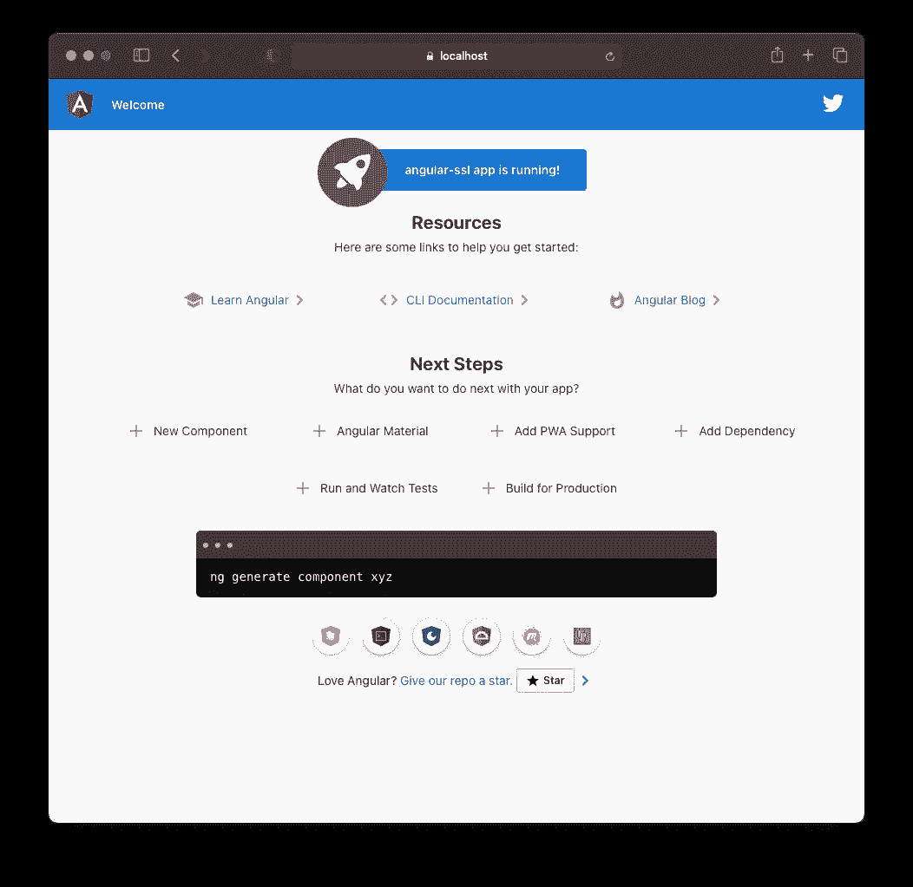

# 如何使用发球法在 HTTPS 上空发球

> 原文：<https://betterprogramming.pub/how-to-serve-your-angular-application-over-https-using-ng-serve-240e2c2e0a5d>

## 配置 Angular CLI，通过安全的 HTTPS 连接在本地为您的应用提供服务

图片来源:作者

[保障网络安全](https://www.w3.org/2001/tag/doc/web-https)已经成为浏览器开发者多年来的主要目标之一。提供一个私密和安全的通信渠道是这项工作的首要任务。这样的安全通道需要保证机密性、完整性和真实性，这些属性只能通过加密通信来实现。

HTTPS 是安全网络的关键组成部分之一。它对客户端和 web 服务之间发送的几乎所有信息进行加密，从而为用户和网站之间的通信提供安全连接。HTTPS 变得如此重要，以至于许多最近的浏览器功能(例如，地理定位和服务人员——查看此 [MDN 文档](https://developer.mozilla.org/en-US/docs/Web/Security/Secure_Contexts/features_restricted_to_secure_contexts)获取完整列表)——只能在安全上下文中启用。

但是如果你正在这里阅读这篇文章，你已经对 HTTPS 很熟悉了，而且你想*切入正题*。您已经知道何时以及为什么要使用它，以及何时对使用它进行例外处理(我猜是您的本地开发环境😉).

当在 HTTPS 上运行本地主机应用程序时，维护自签名证书可能会很麻烦。在安全连接是必须的特定情况下，这是一个你必须处理的麻烦。

这些情况的几个例子可以是:

*   使用 Lighthouse 测试渐进式网络应用程序(Lighthouse 将为不通过安全连接提供服务的 PWA 返回较低的分数)
*   与要求客户端在 HTTPS 上运行的服务集成(例如，脸书登录 API 或 Okta)
*   使用`[getUserMedia](https://developer.mozilla.org/en-US/docs/Web/API/MediaDevices/getUserMedia#Privacy_and_security)`从某个用户设备获取流(只能在[安全上下文](https://developer.mozilla.org/en-US/docs/Web/Security/Secure_Contexts)中使用)

使本地 web 服务器能够通过 HTTPS 提供内容的过程将因服务器而异。但是，使用 Angular CLI 可以非常直接地做到这一点。

# 发球

`ng serve`是 Angular CLI 中预装的专用开发服务器。它提供了大量的功能，使您的开发过程更加顺畅。

在另一篇文章中，我描述了如何更改默认`ng serve`的主机和端口——当默认端口(`4200`)已经在使用中或者您有多个 Angular 应用程序同时在本地运行时特别有用。

 [## 如何更改角连接服务的默认主机和端口

### 是否要设置自定义主机和端口以覆盖 ng serve 的默认配置？

hicaro.medium.com](https://hicaro.medium.com/angular-cli-ng-serve-custom-host-and-port-f7db5e15802a) 

`ng serve`实现现成的内置 SSL 支持。您需要做的就是提供三个配置属性，然后通过`[https://localhost:4200](https://localhost:4200/)`访问您的应用程序(假设您在端口 4200 上运行它)。

# 1.创建证书

重要的事情先来。要通过 HTTPS 运行本地应用程序，首先需要在本地机器上生成并信任一个自签名证书。

在上一篇文章中，我介绍了如何创建可信的自签名证书颁发机构和域名证书。如果你已经有了这个基础，你可以跳过阅读。否则，请查看下面的文章来生成您的本地主机证书。

 [## 如何为您的本地开发创建可信 SSL 证书

### 生成可信的自签名 SSL 证书，以便在本地开发中启用 HTTPS

medium.com](https://medium.com/better-programming/how-to-create-trusted-ssl-certificates-for-your-local-development-13fd5aad29c6) 

# 2.角度 CLI

一旦生成并信任了证书，剩下唯一要做的事情就是让 Angular CLI 知道它。有两种方法可以实现它:*命令行选项*或*配置文件默认值*。

## **命令行选项**

`ng serve`接受三个内置标志来支持 SSL:

*   `--ssl`:布尔值，决定是否启用或禁用 SSL 默认为`false`
*   `--ssl-cert`:证书的相对路径
*   `--ssl-key`:私钥的相对路径

因此，启用 SSL 的命令如下所示:

## **Angular CLI 配置文件默认值**

如果您不太喜欢在脚本中添加命令行参数，或者您更喜欢在终端中键入`ng serve`的简洁外观，这一节就是为您准备的！

**角度 CLI 6+**

默认情况下，以下配置将使用 SSL 启动开发服务器。

如果您想按需打开和关闭 SSL，当您想在 HTTPS 上运行`ng serve`时，您可以从`serve`选项中删除`"ssl": true`行，并在您的命令中添加`--ssl`标志。通过留下密钥和证书路径，Angular CLI 确切地知道在哪里可以找到这些文件。

## **角度指示器< 6**

从版本 5 过渡到版本 6 时，Angular CLI 配置格式发生了变化。在 Angular CLI 版本 6 之前，配置将添加如下:

就是这样！您的设置过程已经结束。您有一个自签名证书，并且知道如何使用它来通过 Angular CLI 启用 SSL。

下一步是在浏览器中检查它。你可以打开网址`[https://localhost:4200](https://localhost:4200)`，看到你的应用程序在 HTTPS 本地提供。

# 结论

现在，您应该能够使用自己可信的自签名证书，通过 HTTPS 本地服务您的 Angular 应用程序。这是一个您可以随意使用的漂亮而方便的特性。我个人的偏好是使用配置文件来包含我的私钥和证书路径，然后按需启用 SSL。

需要注意的是，这种设置仅适用于本地开发。您应该在面向公众的应用程序中使用由可信证书颁发机构签名的证书。[让我们加密](https://letsencrypt.org/)是当今做这件事的一个很好的资源。

就这些了，伙计们！我希望你喜欢阅读，这篇文章对你有帮助。