# 如何使用 Xcode 方案设置不同的应用程序图标和名称

> 原文：<https://betterprogramming.pub/how-to-set-different-app-icons-and-name-using-xcode-scheme-dbbd06803093>

## 释放 Xcode 的全部潜力


克里斯蒂安·威迪格在 [Unsplash](https://unsplash.com?utm_source=medium&utm_medium=referral) 上拍摄的照片

Xcode 为我们提供了调整的灵活性，直到我们满足自己的需求。有时，一些需求可能是额外的环境，如试运行、测试等。对于不同的环境，您可能需要一些指示来区分不同之处，例如应用程序图标甚至应用程序名称。

举个例子，作为一名工程师，你偶尔会运行 debug 和 release，你总是面临的问题是 debug 和 release 都有相同的 app 图标和 app 名称。有时候，你会误以为 debug 是 release，反之亦然。

有一个更好的方法来解决这个问题，那就是释放 Xcode 的全部潜力。不需要为 Staging、Beta、Omega 等创建额外的目标。你只需要明白，Scheme 是苹果为我们制造的一个强大工具。

# 开始

当您创建新项目时，Xcode 会自动为您生成两种类型的方案，它们是“调试”和“发布”此外，如果您需要额外的方案，您也可以在这里创建它们。

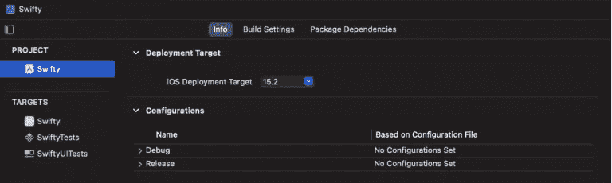

假设您有调试和发布方案，这也是您可以做一些事情的地方，比如根据下面提供的示例中的方案来更改 API URL。顺便说一下，这些不是真正的 URL。

```
#if DEBUG
baseURL = "https://www.staging.daddycoding.com"
#endif#if RELEASE
baseURL = "https://www.daddycoding.com"
#endif
```

# 改变方案条件

如果 debug 听起来没有那么吸引人，您甚至可以通过它的条件或者通过删除方案并重新创建一个新方案来更改命名。

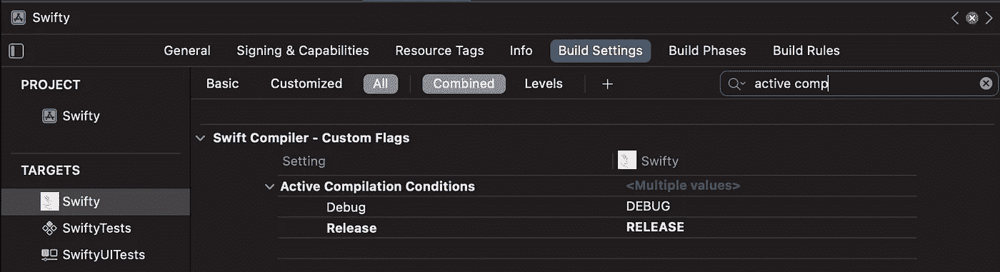

上面的方法允许你改变条件。如果我将 debug 更改为 staging，那么我的条件也需要更改。

```
#if STAGING
baseURL = "https://www.staging.daddycoding.com"
#endif
```

# 创建新方案

上面的方法仍然显示调试，但实际上，它实际上是根据其条件变化的一个阶段。干净的方法是创建一个新的方案。

您可以轻松地在 debug 或 release 上复制。通常，它在 debug 之上，因为你并不真的需要一个额外的版本。

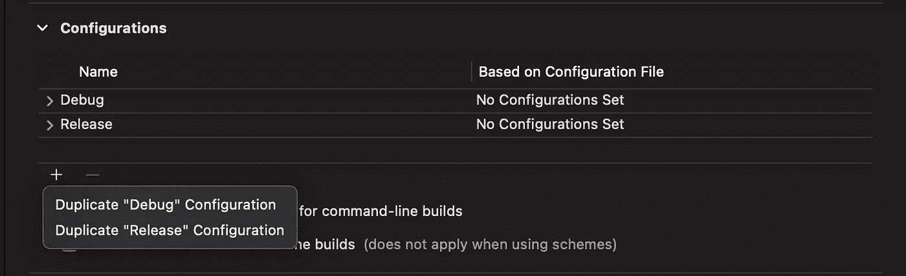

一旦在 debug 上复制了，就可以将其重命名为 staging。

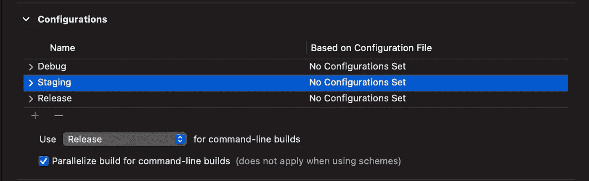

在幕后，你将需要改变更多的东西，因为你只是改变了罩外的名称。你需要改变条件。

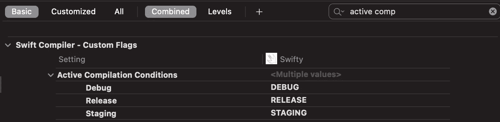

如果您有一个额外的产品标识符，您也需要更改它。

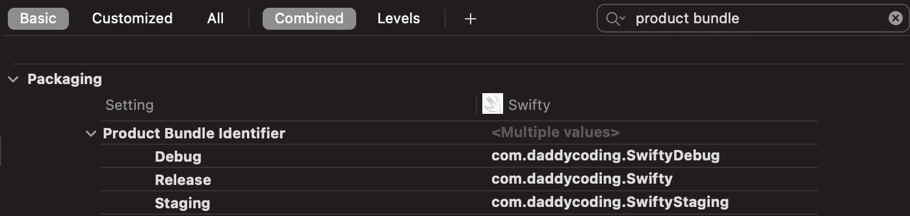

最后，您需要创建一个可以运行和构建项目的方案。您可以简单地转到管理方案>添加按钮来创建一个新的方案项目。


最后一步将所有构建配置更改为暂存。

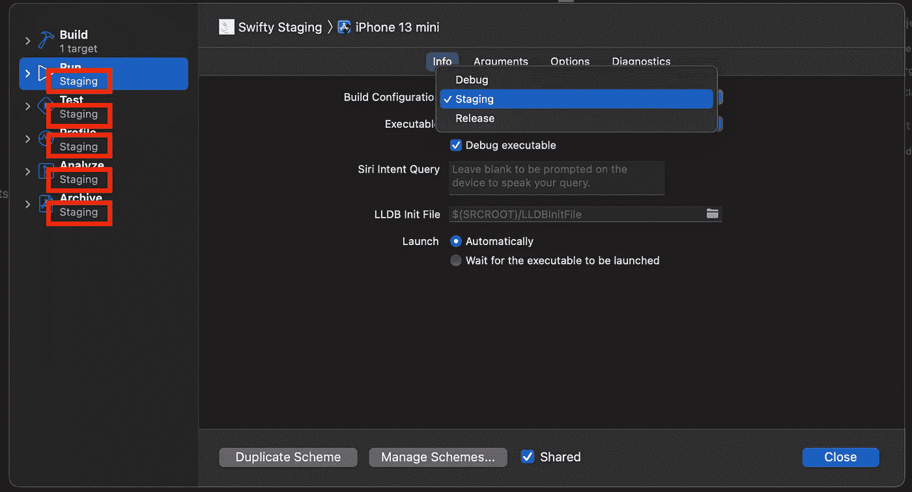

现在，您已经有了调试、发布和试运行方案。

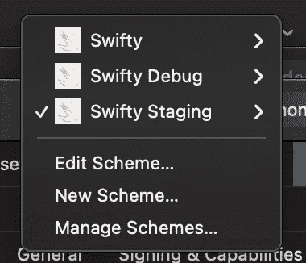

# 显示名称方案

如果你运行这个应用程序，它仍然显示“调试快捷”、“发布”和“准备”可能会有点混乱。有时候，你不知道你在模拟器里看到的是什么方案。

让我们为每个方案显示一个不同的名称，这将有助于我们减少混淆。

有多种方法可以实现这一点，我将向您展示我的方法。您首先需要添加一个名为 APP_DISPLAY_NAME 的用户定义设置。在这里，您可以根据方案设置它的名称。

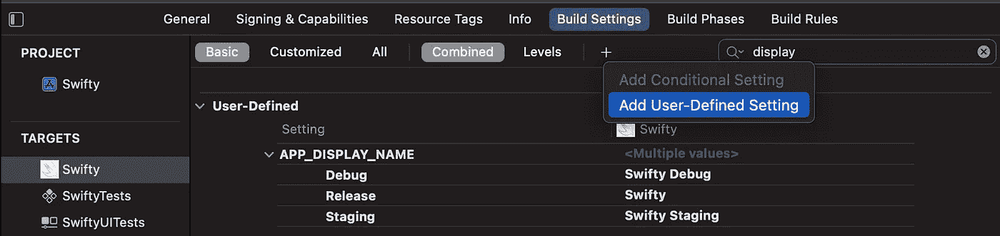

接下来，您将使用`Info.plist`根据用户定义的设置显示应用名称。

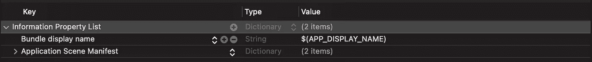

根据该方案，您现在将有三个不同的名称。要做到这一点，确保每个方案都有不同的产品包标识符是非常重要的。如果所有的方案都使用相同的产品标识符，你最终只会得到一个应用，而不是三个应用。

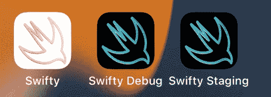

# 应用程序图标方案

最后，最后一点是根据方案添加不同的应用图标。您必须将图标添加到 AppIcon 中。

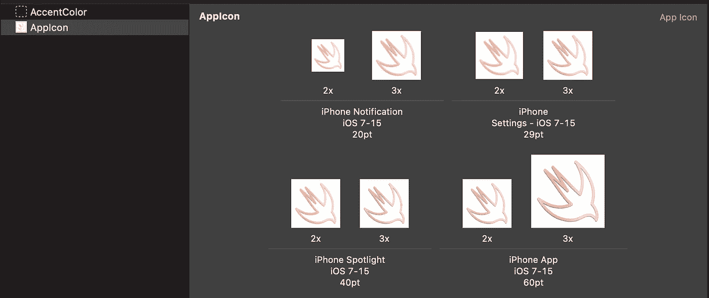

接下来，您可以复制 AppIcon 并重命名它，如下所示:

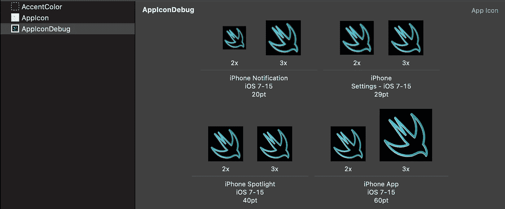

在项目内部，您将根据方案使用不同的 AppIcon。

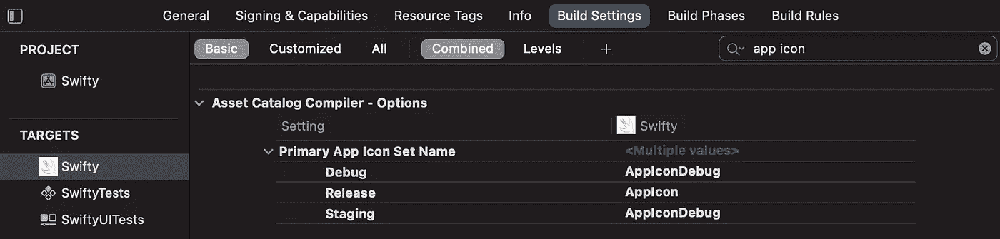

这将是你努力的最终结果。


# 结论

总之，你可以选择最适合你的项目的。我见过有多个不同目标的项目，而不是依赖于方案。我甚至见过一个项目使用脚本来改变应用程序图标。还是那句话，最适合你的。

至少这样，我通过使用 schemes 充分发挥了 Xcode 的潜力。