# 如何使用 Firebase Firestore 设置数据库，以便与 Android 架构组件一起使用

> 原文：<https://betterprogramming.pub/how-to-set-up-a-database-with-firebase-firestore-to-use-with-android-architecture-components-992ab5df8223>

## 为您的 Android 应用添加数据库功能


马库斯·斯皮斯克在 [Unsplash](https://unsplash.com?utm_source=medium&utm_medium=referral) 上的照片。

在[之前的一篇文章](https://medium.com/better-programming/create-an-app-that-uses-livedata-and-viewmodel-in-java-f8086ca94229)中，我们讨论了如何使用 Android 架构组件中最重要的两个构建模块:LiveData 和 ViewModel 来创建 Android 应用程序。这是该教程的后续。

一旦我们有了一个具有干净架构的应用程序，我们将为 Android 架构组件配置 Firebase Firestore，以实时更新数据，并充分利用 Android 中的 LiveData 和 ViewModel。

# 启动

我们将从为上一个教程构建的应用程序“我的购物清单”开始本教程。从[我的网站](http://www.evanamargain.com/blog/wp-content/uploads/2020/05/MyShoppingList-Firestore-Start.zip)下载启动项目。

在 Android Studio 中打开应用程序，让 Gradle 同步完成。运行应用程序，您应该会看到一个带有购物清单的应用程序:

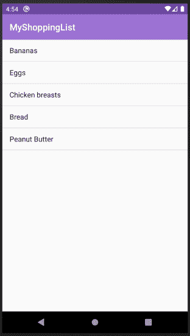

图 1:我的购物清单应用。

# 在 Firebase 控制台中创建项目

第一步是创建一个 Firebase 控制台项目。进入 [Firebase 控制台主页](https://console.firebase.google.com/u/0/?pli=1)。在此屏幕上，您将看到两种布局之一:

1.  如果您以前从未使用过 Firebase 控制台，系统会提示您一条欢迎消息，并邀请您创建一个项目。

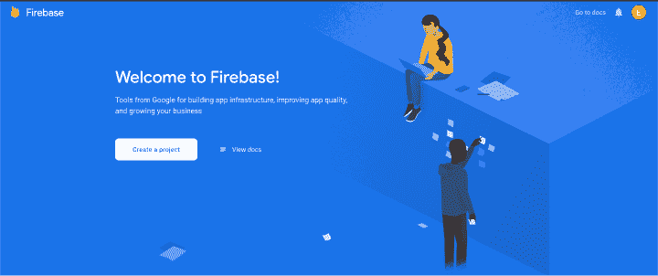

图 2:没有项目的 Firebase 控制台欢迎屏幕。

2.如果您有其他项目，您将看到它们的列表和一个用于添加项目的白色卡片。

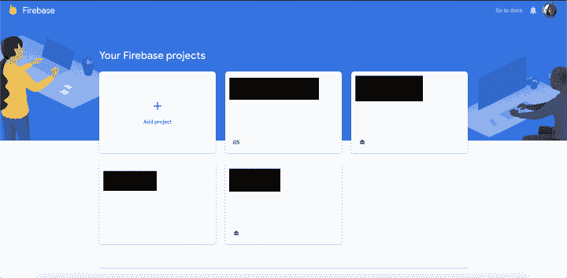

图 3: Firebase 控制台欢迎屏幕和其他项目。

根据您拥有的选项，单击按钮创建一个项目，您将开始创建项目的流程。第一个屏幕将提示您输入项目的名称。在这种情况下，您将使用与您的 Android 应用程序相同的名称，即 MyShoppingList。


图 4:命名 Firebase 项目。

点击继续，下一步将询问您是否要启用谷歌分析。这对于 Firestore 来说不是必需的，但出于其他原因，您可能希望启用它:

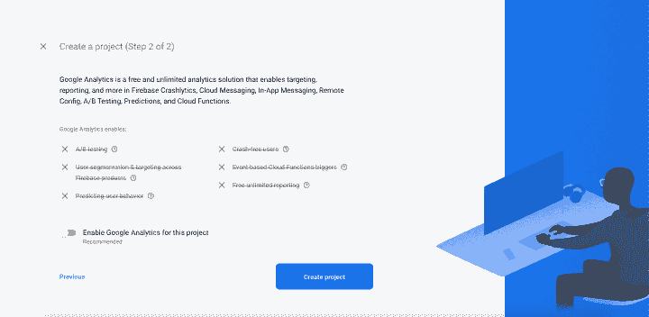

图 5:在 Firebase 项目中启用 Google Analytics。

单击 Create project，您将看到一个加载屏幕(图 6)。这需要一点时间，所以不要担心。


图 6:创建 Firebase 项目加载器。

流程完成后，加载器将变成三个橙色圆点，并显示确认文本和继续按钮。


图 7: Firebase 项目创建正确。

单击 Continue 按钮，您将被带到 MyShoppingList 项目的主屏幕。

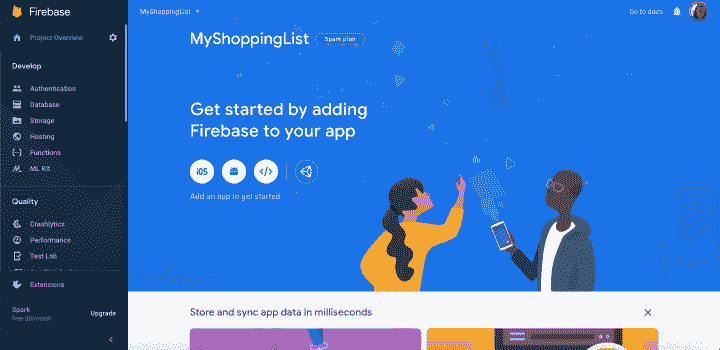

图 MyShoppingList 项目的主屏幕。

重要的是要明白这个项目将适用于许多平台——不仅仅是 Android。如果你打算将 Firestore 集成到一个 iOS 应用程序或一个 web 项目中，你将使用同一个项目，这也将使你能够跨平台共享数据库。

# 向 Android 应用程序添加 Firebase

从这部分开始，配置是安卓特有的。在您项目的主屏幕上，单击白色的 Android 小图标开始集成流程。

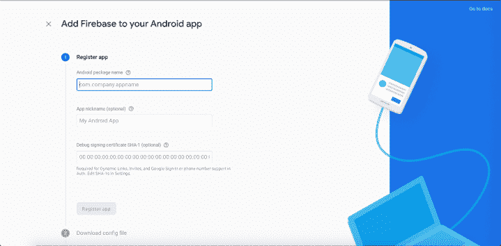

图 9:开始集成流程。

作为第一步，Firebase 将请求您的应用程序的数据。添加以下内容:

1.  包名:`com.evanamargain.android.myshoppinglist`。这必须与您应用程序中的包名相同。如果你不确定并且没有使用演示项目，请访问 app>manifests>androidmanifest . XML。该包位于文件的前几行。
2.  昵称:我的购物清单。这可以是任何有助于你记住应用程序名称的昵称。也许你会想加个后缀“Android”来区别于另一个 app。
3.  SHA-1 证书:这可以是空的，因为在本教程中不会用到它。

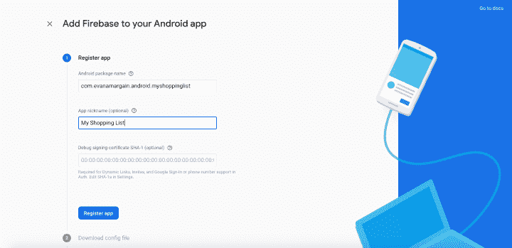

图 10。添加所需数据的第一步。

输入数据后，会得到一个名为`google-services.json`的 JSON 文件。屏幕上有将其集成到应用程序中的说明，但我会在下面解释，以防不清楚。

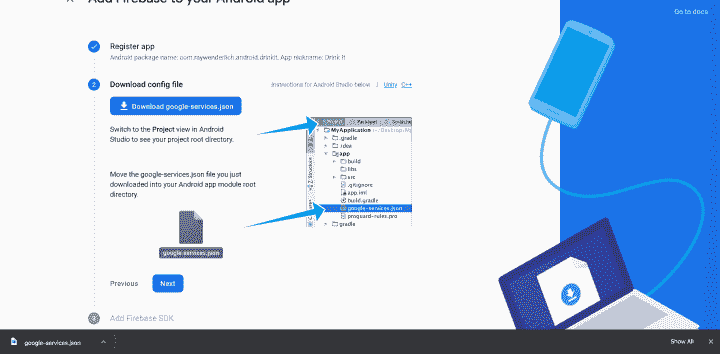

图 11:Android 中 Firebase 的 JSON 配置文件。

转到 Android Studio，在那里打开项目，并在左侧面板中切换视图。您的项目可能处于“Android”模式，您将获得一个下拉列表，其中包含类似于下图 12 的视图选项:

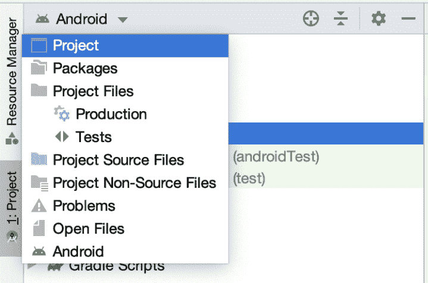

图 12:Android Studio 中的 Android 项目视图。

进入项目视图后，您将看到如下图所示的文件树。将文件从 Firebase 控制台下载到计算机的任何位置，然后拖放到 MyShoppingList > app。

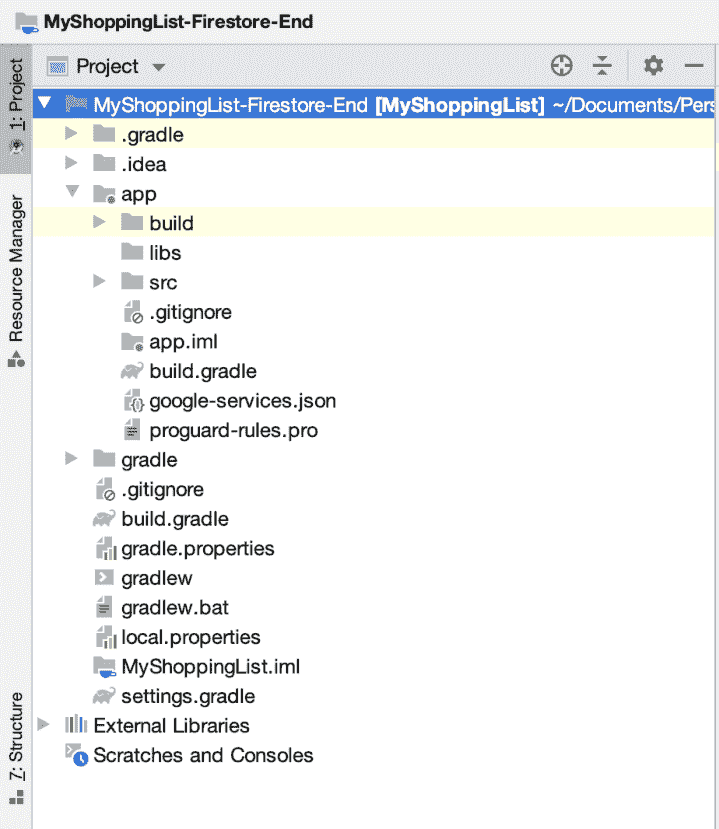

图 13: Android 项目结构。

然后切换回左侧面板中的 Android 视图。大多数情况下，您将在这个视图中使用 Android 项目，因为它是编码时最容易导航的。

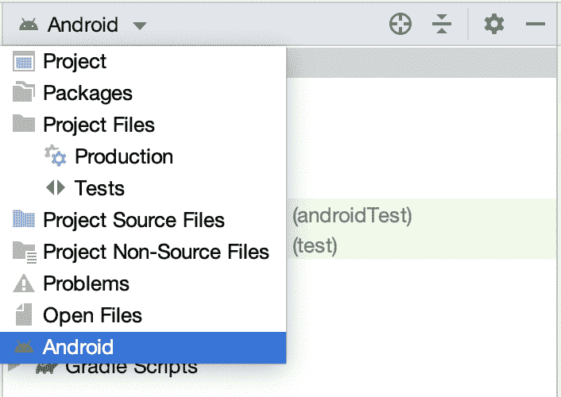

图 14:Android Studio 中的 Android 视图。

一旦你进入 Android 视图，打开`build.gradle (Project: MyShoppingList)`。添加此代码:

```
classpath 'com.google.gms:google-services:4.3.3'
```

在同一个文件夹中，`open Build.gradle (Module: app)`并添加以下代码:

```
apply plugin: 'com.google.gms.google-services' 
... dependencies { 
  ... // In case you activated Google Analytics // Add the Firebase SDK for Google Analytics implementation 'com.google.firebase:firebase-analytics:17.2.2' // Add Firestore dependency implementation 'com.google.firebase:firebase-firestore:21.}
```

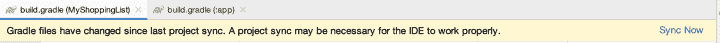

图 15: Android Studio 请求 Gradle 同步。

如果您对同步是否成功有任何疑问，请查看底部面板。它应该看起来像下面的图 16:

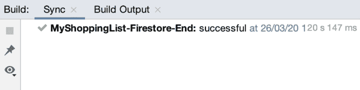

图 16: Gradle 在 Android Studio 中构建成功。

# 完成 Firebase 控制台配置

然后返回 Firebase 控制台，单击 Next 确认您已经将 JSON 文件和依赖项添加到项目中。屏幕底部会有一个提示，表明 Firebase 正在验证您的应用程序和控制台之间的连接。构建并运行应用程序。它的运行和外观应该与教程开始时一样。这样做之后，Firebase 应该会确认连接，并给你一个继续控制台按钮。


图 17:应用程序和 Firebase 控制台之间的连接已确认。

如果上面的步骤失败了，回到说明，确保你做的一切都是正确的。否则，在项目的主屏幕上，你会看到一个紫色的图标，上面有紫色的 Android 标志，这意味着你的项目连接到了应用程序。

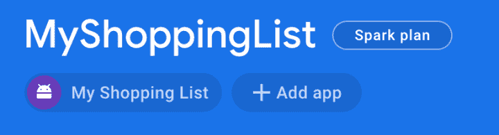

图 18:添加到 Firebase 控制台项目的 Android 应用程序。

# 在 Firebase 控制台中配置 Firestore

一旦您在 Firebase 控制台中有了一个项目，并将您的应用程序连接到该项目，就该在控制台中配置您的 Firestore 数据库了。在主项目屏幕下方找到一个大的橙色磁贴，如下图 19 所示:

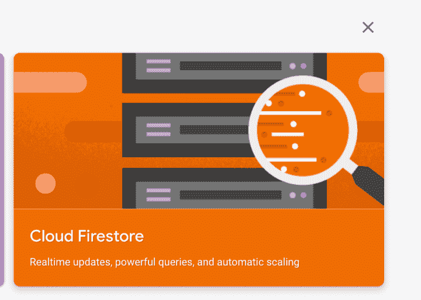

图 19:云 Firestore 访问磁贴。

您将访问该项目的 Firestore 页面，并在一个大横幅中获得创建数据库的提示:

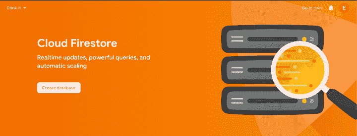

图 20: Firestore 创建第一个数据库。

单击创建数据库按钮，将出现一个模式屏幕。它会首先询问你关于数据库安全性的问题。对于开发和本教程，您将把它设置为“测试模式”，但是考虑到对于生产应用程序，启用“生产模式”是很重要的，因为您希望您的用户数据是安全的。

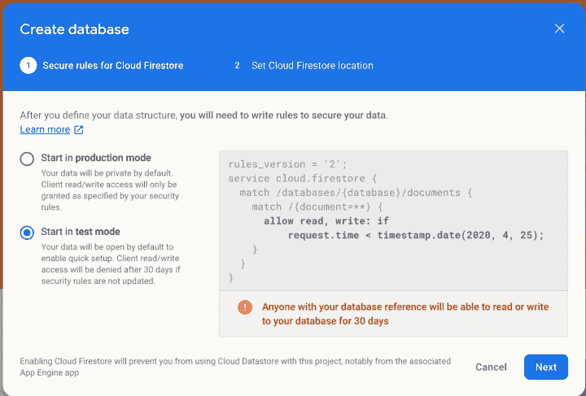

图 21: Firestore 数据库模式。

单击下一步，系统会询问您服务器的位置。通常，建议选择离您或您的用户最近的位置，因为这将减少加载时间。我认为 Firebase 控制台会自动建议离你最近的一个。

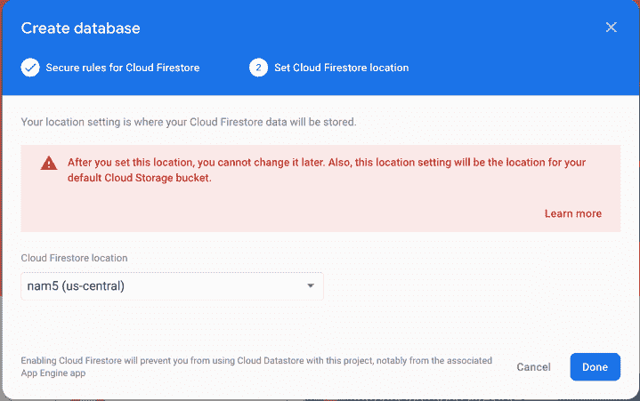

图 22: Firestore 数据库位置。

单击“完成”后，会显示一个配置云 Firestore 微调器(图 23)。我曾经在一次谷歌云会议上被告知，如果服务过于饱和，这种供应可能需要三分钟，但通常需要的时间不到三分钟。

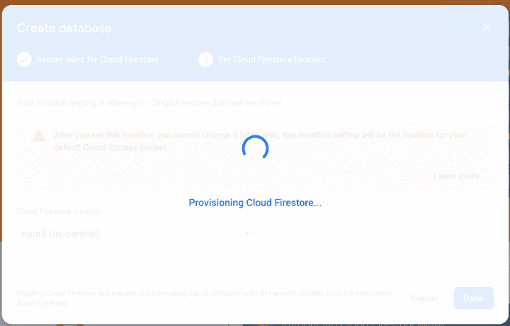

图 23: Firestore 供应微调器。

# 配置数据库

配置过程完成后，您将看到您的数据库，如下图所示。数据库是空的，正在等待您开始处理它:

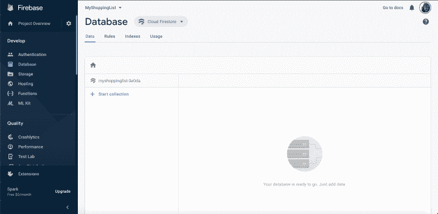

图 24: Firestore 数据库为空。

单击“+开始收藏”文本创建您的第一个收藏。该数据库具有基于集合>文档>字段的多栏结构。根据演示应用程序，我们希望我们的集合被称为我的杂货，因为这将包含我们所有的杂货。

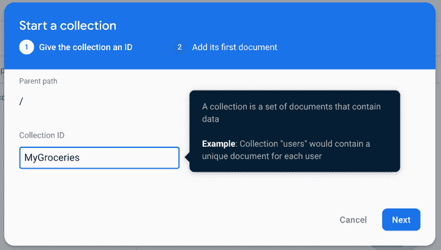

图 25: Firestore 添加产品系列。

然后，对于该文档，还会提示您输入名称。如果你想在你的应用程序中有几个列表，它可以是“今天杂货”或日期(例如“3 月 30 日–2020”)。

添加带有示例数据的字段:

1.  Item1 =字符串—香蕉
2.  Item2 = string —花生酱
3.  Item3 = string —面包
4.  …

添加尽可能多的你想要的或只是复制我们的应用程序中的样本数据。

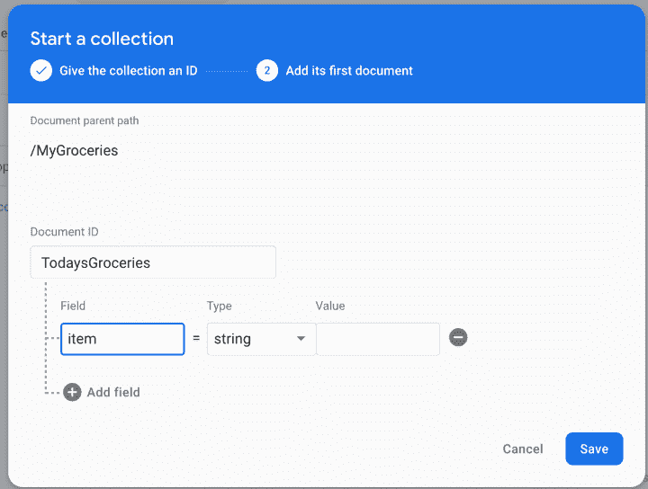

图 26: Firestore 添加文档。

添加完所有字段后，您的数据库应该如下面的图 27 所示:

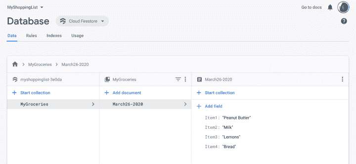

图 27:带有演示数据的 Firestore 数据库。

# 结论

就是这样！我们现在有 Firebase 控制台和 Android 应用程序，配置为使用 Firestore，其中有一个数据库。在下一部分，我们将把这个数据库集成到 Android 架构组件中。如果你想看看项目最后应该如何运作，可以在[我的网站](http://www.evanamargain.com/blog/wp-content/uploads/2020/05/MyShoppingList-Firestore-End.zip)下载完成的项目。

如果你有任何疑问，不要犹豫留下评论，我会尽快回复。

下次见！