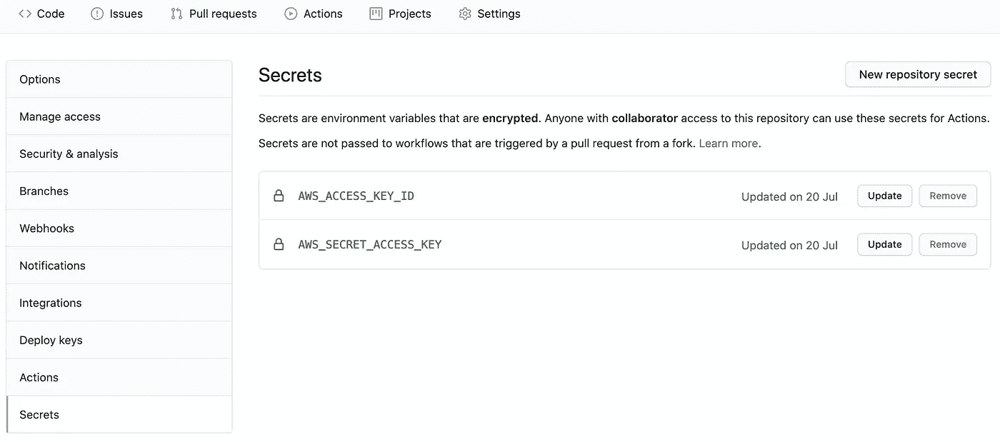

# 如何在 AWS 上设置部署管道

> 原文：<https://betterprogramming.pub/how-to-set-up-a-deployment-pipeline-on-aws-c9ae10a3cd21>

## 通过 GitHub 动作持续交付


由 [Samuel Sianipar](https://unsplash.com/@samthewam24?utm_source=unsplash&utm_medium=referral&utm_content=creditCopyText) 在 [Unsplash](https://unsplash.com/s/photos/pipes?utm_source=unsplash&utm_medium=referral&utm_content=creditCopyText) 拍摄的照片。

CloudFormation 是亚马逊网络服务上的一项服务。它允许您将*基础设施描述为代码*。您可以在中的模板文件中定义必要的服务以及它们之间的依赖关系。yml 或者。json 格式。

如果我们选择在 GitHub 上存储模板文件，我们希望在我们的存储库中有一个自动部署到 AWS 的新提交。这可以通过 GitHub 动作来实现。

要构建一个管道，我们可以使用来自 AWS 的官方 GitHub 动作，该动作可以在 [GitHub Marketplace](https://github.com/marketplace/actions/aws-cloudformation-deploy-cloudformation-stack-action-for-github-actions) 上获得。尽管它有一个很好的描述，但是在集成它的时候，仍然会面临一些挑战。让我们详细介绍一下每个步骤。

# 创建 IAM 用户

GitHub 通过 API 与 AWS 通信。为此，我们需要一个访问密钥 ID 和秘密访问密钥。因此，我们需要首先创建一个 IAM 用户，并为其生成凭证。建议将凭证存储在 GitHub Actions secret 中。



GitHub 秘密部分

然而，这还不够。用户应该有适当的权限。他们至少应该能够创建一个云形成堆栈。否则，部署将会失败。

```
{
    "Version": "2012-10-17",
    "Statement": [
        {
            "Effect": "Allow",
            "Action": [
                "cloudformation:*"
            ],
            "Resource": "*"
        }
    ]
}
```

此时，我发现了一件重要的事情:用户应该分配创建堆栈所需的所有权限。例如，如果我们在堆栈中创建一个 S3 存储桶，这个用户需要拥有创建它的权限。这在当下并不明显，但很有意义。

# 工作流设置

这是构建任何 GitHub 动作的常规步骤。您必须在项目的`.github/workflows`目录中创建一个. yml 文件。这个文件定义了所有需要执行的步骤。GitHub Actions 的[文档](https://docs.github.com/en/free-pro-team@latest/actions/learn-github-actions/essential-features-of-github-actions)涵盖了配置的结构。

作为第一步，我们需要设置前面段落中描述的凭据和区域。第二个动作是按照引用的模板文件进行 CloudFormation 部署。这两个步骤都使用 AWS 的 GitHub 动作。

```
jobs:
  build:
    runs-on: ubuntu-latest
    steps:
    - uses: actions/checkout@v2
    - name: Configure AWS credentials
      uses: aws-actions/configure-aws-credentials@v1
      with:        
        aws-access-key-id: ${{ secrets.AWS_ACCESS_KEY_ID }}
        aws-secret-access-key: ${{ secrets.AWS_SECRET_ACCESS_KEY }}        
        aws-region: eu-west-2 - name: Deploy CloudFormation Stack
      uses: aws-actions/aws-cloudformation-github-deploy@v1.0.3         
      with:
        name: RootStack
        template: root_stack.yml
```

这是工作流的最小设置。

# 准备云形成堆栈

就个人而言，这是最具挑战性的任务。我的 CloudFormation 栈在模板中使用嵌套栈。每个嵌套堆栈都在单独的模板文件中定义。

例如，模板文件`user_template.yml`创建一个新的 IAM 用户。根栈将通过路径引用模板文件。

```
AWSTemplateFormatVersion: '2010-09-09'
Resources:
  IamStack:
    Type: AWS::CloudFormation::Stack
    Properties:
      TemplateURL: user_template.yml
```

这个堆栈的部署经常失败。即使模板文件在那里，它也找不到。原来 GitHub Action 并不运行`package`命令。

根据 CloudFormation [文档](https://docs.aws.amazon.com/it_it/cli/latest/reference/cloudformation/package.html)，模板中定义的所有工件都需要在部署前打包。当`package`命令完成时，所有工件都将被上传到 S3 存储桶，所有对模板文件的引用都将被相应地更新。

```
aws cloudformation package\
  --template-file root_stack.yml \ 
  --s3-bucket uploading-bucket \
  --output-template-file root_stack.packaged.yml
```

在上面的例子中，来自 AWS CLI 的命令`package`将把所有引用模板从根栈上传到 S3 桶`uploading-bucket`。然后，它将生成一个名为`root_stack.packaged.yml`的新文件，该文件将具有与原始堆栈文件完全相同的结构，但是所有指向嵌套模板文件的链接将被替换为指向 S3 存储桶上的文件的链接。

为了使工作流中的`deploy`动作工作，它应该引用`package`命令的输出文件。有了打包的模板文件，部署将会成功。

# 结论

CloudFormation 是 AWS 的一项强大服务。同时，GitHub 仍然是存放源文件的好地方。在 GitHub Actions 的帮助下，有可能构建一个有效的部署管道来遵循最佳的连续交付实践。