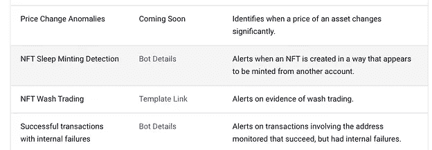
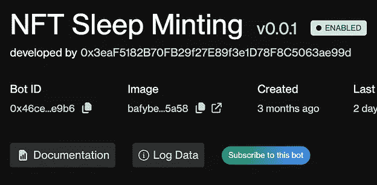
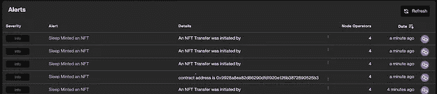
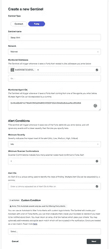
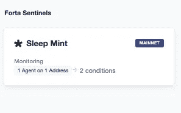

# 如何使用 OpenZeppelin Defender 设置 Forta 提醒通知

> 原文：<https://betterprogramming.pub/how-to-set-up-a-forta-alert-notification-using-openzeppelin-defender-7456c9dc8703>

## 监控合同

由 [Unsplash](https://unsplash.com?utm_source=medium&utm_medium=referral) 上的 [Shubham Dhage](https://unsplash.com/@theshubhamdhage?utm_source=medium&utm_medium=referral) 拍摄的照片

OpenZeppelin 防御者[哨兵](https://docs.openzeppelin.com/defender/sentinel#when-to-use)有两种类型。Contract Sentinels 最适合根据给定合同地址的属性来监控交易，而 Forta Bots 为监控一个或多个合同提供了更广泛、更复杂的可能性。

使用 [Forta Explorer](http://explorer.forta.network) ，您可以通过电子邮件、Slack 或 Discord 轻松接收警报，方法是连接您的钱包地址并选择给定的代理。

Defender 使您有机会对 Forta 警报进行微调，将相关警报分组在一起，并通过 Defender dashboard 将它们与其他智能合同功能一起管理。

# 创建福塔哨兵

一旦登录到 [Defender](https://defender.openzeppelin.com) ，导航到 Sentinel 并选择创建 Sentinel。

在 Sentinel 类型下，选择 Forta。

给你的哨兵一个描述性的名字。该名称将包含在您在后续步骤中选择设置的任何警报通知中。

您可以将网络选择留给所有网络，或者如果您希望仅指定一个网络来接收通知，请从下拉列表中选择网络名称。

可以设置一个给定的哨兵来监控单个地址或多个地址。如果已经使用 Admin 保存并命名了地址，只需从下拉列表中选择地址名称。否则，将合同地址粘贴到字段中。

# 指定福塔代理

社区成员正在不断添加新的 Forta 机器人。您可以通过访问优秀的 Forta 文档并选择[威胁检测工具包](https://docs.forta.network/en/latest/threat-detection-kits/)来浏览基于类别分组的精选机器人。

在那里，您可以从列表中选择适当的类别。对于基于 NFT 安全的策划机器人，选择 [NFT 威胁检测工具包](https://docs.forta.network/en/latest/nft-starter-kit/)。

选择具体的代理 bot: [NFT 睡眠铸币检测 bot 详情](https://docs.forta.network/en/latest/starter-kit-bot-details/#nft-sleep-minting-detection)

[1068×371 90.2 KB](https://aws1.discourse-cdn.com/business6/uploads/zeppelin/original/2X/6/64b565bbf8b3b19e56e6c4791bfbb1ca15c72ec7.png)

选择统计 URL，然后复制机器人 ID。

[835×410 95.9 KB](https://aws1.discourse-cdn.com/business6/uploads/zeppelin/original/2X/c/c18eb1cbd912a4d7fc34c4e0ebadb01b2e5e7cc8.png)

回到 Defender，将 Bot ID 粘贴到受监控的代理 ID 部分。要选择多个代理，只需用逗号分隔每个 Bot ID。选择多个代理可以让您轻松地对各种相关情况的警报通知进行分组。

在警报条件下，选择您希望触发警报的严重性级别。您可以在 Forta Explorer 的“alerts”部分查看您指定的代理以前发出的任何警报。

Forta 试图在多个扫描仪上运行每个机器人。如果警报计时非常重要，将最少扫描程序确认次数设置为 1 将导致它在收到第一个警报时立即触发。如果警报的有效性比速度更重要，请考虑将最少确认次数设置为较高的数字，以便给定的警报需要多个扫描器的一致同意。

指定警报 ID 将导致在代理 ID 和选定的警报 ID 匹配时触发警报。详见 [Forta 匹配规则](https://docs.openzeppelin.com/defender/sentinel#forta-matching-rules)。

最后一部分是自动任务。如果您希望根据一点自定义逻辑进一步过滤这个 Sentinel 的触发，那么可以在这里指定自动任务来完成这个任务。

选择下一步。

在下一个屏幕上，您将看到通知发送目的地的选项。

您还可以[定制通知主体](https://docs.openzeppelin.com/defender/sentinel#customizing-notification-messages)，例如，如果您希望警报更短，或者包含更多描述性信息、超链接或基于动态内容的特定元素。

如果您正在监视一个可能比您想要处理的更频繁触发的条件，您可以[限制通知](https://docs.openzeppelin.com/defender/sentinel#controlling_the_notify_rate)，以便仅在指定时间范围内发生给定数量的匹配后触发警报。您还可以提供一个超时值，以防止发送通知的频率超过您指定的时间间隔(秒)。

就是这样！这就是将 Forta 警报通知与 Defender Sentinel 集成的全部工作。