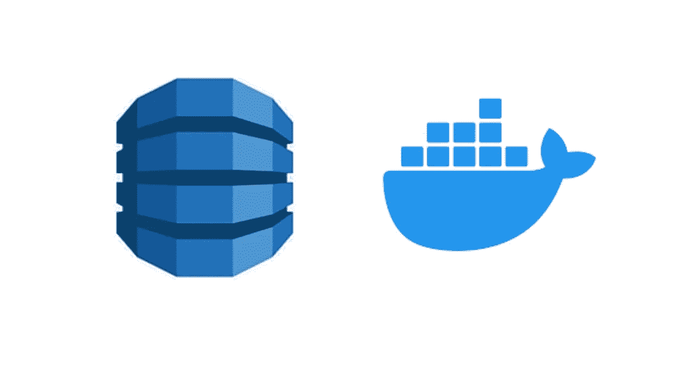
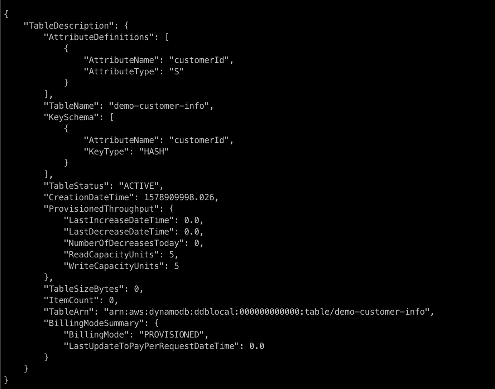
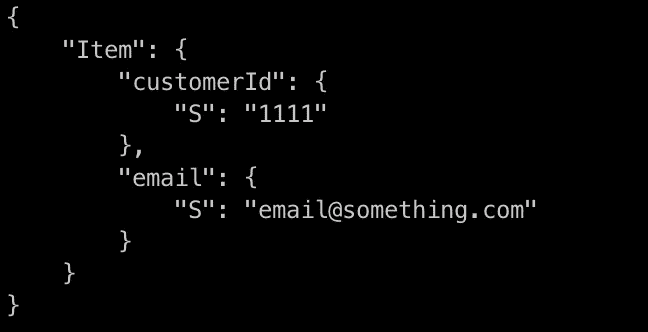
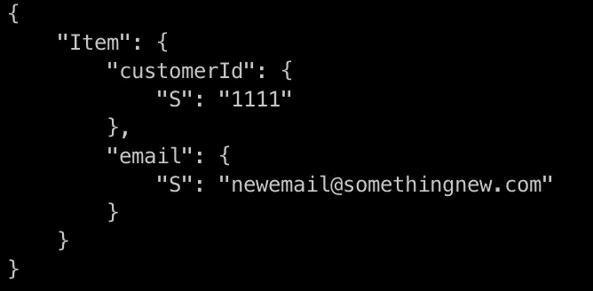
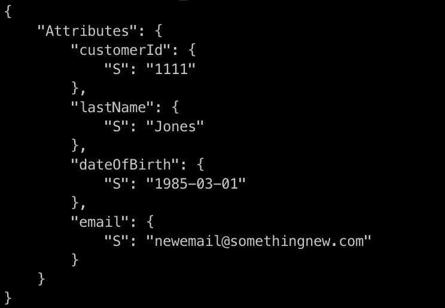
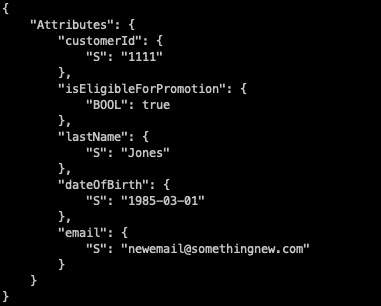
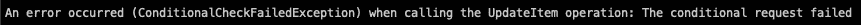
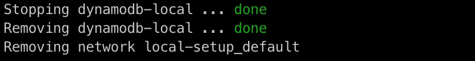

# 如何在 Docker 容器中设置本地 DynamoDB

> 原文：<https://betterprogramming.pub/how-to-set-up-a-local-dynamodb-in-a-docker-container-and-perform-the-basic-putitem-getitem-38958237b968>

## 通过在 Docker 容器中设置一个本地 DynamoDB 实例来改进您的集成测试

Docker 容器中的 AWS DynamoDB

# 介绍

在本教程中，我将向您展示如何在 Docker 容器中设置一个本地 DynamoDB，以便您可以在本地机器上使用它。除此之外，我们还将了解如何通过用于 DynamoDB 的 AWS 命令行工具来执行基本的 CRUD(创建、读取、更新和删除)操作。

## 拥有本地 DynamoDB 实例的好处

拥有本地 DynamoDB 实例的好处之一是，您可以在本地测试与 DynamoDB 交互的应用程序代码，而不是在 AWS 云中指向真正的 DynamoDB。我应该提到它是免费的吗？🙂我们也不需要担心本地实例提供的吞吐量。

此外，因为我们将实例托管在 Docker 容器中，所以它将与运行在本地机器上的其他所有东西分开。所有的依赖项都包含在容器本身中。

## Docker 映像和操作系统详细信息

我们将在本教程中使用的 Docker 图像是官方的 AWS 本地 DynamoDB 图像，你可以在这里找到。本教程也是在 macOS 机器上完成的。

我们开始吧！

# 下载 Docker

作为先决条件，您需要在本地机器上安装 Docker，如果您还没有安装的话。我不会告诉你怎么做，因为 Docker 已经在这里发布了如何安装 Docker for macOS [的说明。说明很详细，所以你不会有任何问题。](https://docs.docker.com/docker-for-mac/install/)

## 安装 AWS 命令行工具

本教程的另一个先决条件是 AWS 命令行工具。请按照 AWS [这里](https://docs.aws.amazon.com/cli/latest/userguide/install-macos.html)写的说明在 macOS 上安装 CLI 工具。

# 为本地 AWS DynamoDB 创建 Docker-Compose 文件

让我们创建一个`docker-compose.yaml`文件，这样我们就可以利用`docker-compose`命令来启动和/或停止 Docker 容器。

我将这个文件命名为`docker-compose-dynamodb-local.yaml`，而不仅仅是`docker-compose.yaml`，因为我希望能够启动一个我需要的 Docker 容器(假设我在同一个文件夹中有多个 Docker 设置)。

例如，如果我为 Kafka 或其他东西设置了另一个 Docker，那么这个设置将会工作，因为`docker-compose`命令允许您指定文件的名称。因此，我可以在任何给定的时间里选择我想要旋转的 Docker 容器。

文件的内容非常简单。我们只需要指定我们想要的 Docker `image`、`hostname`、`container_name`以及我们想要暴露给环境的`ports`。在这种情况下，我们在本地机器的端口`8042`上公开 Docker 容器的端口`8000`(即 DynamoDB 的端点将是`http://localhost:8042`)。

docker-compose-dynamo db-local . YAML

# 启动 Docker 容器

在您根据上一步创建了`yaml`文件之后，我们就可以开始运行本地 DynamoDB 了。从您的终端，将目录`cd`切换到您创建`yaml`文件的目录。然后，执行以下命令。

docker-compose 命令启动本地 DynamoDB 容器

厉害！现在我们已经准备好使用刚刚创建的本地 DynamoDB 实例了。

# CRUD 操作

## 创建表格

在我们进行任何 CRUD 操作之前，我们需要首先创建一个表。从您的终端，执行以下命令。

创建表格命令

我们在命令中设置的变量是:

*   `endpoint-url`:注意，它被设置为指向`http://localhost:8042`，这是 Docker 容器中暴露出来访问 DynamoDB 的端口。
*   `table-name`:这是将要创建的表的名称。如果你愿意，你可以用不同的名字来命名它。
*   `attribute-definitions:`这是构成表的键模式的属性的描述。它有两个参数，`AttributeName`和`AttributeType`。
*   `key-schema`:在这里我们可以定义作为表格主键的属性。
*   `provisioned-throughput`:这定义了我们的表的吞吐量(读和写)，尽管这无关紧要，因为它只是一个本地实例。

如果成功，您应该会看到这样的响应。响应显示了刚刚创建的表的详细信息。

创建表成功响应

我们现在有桌子玩了。耶！😃

## 创建记录— PutItem

我们要对新创建的表做的第一件事是创建一条记录。想象一下这样一个场景，我们有一家企业，想要存储我们的客户信息。让我们假设我们需要的只是他们的电子邮件地址，并且我们有一个合适的系统来生成一个唯一的`customerId`。

要存储新的客户记录，您可以从终端执行以下命令。

放入项目

如果成功，该命令实际上不会向控制台返回任何内容。所以，当你看不到任何回应时，不要感到困惑。🙂有一个参数`--return-values ALL_OLD`，但是它也不会返回任何东西，因为它只会返回一个现有的记录，如果有的话。在后面的部分会有更多的介绍。

此外，我们可能想给我们的`put-item`命令添加一个条件，例如，如果没有相同`customerId`的现有记录，则只创建一个记录。然后表达式变成这样。

带有条件表达式的 put-item

如果您尝试执行上面的命令，您将会得到一个错误，因为已经存在一个与`1111`的`customerId`相同的记录。

条件检查失败导致的错误

`condition-expression`参数也可用于`update-item`和`delete-item`操作。

## 检索记录— GetItem

为了从我们的表中检索一个条目，我们可以使用`get-item` API。在您的终端上，运行以下命令来检索我们在上一节中创建的客户记录。我们需要指定`customerId`，因为它是表的主键。

获取项目

您应该会看到一个响应，其中显示了客户记录。

获取项目响应

由此，我们知道上一节中的`put-item`操作已经成功执行。万岁！😆

## 更新记录—更新项目

接下来，让我们看看是否可以更新之前添加的客户记录。更新记录在现实世界中很常见。假设您的客户需要更改他/她的电子邮件地址。为此，让我们运行下面的命令。

更新-项目

如果没有给出`return-values`参数，如上所示的成功的`update-item`操作不会返回任何响应。因此，让我们执行一个`get-item`命令来检索客户记录，以验证我们刚刚对`email`字段所做的更新。您应该看到下面的响应，它按照我们的`update-item`表达式显示了新的电子邮件地址。

验证更新项的获取项响应

我们现在已经提过几次`return-values`了，那就说说吧。本质上，如果我们希望我们的`update-item`命令(以及`put-item`、`delete-item`)返回值，我们可以添加这个参数。`return-values`参数有 5 个可接受的值:

*   `NONE`:如果我们简单的不包含`return-values`，那么将默认为`NONE`。这意味着不会返回任何值。
*   `ALL_OLD`:它将返回更新前该项目的所有属性或列。
*   `UPDATED_OLD`:只返回更新前更新过的属性。
*   `ALL_NEW`:更新后返回该项目的所有属性或列。
*   `UPDATED_NEW`:更新后只返回项目的属性。

例如，如果您只是将`--return-values ALL_NEW`添加到上面的`update-item`命令中，您将会看到我们在上面的`update-item`命令之后执行的`get-item`命令的响应。

此外，我们可以使用相同的`update-item`命令向我们的客户记录添加更多的字段。执行以下命令。

用新字段和返回值更新项目

您应该会看到该命令的响应，其中包含该项目的所有当前属性。干得好！🙂

更新-项目回应

我想对`update-item`操作做的最后一件事是添加`condition-expression`。假设我们希望向符合资格标准的客户发送报价，出于某种奇怪的原因，该标准是客户出生在`1980-01-01`之后。😅

为了识别这些客户，并用一个标志来更新我们的表，该标志表明客户有资格获得优惠，让我们执行下面的命令。

用条件表达式更新项目

如您所见，我们的客户`1111`的`isEligibleForPromotion`标志等于`true`。耶！🙂

用条件表达式结果更新项目

如果我们试图更新一个在`1980-01-01`之前有`dateOfBirth`的客户，我们会收到这样的错误。

用条件表达式错误更新项目

## 删除记录—删除项目

最后但同样重要的是，有时我们需要根据他们的请求删除我们的客户记录；例如，他们选择退出我们的邮件列表或其他。为此，让我们运行以下命令。

删除-项目

我们在这里添加了`return-values`参数，这样它将把被删除的项目打印到控制台。

# 停止码头集装箱

既然您已经完成了所有的 CRUD 操作(或者您可能想继续探索？)，是时候拆 Docker 容器了。为此，您只需从创建`docker-compose-dynamodb-local.yaml`文件的位置运行下面的命令。

docker-向下合成

您应该在终端控制台中看到以下响应。

docker-撰写关闭响应

# 包扎

如果您已经做到了这一步，那么您已经掌握了一些使用 DynamoDB 实例构建 Docker 容器、创建 DynamoDB 表、使用条件表达式对表执行 CRUD 操作以及关闭容器的技巧。干得好，各位。👍 👍

我希望本教程能帮助您理解，您可以利用本地 DynamoDB Docker 映像对使用 DynamoDB 的应用程序进行本地测试。🙂

由[安德烈·亨特](https://unsplash.com/@dre0316?utm_source=unsplash&utm_medium=referral&utm_content=creditCopyText)在 [Unsplash](https://unsplash.com/?utm_source=unsplash&utm_medium=referral&utm_content=creditCopyText) 上拍摄

# 下一步是什么

您现在可能想知道…“如果我想通过我的应用程序与本地 DynamoDB 实例交互呢？”别担心，我掩护你。😉

查看本文，了解如何将您现有的应用程序与本地 DynamoDB 实例集成。