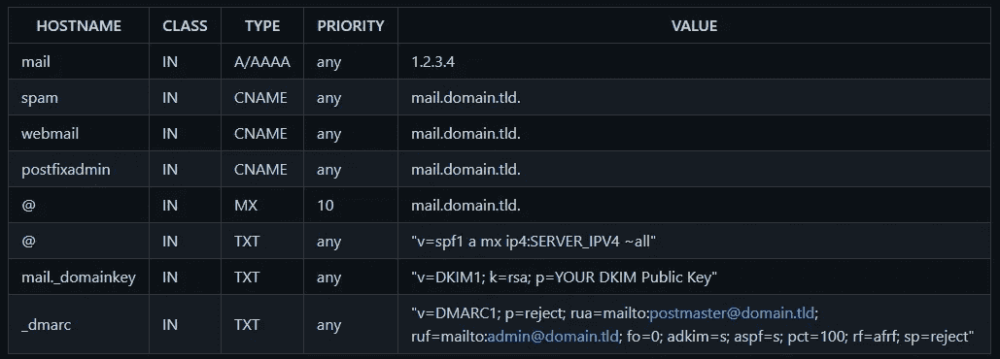

# 如何在 Docker 群中建立邮件服务器

> 原文：<https://betterprogramming.pub/how-to-set-up-a-mailserver-within-a-docker-swarm-e6e9192200c4>

## 想拥有自己的邮件服务器吗？通过本分步指南，了解如何设置您自己的个人邮件服务器


照片由[Wayhomestudio](https://www.freepik.com/photos/watching-movie)/[Freepik](https://www.freepik.com/)拍摄

我运行自己的邮件服务器，为不同的服务提供通用的电子邮件地址。

当我在寻找一个好的解决方案来把我的邮件服务器放入 dockerized 邮件服务器时，我发现了著名的 [docker-mailserver](https://github.com/docker-mailserver) 。不幸的是，我不能使用这个邮件服务器，因为我在配置它的时候有很多错误。

因此，我寻找了一个替代方案，找到了 [hardware-mailserver](https://github.com/hardware/mailserver) ，它类似于 docker-mailserver 的一种优化使用，具有多种预定义的功能。

如果我有一个没有任何其他服务的普通 docker 环境，我可以使用 [this docker-compose.yml](https://github.com/hardware/mailserver/blob/master/docker-compose.sample.yml) 并通过执行以下命令来启动它:

```
$> docker-compose up -d
```

因为[我运行一个 Docker Swarm](https://www.paulsblog.dev/docker-swarm-in-a-nutshell/) 环境，其中[有一个 Traefik 负载平衡器](https://www.paulsblog.dev/services-you-want-to-have-in-a-swarm-environment/#traefik)为我的域创建 SSL 证书，所以我必须在 Compose 文件中做一些调整来设置和配置邮件服务器。每一次调整都将在后面逐一解释。

# 邮件服务器

这是邮件服务器套件使用的主要服务。我必须添加的最重要的东西是环境变量。因为我运行了一个 Docker Swarm 设置，主机名无法正常工作，我必须开发其他东西。我在 GitHub 页面的 pull 请求中找到了一个可能的解决方案。

我必须添加`FQDN`和`DOMAIN`作为环境变量。我必须改变的另一个部分是标签部分。我添加了`deploy`部分并创建了两个重要的属性:

*   `placement-constraint`还有
*   `labels`。

`placement-constraints`用于总是在我的管理器节点上部署邮件服务器，而`labels`填充了我的 Traefik 实例所需的所有信息。

最后，我必须更改卷条目。我想使用 docker 卷，而不是本地共享文件夹(这是通过在卷名前面添加一个`./`来实现的)

此外，在卷部分有一个非常重要的条目:

```
#- ./cert:/etc/letsencrypt/live/${MAILSERVER_FQDN}
```

我将在后面详细解释它的作用以及为什么它会被注释掉

# 后缀-管理

像我以前做的那样，我必须添加环境变量`FQDN`和`DOMAIN`，调整`placement-constraint`、`labels`并更新卷。

# 雨圈

我只加了`deploy`段，换了音量。

# MariaDB

MariaDB 容器获得了一个`placement-constraint`,这样我就不会丢失使用的数据和 docker 卷。此外，非常重要的是`MYSQL_PASSWORD`与邮件服务器服务中定义的相同。

# 雷迪斯

最后一个服务是 Redis 容器，它获得一个`placement-constraint`和调整后的卷。

# 更进一步

在一个文件(`docker-compose.mailserver.yml`)中调整服务后，下一步是部署 Docker Swarm 堆栈。因为我声明了几个环境变量，所以我必须首先导出它们(并且我必须在每次重新创建服务时导出它们)。以下是出口清单:

导出这些变量后，我可以通过执行以下命令将邮件服务器部署到我的 Docker Swarm:

```
$> docker stack deploy -c docker-compose.mailserver.yml mailserver
```

部署邮件服务器后，它没有使用 SSL，因为 Traefik 在第一次访问网站后生成了证书。因为我在邮件服务器服务中声明了一个名为`mail.$PRIMARY_DOMAIN`的域。我打开这个网站，它显示了 rspam，但它也创建了邮件服务器所需的 SSL 证书。


用模因生成器生成的尤达模因

# 如何使用 SSL？

对于之前创建的 SSL 证书，我需要一个函数将它们传输到邮件服务器。不幸的是，由于我安装了 Traefik 的第二个版本，无法使用邮件服务器的自动传输过程。

我必须创建一个小脚本，使用`dumpcerts`(来自邮件服务器 GitHub)从`traefik-acme.json`中提取证书，并将它们存储到邮件服务器可以用来拥有 SSL 证书的文件中。代码如下:

该脚本假设 Traefik 用来存储证书的文件`acme.json`与邮件服务器位于同一个文件夹中。在这里可以找到`dumpcert`脚本[。](https://github.com/hardware/mailserver/blob/master/rootfs/usr/local/bin/dumpcerts.traefik.v2.sh)

如果脚本没有错误地退出，邮件服务器可以被关闭并重新部署(因为 SSL 数据只在邮件服务器栈的开始被检查)。

此外，我创建了一个更新脚本，将所有命令结合在一起使用:

不幸的是，您必须每三个月做一次，因为 Traefik 生成的证书只有三个月的寿命。

# 安装后

一切启动后，下一个任务就是配置`postfix-admin`和`rainloop`。有两个非常简单的信息页面，您可以在其中找到关于配置这些服务的所有信息: [rainloop-initial](https://github.com/hardware/mailserver/wiki/Rainloop-initial-configuration) ， [postfix-initial](https://github.com/hardware/mailserver/wiki/Postfixadmin-initial-configuration)

此外，需要 DNS 设置，以便邮件服务器工作！这一步非常重要。



来自硬件/邮件服务器的 GitHub 页面截图

## **注意事项**

*   确保您 IP 的 PTR 记录与您邮件服务器主机的 FQDN(默认:`mail.domain.tld`)匹配。这个记录通常是在你的虚拟主机界面中设置的。
*   建议使用 DKIM、SPF 和 DMARC 记录来建立良好的信誉评分。
*   在这里可以创建 DMARC 记录
*   SPF 需要邮件服务器的公共 IP！:`v=spf1 a mx ipYOURMAINHERE ~all`
*   容器启动后，DKIM 公共(`mail._domainkey`)密钥将在主机上可用，如下所示:

```
/var/lib/docker/volumes/mailserver_mail/_data/dkim/domain.tld/public.key
```


# 最后的想法

现在，邮件服务器正在运行，您可以使用 postfix admin ( `postfixadmin.yourdomain.de`)来创建可以通过 Rainloop ( `webmail.yourdomain.de`)或另一个电子邮件客户端(Thunderbird/Betterbird)访问的帐户。

我希望本教程对你有所帮助，现在你可以在 Docker Swarm 环境中添加一个邮件服务器了。

此外，如果您有任何问题，想法，建议，或想分享酷 Docker 命令或工具，请联系我。如果可能的话，我会试着回答你的问题，并测试你的建议。

```
**Want to connect with the author**?[Twitter](https://www.twitter.com/paulknulst), [LinkedIn](https://www.linkedin.com/in/paulknulst/), [Blog](https://www.knulst.de), [GitHub](https://github.com/paulknulst)
```

本文最初发表于我的[https://www . pauls blog . dev/how-to-set-a-mail server-within-a-docker-swarm/](https://www.paulsblog.dev/how-to-set-up-a-mailserver-within-a-docker-swarm/)