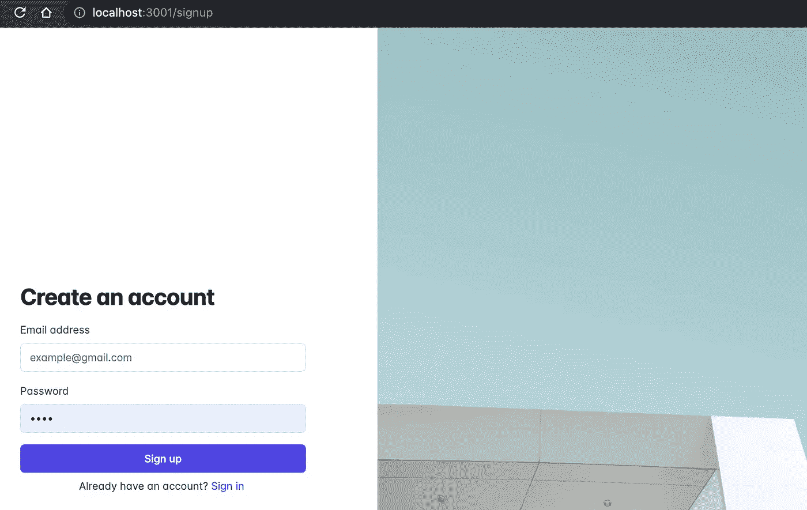
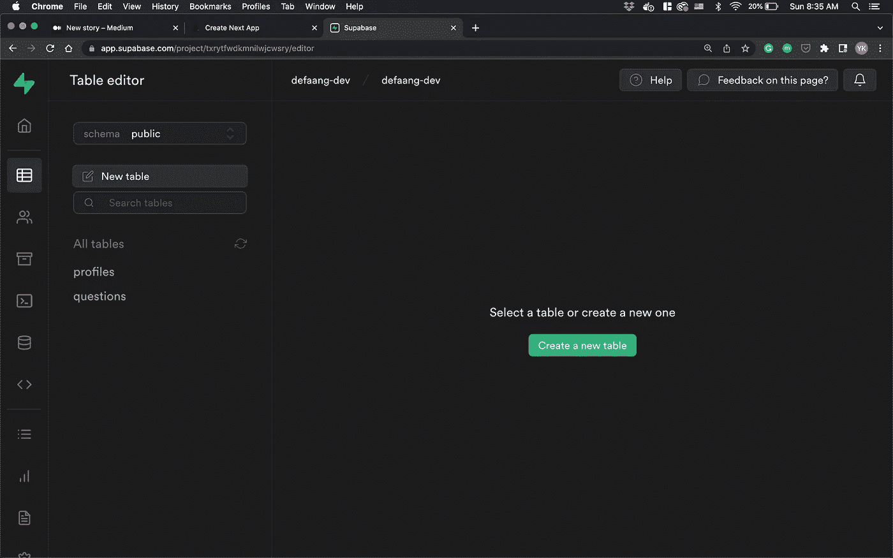
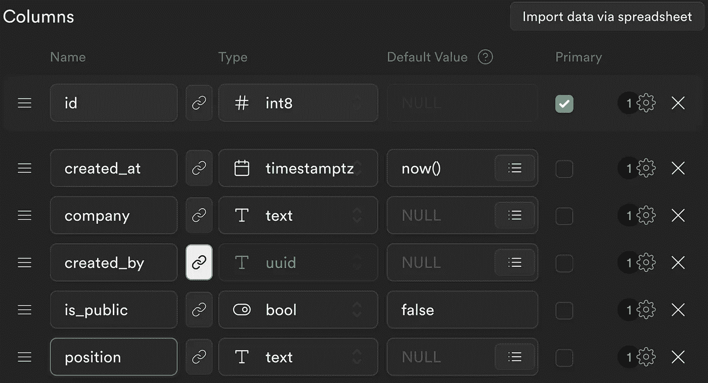
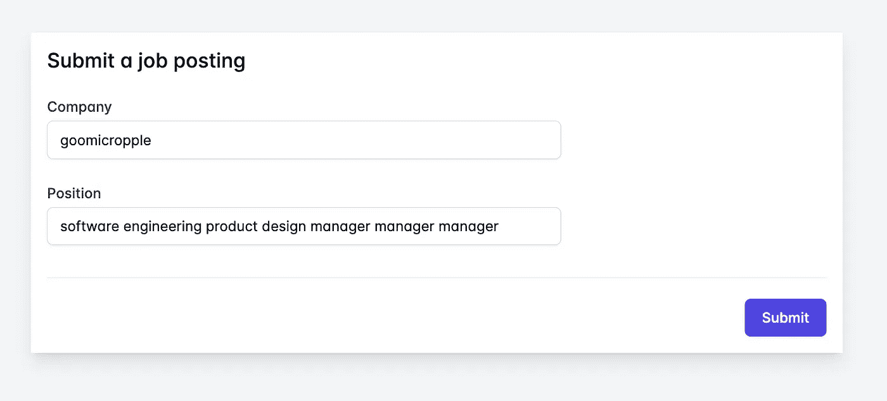

# 如何为应用程序的前端和后端设置 Next.js Supabase 身份验证

> 原文：<https://betterprogramming.pub/how-to-set-up-a-next-js-supabase-auth-for-your-apps-frontend-and-backend-ae23a892693e>

## 开发者分步指南


照片由[Firmbee.com](https://unsplash.com/@firmbee?utm_source=medium&utm_medium=referral)在 [Unsplash](https://unsplash.com?utm_source=medium&utm_medium=referral) 上拍摄

# 什么是 Supabase？

正如他们所描述的，Supabase 是 Firebase 的开源替代品。这是一个托管的 Postgres 环境，具有额外的功能，如身份验证、存储和实时功能。

## 你将学到什么

在本文中，我将向您展示如何在前端和后端设置 Supabase auth。这里我们将使用 Next.js 作为一个例子。出于演示目的，我们将使用[这个示例回购](https://github.com/ykdojo/supabase-nextjs-simple-auth)。

## 阅读这篇文章之前，你需要知道什么

我假设你至少对 Supabase 有所了解。先前对 Next.js 的了解将会有所帮助，但是理解本文并不是必需的。

## 先决条件

我们将在本文中使用 npm，所以要确保它安装在您的系统中。一定要注册一个 Supabase 账户。

现在，让我们进入本教程的主要部分。

# 步骤 1:克隆示例回购

一旦你具备了先决条件，在这里找到示例回购[，然后克隆它。](https://github.com/ykdojo/supabase-nextjs-simple-auth)

# 第二步:做一个关于 supabase.com 的新项目

在 Supabase 的网站上创建一个新的组织和项目。

# 步骤 3:在本地设置项目

然后，进入克隆的目录，将. env.template 复制到. env。

去 Supabase，进入你的项目->设置-> API。将您的密钥复制并粘贴到您新创建的。环境文件。

然后，运行:

```
npm installnpm run dev
```

然后，您应该能够看到类似这样的内容:



# 步骤 3.5:检查路径

此应用程序中提供了以下路径:

`/ (index)`:向数据库发送数据的主窗体。如果用户未登录，重定向至`/signup`。

`/signup`、`/signin:`报名和签到表格。如果用户已登录，则重定向到索引。

`/logout`:注销用户。

现在，您应该能够使用这些路径注册、登录和注销。

# 步骤 4:在 Supabase 中创建新表

在本例中，我们将创建一个简单的职位发布 web 应用程序。

因此，我们将创建一个名为`jobs`的表。

转到您的项目并单击创建新的`table`。



将其命名为`jobs`，启用行级安全性，并添加以下字段:



`created_by`应该是`auth.users`表的外键。

如果这是一个真正的应用程序，它可能需要更多的列，但让我们保持简单。

注意我们有`is_public column`，默认情况下它被设置为 false。

这里的假设是，当用户在网站上发布一个新的招聘信息时，我们不想让它自动出现在网站上。我们希望有一些批准过程，以便网站管理员可以决定哪些职位发布是合法的，足以显示在网站上。

# 第五步:提交职位发布表！

转到根路径，并尝试提交表单！



应该管用的！你可以在 Supabase 的仪表盘上核实一下:


那是怎么发生的？

# 步骤 6:了解前端

进入`src/pages/index.tsx`，你会看到这个处理表单提交的功能:

重要的是，我们在请求头中发送 Supabase 的访问令牌/ JWT。

这是这一部分:

```
headers: {
  Authentication: session.access_token,
},
```

简而言之，JWT 是验证用户是否登录的密钥。

通过将它发送到我们 API 路径上的后端代码，我们可以发送用户已登录的后端证明。

# 步骤 7:了解后端

转到`src/pages/api/submit_job_posting.js`。让我们试着一节一节地理解这个文件。

```
const supabase = createClient(supabaseUrl, supabaseAnonKey);
const supabaseSecret = createClient(supabaseUrl, supabaseServiceKey);
```

^These 顶部的两行以两种不同的方式创造客户。

第一个是与前端相同类型的客户端——公开使用它是安全的:

```
const supabase = createClient(supabaseUrl, supabaseAnonKey);
```

第二个使用 Supabase 的秘密服务密钥。它对您的数据具有管理员级别的访问权限:

```
const supabaseSecret = createClient(supabaseUrl, supabaseServiceKey);
```

然后:

```
const input_data = JSON.parse(req.body);
const jwt = req.headers.authentication;
```

^these 两行解析前端发送的数据，然后从报头中检索 JWT。

```
const { data: user, userError } = await supabase.auth.api.getUser(jwt);const id = user.identities[0][‘id’];
```

^Then，这两行检索登录的用户，我们得到他们的 ID。

```
const { data, error } = await supabaseSecret.from(‘jobs’).insert([input_data]);
```

^Finally，这一行使用管理员级别的访问将数据插入到我们的表中。

# 为什么我们需要管理员级别的访问权限？

另一种可能的方法是—我们可以使用行级安全性直接从前端插入数据。然而，这样一来，每个用户都可以手动将`is_public`设置为 true，这不是我们想要的。

为了避免这种情况，我们需要使用管理员级别的访问权限将其设置为 false，从使用我们的后端代码开始。

# 通过实际例子了解更多信息

感谢您阅读本文！

如果你想了解更多关于如何在现实应用中使用这种特殊模式的信息，请随意查看我的开源项目中使用的[。](https://github.com/ykdojo/defaang)