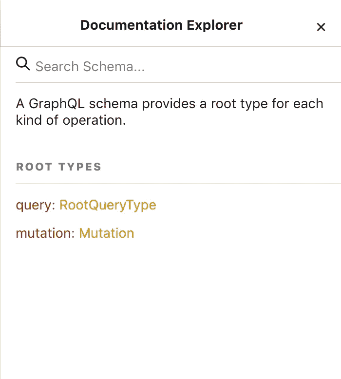
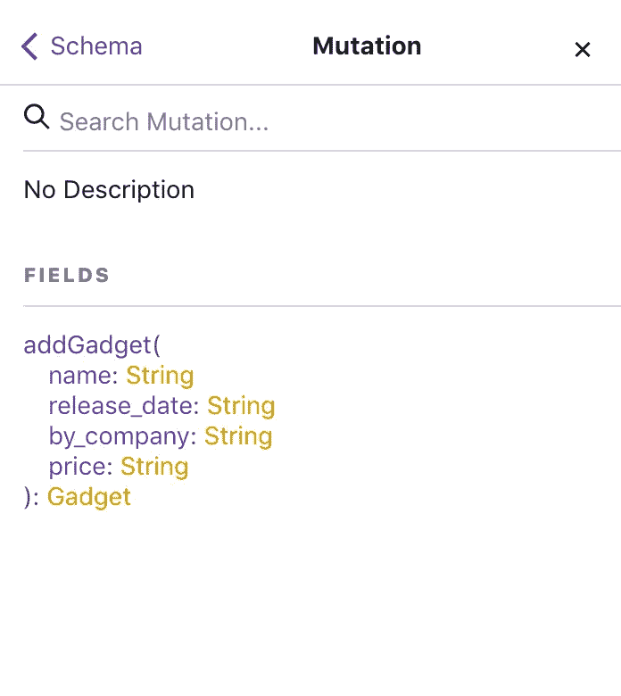
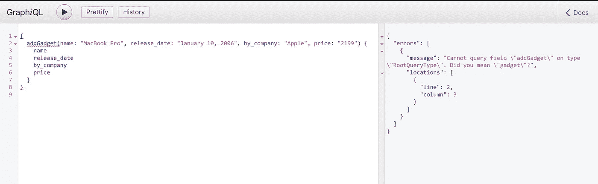
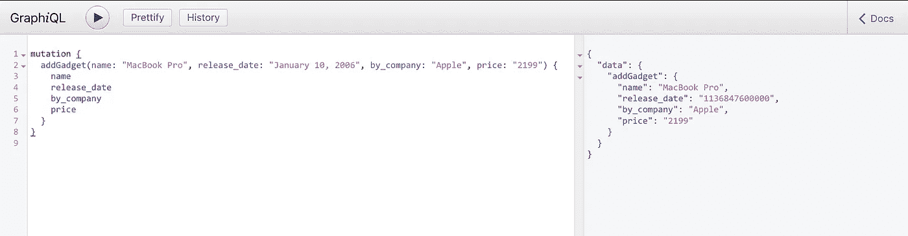
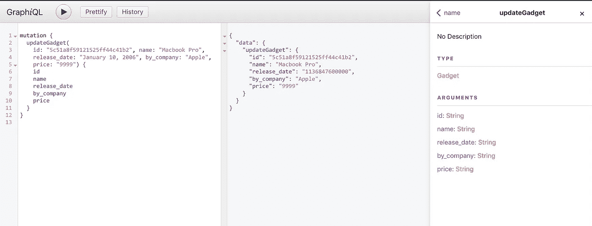
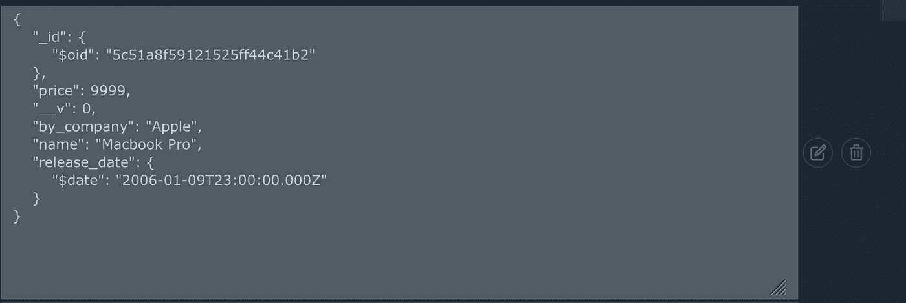
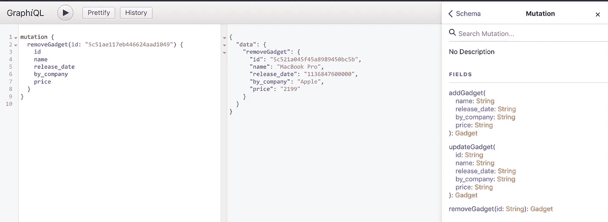

# 如何用 GraphQL、Koa 和 MongoDB 建立一个强大的 API——CRUD

> 原文：<https://betterprogramming.pub/how-to-set-up-a-powerful-api-with-graphql-koa-and-mongodb-crud-4459fc0720d4>

在这个系列中，我们将学习如何用 [GraphQL](https://graphql.org/) 、 [Koa](https://koajs.com/) 和 [Mongo](https://www.mongodb.com/) 建立一个强大的 API。主要焦点将放在 GraphQL 上。如果您还没有，请查看本系列文章的第一部分。

 [## 如何用 GraphQL、Koa 和 MongoDB 建立一个强大的 API

### 构建一个 API 超级好玩！尤其是当您可以利用 Koa、GraphQL 和 MongoDB 等现代技术时。

medium.com](https://medium.com/free-code-camp/how-to-setup-a-powerful-api-with-graphql-koa-and-mongodb-339cfae832a1) 

# 突变

到目前为止，我们可以读取我们的数据，但很有可能我们需要编辑我们的数据记录/文档。任何完整的数据平台都需要一种修改服务器端数据的方法。

想象一下，一家公司推出了一个新玩意。我们如何用 GraphQL 将记录添加到数据库中呢？

# 什么是突变？

想想像`POST`或`PUT` REST 动作这样的突变。设置突变非常简单。

让我们跳进来吧！

# 向我们的数据库添加记录

创建一个文件`graphql/mutations.js`。

在文件中，我们将放置突变。

*   我们将从 GraphQL 库中导入`GraphQLObjectType`和`GraphQLObjectType`对象。
*   为`gadget`导入 GraphQL 类型。
*   导入`gadget`猫鼬模型。

导入我们需要的东西后，我们可以创造变异。

突变只是一个普通的`GraphQLObjectType`，就像我们之前的查询一样。它有两个我们感兴趣的主要特性。

1.  这种突变的名字出现在`graphiql`文档中。

2.字段是我们放置变异逻辑的地方。

注意，我在`fields`对象中添加了一个新对象。它被称为`addGadget`，它会做它所说的事情。

在`addGadget`中，我们可以访问三个属性，`type`、`args`和`resolve()`。

`addGadget`类型为`gadgetGraphQLType`。小工具只能具有我们之前声明的`gadgetGraphQLType`类型中允许的属性。

`addGadget`是一个接受参数的查询。需要这些参数来指定要将哪个小工具添加到数据库中。

我们预先声明查询接受哪些参数，以及参数的类型。

最后—查询会发生什么？这正是我们拥有`resolve()`功能的原因。

记住`resolve()`函数有两个参数:`parent`和`args`。我们对`args`感兴趣，因为这些是我们传递给查询的值。

在 resolve 中，我们放置了创建新 Mongo 记录的逻辑。

我们创建了我们的`Gadget`mongose 模型的一个新实例，将我们从 GraphQL 收到的属性作为新字段传递，最后[保存](https://mongoosejs.com/docs/api.html#model_Model-save)记录。

这是完整的突变的样子:

`graphl/mutations.js`

瞧啊。我们需要做的就是将突变导入到我们的`schema.js`文件中。

`graphl/schema.js`

如果一切顺利，我们应该会在图表上看到以下内容:

如果我们点击它:

注意 GraphQL 是如何自动创建自我文档的。

# 启动变异查询

变异只是一个普通的 GraphQL 查询，它接受我们的参数，将其保存到 Mongo 数据库，并返回我们想要的属性。

这里有个问题——每个突变都需要标记为`mutation`:

我们已经成功地创建了一个新的小工具并将其插入到我们的 Mongo 数据库中。

如果你去 mLab 或者任何你正在使用的提供商，你应该会看到新的记录。

这是我们突变的完整查询。

# 编辑我们在数据库中的记录

如果我们想编辑预先存在的记录呢？我们不能指望永远不出错，或者价格发生变化怎么办？

编辑记录也是一种变异。记住，每次我们想要更改/添加新记录时，都是 GraphQL 的突变！

打开`graphql/mutations`文件并创建另一个变异。变异只是一个普通的物体。

注意，新的突变叫做`updateGadget`。这几乎是之前变异的翻版。请注意额外的参数`id`——这是因为我们需要找到现有的小工具并对其进行更改。我们可以通过 id 找到这个小工具。

`resolve()`函数是它变得更有趣的地方。理想情况下，我们希望通过 id 找到小工具，更改道具，并保存它。我们将如何着手做这件事？

Mongoose 给了我们一个做这个的方法，叫做`findById`。

这回报了一个承诺。如果我们`console.log`承诺，我们可以看到一个巨大的财产滴附在它上面。我们能对承诺做的，是用一种`then()`方法把它锁住。

所以，我们找到小工具，改变道具，保存它。但这又带来了另一个我们需要解决的承诺。

`.catch()`用于错误处理，以防我们遇到错误。记住，你可以通过`pm2 logs`命令监控你的`pm2`日志。如果遇到错误，这些错误将被记录到 pm2 记录器中。

仅此而已！查询时间。查看你的 Mongo 表并从中随机选择一个`id`，然后编辑相应的小工具。

如果我们检查数据库，我们应该看到编辑过的记录。

成功！

下面是对`updateGadget`突变的查询。

好的，到目前为止我们有了`Create`、`Read`和`Update`，但是我们缺少最后的`d` (elete)。

从 Mongo 数据库中删除记录非常简单。我们所需要的是另一个突变，因为我们实际上是在突变数据库。

对于删除记录，Mongoose 给了我们一个叫做`findOneAndDelete`的简便方法——你可以在这里阅读[更多关于 findOneAndDelete 的内容。](https://mongoosejs.com/docs/api.html#model_Model.findOneAndDelete)

删除记录只需要一个参数—id。我们通过 id 找到小工具，删除它，然后返回。如果有错误，我们会记录下来。

和查询:

注意:确保`id`是正确的，并且存在于数据库中，否则无法工作。

如果我们去我们的数据库并检查它——确实记录从我们的数据库中被删除了。

干得好，我们已经实现了基本的`CRUD`功能。注意 GraphQL 是我们的数据库和视图之间的一个薄层。它不应该取代数据库，而是使数据处理、获取和操作变得更容易。

如果你对 GraphQL 感兴趣，我推荐你阅读《 [*通往 GraphQL 之路*](https://amzn.to/2K5PfdE) 》一书，以获得更深入的了解。

下面是源代码:

 [## wesharehoodies/KOA-graph QL-MongoDB

### 教程如何用 graphql 和 mongodb 设置 KOA-wesharehoodies/KOA-graph QL-MongoDB

github.com](https://github.com/wesharehoodies/koa-graphql-mongodb/tree/part-2) 

不要错过第三部分，我们将做更多精彩的事情:

 [## 如何用 GraphQL、Koa 和 MongoDB 建立一个强大的 API 可伸缩性和测试

### 到目前为止，我们实现了基本的 CRUD 功能。

medium.com](https://medium.com/@wesharehoodies/how-to-set-up-a-powerful-api-with-graphql-koa-and-mongodb-scalability-and-testing-4447c3bf5925) 

感谢阅读！