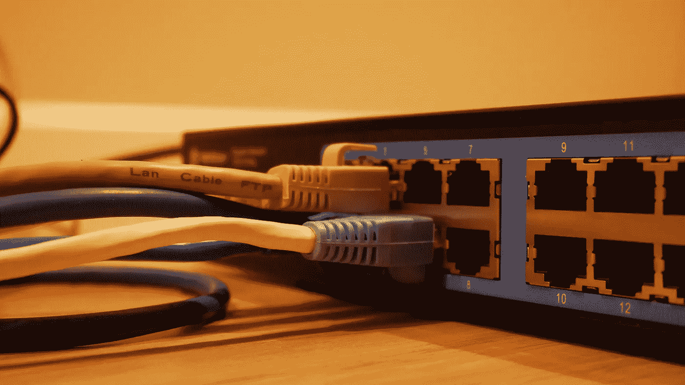
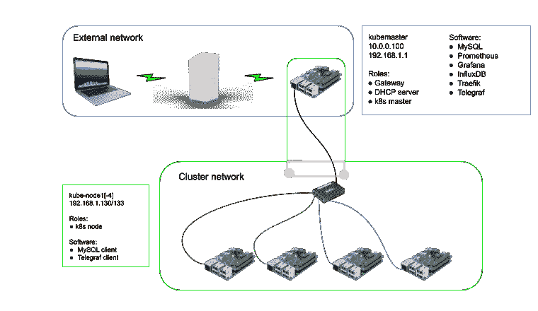
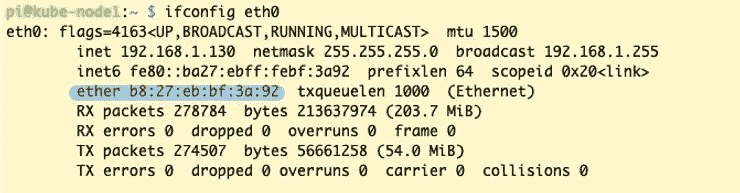
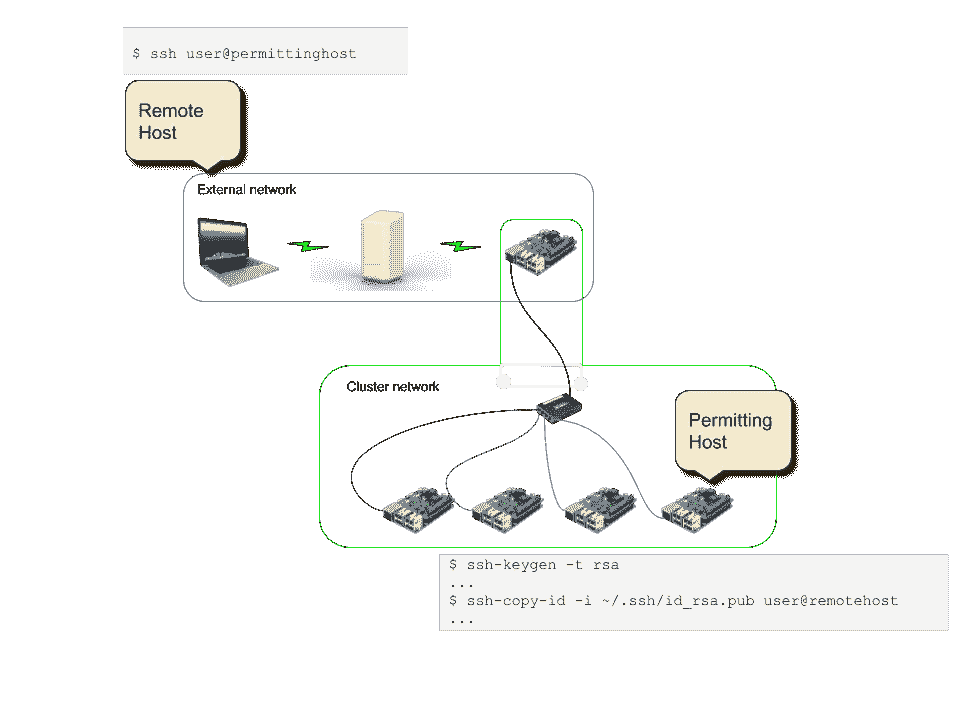
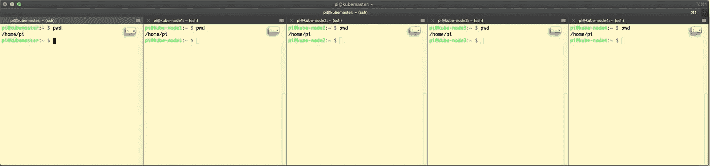
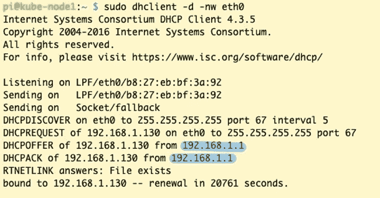

# 如何设置 Raspberry Pi 集群

> 原文：<https://betterprogramming.pub/how-to-set-up-a-raspberry-pi-cluster-ff484a1c6be9>

## **购买、安装和建立自己的数据中心所需的一切**

[乔纳森](https://unsplash.com/@isodme)在 [Unsplash](https://unsplash.com/)

这是在[在 Raspberry Pi 集群上开发和部署 Kubernetes 应用程序](https://medium.com/better-programming/develop-and-deploy-kubernetes-applications-on-a-raspberry-pi-cluster-fbd4d97a904c)中描述的系列文章的第二篇。完成本文概述的步骤后，您就可以学习如何在 Raspberry Pi 集群上安装 Kubernetes 了，这是本系列的下一篇文章。

由于本文引用了与该任务相关的几篇其他文章，您可能会发现在另一个浏览器窗口中打开它们会有所帮助，这样您就可以根据需要在它们和本文之间进行交叉引用。

本文有五个主要部分:

1.  **我的目标集群拓扑** —这一节描述了我们将在本文中构建的内容。
2.  **初始设置** —本节描述需要什么设备，如何安装操作系统，以及如何完成每个 Raspberry Pi 的初始配置。
3.  **配置网络** —本节描述了配置实际的 Raspberry Pi 集群的过程。在本节的最后，我们将有一个工作集群。
4.  **在主机之间设置无密钥 SSH 访问** —本节将介绍如何在集群的节点之间配置无密钥访问`ssh`。它还将描述如何建立到外部网络中主机的反向`ssh`隧道，以允许外部网络`ssh`中任何允许的主机访问任何允许的集群节点。这是不可能的，因为 Pi 路由器不会将 IP 流量从外部网络转发到集群网络。
5.  **设置**[**I2C shh**](https://github.com/wouterdebie/i2cssh)——本节讲述如何让多个主机同时进行终端会话。i2cssh 是一个类似于 [tmux](https://github.com/tmux/tmux/wiki) 的终端多路复用器。使用 i2cssh，您可以将命令复制到每个终端会话。如果您希望同时在多台主机上执行相同的命令，这将非常有用。

我还附上了一份我认为有用的参考资料清单。它们包括本文涉及的信息，以及支持和背景信息。

这需要一段时间。所以拿些咖啡开始吧！

# 1.我的目标集群拓扑

我的集群拓扑——图片由 HiClipart、Comcast、BlackBox 和 Cleanpng 提供

上图展示了目标集群，不包括像 MySQL 这样的软件，它将在本文中构建。下面显示和描述的细节符合我的具体配置。

我的 Pi 集群的目的是作为一种部署 Kubernetes 托管的应用程序的方式，并使这些应用程序的服务从外部网络可用和可观察。因此，我们需要具有以下功能的节点:

*   一个路由器节点，它将为部署在本质上是私有子网的 Kubernetes 工作节点提供 DHCP 和路由功能。我称之为*集群网络*。它还有两个网络接口，私有子网和公共子网各有一个。
*   Kubernetes 主节点。该节点提供所有 Kubernetes 控制和管理功能(例如，集群网络支持、自动重启功能和各种管理功能，如部署、应用程序监控和应用程序管理)。在我的拓扑中，这个节点是上述路由器的两倍。
*   一个 Kubernetes 节点，用于托管常见应用程序功能，如 Prometheus、Traefik、MySQL、Grafana、Telegraf 和 InfluxDB(由 Telegraf 使用)。这些应用程序将在后面的文章中详细介绍。
*   Kubernetes 工作节点。这些节点托管应用程序服务，并由 Kubernetes 主节点主动管理。

实际的集群拓扑是:

*   “kubemaster”是 Pi 路由器的主机名。它的角色包括上面描述的前三个，即路由器、Kubernetes 主节点和 MySQL 等常见软件应用程序的主机。它有两个网络接口。面向外部的 IP 地址是静态的，在我的家庭网络中是 10.0.0.100。它是内部静态的，集群 IP 地址是 192.168.1.1。
*   `kube-node` *n，*其中 *n* 是用于区分各个节点的唯一数字。这些是 Kubernetes 工人节点。他们还将运行 MySQL 客户端和 Telegraf 代理软件。

# 2.初始设置

本节将提供部件列表，描述操作系统安装过程，并涵盖所需的配置步骤。

正如我在本系列的第一篇文章中所述，我不会复制现成的信息。为了与这一理念保持一致，我将引用蒂姆·唐尼的《无限的力量》!我的不可阻挡的树莓 Pi Kubernetes 集群。这篇文章很好地描述了购买什么以及如何安装 Raspbian OS。

在这一节中，我将介绍他的文章的大纲，突出我们两个设置之间的任何差异。最值得注意的是，与他的方法不同，我决定推迟安装 Kubernetes，直到过程的后期。除了使用 5 对 8 个 Pi 和使用 Raspberry Pi 4B 作为 Pi 路由器之外，我们的集群是相同的。接下来的小节将介绍如何在集群中设置每个 Raspberry Pi。

## 零件清单和基本原理

除了用于 Pi 路由器的 Raspberry Pi 4B 之外，我基本上遵循了他的零件清单。我也是用这个主机作为`kube-apiserver`主机的。我最初尝试用一个树莓派 3B+来做这个，但是它的动力太弱了，无法完成`kube-apiserver`的角色。

除了 Pi 路由器(你可以从外部网络`ssh`到它)之外，我确实在所有 Pi 的初始设置期间使用了键盘和显示器。您将需要这些，因为说明假设您最初不会通过`ssh`登录到非路由器 Raspberry Pis。如果您使用 Pi 路由器来执行所有管理活动，您可以不使用键盘和显示器。不过，确定哪些 IP 地址可能需要一些工作。在这个过程的后面，您还必须禁用非路由器节点上的 Wi-Fi 访问。

## 安装 Raspbian 拉伸

我在使用蚀刻机时遇到了一些麻烦，所以我选择了一种不同的方式将操作系统映像刻录到 SD 卡上。我使用了本机 Mac 命令行工具来完成这一点，正如在 Raspberry Pi 镜像安装页面上记录的[。我发现这种方法很容易使用。我还在 Pi 4B 上安装了 Buster Lite 而不是 Stretch Lite。在我设置了初始集群之后，当 Buster Lite 出来时，pi3b 是用 Stretch Lite 设置的。](https://www.raspberrypi.org/documentation/installation/installing-images/mac.md)

由于我在 Pi 4B 上使用的是 64GB 的 SD 卡，我不得不采用不同的方法来格式化这个卡。超过 32GBs 的 SD 卡必须进行不同的格式化。我按照“Moses”在[如何将 SD 卡格式化为 FAT32 for Pi 3](https://www.ahadonline.org/how-to-format-sd-card-to-fat32-for-pi-3/) 中的说明来完成这个任务。

我还选择不执行“无头”安装，而是将键盘和显示器直接连接到 Pis，并在初始启动后对它们进行配置。我这样做是因为，在大多数情况下，我不希望任何 pi 连接到我的无线网络。我不希望发生这种情况，因为我希望将 Pi 放在一个独立的、受到某种保护的、由我的 Pi 路由器主机管理的网络上。这个规则的例外是我打算配置为路由器的 Raspberry Pi。因为它将存在于两个网络中，所以它将在我的无线网络中有一个地址。对于该主机，无线网络地址是静态分配的。

## 配置主机名并更改密码

我使用了与文章中描述的不同的主机名。有关详细信息，请参见上面的集群拓扑部分。

## 禁用交换

Tim 的文章中没有提到的一个关键项目是在集群上安装 Kubernetes 时绝对重要的。除了 Tim 文章中列出的步骤之外，如果您打算继续安装 Kubernetes，您还需要这样做:

`sudo systemctl disable dphys-swapfile`

## 给集群 pi 静态 IP 地址

我选择推迟这一步，直到我用 DHCP 配置了 Pi 路由器，为网络中剩余的 Pi 提供静态 IP 地址。这将在下一节中讨论。

## rak8S Ansible 剧本

我跳过了这一步，因为我想要从头开始安装 Kubernetes 的体验。否则会破坏我学习更多关于 Kubernetes 如何工作的目标，对我来说，包括安装过程。安装 Kubernetes 将在后面的文章中介绍。

# 3.配置网络

我前面说过，我需要提供一种方法来将我的 Kubernetes Pi 集群(集群网络)与我的家庭网络(外部网络)分开。这可以通过路由器来实现。这种类型的路由器有时也被称为网关、跳转主机、跳转箱或跳转服务器。这种能力完成了几件事。它提供:

*   一种将一组主机配置到它们自己的专用网络中的方法
*   群集的 DHCP 服务器
*   将这些主机与其他网络隔离开来。(在我的例子中，这个路由器不是特别安全，但是它确实提供了我一直在寻找的基本功能。)
*   外部网络上的主机访问集群网络上的主机的安全方式(即，通过反向`ssh`隧道)。
*   集群网络中的主机访问互联网的一种方式。安装软件(如`apt-get`)等基本管理任务需要此功能。

Tim Downey 有另一篇关于配置 Raspberry Pi 集群的优秀文章，标题为[为我的 Raspberry Pi Kubernetes 集群烘焙 Pi 路由器](https://downey.io/blog/create-raspberry-pi-3-router-dhcp-server/)。与前一部分一样，我将介绍他的文章的大纲，突出我们两个设置之间的任何差异。我还会解释他的文章中描述的一些我最初不理解的细节。

## 装备

这已经在前一节中介绍过了。

## 安装 Raspbian Linux

这已经在前一节中介绍过了。

## 家庭网络中 Pi 路由器的静态 IP

没有变化。

## 在 Pi 路由器上配置以太网接口

本节的目的是为面向集群网络的以太网接口分配一个静态 IP 地址。只需要对`/etc/dhcpcd.conf` 文件进行相对简单的更改。在[为我的 Raspberry Pi Kubernetes 集群](https://downey.io/blog/create-raspberry-pi-3-router-dhcp-server/)烘焙 Pi 路由器时，集群正在使用`10.0.0.1/8`的地址空间。由于`10.0.0.0/8`地址空间已经被我的家庭网络使用，我选择使用`192.168.1.1/24`来代替。在我的配置中，我对所有内容都采用了默认值，将静态 IP 地址分配块修改为如下所示:

依次读取每一行:

*   `interface eth0` —指定下一个模块属于`eth0`以太网接口
*   `static ip_address=192.168.1.1/24` —总的来说，我知道该行请求将地址 192.168.1.1 分配给该主机；然而，我不熟悉这个符号。原来这个符号是[无类域间路由(CIDR)](https://en.wikipedia.org/wiki/Classless_Inter-Domain_Routing) 规范的一部分。简而言之，192.168.1.1/24 指定网络地址由地址的前三个八位字节(24 位)指定，即 192.168.1。这由/24 后缀表示，它指定地址的前 24 位来标识网络。最后一个二进制八位数用于标识子网中的特定主机。标识符 1，如 192.168.1 中所示。 **1** ，是为此主机保留的。192.168.1.1/24 还规定 1 到 255 之间的所有标识符都可以分配给网络中的主机。标识符 0 由网络堆栈保留。有关 CIDR 的更多信息，请参见下面的参考资料部分。
*   这些地址引用了谷歌的公共 DNS 服务器。

## 安装 dnsmasq

来自 [dnsmasq 网站](http://www.thekelleys.org.uk/dnsmasq/doc.html):“Dnsmasq 为小型网络提供网络基础设施:DNS、DHCP、路由器广告和网络引导。”

因为我的集群使用不同的地址空间，所以我需要修改`/etc/dnsmasq.conf`文件。我的更改以红色突出显示。

*   `listen-address`指定 DHCP 服务器将监听的地址。在这种情况下，我将其设置为主机的以太网(即有线)网络地址。回想一下这是如上所述的`/etc/dhcpcd.conf` 中指定的。
*   `dhcp-range`指定用于分配的地址池的范围是 192.168.1.130 到 192.168.1.200。这个范围是任意选择的；听起来很合理。它允许网络中有多达 71 台主机，对我来说已经足够了。
*   `dhcp-host`用于为网络上的特定主机分配静态 IP 地址。为此，您需要每台主机的 MAC 地址。例如，b8:27:eb:bf:3a:92 是要分配 IP 地址 192.168.1.130 的主机的 MAC 地址。获取 MAC 地址可以按如下方式完成:

MAC 地址由突出显示的`ether`条目标识。这需要在每台通过 DHCP 分配了静态 IP 地址的主机上运行。

## 将互联网从 Wi-Fi ( `wlan0`)转发到以太网(`eth0`)

要允许从群集网络访问 internet，需要执行此步骤。我按原样使用了这一部分。

## 全部测试出来

除了通过主机名(我使用 IP 地址)进入每台机器之外，我照原样使用这个部分。

## 什么没起作用

由于以上所有部分都警告了问题以及如何避免这些问题的具体建议，所以我的安装工作正常。

## 结束语

我也有同样的建议。由于操作系统和硬件升级，这些具体步骤可能不起作用，但是找到您可能遇到的任何问题的解决方案应该相对容易。

# **4。在主机之间设置无密钥 SSH 访问**

学完本节后，您将能够轻松地在集群中的主机之间以及外部网络中的选定主机之间自由地`ssh`。本节由两个小节组成:

*   设置无密钥 SSH 访问
*   建立一个反向 SSH 隧道

## 设置无密钥 SSH 访问

本节中的一些信息摘自“[如何在 Mac OS X 和 Linux 中配置无密码登录](https://help.dreamhost.com/hc/en-us/articles/216499537-How-to-configure-passwordless-login-in-Mac-OS-X-and-Linux)”请务必注意，这些步骤是定向的，即它们提供从特定主机到远程主机的无钥匙访问，例如，从您正在执行这些步骤的群集主机到远程主机。

主机用户的公钥被复制到远程主机。在复制过程中`ssh-copy-id`，需要完成对远程主机的正常认证过程。复制完成后，被复制的公钥现在被认为是经过验证的。有关无钥匙访问期间如何使用公钥/私钥的更多信息，请参见“[了解 SSH 连接和加密过程](https://www.digitalocean.com/community/tutorials/understanding-the-ssh-encryption-and-connection-process)”

从允许访问的主机，步骤如下:

1.  `ssh-keygen -t rsa` —这将生成一个私钥/公钥对。如果已经有了公钥/私钥对，可以跳过这一步。

密钥对用于在 SSH 会话中涉及的主机之间提供相互身份验证。`-t`指定生成的密钥类型为 [RSA](https://en.wikipedia.org/wiki/RSA_(cryptosystem)) 。

会有几个提示。第一个是生成对的位置/名称。默认为`~/.ssh/id_rsa`和`~/.ssh/id_rsa.pub`(公钥)。如果您更改了这些名称，请在使用这些名称的地方替换您用于`~/.ssh/id_rsa`的名称。

接下来的提示将是输入密钥的密码。如果您不想在每次`ssh`进入远程主机时都必须输入密码，请使用默认值(本节的目的是避免输入密码)。注意:空密码被认为是一种安全风险，但是在某些情况下，比如这个，是可以接受的。

下面的要点展示了一个`ssh-keygen`的例子:

创建公钥/私钥对

2.`ssh-copy-id -i ~/.ssh/id_rsa.pub user@remotehost` —这将把公钥(在本例中为`id_rsa.pub`)复制到远程主机。

在我们的集群中，您将能够从集群网络中的主机`ssh-copy-id`到外部网络中的主机，但是您还不能从外部网络中的主机`ssh` 或`ssh-copy-id`到集群网络中的主机。下一步“设置反向 ssh 隧道”实现了这一点。

对网络中要启用无钥匙访问的每台主机重复上述步骤。请注意，远程主机也可以位于群集网络中。

下面是上述内容的图示说明:

## 建立一个反向 SSH 隧道

拥有从集群主机到外部网络中主机的反向 SSH 隧道非常有用，几乎是强制性的。我从我的 MacBook 上完成所有的集群配置。从 Pi 路由器可以做到这一点，但是远没有这么方便，尤其是如果您想要多个`tmux`或`i2cssh`窗口进入集群。

前一步**设置无钥匙 SSH 访问**，是这一步的先决条件。您必须已经创建了密钥，并将其从许可主机发送到外部网络上的远程主机。我的集群中允许的主机是`kube-node1`到`kube-node4`。在我的网络上，外部网络上的主机位于外部网络上的`10.0.0.223`。

以下部分信息摘自“[启动时自动刷新](http://jhshi.me/2016/08/24/start-autossh-on-boot/index.html#.Xmq6xy2ZPVv)”

步骤如下:

1.  `sudo apt-get install autossh`。`autossh`是一个工具，它将建立一个已配置的反向 ssh 隧道。`autossh`还将监控隧道，并在隧道出现故障时重新建立隧道。这一步将`autossh`安装到树莓派上。可以配置`autossh`在启动时设置隧道。这是我们接下来要做的。
2.  编辑您的`/etc/rc.local`文件，添加以下行(适当修改):

`autossh -o StrictHostKeyChecking=no -i /home/pi/.ssh/id_rsa -fN -R <port>:localhost:22 <user>@<remotehost>`

下面是上面一行指定的内容:

*   `-o`标志用于指定没有命令行模拟的配置选项。`-o StringHostKeyChecking=no`指示`autossh`忽略`~/.ssh/known_hosts`文件，即，即使主机不在`known_hosts`中也要连接。更多细节参见 Debian [SSH_CONF](https://manpages.debian.org/stretch/openssh-client/ssh_config.5.en.html) 和 [SSH](https://manpages.debian.org/buster/openssh-client/ssh.1.en.html) 主页。
*   `-i`告诉`autossh`在哪里可以找到密钥文件。
*   `-f`指示`autossh`在后台运行。
*   `-N`告诉`autossh`没有命令要在远程主机上运行，只有建立隧道。
*   `-R`是转发规范。在上面的命令中，`<port>:localhost:22`中的`<port>` 指定远程主机上的哪个端口用于隧道。`<port>:localhost:22`中的`localhost:22`指示`autossh`使用端口 22 终止该主机上的连接。

在我的集群主机上，我使用以下代码:

`autossh -o StrictHostKeyChecking=no -i /home/pi/.ssh/id_rsa -fN -R 13003:localhost:22 rich_youngkin@10.0.0.223`

端口`13003`是任意的。它可以是远程主机上任何未使用的端口，通常在`1024`以上。把它记下来，因为一会儿会用到它。重启主机，确保`autossh`按预期启动。要验证隧道是否如预期的那样工作，在远程主机上(在我的例子中是我的 MacBook,`10.0.0.223`),运行:

`ssh pi@localhost -p 13003`

`-p`指定反向隧道使用的端口。(注意:使用`localhost`是因为我们使用当前主机(本地主机)上的隧道端口，通过隧道端口`13003`连接到远程主机。)

系统会提示您输入密码。什么？这样做的目的是不需要密码就可以`ssh`！嗯，我们还没有将外部网络中主机的公钥复制到集群网络中的主机。我们不能这样做，因为我们还没有两个网络之间的连接。反向隧道让我们可以做到这一点。现在，我们可以实现从外部主机到集群网络的无钥匙访问:

`ssh-copy-id -i ~/.ssh/id_rsa.pub pi@localhost -p <tunnelPort>`

在这一部分中，隧道端口是`13003`，因此命令将是:

`ssh-copy-id -i ~/.ssh/id_rsa.pub pi@localhost -p 13003`

现在`ssh`进入集群主机。如果一切顺利，就不会提示您输入密码。

`ssh pi@localhost -p 13003`

对要启用`autossh`的每个集群主机重复这些步骤。您需要为每个集群主机选择不同的隧道端口(例如，`kube-node1`、`kube-node2`)。这是因为外部网络上的主机，例如我在`10.0.0.223`的 MacBook，对于它将`ssh`进入的每个集群主机，需要有一个唯一的隧道端口号。在我的配置中，我使用 MacBook 上的端口`13000`到`13003`。比如说:

*   在`kube-node1`上，我在`autossh`命令中指定端口`13000`。在`kube-node2`上，我指定了端口`13001`。在`kube-node3`上，我指定端口`13002`。诸如此类。

为了简化我的生活，我做的另一件事是配置我的`~/.ssh/config`,允许我使用快捷方式进入其他主机的`ssh`。具体来说，它提供了反向隧道上`ssh`g 的简写。这是我的`~/.ssh/config`文件:

以第一个条目`Host master ...`为例，下面是每行的含义:

*   `Host` —这是以下规范的别名。
*   `Hostname` —这是本地主机要连接的 IP 地址。
*   `Port` —这是远程主机上的端口号。通常，这是端口 22，标准的`ssh`端口和我们在上面的`autossh`命令中指定的端口。
*   `User` —这是用于登录的用户。

以下是你如何用它来代替`ssh pi@localhost -p 13004`:

`ssh pi-node1`

就是这样。

# 5.设置 i2cssh

这一步将使您能够同时向几台主机打开终端会话。使用 [i2cssh](https://github.com/wouterdebie/i2cssh) ，您可以选择将您键入的命令复制到每个终端窗口，或者您可以将焦点隔离到单个终端窗口。设置 i2cssh 并不是绝对必要的，但是我想您会发现它很有用。

在我的 MacBook 上，我用的是带[I2C shh](https://github.com/wouterdebie/i2cssh)的 [iTerm2](https://iterm2.com/) 。iTerm2 可以从[网站](https://iterm2.com/)下载，并像任何 Mac 应用程序一样安装。要安装 i2cssh:

`gem install i2cssh`

上面的命令假设 Ruby 已经安装在您的 Mac 上，它应该已经安装了。如果不是的话，你可以用[自制软件](https://brew.sh/)来安装。如果你不熟悉家酿啤酒，你应该花时间去了解它。这是在 Mac 上开发软件所必需的。

要启动 i2cssh 会话，使用我们之前设置的`~/.ssh/config`,输入:

`i2cssh -m master,node1,node2,node3,node4 -p Rich -C 5 -b`

以下是上述命令中每一项的含义:

*   `-m` —指定要连接的主机的逗号分隔列表
*   `-p` —指定要使用的 iTerm2 概要文件。在本例中，我有一个名为`Rich`的 iTerm2 概要文件。这个简介最突出的特点就是有一个黄色的背景，如下图所示。
*   `-C` —指定用于终端显示的列数。上面的命令打开了五个主机的会话，表明我选择了每个主机一列。
*   `-b` —指定启动从`stdin`(即键盘)输入的会话“广播”。这会导致命令同时输入到所有终端会话中。通过`cmd-shift-i`可以打开/关闭“广播”模式。

生成的会话的这个(非常小的)图像显示了结果。它还显示了在“广播”模式下，在每个终端会话中同时运行`pwd`的结果。

由于我不喜欢打字，我为此设置了一个 shell 别名:

`alias csshall=”i2cssh -m master,node1,node2,node3,node4,pi-node1 -p Rich -C 6 -b”`

# 结论

咻，那可太多了。但是我们现在有了一个完全配置好的 Raspberry Pi 集群。我们完成了以下工作:

1.  执行每个树莓 Pi 的初始设置。这包括安装操作系统和设置主机名。
2.  已配置网络。这包括设置 DHCP，这样集群节点将获得 Pi 路由器分配的静态 IP 地址(本文中的`kubemaster`)。
3.  设置对所有节点的无钥匙访问，包括集群网络中的主机和外部网络中的主机之间的反向 SSH 隧道。
4.  安装和设置 i2cssh，一个终端多路复用器。

# 参考

这些是我用来初始设置 Raspberry Pi 主机以及将这些主机配置到集群中的主要参考资料。

*   [无限力量！我的不可阻挡的树莓派 Kubernetes 集群](https://downey.io/blog/how-to-build-raspberry-pi-kubernetes-cluster/)
*   [为我的树莓酱烤一个圆饼路由器](https://downey.io/blog/create-raspberry-pi-3-router-dhcp-server/)T7

这些参考资料包含了有关 Raspberry Pi 初始配置的其他资料:

*   [Raspberry Pi 基础知识:安装 Raspbian 并启动运行](https://www.howtoforge.com/tutorial/howto-install-raspbian-on-raspberry-pi/)
*   [将 Raspbian Buster Lite 安装到您的树莓 Pi 中](https://peppe8o.com/2019/07/install-raspbian-buster-lite-in-your-raspberry-pi/)

这些参考资料与设置群集的网络方面相关:

*   [将 Raspberry Pi 配置为无线接入点](https://www.raspberrypi.org/documentation/configuration/wireless/access-point.md) —本文档提供了将 Pi 设置为路由器时有用的背景信息。
*   [构建 Raspberry Pi Kubernetes 集群—第 1 部分—路由](https://www.shogan.co.uk/kubernetes/building-a-raspberry-pi-kubernetes-cluster-part-1-routing/) —这篇文章与我作为本文基础的 Tim Downey 的文章非常相似。但是，还有一些附加信息。它也是一个系列的一部分，与这个系列有一些重叠。
*   来自维基百科的基本 CIDR 概述 —这是对无类域间路由的一个很好的概述。
*   [网络配置](https://wiki.archlinux.org/index.php/Network_configuration) —一般网络配置文档，包括 DHCP 配置。这对我更好地理解网络配置以及`/etc/dhcp.conf` 文件的内容非常有用。
*   [DHCP 概述](https://en.wikipedia.org/wiki/Dynamic_Host_Configuration_Protocol) —这是对 DHCP 的一个很好的概述。我特别喜欢关于发现和分配消息交换的部分，因为我遇到了地址分配不起作用的问题。这帮助我解决了我的问题(我追踪到我的以太网集线器，重启它解决了问题)。
*   [如何定位 DHCP 服务器](https://www.putorius.net/find-dhcp-server-ip-linux.html) —本参考介绍了几种在网络上定位 DHCP 服务器的技术。我发现这在故障诊断中很有用(正如我在前面提到的)。对于 Raspbian，此命令显示了客户端和服务器之间的消息交换，用于 DHCP 发现和分配。在我的例子中，`DHCPDISCOVER`请求失败了。顺便提一下，`DHCPDISCOVER`消息被广播到整个子网。根据标准，DHCP 服务器将监听端口 67，因此只有监听该端口的主机才会响应。注意在下面的交换中，正如所料，我的 IP 地址为 192.168.1.1 的 DHCP 服务器响应如下:

这些参考资料涵盖了无密钥 SSH 访问和反向 SSH 隧道:

*   [如何在 Mac OS X 和 Linux 中配置无密码登录](https://help.dreamhost.com/hc/en-us/articles/216499537-How-to-configure-passwordless-login-in-Mac-OS-X-and-Linux) —这涵盖了无需提供密码即可通过 SSH 登录主机所需的信息(无钥匙访问)。
*   [在引导时启动 AutoSSO](http://jhshi.me/2016/08/24/start-autossh-on-boot/index.html#.Xmq6xy2ZPVv)—这包括在引导时自动建立 SSH 反向隧道所需的信息。
*   [SSH 跳转主机](https://wiki.gentoo.org/wiki/SSH_jump_host) —这描述了建立反向 SSH 隧道以访问另一个子网中的主机的替代方案。我没有选择在我的集群中这样做，但这是一个选项。这种方法的优点之一是，与我描述的方法相比，它相对简单。我的方法的优点是，可以说它更安全。
*   使用 SSH 配置文件简化您的生活——这涵盖了您可以定制您的`~/.ssh/config`文件的各种方式。我用它来配置我的`ssh`命令的快捷方式。
*   [I2C shh](https://github.com/wouterdebie/i2cssh)和 [iTerm2](https://iterm2.com)