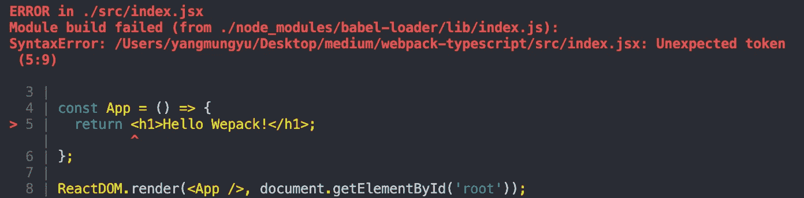
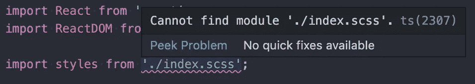
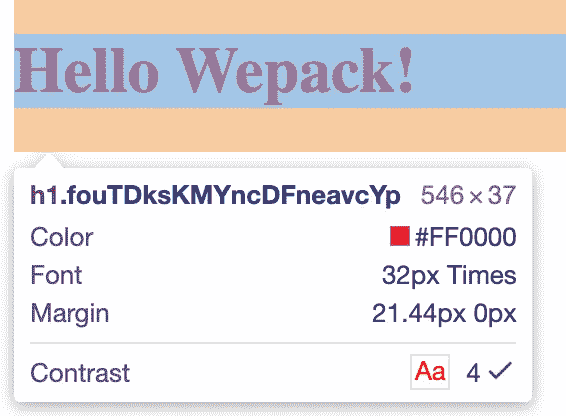

# 如何使用 Webpack、TypeScript 和 Sass 设置 React 项目

> 原文：<https://betterprogramming.pub/how-to-set-up-a-react-project-using-webpack-typescript-and-sass-74914421158a>

## 超越创建 React 应用


[Artem Sapegin](https://unsplash.com/@sapegin?utm_source=medium&utm_medium=referral) 在 [Unsplash](https://unsplash.com?utm_source=medium&utm_medium=referral) 上拍照

当我需要制作一个项目时，我总是使用[创建-反应-应用](https://github.com/facebook/create-react-app) (CRA)。我需要制作另一个 React 项目，但这一次我不想使用 CRA。我被许多问题困住，花了很多时间才解决。所以，让我告诉你我做了什么，我是怎么熬过来的。

## 先前阅读

如果你不知道什么是 Webpack，请访问官方 Webpack 网站。

# 反应项目设置

首先，您需要为 Webpack 或 React 安装一些包。

```
npm i -D webpack webpack-cli @babel/core @babel/preset-env @babel/preset-react babel-loadernpm i -S react react-dom
```

Webpack 是 JavaScript、CSS 和 HTML 文件的代码捆绑器。它通过将所有内容放入几个文件中来减小项目的大小。

```
touch webpack.config.js
```

现在，为 Webpack 创建配置文件。一旦您运行该程序，Webpack 将自动使用它。

```
const path = require('path');module.exports = {
  entry: path.resolve(__dirname, 'src', 'index.jsx'),
  output: {
    filename: 'bundle.js',
    path: path.resolve(__dirname, 'dist')
  },
  mode: "development",
  resolve: {
    extensions: ['.js', '.jsx']
  },
  module: {
    rules: [
      {
        test: /\.jsx?$/,
        use: ['babel-loader']
      }
    ]
  }
};
```

*   【Webpack 开始工作时首先使用的文件。
*   `output` —由 Webpack 进程导出的文件。
*   `resolve.extensions`—web pack 使用的文件扩展名。
*   【Webpack 在处理文件时将使用的规则。

在采用 TypeScript 之前，我们将检查 Webpack 是否能够识别 React 文件。

```
mkdir src dist
touch src/index.jsx
```

并将这段代码写入`index.jsx`:

```
import React from 'react';
import ReactDOM from 'react-dom';const App = () => {
  return <h1>Hello Wepack!</h1>;
};ReactDOM.render(<App />, document.getElementById('root'));
```

这是简单的第一个 React 组件，它打印“Hello Webpack！”。您需要使用`react-dom`将 React 组件挂钩到 HTML 文件中。但是我们还没有任何 HTML 文件。

```
npm i -D html-webpack-plugin html-loadermkdir public
touch public/index.html
```

要使 Webpack 识别并使用该文件，请在`webpack.config.js`中添加更多信息:

并在`package.json`中添加脚本。

```
"scripts": {
  "build": "webpack"
}
```

如果运行该脚本，您将看到以下错误:



Webpack 给你一个错误，但是为什么呢？

这是因为你没有让 Babel 知道应该使用什么插件来将你的 React 代码转换成普通的 JavaScript 代码。

```
touch .babelrc
```

将此内容写入`.babelrc`:

```
{
  "presets": ["@babel/preset-env", "@babel/preset-react"]
}
```

让你使用最新的 JavaScript，而不必为该用什么插件而头疼。`@babel/preset-react`是一个插件，可以解释 JSX 语法并将其转换成 JavaScript DOM 语法。

你应该记住的一件事是，Babel 从右向左读取“预置”配置。所以，React JSX 应该先被`@babel/preset-react`转换成 DOM 语法，然后再被`@babel/preset-env`转换成合适的 JavaScript 版本。

```
npm i -D webpack-dev-server
```

现在，让我们看看代码是否能成功运行。安装允许您在开发服务器中运行代码的包。将此添加到`webpack.config.js`:

```
module.exports = {
  ...,
  devServer: {
    contentBase: path.resolve(__dirname, 'dist'),
    port: 8888
  }
}
```

为了更方便地运行 dev 服务器，添加新脚本:

```
// package.json"scripts": {
  ...,
  "dev": "webpack-dev-server --open"
}
```

现在，如果您运行该脚本，您的代码应该在端口 8888 上运行良好。

```
npm run dev
```


代码应该会成功运行

# 使用 SASS

现在，是时候在项目中采用 SASS 了。为此，您应该为 SASS 安装合适的加载程序。

```
npm i -D style-loader css-loader sass-loader node-sass
```

*   `style-loader` —将 CSS 注入 DOM
*   `css-loader` —获取 CSS 文件并返回带有`imports`和`url(...)`的 CSS 用于 Webpack
*   `sass-loader` —获取萨斯/SCSS 文件并编译成 CSS
*   `node-sass` —您需要这是加载 SCSS 文件所需的软件包

并将此添加到您的`webpack.config.js`:

如果您想使用带有 SASS 的模块系统，在`options`属性中添加`modules: true`将允许您使用它。

创建 SASS 文件。

```
touch src/index.scss
```

这很简单:

```
// index.scss
.title { 
  color: red;
}// index.jsx
...
import styles from './index.scss';
```

您需要做的就是将它添加为 DOM 的类名:

```
<h1 className={styles.title}>Hello Webpack!</h1>
```

现在你可以看到颜色改变了:


颜色变了

# 使用类型脚本

为 Webpack 安装 Typescript 及其加载程序。

```
npm i -D typescript ts-loader @types/react @types/react-dom
```

使用 TypeScript 在`webpack.config.js`中有一些变化。

首先，您应该为`.jsx`更换加载器。

```
{
  test: /\.tsx?$/,
  use: ['ts-loader']
}
```

`.jsx` → `.tsx`和`babel-loader` → `ts-loader`。

其次，更改扩展名:

```
resolve: {
  extensions: ['.js', '.ts', '.tsx']
}
```

`['.js', '.jsx']` → `['.js', '.ts', '.tsx']`

您应该仍然需要`'.js'`以便 Webpack 能够识别传输的 JavaScript 文件。

最后，改变入口点:

```
entry: path.resolve(__dirname, 'src', 'index.tsx')
```

`'index.jsx'` → `'index.tsx'`

并将文件名改为`index.tsx`。

那么您会遇到以下错误:



这是因为你项目中的 TypeScript 不知道`index.scss`在哪里。您可以简单地通过创建 TypeSciprt 的配置文件和一点额外的设置来解决这个问题。

```
touch tsconfig.json
```

TypeScript 自动从项目的根目录中查找`tsconfig.json`，除非您指定它的位置。

创建一个新文件夹，并在其中创建一个文件。

```
mkdir src/typings
touch src/typings/scss.d.ts
```

`scss.d.ts`是一个类型化文件。TypeScript 可以阅读并理解它还应该记住什么类型。

```
// scss.d.ts
declare module '*.css' {
  const content: { [className: string]: string; };
  export default content;
}declare module '*.scss' {
  const content: { [className: string]: string; };
  export default content;
}
```

现在，你会看到错误消失了。现在运行服务器，看看结果是否相同。

# 奖金-散列类名

在开发模式下，将 CSS 类名转换成散列字符串会很不方便。



哈希字符串总是妨碍您的工作

实际上，您可以告诉 Webpack 不要为 CSS 创建散列名称。

将`webpack.config.js`中`css-loader`的`module`部分修改如下。

```
{
  loader: 'css-loader',
    options: {
      modules: {
        localIdentName: '[local]'
      }
    }
}
```

现在您将看到非散列字符串。


现在好多了！

# 结论

我已经向您展示了我是如何练习使用 Webpack 设置 TypeScript + React 项目的。轮到你自己试一试了。

这是我的 Github 库。如果你愿意，你可以自由地叉这个。

[](https://github.com/moonformeli/TypeScript_Webpack_boilderplate) [## moonformeli/TypeScript _ web pack _ boilerdplate

### 此时您不能执行该操作。您已使用另一个标签页或窗口登录。您已在另一个选项卡中注销，或者…

github.com](https://github.com/moonformeli/TypeScript_Webpack_boilderplate) 

# 资源

*   [Webpack 官方文档](https://webpack.js.org/concepts/)
*   [HTML-webpack-plugin](https://webpack.js.org/plugins/html-webpack-plugin/#root)
*   [巴别预设环境](https://babeljs.io/docs/en/babel-preset-env#docsNav)
*   [巴别塔-预设-反应](https://babeljs.io/docs/en/babel-preset-react#docsNav)
*   [装订机](https://www.npmjs.com/package/style-loader)
*   [css 加载器](https://www.npmjs.com/package/css-loader)
*   [sass-loader](https://www.npmjs.com/package/sass-loader)
*   [如何避免创建哈希 CSS 名称](https://stackoverflow.com/questions/47052080/how-to-set-css-name-not-to-be-hash-in-webpack-configuration-file)