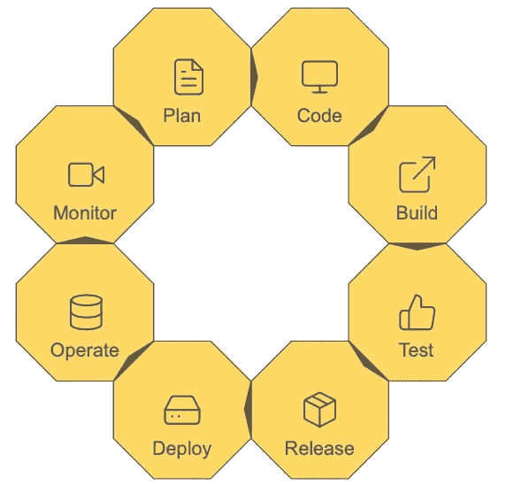

# 如何建立稳固的 DevOps 生命周期

> 原文：<https://betterprogramming.pub/how-to-set-up-a-solid-devops-lifecycle-e3bd1456201>

## 了解 DevOps 生命周期的不同阶段以及要使用的工具

[布莱恩·何](https://unsplash.com/@sirmatt279?utm_source=medium&utm_medium=referral)在 [Unsplash](https://unsplash.com?utm_source=medium&utm_medium=referral) 上拍照

DevOps 是一套结合了 IT 开发和运营的实践。它主要是为了减少提交变更和变更投入生产之间的时间。这些实践促进了开发人员和操作工程师之间的协作，因此支持连续的软件交付，减少了要解决的复杂挑战，并且更快地解决了出现的问题。

DevOps 生命周期可分为多个阶段:

按作者分列的数字

DevOps 实践允许团队管理整个软件开发周期，包括开发、测试、部署和操作。它由不同的阶段组成，例如持续开发、持续集成、持续部署和持续监控。

# 发展

## 持续发展

持续开发包括软件的规划和编码。

**计划**

规划阶段包括在实际编码开始之前发生的所有活动。通常，软件公司已经根据他们的产品愿景和客户反馈制定了产品路线图。路线图可以分为史诗、特性和用户故事。用户故事解释了功能、利益相关者和预期输出。DevOps 团队通常会记录产品路线图，并使用软件工具为每个用户故事设置重要性和预测的实现时间。

流行的代码规划工具:

*   [吉拉](https://www.atlassian.com/software/jira)
*   [Azure DevOps](https://azure.microsoft.com/en-ca/services/devops/)
*   [体式](https://asana.com/)

**代码**

对于编码，有许多不同的编码语言和 ide 可以使用。IDE 代表*集成开发环境*，通常包括源代码编辑器、构建自动化工具和调试器。一些最流行的编码语言包括 Python、Java 和 JavaScript。

为了维护代码，使用版本控制工具是很常见的，比如 [Git](https://git-scm.com/) 、 [GitHub](https://github.com/) 和 [Bitbucket](https://bitbucket.org/product) 。这些工具还广泛用于促进开发和运营团队之间的沟通，并且对于确保 DevOps 团队内部的沟通至关重要。

流行的 ide:

*   [PyCharm](https://www.jetbrains.com/pycharm/)
*   [Visual Studio](https://visualstudio.microsoft.com/)
*   [月食](https://www.eclipse.org/ide/)

## 连续测试

持续测试是构建代码并持续测试 bug 的阶段。

**构建**

构建代码包括生成可执行文件所需的所有步骤。其中最重要的一个过程是编译代码，也就是将源代码转换成机器码。通常作为构建代码一部分的其他过程正在执行测试(例如，单元测试、集成测试等)。)、打包、运行状况检查和生成报告。

流行的构建工具:

*   [蚂蚁](https://ant.apache.org/)
*   [美文](https://maven.apache.org/what-is-maven.html)

**测试**

在 DevOps 团队构建代码之后，代码通常被部署到一个阶段环境中。这里执行一组手动和自动测试。自动化测试可以通过使用 Selenium、TestNG 或 JUnit 等工具来完成，而 Docker 容器通常用于模拟测试环境。詹金斯是一个持续集成工具，可以自动化整个测试过程。

流行的测试自动化工具:

*   [硒](https://www.selenium.dev/documentation/en/introduction/on_test_automation/)
*   [TestNG](https://testng.org/doc/)
*   [朱尼特](https://junit.org/junit5/)

# 持续部署

当构建并彻底测试代码时，就可以发布并部署到生产环境中了。

## 释放；排放；发布

发布是 DevOps 生命周期中代码准备部署的阶段。此时，代码已经通过了一组手动和自动测试，团队应该确信在部署到生产环境时不会出现任何问题。

根据使用的工具和设定的原则，一些组织在发布阶段增加了手动批准过程。这样做是为了只允许组织中的某些人授权发布到生产中。

流行的发布管理工具:

*   [BMC 发布流程](https://docs.bmc.com/docs/display/public/brpm50/Home?key=brpm50)
*   [CA 发布自动化](https://techdocs.broadcom.com/us/en/ca-enterprise-software/intelligent-automation/release-automation-nolio/6-6.html)
*   [微焦点发布](https://www.microfocus.com/en-us/products/release-control/overview)

## 部署

部署是将变更从一个环境推到另一个环境的过程。这通常是在将构建推向生产时使用的一个短语。一旦部署了构建，就可以在实时生产环境中查看更改。

流行的部署工具:

*   詹金斯
*   [团队合作](https://www.jetbrains.com/teamcity/)
*   [AWS 代码部署](https://aws.amazon.com/codedeploy/)

# 操作

## 操作

当代码被部署到生产环境中时，确保一切按预期运行是很重要的。此外，运营团队通常进行技术和基础设施管理，并与客户互动，以确保产品满足他们的需求。在进一步开发产品时，客户洞察力也是至关重要的，在规划阶段就应该考虑到这一点。

流行的 ITOM 工具:

*   [管理引擎 OpManager](https://www.manageengine.com/network-monitoring/)
*   [轴囊](https://www.axiossystems.com/)

## 连续监视

**监视器**

在监控阶段，这是 DevOps 生命周期的最后一个阶段，DevOps 团队监控解决方案。这包括收集关于客户行为、表现、错误等的数据。分析数据以获得洞察力，然后用于支持决策。

当 DevOps 团队重新开始 DevOps 生命周期时，在运营阶段收集的所有信息和见解都至关重要。对于 DevOps 团队来说，通常没有开始或结束，而是产品的持续发展。

流行的基础设施监控工具:

*   [全天候现场基础设施监控](https://www.site24x7.com/server-monitoring.html)
*   [Xi 纳吉奥斯](https://www.nagios.com/products/nagios-xi/)

# CI/CD

CI/CD 包括持续集成和持续交付或持续部署。

持续集成是提交、构建和测试代码的过程。这是 DevOps 生命周期的核心。开发人员被鼓励经常提交代码，并且每次提交都考虑到问题的早期检测。Jenkins 是持续集成最常用的工具之一。

持续交付是持续集成的延伸。除了提交、构建和测试代码，它还包括将代码变更部署到测试和/或生产环境中。值得注意的是，部署到生产环境是一个手动阶段，其他大部分阶段都是自动化的。

持续部署比持续交付更进一步。对于连续部署，生产部署也是自动化的。

按作者分列的数字

[1]阿文德。" [DevOps 生命周期:关于 DevOps 生命周期阶段](https://www.edureka.co/blog/devops-lifecycle/)你需要知道的一切"(2020 年 11 月)。

【2】[devo PS 管道的八个阶段](https://medium.com/u/b9cadad613a1#id_token=eyJhbGciOiJSUzI1NiIsImtpZCI6IjEzZThkNDVhNDNjYjIyNDIxNTRjN2Y0ZGFmYWMyOTMzZmVhMjAzNzQiLCJ0eXAiOiJKV1QifQ.eyJpc3MiOiJodHRwczovL2FjY291bnRzLmdvb2dsZS5jb20iLCJuYmYiOjE2MTY5MjU5NDIsImF1ZCI6IjIxNjI5NjAzNTgzNC1rMWs2cWUwNjBzMnRwMmEyamFtNGxqZGNtczAwc3R0Zy5hcHBzLmdvb2dsZXVzZXJjb250ZW50LmNvbSIsInN1YiI6IjEwODY0MzM5NDkyOTQ4NDIxNTgzMyIsImVtYWlsIjoiY2hyaXMudmVyZGVuY2VAZ21haWwuY29tIiwiZW1haWxfdmVyaWZpZWQiOnRydWUsImF6cCI6IjIxNjI5NjAzNTgzNC1rMWs2cWUwNjBzMnRwMmEyamFtNGxqZGNtczAwc3R0Zy5hcHBzLmdvb2dsZXVzZXJjb250ZW50LmNvbSIsIm5hbWUiOiJDaHJpcyBWZXJkZW5jZSIsInBpY3R1cmUiOiJodHRwczovL2xoMy5nb29nbGV1c2VyY29udGVudC5jb20vYS0vQU9oMTRHaWVBNjRYd2hsX2xWNlNqMWJVMWJnT0s5VDdjYWZjYUxOUXpDYU89czk2LWMiLCJnaXZlbl9uYW1lIjoiQ2hyaXMiLCJmYW1pbHlfbmFtZSI6IlZlcmRlbmNlIiwiaWF0IjoxNjE2OTI2MjQyLCJleHAiOjE2MTY5Mjk4NDIsImp0aSI6IjVmNDBlNTljMjNhNTU3OGFmN2YzYjkzZDM4N2MzZjBjYmNiOTdlNzUifQ.lcfU5R01Watgw4u_5ZLu7HY0JiAtalVOlR4I2VSzjBY7UM1wG-P-BgRu5iNzvOm6ZsV2xGmURhBWwiTyHTJQrcgt4DqWK9wrwvt56Lyv-OYg7_iTq_MEKQrBFtvKRuvVCEev_xzOUFDW5JnjwF7r5IHgTIwyeENco1caBj4MjGAXMNoxXaEKfOuM1nkV3vjmH94lzu_sIlM6cPk1Shg-XIRSknzHc244CCv7zXY4JtJr6mC20dlopevp3_9w7ms-FsS3-v4ZCmgqBspcSmQFwQT9F_9_IpVtBUOsy9jwcK1uIYT_tBmtuLB_yC0SdG-44dYpbisXZw9C2oqg87E0Zg)"(2019 年 7 月)。