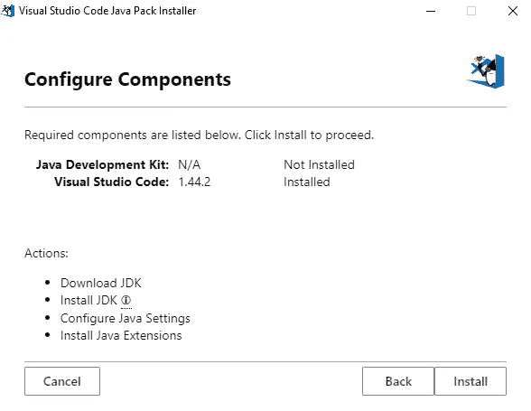
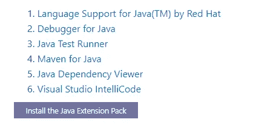
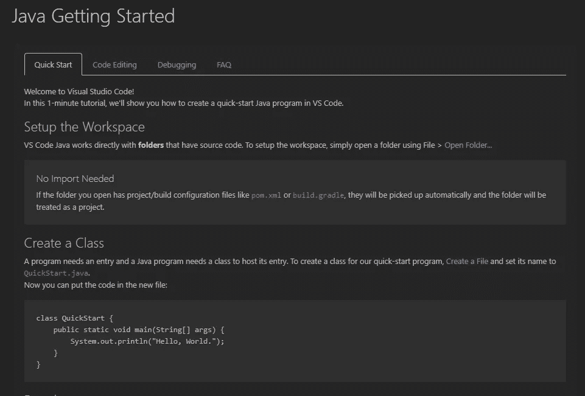
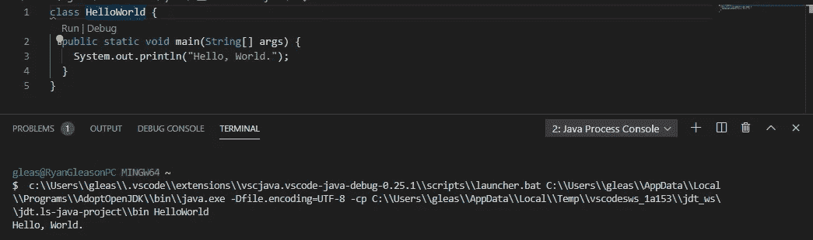
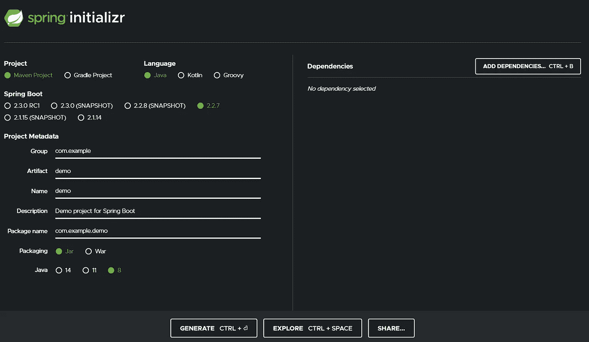
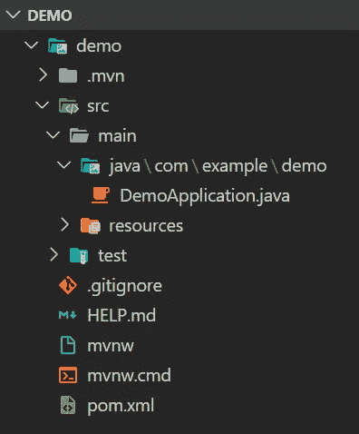
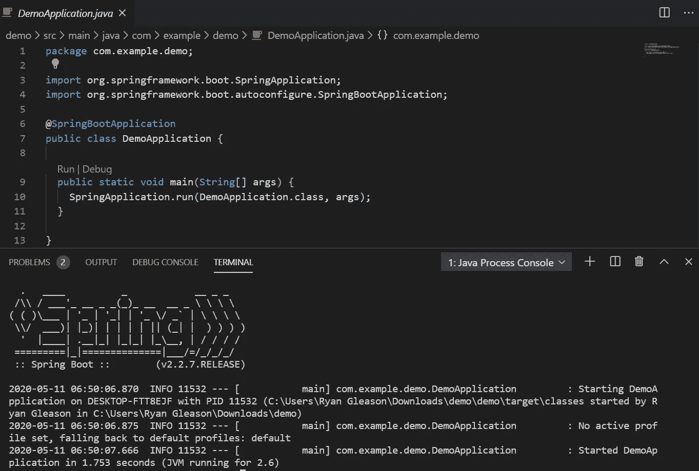

# 如何在 VS 代码中设置 Spring Boot 项目

> 原文：<https://betterprogramming.pub/how-to-set-up-a-spring-boot-project-in-vs-code-b0ca013c66fb>

## 在 5 分钟内设置好您的新项目


不是这种春天！阿诺·斯密特在 [Unsplash](https://unsplash.com/s/photos/spring?utm_source=unsplash&utm_medium=referral&utm_content=creditCopyText) 拍摄的照片。

# 目标

在设置好本地开发环境之后，启动一个简单的 [Spring Boot](https://spring.io/projects/spring-boot) 应用程序。

我们将尽可能保持简短。您将能够在不到五分钟的时间内在 VS 代码环境中启动并运行一个 Spring 服务器。

这些是我们将要安装的工具:

*   Visual Studio 代码
*   Java 开发工具包(JDK)
*   增强我们环境的 Java 扩展

我们开始吧！

# 下载 VS 代码

从 [Visual Studio 代码](https://code.visualstudio.com/)下载稳定版本。

这是一个非常简单的下载。微软在简化这个应用程序的安装过程方面做得很好。

# 下载 Visual Studio 代码 Java 包安装程序

这个过程已经自动化，你不会相信。

我们将导航到[页面](https://code.visualstudio.com/docs/languages/java)，然后向下滚动到您看到的“下载 Visual Studio 代码 Java 包安装程序”的位置

这个安装程序将处理所有 Java 相关的包，这些包是您开始 Java 开发所必需的。



点击“安装”按钮，这将需要几秒钟来完成。

# 安装 Java 扩展包

一旦安装了 JDK，我们就可以安装扩展包了。这些工具将增强我们的项目。他们增加了自动完成、依赖查看器、Maven 支持、调试器、测试运行器等功能。

在我们刚刚访问的 [VSCode 站点](https://code.visualstudio.com/docs/languages/java)上，向下滚动直到您看到以下内容:



单击“安装 Java 扩展包”按钮。

# 你好世界

成功安装此扩展包后，您将看到如下所示的屏幕:



我们将按照说明创建一个新文件。在这个文件中，我们将放入以下代码:

```
class HelloWorld {
  public static void main(String[] args) {
    System.out.println("Hello, World.");
  }
}
```

当您单击“Run”按钮(或按 F5)时，您应该在控制台中看到以下输出:



注意:如果你的路径上有一个空格(例如`C:\Users\Ryan Gleason\Documents\…`)，一个快速的解决办法就是把你默认的终端切换到 Powershell。

键入 Ctrl + Shift + P 打开命令面板，输入`Terminal: Select Default Shell`，选择 Powershell 选项。

仅此而已。现在，您已经准备好在 VSCode 中使用 Java 构建一些令人惊叹的东西了！

现在我们已经有了 Java 和 VSCode，我们将使用 Spring Initializr 创建一个新项目。

# 下载一个 Spring 项目

我们现在将导航到 [Spring Initializr](https://start.spring.io/) 来生成一个包含我们需要的所有内容的 Spring Boot 项目。



输入适合您项目的元数据，然后点击“生成”！

提取新生成的项目，并在 VSCode 中打开它。您应该会看到类似于下面的项目结构:



点击 main 方法上方的“Run”按钮，您应该会看到 Spring Boot 服务器在控制台中启动。



就是这样！就这么简单。你现在已经准备好和 Spring Boot 一起挑战这个世界了。

如果您有任何问题、意见或顾虑，请毫不犹豫地提出来。