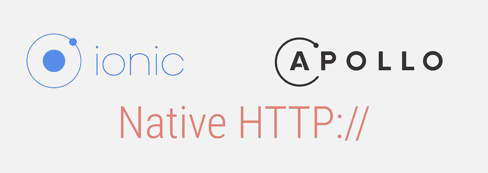
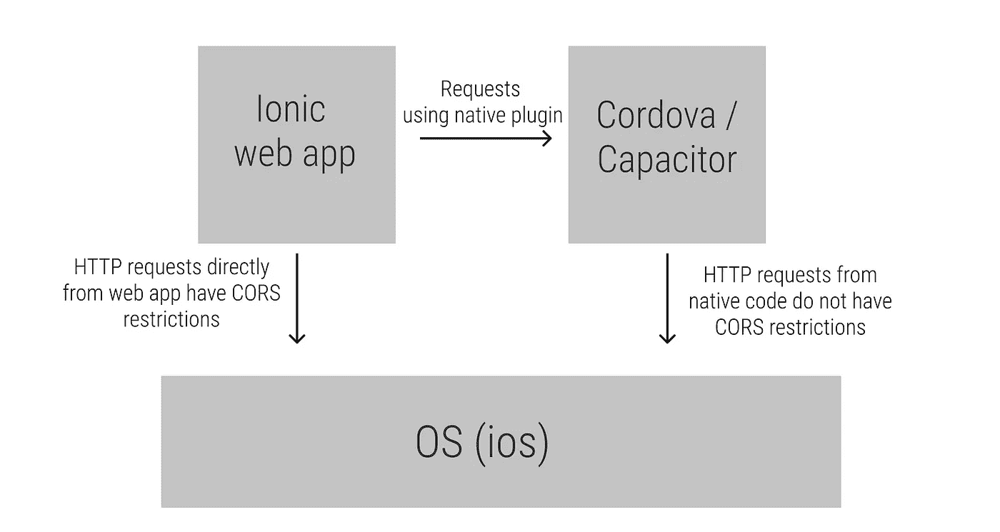

# 如何设置 Apollo GraphQL 客户端以在 Ionic/React 应用程序中使用本地 HTTP 客户端

> 原文：<https://betterprogramming.pub/how-to-set-up-an-apollo-graphql-client-to-use-a-native-http-client-in-an-ionic-react-app-c8456b481990>

## 将本机插件链接到 Apollo 客户端，以避免 CORS 错误，并在后台线程中运行网络请求



图片来源:作者

# 背景

最近发布的 Ionic React 让我对混合应用感到非常兴奋，所以我决定深入研究并开发一个演示移动应用。事情进行得很顺利，直到我的 iOS 模拟器出现 CORS 错误。我假设我不会遇到 CORS 问题，因为我是在一台设备上运行的。这让我想起了两个事实:

*   Ionic 移动应用仍然使用浏览器的网络层，因为它们基本上是网络应用。
*   iOS 对混合应用程序实施 CORS 限制。



显示浏览器 HTTP 请求与本机 HTTP 请求的图表

考虑到这一点，我有两个选择。我可以向我的服务器添加更多的 CORS 规则来接受请求，或者使用本地 HTTP 库来避免这些 CORS 限制。我选择了后者，因为我不想给我的服务器添加更宽松的 CORS 规则，而且我还可以从在后台线程上运行我的网络调用中获益。

# 本地请求相对于 JavaScript 请求的优势

根据 Ionic 和[Cordova-plugin-advanced-http](https://github.com/silkimen/cordova-plugin-advanced-http)repo 的所有者所说，这些是使用原生请求的优势。我肯定在回购协议中使用了本机请求来绕过 CORS 限制。

*   能够实施 [SSL / TLS 锁定](https://labs.nettitude.com/tutorials/tls-certificate-pinning-101/)
*   [CORS](https://developer.mozilla.org/en-US/docs/Web/HTTP/CORS) 限制不适用
*   HTTP 代码 401 的处理—在[问题 CB-2415](https://issues.apache.org/jira/browse/CB-2415) 中阅读更多信息
*   后台线程—所有请求都在后台线程中完成

# 要求

*   建立一个离子反应项目。如果你没有，你就按照[这些说明](https://ionicframework.com/docs/react/quickstart)。
*   安装 [Cordova HTTP 插件](https://www.npmjs.com/package/cordova-plugin-advanced-http)。
*   安装阿波罗客户端。

# 安装 Cordova HTTP 插件

```
npm i cordova-plugin-advanced-http
ionic cap sync
```

# 初始 Apollo 客户端设置

```
npm i apollo-boost graphql
```

Apollo 的人们在设计 Apollo 客户端 API 方面做得非常出色。它被设计成可组合的，因此您可以组合客户机来使用您喜欢的网络层。唯一的警告是你传递给 Apollo 的网络层必须适合 web [Fetch API 接口](https://developer.mozilla.org/en-US/docs/Web/API/Fetch_API)。

这是一个默认设置，会导致 CORS 错误，因为我们使用的是 web Fetch API。

# 用本地 Cordova 本地 HTTP 插件设置 Apollo 客户机

我们现在可以在本地 Cordova HTTP 插件上构建一个包装器，就像 Fetch API 规范一样。

我使用 [http-status-codes](https://www.npmjs.com/package/http-status-codes) 库来获取 http 状态代码的文本表示。您可以通过运行下面的命令来安装它。

```
npm i http-status-codes
```

我们来分析一下。

*   **第 6 行**:(可选)如果没有检测到科尔多瓦，这个检查返回获取 API。这是为了在浏览器中运行 CORS 插件。
*   **第 13 行:**将 Apollo 传入的主体复制到数据键中，因为 HTTP 插件将数据键用于请求主体。
*   **第 16 行:W**rap promise 中的 HTTP 插件调用并执行请求。
*   将来自 HTTP 插件的响应包装在一个 Fetch [Response](https://developer.mozilla.org/en-US/docs/Web/API/Response) 接口中并返回它。

# 包扎

现在我们有了 Cordova 本地 HTTP 客户端的 Fetch 实现，我们可以将它与 Apollo 客户端实例化连接起来。

瞧啊。在这个文件中，我们现在用 Cordova HTTP Fetch 实现交换初始 Fetch。现在，您应该能够通过本机 HTTP 客户端使用 Apollo 客户端进行 GraphQL 调用，并避免 CORS 错误。

我在 Github 上用 Yelp 的 GraphQL API 建立了一个演示回购，因为它不支持 CORS。如果你想看看在一个项目中它们是如何结合在一起的，就去看看吧。

[](https://github.com/williamkwao/ionic-react-apollo-yelp) [## 威廉克沃/爱奥尼亚-反应-阿波罗-yelp

### 这个回购演示了如何避免 ios 对混合应用施加的 CORS 限制。我选择使用 YELP api 是因为…

github.com](https://github.com/williamkwao/ionic-react-apollo-yelp) 

# 可能的改进

*   将它转换成自己的 Cordova 插件，这样我们就可以有一个 Fetch 接口本地 HTTP 插件。
*   向[Cordova-plugin-advanced-HTTP](https://www.npmjs.com/package/cordova-plugin-advanced-http)repo 发出一个 pull 请求作为特性。您可以跟踪电容器团队目前就此[拉动请求](https://github.com/ionic-team/capacitor/pull/2495)所做的工作。
*   用 Fetch 接口实现写一个原生的[电容](https://capacitor.ionicframework.com/) HTTP 客户端插件。这将是一个好消息，因为爱奥尼亚正在推动电容器作为科尔多瓦的继任者，这将是。

# 奖金；奖品

*   [Axios Fetch](https://github.com/lifeomic/axios-fetch) :我从这个回购中获得了灵感，因为这也是作为一种使用 [Axios](https://github.com/axios/axios) 作为 Apollo 的网络层的方式来实现的。
*   [Cordova-plugin-advanced-HTTP](https://www.npmjs.com/package/cordova-plugin-advanced-http):Cordova 插件，使您能够使用平台本地客户端发出 HTTP 请求。
*   Ionic :用于构建一个令人敬畏的框架，使移动应用程序开发民主化，并让 web 开发人员能够使用。
*   [Apollo GraphQL](https://www.apollographql.com/docs/react/) :制作了一个非常可组合的 GraphQL 客户端库，使得像这样的解决方案成为可能。