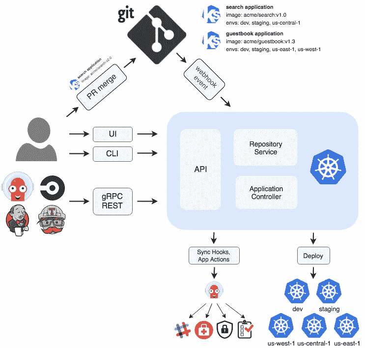
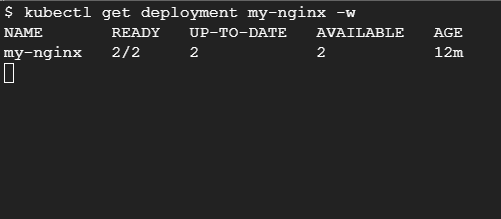
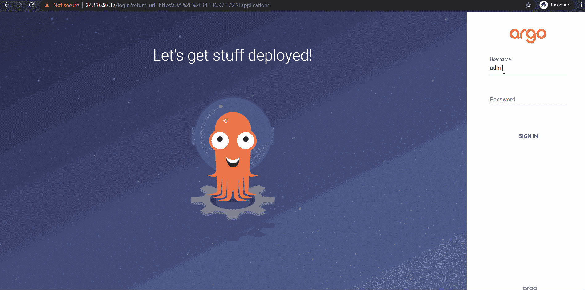

# 如何用 Terraform 设置 Argo 光盘实现纯 GitOps

> 原文：<https://betterprogramming.pub/how-to-set-up-argo-cd-with-terraform-to-implement-pure-gitops-d5a1d797926a>

## 针对 Kubernetes 工作负载的声明式持续部署


杰瑞米·毕肖普在 [Unsplash](https://unsplash.com?utm_source=medium&utm_medium=referral) 上的照片。

[Argo CD](https://argoproj.github.io/argo-cd/) 是一个非常流行的声明式、基于 GitOps 的持续交付工具。它是一个开源工具，是云本地计算基金会(CNCF)的一部分。

安装和设置都很容易，它提供了各种功能和一个 jazzy UI 来管理您所有的应用程序需求。此外，该工具支持 Kubernetes，并通过不断地将 Kubernetes 资源清单从 Git 同步到 Kubernetes 集群来帮助您实现 GitOps。

# 为什么是 Argo CD？

它允许团队实现 [GitOps](https://www.gitops.tech/) ，其原则如下:

*   Git 是真理的唯一来源。
*   Git 是操作所有环境的唯一地方，所有配置都是代码。
*   所有变化都是可观察/可验证的。

# Argo CD 如何工作

除了普通的旧 Kubernetes 清单 YAML 文件外，Argo CD 还支持其他几种定义 Kubernetes 清单的方法:

*   [舵](https://helm.sh/)图表
*   [kustomize](https://kustomize.io/)
*   [ksonnet](https://ksonnet.io/)
*   [jsonnet](https://jsonnet.org/) 文件
*   简单的 YAML/JSON 清单
*   通过插件的其他定制配置管理工具

您可以在 Argo CD 中定义包含源和目标的应用程序。源代码描述了 Git 存储库和 manifest/helm charts/kustomize 文件的位置，并在指定的目标环境中应用它们。您可以跟踪对特定分支、标签的更改，或者观察 Git 存储库中的特定版本。还有其他[跟踪策略](https://argoproj.github.io/argo-cd/user-guide/tracking_strategies/)可用。

Argo CD 提供了一个基于 web 的用户界面和与之交互的命令行界面。它还可以使用同步挂钩和应用程序操作来报告应用程序状态，因此如果在 GitOps 之外的集群中发生了任何更改，Argo CD 可以在 Slack 通道中提醒您的团队。

下图详细描述了 Argo CD 架构:



图片来自 [Argo CD](https://argoproj.github.io/argo-cd/)

现在，为了更好地理解 Argo CD，我们来做一个动手练习。

# 先决条件

我们将使用谷歌 Kubernetes 引擎进行这项工作，所以你需要一个 GCP 帐户开始。目前，GCP 提供 300 美元的免费试用，所以你可以在 https://cloud.google.com/free 的[注册。](https://cloud.google.com/free)

你还需要叉[https://github.com/bharatmicrosystems/argo-cd-example](https://github.com/bharatmicrosystems/argo-cd-example)。

# 我们将要做的事情

由于我们的重点是实现 GitOps，所以我们将声明一切，包括 Argo CD 的安装和我们的应用程序在 Argo CD 上的配置。我们将使用 [Terraform](https://www.terraform.io/) 和 [GitHub Actions](https://github.com/actions) 来完成这个任务。Terraform 配置将执行以下操作:

1.  创建 GKE 集群。
2.  在上面安装 Argo 光盘。
3.  在它上面创建一个启用自动同步的应用程序。

一旦我们的设置就绪，我们将手动登录到 Kubernetes 集群，并发现我们的设置是否正确。

现在，让我们看看地形配置。

# 地形结构

Terraform 配置由一个包含以下部分的`main.tf`文件组成。

## 声明 Terraform 后端

Terraform 需要存储它所管理的资源的状态。因此，我们需要声明一个后端，我们希望 Terraform 在其中保存状态。在这种情况下，由于我们使用 GCP，我们将使用谷歌云存储桶作为 Terraform 后端。以下配置声明:

您可能已经注意到，我们需要创建一个名为`terraform-backend-<project-id>`的 GCS bucket。为此，打开 Google Cloud Shell 会话并运行以下命令:

```
$ PROJECT_ID=<YOUR_PROJECT_ID>
$ gsutil mb gs://terraform-backend-$PROJECT_ID
```

现在，让我们看看 Terraform 配置的下一部分:创建 GKE 集群。

## 创建 GKE 集群

为了创建 GKE 集群，我们需要声明 Google Provider，然后创建一个服务帐户。然后，我们将创建 GKE 群集，并在准备就绪后从该群集获取身份认证令牌。这是它的地形配置:

接下来，我们将在 GKE 集群上安装 Argo CD。

## 安装 Argo CD

Argo CD 在他们的[发布页面](https://github.com/argoproj/argo-cd/releases)上提供了一个 Kubernetes 自定义资源定义清单。您可以下载您选择的清单，并将其存储在 Git 存储库的`manifests/argocd`目录中。

在应用该清单之前，您需要创建一个名为`argocd`的名称空间。我们将为此创建一个`manifests/argocd/namespace.yaml`清单:

现在是地形配置。我们需要做到以下几点:

1.  声明将帮助我们将清单应用到集群的`gavinbunney/kubectl`提供者。
2.  应用`manifests/argocd/namespace.yaml`清单来创建`argocd` 名称空间。
3.  应用`manifests/argocd/install.yaml`清单在 GKE 集群上安装 Argo 光盘。

以下是相应的地形配置:

我们需要做的下一件事是在 Argo CD 中创建一个应用程序，将配置从我们的 GitHub 存储库同步到 GKE 集群。

## 创建 Argo CD 应用程序

首先，我们必须定义一些我们希望 Argo CD 为我们部署和管理的资源。我们将为此创建一个 Nginx 部署和服务。我们将为此创建以下`manifests/nginx/nginx.yaml`:

现在，为了让 Argo CD 从`manifests/nginx`目录同步配置，我们必须为此定义以下 Argo CD 应用程序 CRD `manifests/argocd/my-nginx.yaml`:

清单在`argocd`名称空间上定义了一个名为`my-nginx`的`argoproj.io/v1alpha1/Application`资源，并具有以下规范:

*   `project` —此应用程序应驻留的 Argo CD 项目。在这种情况下，我们将把它保留在`default`项目中。
*   `source.repoURL`—ArgoCD 应从其同步清单的 GitHub 存储库 URL。用您的 GitHub 存储库 URL 替换`repoURL`字段。
*   `source.targetRevision`—ArgoCD 应从其同步清单的 Git 储存库的修订版。在这种情况下，我们将使用`HEAD`。
*   `source.path` —Git 存储库中要应用的清单所在目录的路径。在这种情况下，我们将使用`manifests/nginx`。
*   `destination.server`—Kubernetes API 服务器 URL，Argo CD 应在其中部署资源。
*   `destination.namespace`—Argo CD 应该部署资源的名称空间。在这种情况下，它是`default`名称空间。
*   `syncPolicy.automated.selfHeal` —表示同步是自动进行的。`selfHeal`标志指定，如果目标(即 Kubernetes 集群)中的资源发生变化，而源中的资源没有变化，则需要部分应用同步。

现在，我们已经定义了清单，我们将声明以下 Terraform 资源来应用它:

现在 Terraform 配置已经准备好了，让我们继续创建一个 GitHub Actions 工作流文件来应用这个配置。

# GitHub 操作工作流程

GitHub Actions 是一个持续集成和部署工具，默认情况下在每个 GitHub 存储库中提供。一旦我们将代码签入存储库，我们将使用它来自动应用 Terraform 配置。为此，我们必须创建下面的`.github/workflows/setup-argo.yml`文件:

工作流文件在基于 ubuntu 的 worker 中的`./terraform`工作目录下运行以下步骤:

1.  从存储库中签出代码。
2.  在 worker 中安装 Terraform。
3.  通过运行`init`和`apply`应用地形配置。

工作流文件还需要一些秘密来运行——`PROJECT_ID` 和`GOOGLE_CREDENTIALS`。`PROJECT_ID`指的是您想要创建 GKE 集群的 Google Cloud 项目 ID。`GOOGLE_CREDENTIALS`是一个服务帐户的 JSON 凭证，Terraform 将使用它来验证 Google Cloud APIs。我们必须为此创建服务帐户。为此，请在您的云 shell 上运行以下命令:

```
$ gcloud iam service-accounts create terraform --description="terraform" --display-name="Terraform"
$ gcloud projects add-iam-policy-binding $PROJECT_ID --member="serviceAccount:terraform@$PROJECT_ID.iam.gserviceaccount.com" --role="roles/editor" 
$ gcloud projects add-iam-policy-binding $PROJECT_ID --member="serviceAccount:terraform@$PROJECT_ID.iam.gserviceaccount.com" --role="roles/container.admin"
$ gcloud iam service-accounts keys create key-file --iam-account=terraform@$PROJECT_ID.iam.gserviceaccount.com
$ cat key-file
```

最后一个命令将输出一个 JSON 密钥，我们将在 GitHub 上的`GOOGLE_CREDENTIALS` secret 中使用这个密钥。

要创建 GitHub secret，请转到 https://github.com/<your_github_user>/Argo-CD-example/settings/secrets/actions/new，创建一个名为`GOOGLE_CREDENTIALS`的 secret，并将 JSON 密钥粘贴到“values”字段中。</your_github_user>

类似地，创建另一个名为`PROJECT_ID`的秘密，并在“values”字段中添加您的 Google Cloud 项目 ID。

要允许 Terraform 创建 GKE 集群，我们必须使用以下命令启用一些 GCP API:

```
$ gcloud services enable iam.googleapis.com container.googleapis.com
```

就是这样。我们现在准备触发 GitHub 动作工作流。

# 触发 GitHub 操作工作流

要触发 GitHub 动作工作流，您可以在`README.md`文件中做一个小的更改，并将更改推送到 GitHub。一旦你这样做了，你会看到 GitHub 动作工作流被触发:


GitHub 操作

现在，让我们从云 shell 访问 GKE 集群，看看`my-nginx`部署是否正在运行。

```
$ gcloud container clusters get-credentials k8s-cluster --zone us-central1-a --project $PROJECT_ID
$ kubectl get deployment
NAME       READY   UP-TO-DATE   AVAILABLE   AGE
my-nginx   2/2     2            2           2m51s
```

正如我们看到的，两个`my-nginx` pod 的副本正在运行。

现在让我们获取服务 URL 并点击端点。

```
$ kubectl get svc my-nginx
NAME       TYPE           CLUSTER-IP     EXTERNAL-IP      PORT(S)        AGE
my-nginx   LoadBalancer   10.3.252.166   35.184.172.126   80:30763/TCP   5m11s
$ curl 35.184.172.126
<!DOCTYPE html>
<html>
<head>
<title>Welcome to nginx!</title>
...
<h1>Welcome to nginx!</h1>
...
<p><em>Thank you for using nginx.</em></p>
</body>
</html>
```

我们看到默认的 NGINX 响应。所以应用程序同步工作正常。现在，为了进行测试，让我们更改源代码中的副本。前往`manifests/nginx/nginx.yaml`，将`replicas`从`2`改为`4`。提交代码并推送到 GitHub。等待几分钟，您会看到现在副本是`4`。



Argo CD 还为可视化和管理您的应用程序和项目提供了一个很棒的 Web UI。接下来让我们访问 UI。

# 访问 Argo CD 网络用户界面

要访问 Argo CD Web UI，您需要 Argo 服务器服务的外部 IP。

```
$ kubectl get svc argocd-server -n argocd
NAME            TYPE           CLUSTER-IP     EXTERNAL-IP    PORT(S)     
argocd-server   LoadBalancer   10.3.240.170   34.136.97.17 80:30188/TCP,443:31372/TCP
```

正如我们所见，Argo CD 正在 https://34.136.97.17 的[上运行。如果你访问这个网址，你会看到我们需要一个用户名和密码登录。Argo CD 提供了一个默认的`admin`用户，其密码作为明文保存在`argocd-initial-admin-secret` `Secret`资源中。虽然我们可以继续使用它，但它是不安全的，所以改变它是一个好主意。为此，请运行以下命令:](https://34.136.97.17/)

```
$ kubectl patch secret argocd-secret  -p '{"data": {"admin.password": null, "admin.passwordMtime": null}}' -n argocd
$ kubectl scale deployment argocd-server --replicas 0 -n argocd
$ kubectl scale deployment argocd-server --replicas 1 -n argocd
```

现在，等待两分钟以生成新凭据，并运行以下命令来获取密码:

```
$ kubectl -n argocd get secret argocd-initial-admin-secret -o jsonpath="{.data.password}" | base64 -d && echo
```

现在让我们使用凭据登录。



就是这样！Argo CD 设置正确。

或者，您也可以从 CLI 访问 Argo CD。让我们来看看这个。

# 从命令行界面访问 Argo 光盘

要从 CLI 访问 Argo CD，我们必须下载 Argo CD CLI 实用程序，并在使其可执行后将二进制文件移动到系统路径。

```
$ wget [https://github.com/argoproj/argo-cd/releases/download/v2.0.4/argocd-util-linux-amd64](https://github.com/argoproj/argo-cd/releases/download/v2.0.4/argocd-util-linux-amd64)
$ sudo mv argocd-util-linux-amd64 /usr/bin/argocd
$ chmod +x /usr/bin/argocd
```

要登录到 Argo CD，请使用以下命令:

```
$ argocd login 34.136.97.17
WARNING: server certificate had error: x509: cannot validate certificate for 334.136.97.17 because it doesn't contain any IP SANs. Proceed insecurely (y/n)? y
Username: admin
Password:
'admin:login' logged in successfully
Context '34.136.97.17' updated
```

然后，您可以使用`argocd`命令与 Argo 进行交互。

# 结论

感谢阅读！我希望你喜欢这篇文章。

Argo CD 是为您的 Kubernetes 工作负载实现 GitOps 的最有效方法之一。其功能丰富且简单的维护 GitOps 管道的模型和出色的 UI 使其更受欢迎。