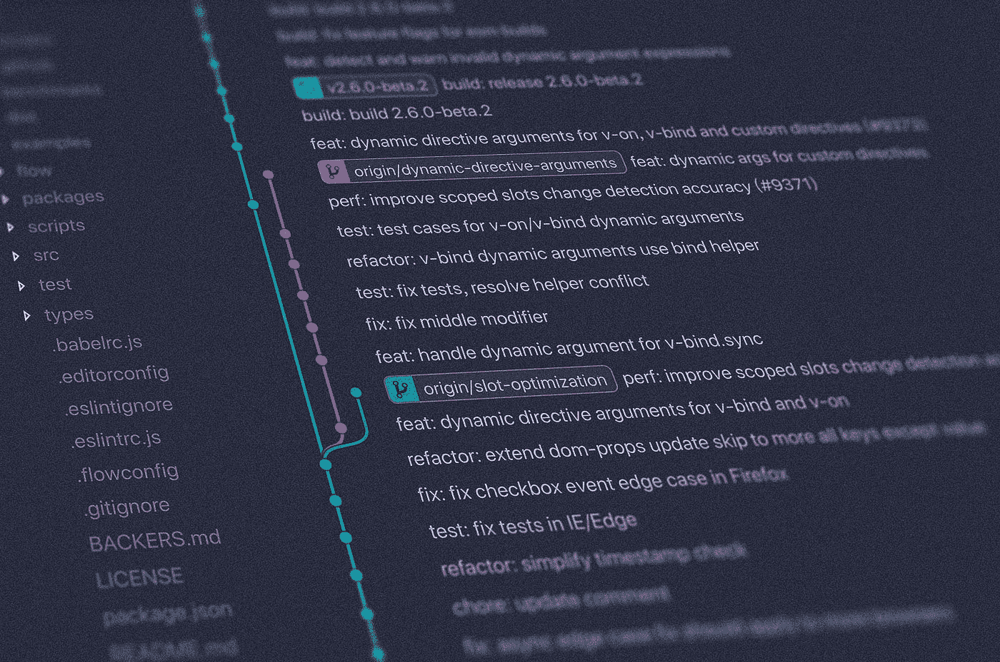
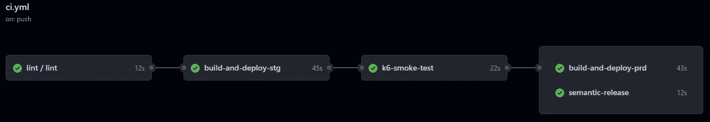

# 如何为 Cloudflare Worker 设置 CI/CD 管道

> 原文：<https://betterprogramming.pub/how-to-set-up-ci-cd-pipeline-for-cloudflare-worker-dbd3603b9c52>

## 在牧马人、k6 和语义发布中使用 GitHub 动作



照片由[扬西·敏](https://unsplash.com/@yancymin?utm_source=medium&utm_medium=referral)在 [Unsplash](https://unsplash.com?utm_source=medium&utm_medium=referral) 上拍摄

今天，我在 GitHub 上的大多数项目都与[更新](https://github.com/renovatebot/renovate)保持同步。在启用自动合并的情况下，我希望有足够的信心，自动的依赖项更新不会导致任何回归。

测试 Cloudflare Worker 有点不正常。别误会，我喜欢 Cloudflare Worker。然而,[现有的解决方案](https://blog.cloudflare.com/unit-testing-workers-in-cloudflare-workers/)感觉有点不直观。最重要的是，[dollarshaveclub/cloud worker](https://github.com/dollarshaveclub/cloudworker)不再被积极维护，这是一个败笔。

*TL；DR:如何使用 GitHub Action 和*[*Grafana K6*](https://k6.io/)*为 Cloudflare Worker 项目设置 CI/CD 管道。*

# 概观

之前，[我用 Cloudflare Worker 构建了一个 URL shortener 克隆](https://jerrynsh.com/i-built-my-own-tiny-url/)。使用这个现有的项目( [GitHub](https://github.com/ngshiheng/atomic-url) link)，我们将考虑为它建立一个 CI/CD 管道以及简单的集成测试。

我们的 GitHub Action CI/CD 管道相当简单。阶段(作业)如下:



GitHub 上的 CI 工作流示例([链接](https://github.com/ngshiheng/atomic-url/actions/runs/2374888846))

1.  皮棉检查或单元测试
2.  部署到临时环境
3.  在我们的试运行环境中运行集成测试
4.  运行[语义发布](https://github.com/semantic-release/semantic-release)并部署到生产环境中

# 牧马人配置

首先，我们必须修改我们现有的 `[wrangler.toml](https://github.com/ngshiheng/atomic-url/blob/v1.1.8/wrangler.toml)` [文件](https://github.com/ngshiheng/atomic-url/blob/v1.1.8/wrangler.toml)[。请记住，我们需要部署一个测试环境来运行我们的集成测试:](https://github.com/ngshiheng/atomic-url/blob/v1.1.8/wrangler.toml)

```
[env.staging]
name = "atomic-url-staging"
workers_dev = true
kv_namespaces = [
  { binding = "URL_DB", id = "ca7936b380a840908c035a88d1e76584" },
]
```

*   `name` —确保`name`对于每个环境都是唯一的字母数字(`-`是允许的)。让我们将我们的登台环境命名为`atomic-url-staging`。
*   `worker_dev` —我们的集成测试在`<NAME>.<SUBDOMAIN>.workers.dev`端点上运行。因此，我们需要通过设置`workers_dev = true` ( [引用](https://developers.cloudflare.com/workers/platform/environments/#publishing-to-workersdev))来部署我们的 Cloudflare Worker。
*   `kv_namespaces` —原子 URL 使用 KV 作为其数据库来存储缩短的 URL。这里，我选择使用一个预览名称空间 KV 作为测试数据库。为什么？仅仅因为它是我在本地开发期间(运行`wrangler dev`时)使用的同一个开发 KV 名称空间。当然，您可以只使用常规的 KV 名称空间。请确保您没有使用生产 KV `id`。[阅读如何创建 KV 名称空间](https://developers.cloudflare.com/workers/wrangler/cli-wrangler/commands/#kv_namespaces)。

接下来，我们还需要创建一个生产环境，使用我们的生产 KV 命名空间进行部署:

```
[env.production]
name = "atomic-url"
route = "s.jerrynsh.com/*"
workers_dev = false
kv_namespaces = [
  { binding = "URL_DB", id = "7da8f192d2c1443a8b2ca76b22a8069f" },
]
```

生产环境部分与之前类似，除了—我们将为生产设置`worker_dev = false`和`route`。

## 部署

要从本地计算机手动部署到各自的环境，请运行:

*   `wrangler publish -e staging`
*   `wrangler publish -e production`

不过，我们将研究如何使用 GitHub 动作通过 CI/CD 管道自动完成这项工作。

在我们继续之前，您可以在这里找到完整的`wrangler.toml`配置。

哦，这里有一张[小抄](https://developers.cloudflare.com/workers/wrangler/configuration/#configure-wranglertoml)来配置`wrangler.toml`。我强烈建议你利用这一点！

# Grafana k6

对于集成测试，我们将使用一个叫做 k6 的工具。通常，k6 被用作性能和负载测试的工具。现在，请原谅我，我们不会将任何负载测试集成到我们的 CI/CD 管道中；今天不行。

在这里，每当新的提交被推送到我们的`main`分支时，我们将为这个项目运行[冒烟测试](https://k6.io/docs/test-types/smoke-testing/)。冒烟测试本质上是一种在系统上执行健全性检查的集成测试。

在这种情况下，运行冒烟测试足以让我确定我们的系统是在没有任何回归的情况下部署的，并且可以在最小负载下运行。

## 测试什么

基本上，这里有几件事是我们想要在[组](https://k6.io/docs/using-k6/tags-and-groups/#groups)中对我们的 URL shortener 应用程序进行冒烟测试的一部分:

*   主页应该像预期的那样加载 200 响应状态

```
group('visit main page', function () {
    const res = http.get(BASE_URL)check(res, {
        'is status 200': (r) => r.status === 200,
        'verify homepage text': (r) =>
            r.body.includes(
                'A URL shortener POC built using Cloudflare Worker'
            ),
    })
})
```

*   我们的主 POST API 端点`/api/url`应该用原始 URL 创建一个短 URL

```
group('visit rest endpoint', function () {
    const res = http.post(
        `${BASE_URL}/api/url`,
        JSON.stringify({ originalUrl: DUMMY_ORIGINAL_URL }),
        { headers: { 'Content-Type': 'application/json' } }
    )check(res, {
        'is status 200': (r) => r.status === 200,
        'verify createShortUrl': (r) => {
            const { urlKey, shortUrl, originalUrl } = JSON.parse(r.body)
            shortenLink = shortUrl
            return urlKey.length === 8 && originalUrl === DUMMY_ORIGINAL_URL
        },
    })
})
```

*   最后，我们希望确保当我们访问生成的短 URL 时，它会将我们重定向到原始 URL

```
group('visit shortUrl', function () {
    const res = http.get(shortenLink)check(res, {
        'is status 200': (r) => r.status === 200,
        'verify original url': (r) => r.url === DUMMY_ORIGINAL_URL,
    })
})
```

要进行本地测试，只需运行`k6 path/to/test.js`。仅此而已！你可以在这里找到完整的测试脚本。

如果您正在考虑运行负载测试，请阅读[如何在负载测试中确定并发用户](https://k6.io/blog/monthly-visits-concurrent-users/)。

# GitHub 操作

我将忽略这一部分，因为它非常简单。你可以在这里参考最终的 [GitHub Actions 工作流文件](https://github.com/ngshiheng/atomic-url/blob/f1ff25a00c1430314b45dde855497b58831b8e3a/.github/workflows/ci.yml)。

让我们把所有的东西拼凑起来。下面是我们需要使用的 GitHub 操作:

*   [wrangler-action](https://github.com/cloudflare/wrangler-action/tree/1.3.0) —用于使用 Wrangler CLI 部署 Cloudflare Worker
*   [k6-动作](https://github.com/marketplace/actions/k6-load-test?version=v0.2.0)-用于运行 K6

关于工作流文件有一点需要注意——为了使一个作业依赖(需要)另一个作业，我们将使用`[need](https://docs.github.com/en/actions/using-workflows/workflow-syntax-for-github-actions#jobsjob_idneeds)` [语法](https://docs.github.com/en/actions/using-workflows/workflow-syntax-for-github-actions#jobsjob_idneeds)。

## 行动秘密

这个项目需要 2 个行动秘密:

1.  `CF_API_TOKEN` —供 Wrangler GitHub Action 用于将我们的 Cloudflare Worker 自动发布到其各自的环境中。您可以使用`Edit Cloudflare Workers`模板[创建您的 API 令牌](https://dash.cloudflare.com/profile/api-tokens)。
2.  `NPM_TOKEN` —该项目也使用[语义发布](https://github.com/semantic-release/npm)自动发布到 [NPM](https://www.npmjs.com/) 。为此，您需要通过 [npm 创建令牌](https://docs.npmjs.com/getting-started/working_with_tokens#how-to-create-new-tokens)创建一个`NPM_TOKEN`。

要将它添加到您的 GitHub 库机密，请查看本指南。

如果你已经看了最终的工作流文件，你可能已经注意到了语法`${{ secrets.GITHUB_TOKEN }}`，并且想知道为什么我没有提到任何关于添加`GITHUB_TOKEN`到我们的项目动作秘密中的事情。原来，它是[自动创建并添加到您的所有工作流](https://docs.github.com/en/actions/security-guides/automatic-token-authentication#about-the-github_token-secret)中的。

# 结束语

可以理解的是，众所周知，无服务器平台很难测试和调试。然而，这并不意味着我们应该忽视它。

那么，下一步是什么？在我脑海中，我们可以做得更好。这里有几个我们可以改进的地方:

1.  添加一个在冒烟测试失败时自动回滚并恢复提交的作业/阶段
2.  创建 PR 时创建一个单独的测试环境，以便我们可以对它们进行冒烟测试
3.  对这个项目来说可能有点过了——实现[金丝雀部署](https://octopus.com/docs/deployments/patterns/canary-deployments)听起来是一个有趣的挑战

# 参考

如果您正在考虑对 Cloudflare 工作人员进行单元测试，以下是我的建议:

*   https://findwork.dev/blog/testing-cloudflare-workers/
*   [https://blog . cloud flare . com/unit-testing-workers-in-cloud flare-workers/](https://blog.cloudflare.com/unit-testing-workers-in-cloudflare-workers/)
*   [https://blog.cloudflare.com/unit-testing-worker-functions/](https://blog.cloudflare.com/unit-testing-worker-functions/)

这里有一个关于建立理想而实用的 CI/CD 渠道的视频:

*   [理想的&实用的 CI / CD 管道](https://www.youtube.com/watch?v=OPwU3UWCxhw)

```
**Want to Connect?**This article was originally published at [jerrynsh.com](https://jerrynsh.com/how-i-setup-ci-cd-pipeline-for-cloudflare-worker/)
```