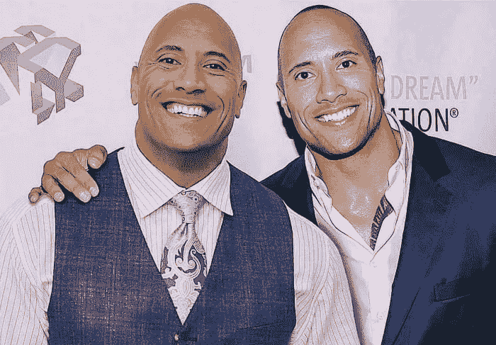
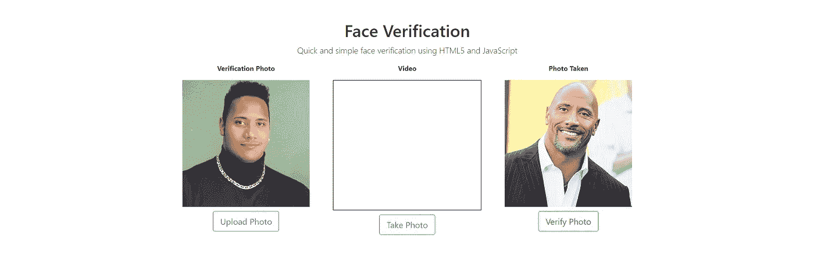
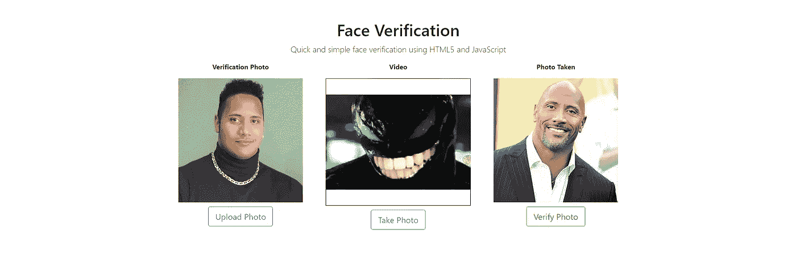
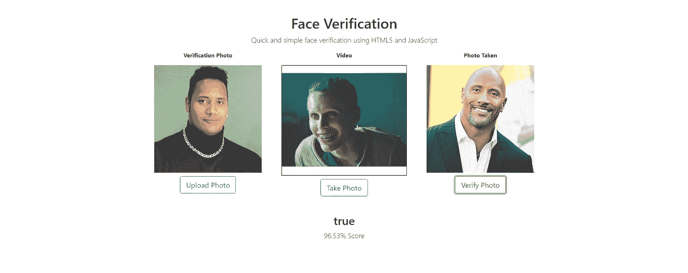
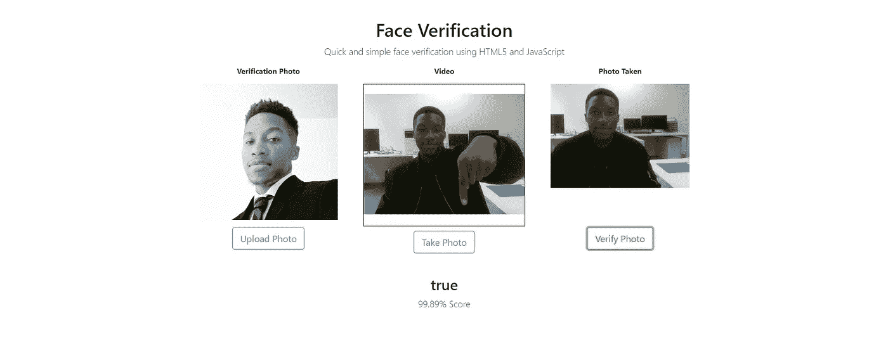
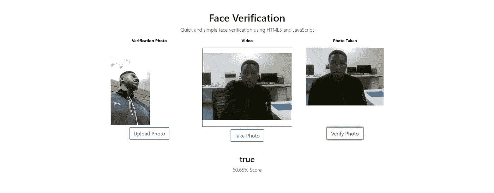

# 如何使用 HTML5 + JavaScript 以简单的方式设置人脸验证

> 原文：<https://betterprogramming.pub/how-to-set-up-face-verification-the-easy-way-using-html5-javascript-5301235e495f>

## 上传、捕获、验证。



我用 HTML5 和 JavaScript 创建了一个非常简单的方法来匹配两张图片。你上传想要使用的验证图片，从你的相机/网络摄像头的视频流中拍摄快照，然后使用人脸匹配 API 来检索结果。简单。

[GitHub 回购](https://github.com/shango44/facesoft-html5-javascript-face-match)

# **你需要什么**

*   网络摄像机/照相机
*   免费人脸识别 API 密钥
*   网络服务器

# 在开始之前

## 为此项目创建一个目录

这个目录将是我们存放所有文件的地方。

## 创建本地 Web 服务器

为了完全控制图像，需要一个网络服务器。否则我们会得到一个污染画布的安全错误。有几种方法可以做到这一点，我在下面列出了如何用 Python 做到这一点。

## **巨蟒**

*   [安装 Python](https://www.python.org/downloads/release/python-373/)
*   打开命令提示符
*   进入

```
cd C:/DIRECTORY_LOCATION & py -m http.server 8000
```

你应该可以通过 [http://localhost:8000](http://localhost:8000) 访问这个目录。

## 获取免费的 API 密钥

我们将使用 Facesoft 的人脸识别 API。快速[在这里注册访问您的免费 API 密钥](https://facesoft.io/signup.html?utm_source=medium&utm_medium=post&utm_campaign=html-js-04-2019)，这样您就可以获得无限的 API 调用，每分钟最多两个请求。

登录后，您的 API 密钥将出现在仪表板区域。

# 1.设置

创建这三个文件:

*   index.html
*   style.css
*   verify.js

接下来，右键单击并将下面的文件保存到该目录中。这些图像文件将是上传和验证图片的默认图像。


另存为“defaultupload.png”


另存为“defaultphoto.png”

# 2.HTML

## 布局

将下面的布局代码复制并粘贴到“index.html”文件中。这给了我们借助 bootstrap 的框架和设计。

```
<!DOCTYPE html>
<html lang="en"><head>
  <!-- Required meta tags -->
  <meta charset="utf-8">
  <meta name="viewport" content="width=device-width, initial-scale=1, shrink-to-fit=no"><!-- Bootstrap CSS -->
  <link rel="stylesheet" href="[https://stackpath.bootstrapcdn.com/bootstrap/4.3.1/css/bootstrap.min.css](https://stackpath.bootstrapcdn.com/bootstrap/4.3.1/css/bootstrap.min.css)" integrity="sha384-ggOyR0iXCbMQv3Xipma34MD+dH/1fQ784/j6cY/iJTQUOhcWr7x9JvoRxT2MZw1T" crossorigin="anonymous"><!-- Style CSS -->
  <link rel="stylesheet" href="style.css"><title>Face Verification</title>
</head><body>
  <!-- Page Content -->
  <div class="container">
    <div class="row">
      <div class="col-lg-12 text-center">
        <h1 class="mt-5">Face Verification</h1>
        <p class="lead">Quick and simple face verification using HTML5 and JavaScript</p>
      </div>
    </div>
    <!-- INSERT NEXT CODE HERE --> </div><!-- Verify JS -->
 <script src="verify.js"></script><!-- jQuery first, then Popper.js, then Bootstrap JS -->
  <script src="[https://code.jquery.com/jquery-3.3.1.slim.min.js](https://code.jquery.com/jquery-3.3.1.slim.min.js)" integrity="sha384-q8i/X+965DzO0rT7abK41JStQIAqVgRVzpbzo5smXKp4YfRvH+8abtTE1Pi6jizo" crossorigin="anonymous"></script>
  <script src="[https://cdnjs.cloudflare.com/ajax/libs/popper.js/1.14.7/umd/popper.min.js](https://cdnjs.cloudflare.com/ajax/libs/popper.js/1.14.7/umd/popper.min.js)" integrity="sha384-UO2eT0CpHqdSJQ6hJty5KVphtPhzWj9WO1clHTMGa3JDZwrnQq4sF86dIHNDz0W1" crossorigin="anonymous"></script>
  <script src="[https://stackpath.bootstrapcdn.com/bootstrap/4.3.1/js/bootstrap.min.js](https://stackpath.bootstrapcdn.com/bootstrap/4.3.1/js/bootstrap.min.js)" integrity="sha384-JjSmVgyd0p3pXB1rRibZUAYoIIy6OrQ6VrjIEaFf/nJGzIxFDsf4x0xIM+B07jRM" crossorigin="anonymous"></script>
</body></html>
```

## 图像、画布和按钮

我们现在创建一行，有三列用于验证照片、视频流和从视频流中拍摄的照片。将下面的代码添加到该行之后。

检查前面代码中的“在此插入下一个代码”标记。

```
<div class="row justify-content-md-center">
  <div class="col-lg-4 text-center">
    <p><strong>Verification Photo</strong></p> <!-- Canvas For Uploaded Image -->
      <canvas id="uploadCanvas" width="300"  height="300"></canvas> <!-- Default Canvas Image -->
       <!-- Upload Image Input & Upload Photo Button -->
      <input type="file" name="image-upload" accept="image/png, image/jpeg"> <button id="upload" type="button" class="btn btn-outline-primary btn-lg">Upload Photo</button>
  </div> <div class="col-lg-4 text-center">
    <p><strong>Video</strong></p> <!-- Camera -->
    <div class="camera-container">
      <video id="video" width="100%" height="300" autoplay="true">
      </video>
    </div> <!-- Take Photo Button -->
    <button id="capture" type="button" class="btn btn-outline-primary btn-lg">Take Photo</button>
  </div> <div class="col-lg-4 text-center">
    <p><strong>Photo Taken</strong></p>

    <!-- Canvas For Capture Taken -->
    <canvas id="captureCanvas" width="300"  height="300"></canvas> <!-- Default Canvas Image -->
     <!-- Verify Photos Button -->
    <button id="verify" type="button" class="btn btn-outline-success btn-lg">Verify Photo</button>
  </div>
</div>
<!-- INSERT NEXT CODE HERE -->
```

## API 响应和警告

我们要添加的代码将显示比赛结果、分数百分比、错误和警告。在我们添加的最后一个代码的正下方，添加下面的代码。

```
<div class="row">
  <div class="col-lg-12 text-center">
    <!-- API Match Result & API Percentage Score -->
    <h2 id="match" class="mt-5"></h2>
    <p id="score" class="lead"></p>
  </div>
  <div class="col-lg-12 text-center">
    <!-- Error & Warning Alerts -->
    <div class="alert alert-danger" id="errorAlert"></div>
    <div class="alert alert-warning" id="warningAlert"></div>
  </div>
</div>
```

# 3.CSS

将下面的代码添加到 style.css 文件中。

```
.camera-container {
  max-width: 100%;
  border: 1px solid black;
}.verification-image {
  width: 300px;
  height: auto;
  max-width: 100%;
}.btn {
  margin-top: 10px;
}#captureCanvas, #uploadCanvas {
  display: none;
}input[name="image-upload"] {
  display: none;
}#errorAlert, #warningAlert {
  display: none;
}
```

我们已经将图像上传输入设置为显示 none，因为我们将使用 upload 按钮触发它。此外，画布的 id 已经设置为显示 none，因此最初显示的是默认图像。

你的屏幕应该是这样的:



# 4.JavaScript

```
document.addEventListener("DOMContentLoaded", function() {});
```

在 verify.js 文件中，我们希望从添加一个将在页面加载后运行的事件侦听器开始。我们输入的每个代码都应该在这个函数里面。

## 变量

```
var video = document.getElementById('video'), 
captureCanvas = document.getElementById('captureCanvas'), 
uploadCanvas = document.getElementById('uploadCanvas'), 
captureContext = captureCanvas.getContext('2d'),
uploadContext = uploadCanvas.getContext('2d'),
uploadedPhoto = document.getElementById('uploadedPhoto'),
capturedPhoto = document.getElementById('capturedPhoto'),
imageUploadInput = document.querySelector('[name="image-upload"]'),
apiKey = 'INSERT_YOUR_FACESOFT_API_KEY',
errorAlert = document.getElementById('errorAlert'), AlertwarningAlert = document.getElementById('warningAlert'),
matchText = document.getElementById('match'),
scoreText = document.getElementById('score');
```

这些变量是:

*   视频元素、画布、照片和 API 响应的 id
*   图像输入选择器
*   画布上下文
*   API 密钥

## 视频流

这里有一个非常简单的代码来访问您的网络摄像头/摄像机，并将其流式传输到视频元素。添加底层变量。

```
// Stream Camera To Video Elementif(navigator.mediaDevices.getUserMedia){
  navigator.mediaDevices.getUserMedia({ video: true })
  .then(function(stream) {
    video.srcObject = stream;
  }).catch(function(error) {
    console.log(error)
  })
}
```

如果你刷新你的页面，你会看到:



## 功能 1:将照片设置到画布上

```
// Set Photo To Canvas Functionfunction setImageToCanvas(image, id, canvas, context, width=image.width, height=image.height) {
  var ratio = width / height;
  var newWidth = canvas.width;
  var newHeight = newWidth / ratio; if (newHeight > canvas.height) {
    newHeight = canvas.height;
    newWidth = newHeight * ratio;
  } context.clearRect(0, 0, canvas.width, canvas.height);
  context.drawImage(image, 0, 0, newWidth, newHeight);
  id.setAttribute('src', canvas.toDataURL('image/png'));
}
```

在这个函数中，我们接收图像、ID、画布、上下文、宽度和高度。我们接受宽度和高度，因为要获得视频的尺寸，我们必须使用 video . video width & video . video height。

我们还获得了图像的纵横比，这样，当我们分配图像时，它正好适合画布。剩余的代码清除画布并将新图像绘制到画布中。

## 函数 2: V **通过将照片发送到 API 来验证照片是否匹配**

```
// Facesoft Face Match API Functionfunction verifyImages(image1, image2, callback){
  var params = {
    image1: image1,
    image2: image2,
  } var xhr = new XMLHttpRequest();
  xhr.open("POST", "https://api.facesoft.io/v1/face/match");
  xhr.setRequestHeader("apikey", apiKey);
  xhr.setRequestHeader("Content-Type", "application/json;charset=UTF-8"); xhr.onload = function(){
    callback(xhr.response);
  } xhr.send(JSON.stringify(params));
}
```

在这个函数中，我们向 face match API 端点发出 XMLHttpRequest。我们已经在标题中添加了用于授权和内容类型的 API 密钥。对于主体，我们传递一个包含两个图像的对象。

现在我们完成了函数。

## 上传照片按钮点击事件

```
// On Upload Photo Button Clickdocument.getElementById('upload').addEventListener('click', function(){
  imageUploadInput.click();
})
```

upload 按钮的 click 事件侦听器触发图像输入的单击。

## 图像上传输入更改事件

```
// On Uploaded Photo ChangeimageUploadInput.addEventListener('change', function(){
  // Get File Extension
  var ext = imageUploadInput.files[0]['name'].substring(imageUploadInput.files[0]['name'].lastIndexOf('.') + 1).toLowerCase(); // If File Exists & Image if (imageUploadInput.files && imageUploadInput.files[0] && (ext == "png" || ext == "jpeg" || ext == "jpg")) { // Set Photo To Canvas
    var reader = new FileReader();
    reader.onload = function (e) {
      var img = new Image();
      img.src = e.target.result;
      img.onload = function() {
      setImageToCanvas(img, uploadedPhoto, uploadCanvas, uploadContext);
      }
    }
    reader.readAsDataURL(imageUploadInput.files[0]);
  }
})
```

在这个变更事件监听器中，我们检索文件扩展名并执行 if 语句来检查输入中是否有图像文件。然后，我们使用 FileReader 将图像加载到画布上。

## 拍照按钮点击事件

```
// On Take Photo Button Clickdocument.getElementById('capture').addEventListener('click', function(){
  setImageToCanvas(video, capturedPhoto, captureCanvas, captureContext, video.videoWidth, video.videoHeight);
})
```

这个事件侦听器现在执行 set image to canvas，从视频中捕获一个静止帧，并将其分配到画布中。

## 验证照片按钮点击事件

```
// On Verify Photo Button Clickdocument.getElementById('verify').addEventListener('click', function(){ // Remove Results & Alerts errorAlert.style.display = "none";
  warningAlert.style.display = "none";
  matchText.innerHTML = "";
  scoreText.innerHTML = ""; // Get Base64 var image1 = captureCanvas.toDataURL().split(',')[1];
  var image2 = uploadCanvas.toDataURL().split(',')[1];  // Verify if images are of the same person verifyImages(image1, image2, function(response){ if(response){
      var obj = JSON.parse(response);

      // If Warning Message

      if(obj.message){
        errorAlert.style.display = "none";
        warningAlert.style.display = "block";
        warningAlert.innerHTML = obj.message;
        matchText.innerHTML = "";
        scoreText.innerHTML = "";
      } // If Error else if(obj.error){
        errorAlert.style.display = "block";
        errorAlert.innerHTML = obj.error;
        warningAlert.style.display = "none";
        matchText.innerHTML = "";
        scoreText.innerHTML = "";
      } // If Valid else{
        errorAlert.style.display = "none";
        warningAlert.style.display = "none";
        matchText.innerHTML = obj.match;
        scoreText.innerHTML = (obj.score*100).toFixed(2)+"% Score";
      }
    }
  })
})
```

在这种情况下，我们首先隐藏错误/警告警报，并从匹配结果和分数百分比中删除任何文本。

然后我们从画布中获取图像的 base64，并使用 split 方法只获取没有“data:image/png；base64”，这样 API 就不会返回错误。

最后，我们调用 verify images 函数将数据发送给 API，我们的响应将是一个包含结果、错误或消息的对象。

## 最终代码

```
// Set Default Images For Uploaded & Captured PhotosetImageToCanvas(uploadedPhoto, uploadedPhoto, uploadCanvas, uploadContext);setImageToCanvas(capturedPhoto, capturedPhoto, captureCanvas, captureContext);
```

这将允许我们通过将默认图像分配到它们的画布来验证它们。

# 5.岩石大战道恩·强森

如果你点击“验证”,我们将会看到 API 是否能区分年轻时的岩石和我们通常在电影中看到的道恩·强森…



API 以 96.53%的匹配分数正确地将两者识别为相同！



# 简而言之:上传、捕获、验证

现在，您应该能够想到更好、更安全、更复杂的方法来实现面部匹配，如登录、2FA、授权、支付等。

## 准确性和可靠性

世界上最好的人脸识别算法的结果出来了，我们正在使用的算法排名前十，击败了东芝、微软和 VisionLabs。它还在 wild image 测试(困难角度下的检测)中获得了全球第二名。参见 [NIST 人脸识别厂商测试](https://www.nist.gov/programs-projects/frvt-11-verification) — imperial-001。



验证照片呈 45 度角，照片拍摄于面部下方。

该 API 还能够检测、地标、大规模识别和名人检测。[你可以在这里测试所有的演示。](https://facesoft.io/demos.html?utm_source=medium&utm_medium=post&utm_campaign=html-js-04-2019)

玩得开心！