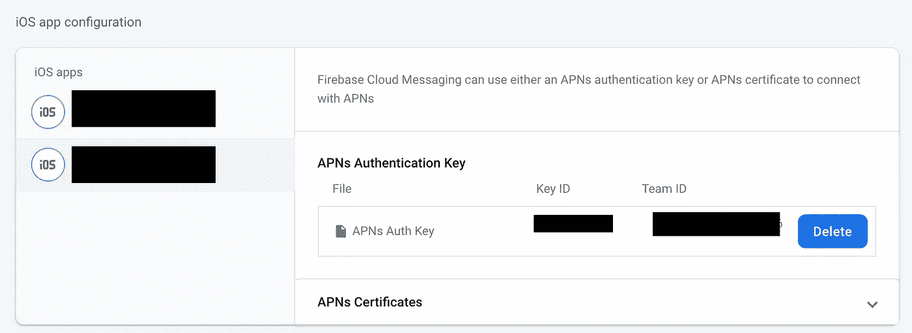
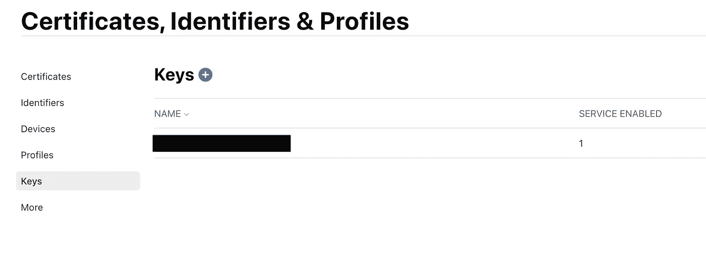
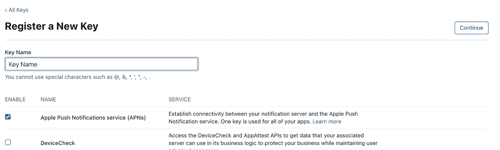

# 如何在 React 本机应用程序中设置 Firebase 推送通知

> 原文：<https://betterprogramming.pub/how-to-set-up-firebase-push-notifications-in-a-react-native-app-a9405af32093>

## 帮助您将 FCM 集成到 React 本机应用程序中的分步教程


照片由[路易斯·佩尔迪戈](https://unsplash.com/@scalabis?utm_source=medium&utm_medium=referral)在 [Unsplash](https://unsplash.com?utm_source=medium&utm_medium=referral) 上拍摄。

推送通知是增加用户参与度和让用户了解最新消息和更新的好方法。在我看来，向移动应用添加推送通知的最简单方法是使用 Firebase 云消息。FCM 可用于多种平台(iOS、Android、Unity、web ),它们的文档非常丰富。

当您根据自己的需求决定如何使用服务时，您有多种选择。例如，您可以直接从控制台发送通知，任何人都可以这样做。在这里，您可以为通知提供标题和正文，以及一些以键值对表示的可选数据。另一种选择(在我看来，也是更优雅的解决方案)是在后端完成。通过这样做，发送通知将不再需要人工干预。此外，当您拥有成千上万的用户，每个用户都根据他们的活动和更新接收个性化通知时，从控制台手动发送通知将是不可能的。

在本教程中，我们将研究如何将 Firebase 推送通知支持添加到 React 本机应用程序中。

# 需要什么库？

首先，您需要向您的项目添加一些依赖项。

请确保您仔细遵循每一步！哪怕是一行代码或者错过一个步骤，都会导致无休止的调试。

## 反应自然燃烧基

将资源库添加到项目中:

```
yarn add @react-native-firebase/app
```

现在，让我们配置库。

对于 Android 端，首先需要将`google-services.json`(从 Firebase 控制台下载)添加到项目的`android/app`目录中。然后，让我们在您的应用程序中启用谷歌服务。

前往`android/build.gradle`，将高亮显示的行添加到`buildscript dependencies`部分:

```
buildscript {
  dependencies {
    *// ... other dependencies*
    classpath 'com.google.gms:google-services:4.3.4' // ADD THIS
  }
}
```

在`android/app/build.gradle`中，添加这一行:

```
apply plugin: 'com.google.gms.google-services'
```

对于 iOS 端，我们首先需要配置 Firebase SDK。

在`AppDelegate.m`中，添加以下导入:

```
#import <Firebase.h> // ADD THIS// Make sure that Firebase.h is before FB_SONARKIT_ENABLED
#ifdef FB_SONARKIT_ENABLED 
```

在`didFinishWithLaunching`方法中，您应该在顶部添加以下内容:

现在，让我们将`GoogleService-Info.plist`添加到项目中。如果你还没有，你需要在 Firebase 控制台上创建一个 iOS 应用程序。确保您在那里使用的包 ID 是正确的。

将`.plist`文件添加到项目中时，使用 Xcode 添加非常重要。我犯了一个错误，只是将文件粘贴到了`ios`目录中。然后我不明白为什么我的同事不能在他们的机器上运行这个项目。我也将解释如何解决这个问题。

正确的做法是在 Xcode 中打开你的`.xcworkspace`文件，然后右键点击项目，“将文件添加到项目名”，然后选择`.plist`文件。出现提示时，勾选“需要时复制项目”框。

如果您不小心使用了复制粘贴将文件添加到项目中，那么不用担心！在 Xcode 中的“构建阶段”选项卡中找到您的目标。找到“复制包资源”一节，确保包含了正确路径的`.plist`文件(如果没有包含，就在这里包含它)。

剩下要做的就是连接库。

```
cd ios && pod install
```

如果您喜欢手动链接，您可以在[文档](https://rnfirebase.io/)中找到如何操作。

如果您对上面的任何步骤感到困惑，请访问 [RNFirebase 网站](https://rnfirebase.io/)来完成配置。

# 对本机推送通知做出反应

[这个库](https://github.com/zo0r/react-native-push-notification)在你的应用中增加了对本地和远程通知的支持。

```
yarn add react-native-push-notification
```

对于 iOS，我们将需要再添加一个库，但是我们会马上研究这个问题。首先，让我们配置 Android。

在`android/build.gradle`中:

在`android/app/build.gradle`中:

在`MainApplication.java`中，您只需要添加这个导入:

```
import com.dieam.reactnativepushnotification.ReactNativePushNotificationPackage;
```

在您的`AndroidManifest.xml`文件中，您将添加以下内容:

# iOS 推送通知

现在，在继续修改`index.js`和`App.tsx`之前，我们将安装[支持推送通知的库](https://github.com/react-native-push-notification-ios/push-notification-ios)。

```
yarn add @react-native-community/push-notification-ios
```

别忘了链接:

```
cd ios && pod install
```

在 Xcode 中进行以下更改。他们会帮助你格式化，并找出你是否有任何错误。

在`AppDelegate.h`中，您将添加以下导入:

```
#import <UserNotifications/UNUserNotificationCenter.h>
```

然后您将在同一个文件中添加`UNUserNotificationCenterDelegate`协议:

```
[@interface](http://twitter.com/interface) AppDelegate : UIResponder <UIApplicationDelegate, RCTBridgeDelegate, UNUserNotificationCenterDelegate>
```

在`AppDelegate.m`中，您将做一些补充:

同样在同一个文件中，您将更改:

# 您必须进行的其他 iOS 配置

您需要为 iOS 添加通知功能。为了做到这一点，在 Xcode 中转到您的目标，到“签名和功能”标签，并添加一个新的功能:`Push Notifications`。

你的推送通知不会在 iOS 设备上工作，除非你给 Firebase 控制台添加一个 APN 键。转到控制台中的“项目设置”。在这里，你会看到一个应用程序列表(如果你没有使用 flavors，可能是一个 Android 和一个 iOS)。转到云消息选项卡。在“iOS 应用程序配置”部分，您会看到“APNs 认证密钥”小节。



名单上有两个 iOS 应用，因为我们用的是 flavors。如果你只有一个，不用担心。

现在，让我们获取您在屏幕截图中看到的 APNs 身份验证密钥。我以前忘记了这一步，不明白为什么我的 iOS 通知不会进来！不要重复我的错误。

前往 Apple 开发者控制台。在“证书、标识符和配置文件”部分，选择“密钥”子部分。

*专业提示:如果你以前从未使用过这个控制台，或者你只是对知识如饥似渴，我有一个非常简单易懂的教程* *，它将教你如何创建一个 iOS 应用程序，如何配置方案，什么是证书，等等。*



添加新密钥。切换 APN 并为您的键设置一个名称:



下载它，但不要关闭标签。上传到 APN 区的 Firebase，并输入所需的 id。你会在你没有关闭的苹果开发者标签上找到它们。

还和我在一起吗？厌倦了配置？好消息是:他们完成了。剩下要做的就是编写实际的代码来处理收到的通知。这不会花太长时间。

# 代码

我通常会在项目中添加一个`NotificationManager`，这样我们就可以把所有东西都放在一个地方。以下要点包含了接收推送通知和本地通知(如果需要实现的话)所需的一切:

最后一步是修改您的`index.js`文件:

要点是，我给了你推送通知可能需要的所有东西。您可以自由使用与您相关的部分。同样，如果您也感兴趣的话，gist 还会处理本地通知。

您将收到的通知可能包含一些附加数据，例如当您从通知中打开应用程序时，您应该导航到用户的目的地。

尝试从 Firebase 控制台发送通知(云消息传递->新通知)。选择您的两个项目(iOS 和 Android)以确保它们都可以工作。请记住，iOS 模拟器不能用于测试推送通知:为此，您需要一个物理 iOS 设备。Android 对我们有好处:我们可以毫无困难地在模拟器上测试通知。

# 通知故障排除

如果您的通知没有到达:

*   验证您是否已经将`.plist`和`google-services.json`文件添加到它们应该在的地方。
*   检查包名和包 id。
*   确保 Xcode 项目确实检测到了`.plist`文件(我在上面解释了如何做)。
*   不要忘记给 Firebase 控制台添加 APN 键，否则 iOS 通知将无法工作。

在配置了通知并确保可以从 Firebase 控制台发送它们(它们正在到达两个平台)之后，当应用程序启动时，您需要将 Firebase 令牌发送到后端服务器。当然，只有当你的应用程序有后台支持时，你才会这么做。

# 结论

向 React 本地项目添加推送通知有点乏味，并且涉及大量配置。此外，漏掉一行可能会导致几个小时的调试，所以请确保您仔细遵循了每一步。我确信这些步骤将导致一个工作的推送通知项目。

我希望这对你有所帮助。感谢阅读和快乐编码！