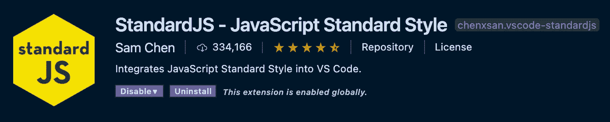
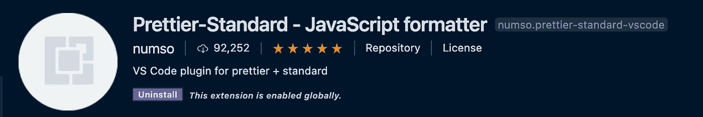
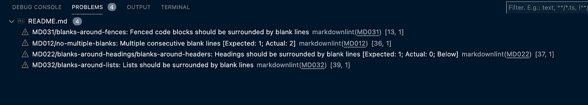
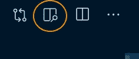
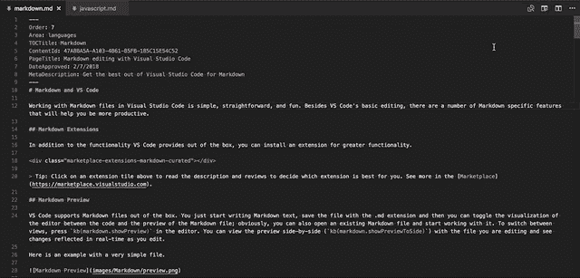

# 如何为 VS 代码和 Ruby on Rails 设置 Linters 和 Formatters

> 原文：<https://betterprogramming.pub/how-to-set-up-linters-and-formatters-for-vs-code-and-ruby-on-rails-287394540754>

## StandardJS、Stylelint、Rubocop 和 Markdownlint


照片由[卢卡布拉沃](https://unsplash.com/@lucabravo?utm_source=medium&utm_medium=referral)在 [Unsplash](https://unsplash.com?utm_source=medium&utm_medium=referral) 拍摄。

有了合适的工具，任何开发人员都可以享受令人非常满意的编码会议。掌握心流就是授权。相反的会导致沮丧和烦恼。幸运的是，在编码最佳实践方面，linters 和 formatters 可以帮助完成繁重的工作。

在下面的指南中，VS 代码用户和 Ruby on Rails 开发人员可以找到一个详细的设置，来立即构建格式良好、风格独特的项目！

1.  JavaScript**—**standard js(w beauty)
2.  CSS 和 SCSS — Stylelint
3.  Ruby — Rubocop 和 Rubocop Rails
4.  Markdown — Markdownlint

首先，棉绒和格式器有什么区别？

linter 检查代码的最佳实践和代码质量。它检查编程错误和风格错误。它就像是编程语言的高级拼写检查器(例如[语法上的](https://www.grammarly.com/))。格式化程序擅长在任何地方应用一致的格式(比如制表符和空格)。Linters 可以用作格式化程序，但是它们可能并不总是最好的。看情况。对于 JavaScript 文件，使用 Standard 作为 linter 和 Prettier 作为 formatter 是一个很好的组合。对于 Ruby 来说，Rubocop 既有强大的格式化功能，也有林挺功能。

linter 可以通过终端命令来执行。最重要的是，它可以集成到编辑器中(例如 VS 代码)。您可以在不离开开发环境的情况下释放高级格式和样式技能。本文将帮助您设置这两者。没有无休止的搜索来安装正确的软件包或找到正确的格式规则。下面是从 A 到 z 的安装指南。

# 1.JavaScript 标准样式

[Standard](https://standardjs.com/) 是一个流行的固执己见的 JavaScript 格式化程序。忘记创建复杂的安装文件或异常列表。遵循最佳实践，花更多的时间编码而不是格式化！标配贴心无配置(比如。eslint)来帮助自动格式化 JS 代码。

1.  安装标准 JS:

*   纱线使用者？→ `yarn add standard`
*   NPM 用户？→ `npm install standard`

2.在你的终端中运行`standard`。

3.运行`standard --fix`自动修复所有发现的问题。

## **集成到 VS 代码编辑器**



[*VS 代码安装*](https://marketplace.visualstudio.com/items?itemName=chenxsan.vscode-standardjs)

打开`settings.json`文件，禁用默认的 JavaScript 默认内置验证。

*注意:Mac 用户可以在选择“首选项:打开设置(JSON)”的同时，用 Cmd + Shift + P 打开* `*setting.json*` *文件*

```
"javascript.validate.enable": false
```

您现在可以简单地让 StandardJS 负责用 Cmd + Shift + P 格式化 JavaScript 文件，同时选择“JavaScript 标准样式:修复所有可自动修复的问题”

## **ES7 for Javascript 标准样式**(可选)

一些开发人员喜欢使用实验性的 JavaScript 特性(ES7 语法)。标准可能会显示一些风格上的问题，可以通过添加 babel-eslint 作为依赖项来解决。例如:

```
Parsing error. Unexpected token =.
```

1 .添加 babes-eslint 作为依赖项:

*   纱线使用者？→ `yarn add babel-eslint --dev`
*   NPM 用户？→ `npm install eslint babel-eslint --save-dev`

在您的终端中:

2.运行`standard --parser babel-eslint`来 lint 所有文件。

3.运行`standard --parser babel-eslint --fix`自动修复所有发现的问题。

为了去掉 VS 代码中同样的错误，[安装 ESLint](https://marketplace.visualstudio.com/items?itemName=dbaeumer.vscode-eslint) 并在`settings.json`文件中设置`"eslint.enable": true`。

## **在 VS 代码中更漂亮和标准(可选)**



[*VS 代码安装*](https://marketplace.visualstudio.com/items?itemName=numso.prettier-standard-vscode)

如果您使用 pretty 作为格式化程序，您可以安装 pretty-Standard 包。漂亮处理视觉格式。在编写 JavaScript 时，Standard 可以作为一个提示来帮助指导您的最佳实践。

# 2.Rubocop 和 Rubocop 导轨

[Rubocop](https://github.com/rubocop-hq/rubocop) 实现了开箱即用的大部分 [Ruby 风格指南](https://rubystyle.guide/)。检查[配置选项](https://github.com/rubocop-hq/rubocop/blob/master/config/default.yml)，通过覆盖`.rubocop.yml` *启用或禁用某些规则。如果你想让 Rubocop 标记 Rails 的最佳实践和编码约定，你也可以添加进来。检查[轨道最佳实践](https://docs.rubocop.org/rubocop-rails/cops_rails.html)。*

1.  将此添加到 gem 文件中:

```
group :development, :test do
 **gem 'rubocop', require: false**
 **gem 'rubocop-rails', require: false**
end 
```

2.在您的终端中运行`bundle install`。

3.将它添加到`.rubocop.yml`文件的顶部。*注意:* `*.rubocop.yml*` *文件位于您的存储库级别。如果没有，自己创建一个(* [*例子*](https://gist.github.com/jhass/a5ae80d87f18e53e7b56) *)。*

```
**require:
  - rubocop-rails**
```

4.运行`rubocop --auto-correct-all`或较短的`rubocop -a`自动纠正[所有(安全)违规](https://docs.rubocop.org/rubocop/usage/auto_correct.html)。

有些错误不能自动纠正，因为它们会过多地改变代码的语义。在这种情况下，Rubocop 会列出违规行为，你可以手动查看。

# 3.Stylelint

这是[一个现代的 CSS linter](https://stylelint.io/) ，帮助你执行一致的约定，避免样式表中的错误。当您编辑 CSS 和 SCSS 文件时，它会显示打字错误、错误和主动反馈。检查格式化[规则](https://stylelint.io/user-guide/rules/list)。

1.  安装 Stylelint:

*   纱线使用者？→ `yarn add stylelint stylelint-config-standard --dev`
*   NPM 用户？→ `npm install stylelint stylelint-config-standard --save-dev`

2.在存储库的顶层创建一个名为`.stylelintrc.json`的配置文件。

```
{
 **"extends": "stylelint-config-standard"**
}
```

3.对您的存储库执行样式检查:

*   敬风格。css 文件，运行`stylelint "**/*.css"`。
*   敬风格。scss 文件，运行`stylelint "**/*.scss"`。

## **集成到 VS 代码编辑器**


[*VS 代码安装*](https://marketplace.visualstudio.com/items?itemName=stylelint.vscode-stylelint)

避免两次标记相同的问题。让它和顺风一起很好地工作。将此添加到 VS 代码的`settings.json`文件中:

```
"css.validate": false,
"less.validate": false,
"scss.validate": false
```

手动修复标记的错误，或者使用以下命令让 stylelint 自动修复所有错误:Cmd + Shift + P，同时选择“Stylelint:修复所有可自动修复的问题”

# 4.Markdownlint

Markdown 是帮助开发人员将纯文本转换成样式化文档的最常见语言之一。有关如何使用 markdown 的简短指南，请查看此[备忘单](https://github.com/adam-p/markdown-here/wiki/Markdown-Cheatsheet)。

1.  安装 [Markdownlint](https://marketplace.visualstudio.com/items?itemName=DavidAnson.vscode-markdownlint) :

*   纱线使用者？→ `yarn add markdownlint --dev`
*   NPM 用户？→ `npm install markdownlint --save-dev`

2.在您的终端中:

*   运行`markdownlint README.md`对自述文件进行样式检查。
*   运行`markdownlint -f README.md`修复特定文件中发现的错误。
*   如果存储库中存在多个降价文件，运行`markdownlint **/*.md --ignore node_modules`来 lint 所有降价文件(不包括外部库中的降价文件)。

## **集成到 VS 代码编辑器**


[*VS 代码安装*](https://marketplace.visualstudio.com/items?itemName=DavidAnson.vscode-markdownlint)

一旦安装，降价规则将自动编译。md)文件在 VS 代码中打开(如`[README.md](http://README.md)`)。您可以手动进行更改以消除样式冲突。关于 linter 规则的完整概述:查看 GitHub 上的 [Markdowlint repo](https://github.com/DavidAnson/markdownlint/blob/main/doc/Rules.md) 。



VS 代码中的 markdownlint 集成

# **实时预览**

在 VS 代码中打开一个 markdown 文件时，一个小图标会出现在右上角。点击图标后，会打开一个新标签，并列预览您的降价代码。编辑时，更改会实时反映出来。



点击图标以实时查看降价文件



实时查看降价演示

# 结论

如果你正在寻找更有帮助的 VS 代码扩展，看看这篇文章。

有什么反馈吗？请让我知道。

感谢阅读！