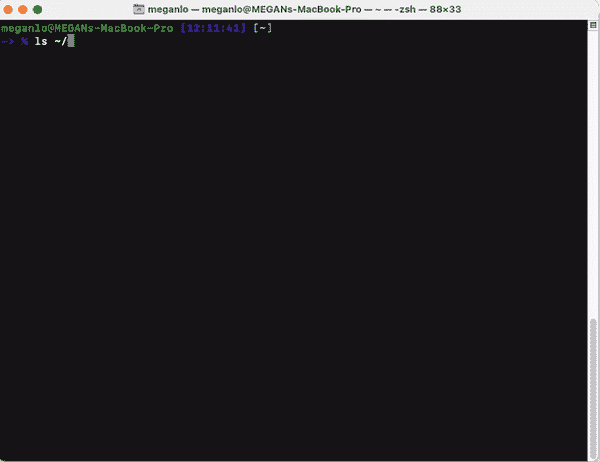
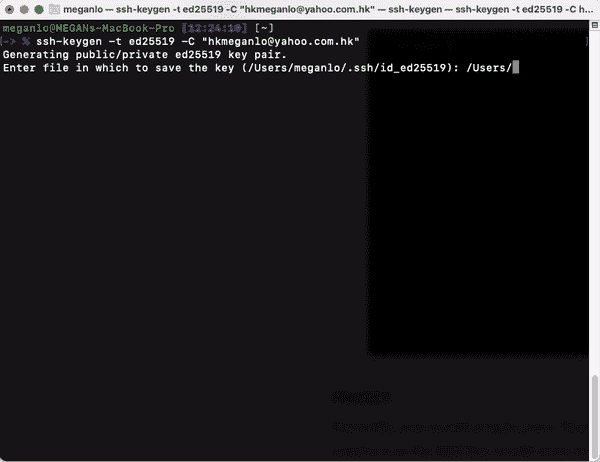
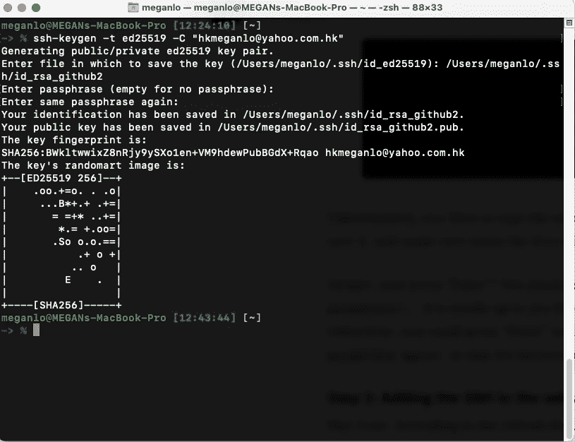
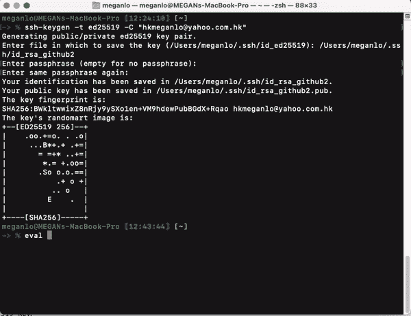
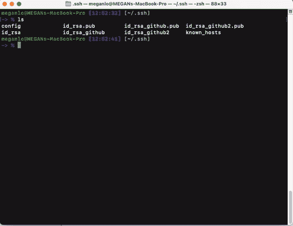
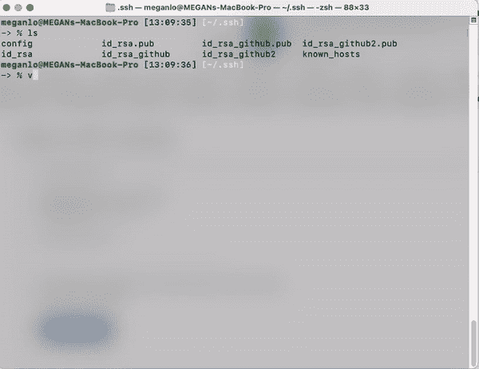

# 如何在电脑上设置多个 SSH 密钥

> 原文：<https://betterprogramming.pub/how-to-set-up-multiple-ssh-keys-ae6688f76570>

## 对于需要为多台主机设置多个 SSH 密钥的人来说，这是一个快速指南


照片由[阮晋勇](https://unsplash.com/@nguyendqnhu?utm_source=medium&utm_medium=referral)在 [Unsplash](https://unsplash.com?utm_source=medium&utm_medium=referral) 拍摄

你好！我写这篇文章的灵感来自于我在设置多个 SSH 密钥时偶然发现的一些问题。

我最初是为我的个人 GitHub 设置的。几天前，我开始为一个需要另一组 SSH 密钥对的非营利组织做志愿者。我不知道的是，我不应该用新的 SSH 密钥对覆盖旧的 SSH 密钥对，并期望它们能够工作。有一天，我正在做我的一个个人项目，试图推送到 GitHub，但是我的终端告诉我:**“拒绝许可(publickey)。”在花了无数个小时搜索之后，我终于解决了问题，并从错误中吸取了教训。我将带您了解这一过程，以便您可以快速高效地设置自己的产品。**

# 目录

`▹ [Step 1](#54ba): Double-check if you have an existing SSH key.
▹ [Step 2a](#f204): If you don’t have an existing SSH key, generate a new SSH key
▹ [Step 2b](#eed2): Save the SSH key in the according file of your choice.
▹ [Step 3](#e58a): Add the SSH to the ssh-agent
▹ [Step 4](#bb5f): Add your SSH private key to the ssh-agent
▹ [Step 5](#354c) It depends: Add the SSH key to your GitHub account
▹ [Step 6](#d2c5) Optional: To double-check if your git is connecting to your server`

## 步骤 1:仔细检查您是否有一个现有的 SSH 密钥。

★开放终端(针对 Windows 用户的 Git Bash。)

★输入`ls ~/.ssh` (/。ssh/是一个隐藏文件夹。可以通过终端访问，或者 Mac:`cmd + shift + .`；Windows:勾选[显示隐藏文件](https://support.microsoft.com/en-us/windows/view-hidden-files-and-folders-in-windows-10-97fbc472-c603-9d90-91d0-1166d1d9f4b5#)



(如果没有加载，您可能需要刷新浏览器才能看到)

## 步骤 2a:如果您没有现有的 SSH 密钥，那么生成一个新的 SSH 密钥

★输入`ssh-keygen -t ed25519 -C "*your_email@example.com*"`(用您与 GitHub 关联的电子邮件替换该电子邮件)或简单地用`ssh-keygen`替换其他主机。

★如果是为了 GitHub，你应该看看`Generating public/private ed25519 key pair`，或者`Generating public/private rsa key pair`。


## 暂停！！

通常，您只需按下`Enter`(或者 Mac 用户按下`Return`)继续，因为 SSH 密钥会存储在提示符指定的默认文件中(`id_rsa`)。但是，由于我们正在设置多个 SSH 密钥，我们希望用不同的名称命名这些密钥，这样您就可以区分哪个是哪个，也便于以后使用。

## 步骤 2b:将 SSH 密钥保存在您选择的相应文件中。



不幸的是，您必须键入要保存它的完整路径名，并确保用不同的名称命名这些键。

好了，现在按`Enter`！你应该看看`Enter passphrase(empty for no passphrase):`。你想不想要密码完全取决于你。否则，当您看到这个:`Enter same passphrase again:`时，您可以按`Enter`和`Enter`来跳过输入任何密码短语的过程。



您应该会看到类似这样的内容👆🏻

## 步骤 3:将 ssh 添加到 SSH 代理

Mac 用户:根据 GitHub 文档，如果要向代理添加 SSH 密钥，请使用默认的 macOS `ssh-add`命令。

我假设您在 ssh 文件夹中获得了配置文件，因为这不是您第一次设置 SSH 密钥。

如果你不知道或者你只是想仔细检查，你可以:

★在后台启动 ssh-agent`eval "$(ssh-agent -s)"`



别担心，你和我会有不同的特工编号。

★查看你的`~/.ssh/config`是否存在。

★你可以在`~/.ssh/`中输入`ls`

(对不起，Windows 用户。这一点我了解的不多，但是根据 GitHub 的说法，你可以跳过这一部分，直接去设置私钥。)

★类型`vim config`。这将打开配置文件，无论您是否有该文件。您可以使用 Vim 文本编辑器编辑配置文件。



★进入该页面后，按下`i`即可插入您的 ssh-agent。按住键盘上的`Option`(Windows 上的`alt`)并单击您想要复制和粘贴以下项目的任意位置。

对于 GitHub，您可以复制并粘贴以下内容:

```
Host *
  AddKeysToAgent yes
  UseKeychain yes
  IdentityFile ~/.ssh/id_rsa_github2 <- change this to whatever you name your ssh-key, in my case, it would be id_rsa_github2
```

如果您使用其他站点，比如 AWS CodeCommit，您需要找到相应的 ssh-agent 名称:

```
Host git-codecommit.*.amazonaws.com   
  User *APKAEIBAERJR2EXAMPLE*  <- You would find this when you upload the SSH key and it's under SSH Key ID
  IdentityFile ~/.ssh/*codecommit_rsa* <- change this to whatever you name your ssh-key
```

## 在`vim config`之后

★完成后，按键盘上的`esc`退出“插入”模式，键入`:wq`，然后按`Enter` 退出文本编辑器。



## 步骤 4:将您的 ssh 私有密钥添加到 SSH 代理中

```
ssh-add -K ~/.ssh/id_rsa_github2
```

## 视情况而定:将 SSH 密钥添加到您的 GitHub 帐户

这里有来自 GitHub 的[详细说明和指导](https://docs.github.com/en/free-pro-team@latest/github/authenticating-to-github/adding-a-new-ssh-key-to-your-github-account)，你可以遵循。

## 步骤 6 可选:仔细检查您的 git 是否连接到您的服务器

(那是我设置好我的钥匙后去找的。)

对于 GitHub，请键入以下内容:

```
ssh -T *GITHUB-USERNAME*@github.com
```

如果你有`Permission denied (publickey)`，继续复制粘贴:

```
ssh -T git@github.com
> Hi *username*! You've successfully authenticated...
```

如果您仍然有`Permission denied`，您可能想要检查您的 SSH 密钥是否在您的主机代理、您的配置等中设置正确。更多信息[此处](https://docs.github.com/en/free-pro-team@latest/github/authenticating-to-github/error-permission-denied-publickey)专门针对 GitHub。

## 步骤 7:如有必要，重复说明(回到[步骤 1](#54ba)

如果您还需要设置更多的 SSH 密钥，只需重复上面的说明，就可以了😉。我还建议仔细检查您正在尝试连接的主机代理的说明。如果您对如何设置多个 SSH 密钥感兴趣，那么本文是一个通用案例。

注意:如果我错过了什么，我会感谢任何意见。我希望在这篇文章中包括 Windows 用户。让我知道你还做了什么让它工作！

 [## 用 SSH 连接到 GitHub

### 您可以使用 SSH 连接到 GitHub。使用 SSH 协议，您可以连接到远程服务器并进行身份验证，并且…

docs.github.com](https://docs.github.com/en/free-pro-team@latest/github/authenticating-to-github/connecting-to-github-with-ssh) [](https://docs.aws.amazon.com/codecommit/latest/userguide/setting-up-ssh-unixes.html) [## Linux、macOS 或 Unix 上 AWS CodeCommit 存储库的 SSH 连接的设置步骤

### 在第一次连接到 CodeCommit 之前，您必须完成一些初始配置步骤。你先请…

docs.aws.amazon.com](https://docs.aws.amazon.com/codecommit/latest/userguide/setting-up-ssh-unixes.html)