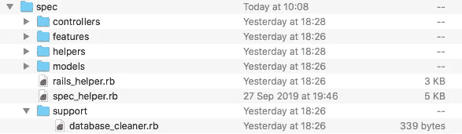

# 如何用 RSpec、Capybara 和 Database_cleaner 设置 Rails

> 原文：<https://betterprogramming.pub/how-to-set-up-rails-with-rspec-capybara-and-database-cleaner-aacb000070ef>

## 在 15 分钟内配置一个测试框架

JOSHUA COLEMAN 在 [Unsplash](https://unsplash.com/s/photos/matrix-glasses?utm_source=unsplash&utm_medium=referral&utm_content=creditCopyText) 上拍摄的照片

对这个世界来说，可悲的是，我们从来没有得到《黑客帝国》的前传，在那里，机器埋头苦干，为它们的模拟编写高质量的验收测试。

我把它想象成一个长达六个月的未删节的艺术作品，充满了多条腿在多个键盘上颠簸，并不时夹杂着二进制脏话。

如果我们这样做了，各地的初级开发人员可能就不会那么不情愿弄脏自己的手——并保持他们的代码干净——进行测试。

测试很重要。无论你是想从竞争工作的初级开发人员中脱颖而出，还是你只是一个工作代码的爱好者，学习测试你自己的应用程序都是无价的。

但是，到达可以开始测试的点本身就是一个考验。最近，我坐在我的键盘前，敲出了一个复古的 Rails 社交网络的注册、登录和资料流。

“一份温和的周日工作，”我心想。半天后，伤痕累累，疲惫不堪，步履蹒跚，我差不多配置好了测试框架。

以下是如何在 15 分钟内完成的。

# 工具

下面是我用来测试简单的、无 JavaScript 的 Rails 项目的方法:

## **RSpec**

Rails 的新版本使用 [MiniTest](https://github.com/seattlerb/minitest) 作为默认的测试框架。我比较熟悉 [RSpec](http://rspec.info/) 。幸运的是，两者可以互换，不会有太大问题。

## **水豚**

每个人都喜欢的不寻常大小的啮齿动物， [Capybara](https://github.com/teamcapybara/capybara) 是一个漂亮可读的验收测试框架，模拟用户如何在浏览器中与你的应用程序交互。想想访问页面、填充字段和点击按钮。

## **数据库 _ 清理器**

我使用 [database_cleaner](https://github.com/DatabaseCleaner/database_cleaner) gem 在每次测试运行之前清理我的测试数据库，确保每次都有干净的石板和稳定的基线。

[默认情况下，RSpec 将实际上为您做这件事](https://relishapp.com/rspec/rspec-rails/docs/transactions)，用一个数据库事务运行每个测试，然后在它完成后回滚那个事务。

然而，有一些怪癖会让你措手不及:

*   在 RSpec `before(:each)`钩子中创建的数据在每次测试后都会回滚——非常好。
*   在一个`before(:all)`钩子中创建的数据*不会*回滚。除非您手动处理它，否则该数据可能会开始干扰套件中的其他测试。
*   如果你用带`:js`选项的水豚来测试带[硒](https://www.seleniumhq.org/)或[网络工具包](https://webkit.org/)，RSpec 的事务清理器[根本无法工作](https://avinmathew.com/mixing-databasecleaner-transaction-and-truncation-strategies/)。

如果你想配置你自己的清理器，我已经在下面包括了 database_cleaner 的要点。

# 入门指南

1.  要使用 RSpec，创建新的 Rails 项目*而不使用默认的测试框架*。现在这样做比以后再进行全面驱魔要简单得多。在你的控制台上运行`rails new <project_name> -T`。

2.将`rspec-rails`、`capybara`和`database_cleaner`添加到 gem 文件中。

3.运行`bundle install`来安装新的 gems。

4.运行`bundle exec rails g rspec:install`来初始化 RSpec，并在您的项目目录中生成`spec`文件夹。这是你所有测试的地方。

# 配置 RSpec 和水豚

1.  在`spec/rails_helper.rb`中，确保`require 'rspec/rails'`和`require 'capybara'`都存在。这将允许每个需要`rails_helper`访问 RSpec 和 Capybara 的测试文件，而无需单独访问它们。

2.水豚测试通常被称为“功能测试”，因为与单元测试不同，它们测试依赖于代码中多个系统的复杂程序行为。继续创建一个`spec/features`目录来存储这些测试。

# 为 RSpec 配置 database_cleaner

Database_cleaner 需要更多的爱才能工作。

1.  在`rails_helper.rb`中，将`config.use_transactional_fixtures`设置为`false`。这告诉 RSpec 不要用数据库事务运行每个测试——我们将让`database_cleaner`来处理它。

2.创建一个新目录:`spec/support`。为了保持项目有序，这是我们存储配置文件`database_cleaner`的地方。

3.在`spec/support`中，创建`database_cleaner.rb`。这里是你的`spec`文件夹此时的样子:

3.在`database_cleaner.rb`里面，打开这个代码块:

4.在块内，添加以下内容:

这指示 RSpec 在每个测试套件之前使用 database_cleaner 来“截断”数据库——它完全清空每个表。这是一种强力的数据库清理方法，但是对于个人项目来说，它会很好。

如果使用活动记录，那么`except`语句是必不可少的。没有它，database_cleaner 将破坏活动记录的环境数据，导致每次测试运行时出现一个`NoEnvironmentInSchemaError`。

5.接下来，添加:

在逐个测试的基础上(即`before(:each)`，而不是`before(:suite)`，截断是多余的。

在这里，我们将 database_cleaner 策略设置为`transaction`，这意味着每个测试都将创建一个数据库事务，当它结束时将简单地回滚，就好像它从未发生过一样。

`DatabaseCleaner.start`和`DatabaseCleaner.end`只是在每次测试前后启动清洁过程的触发器。

下面是完成后的`database_cleaner.rb`文件的样子(我永远感谢[良性代码](http://www.virtuouscode.com/2012/08/31/configuring-database_cleaner-with-rails-rspec-capybara-and-selenium/)在这一点上的帮助):

6.最后用`require 'support/database_cleaner'`告诉`rails_helper.rb`去哪里找`database_cleaner.rb`。

就这样——您已经准备好开始编写测试了！

# 资源和进一步阅读

*   [Github 上的水豚](https://github.com/teamcapybara/capybara)
*   [用 Selenium 配置 database _ cleaner](http://www.virtuouscode.com/2012/08/31/configuring-database_cleaner-with-rails-rspec-capybara-and-selenium/)—良性代码
*   [Github 上的数据库清理器](https://github.com/DatabaseCleaner/database_cleaner)
*   [RSpec 首页](https://rspec.info/)
*   [RSpec 交易](https://relishapp.com/rspec/rspec-rails/docs/transactions)
*   [混合数据库清理器事务和截断策略](https://avinmathew.com/mixing-databasecleaner-transaction-and-truncation-strategies/) — Avin 的博客