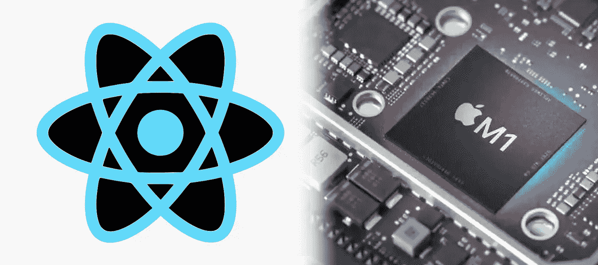
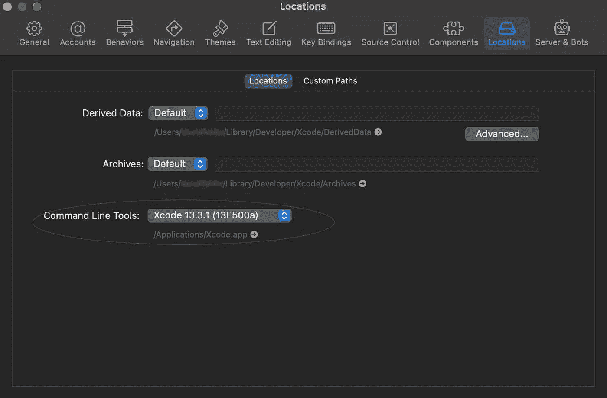

# 如何在 M1 Mac 2022 版上设置 React Native

> 原文：<https://betterprogramming.pub/how-to-set-up-react-native-on-m1-mac-2022-edition-24a0a5c27d9d>

## React Native 的文档不包含 M1 苹果硅细节



David Fekke 的图片

我最近购买了一台 M1 Mac 用于开发。这是我第一次使用 M1 Mac，所以我想分享我的经验。

在浏览 [React-Native 文档](https://reactnative.dev/docs/0.67/environment-setup)时，我发现很多都已经过时了。以下是我在新 Mac 上运行 React-Native 时必须做的事情。

# 确定您已经安装了 Xcode

请确保在 Mac 上安装最新版本的 Xcode。这可以通过访问 Mac 上的 App Store，搜索 Xcode，然后安装来安装。

# 确定安装 Xcode 命令行工具已安装

当您打开 Xcode 时，应该会提示您安装 Xcode 命令行工具。要验证您是否安装了工具，请转到首选项，选择位置，并确保您安装了工具的最新版本。它应该如下所示:



# 安装自制软件

[如果苹果有一个软件包管理器，那么自制软件](http://brew.sh)就像是 apt-get。您可以通过在终端中运行以下命令来安装 Homebrew

```
> /bin/bash -c "$( curl -fsSL https://raw.githubusercontent.com/Homebrew/install/HEAD/install.sh) "
```

这可能需要一点时间来安装，请耐心等待。

# 安装 Node.js 的当前 LTS 版本

接下来，您将需要安装 LTS 版本的 [Node.js](https://nodejs.org/) 。我推荐使用他们网站上的安装程序，但是你也可以用自制软件安装。

# 安装守夜人

用自制软件安装 watchman。在您的终端中运行以下命令来安装 watchman

```
> brew install watchman
```

# 安装 Cocoapods

使用`homebrew`安装 [Cocoapods](https://cocoapods.org/) ，不要使用文档中列出的 Ruby `gem`命令。椰子就像节点的 NPM。它用于安装项目的依赖项。您不能在 iOS 上使用 React Native 来安装 Cocoapods。

```
> brew install cocoapods
```

# 让我们创建一个新项目，以确保您的安装工作正常

一旦安装了所有的必备组件，就可以从它们的文档中运行以下示例

```
> npx react-native init AwesomeProject
```

安装示例项目后，您可以使用以下命令运行它；

```
> npx react-native run-ios
```

# 结论

在 Apple Silicon Macs 上开发的所有问题还没有解决，但是只要做一些小的改变，你就可以在你的 M1 Mac 上运行 React-Native。

*原发布于*[*https://fek . io*](https://fek.io/blog/how-to-set-up-react-native-on-m-1-mac-2022-edition/)*。*