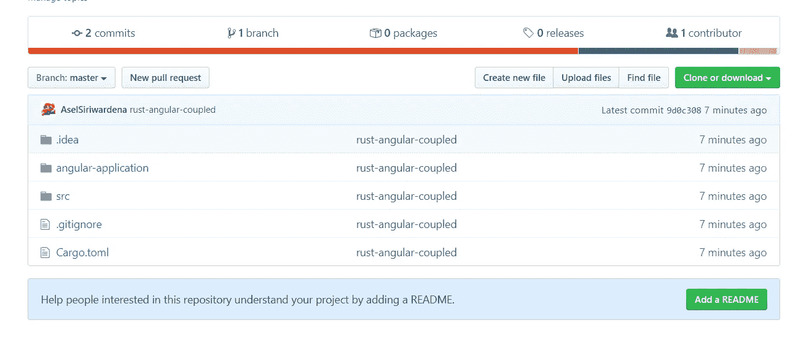
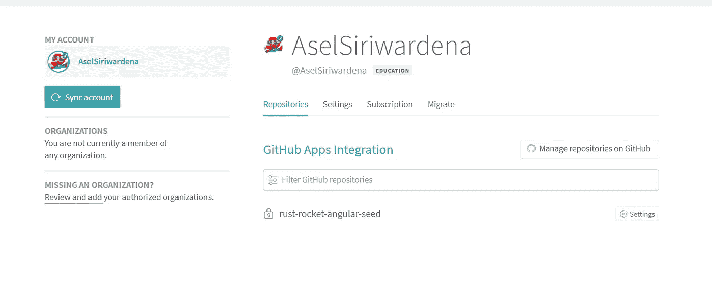
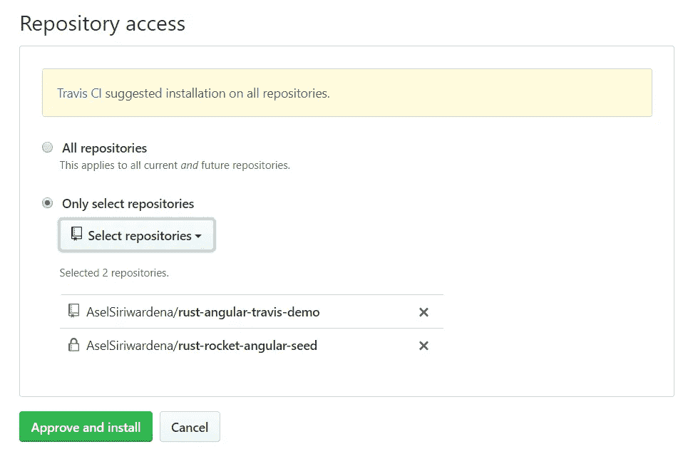
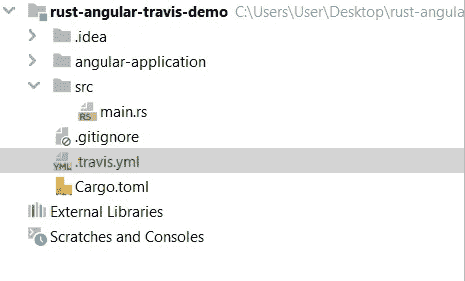
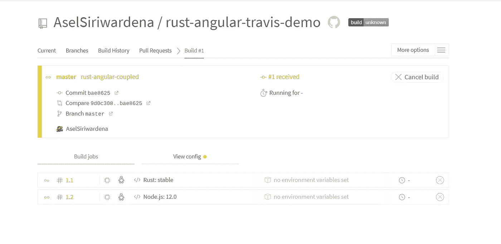
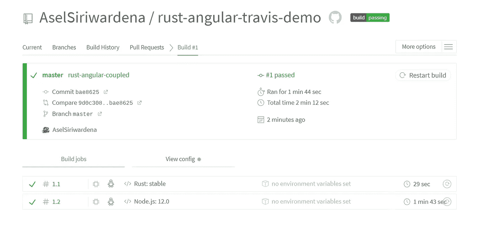
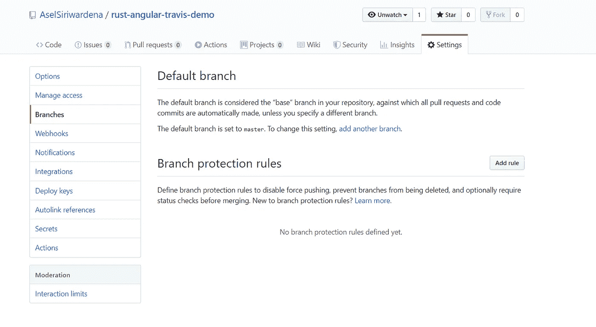
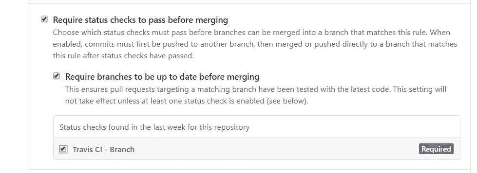

# 如何使用多语言版本设置 Travis CI

> 原文：<https://betterprogramming.pub/how-to-set-up-travis-ci-with-multiple-languages-82d70087f95b>

## 验证您的应用程序在所有受支持的语言中都能正常工作并且外观良好


照片来自[特拉维斯·CI](https://travis-ci.com/)。

在本文中，我将向您展示如何设置 Travis CI，以便在同一个 GitHub repo 中构建多语言应用程序。

首先，你要在 GitHub 上做一个资源库。我将快速跳过这一步，假设您已经在本地机器上创建了项目。由于我热爱 Rust，所以我选择了 Rust 和 Angular 来做这个演示。



我在里面创建了一个铁锈项目和一个棱角项目。

接下来，在 [Travis CI](https://travis-ci.com/) 上注册，完成所有基本的事情。您可以使用 GitHub 帐户轻松登录。然后进入设置，将你的 GitHub 项目添加到 Travis 中。



点击 GitHub 上的管理存储库。在 Repository access 下，您将看到一个添加项目的选项。



然后单击“批准并安装”继续。

现在我们必须添加一个配置文件来构建我们的项目。在您喜欢的 IDE 中打开您的项目，并在根目录下创建一个名为`.travis.yml`的文件。



然后使用这些配置:

```
matrix:
  include:
    - language: rust
      rust:
        - stable
      jobs:
        allow_failures:
          - rust: nightly
        fast_finish: true - language: node.js
      node_js: "12.0"
      before_script:
        - cd angular-application
      script:
        - npm install
        - ng build --prod
```

现在你可以推动你的改变。然后，您可以看到它开始构建您的项目。单击日志的散列值。



给一些时间来完成这个过程。



然后转到您的回购设置并选择分行。现在我将添加一些规则来防止合作者将不成功的构建合并到主分支中。



单击添加规则。



根据您的喜好配置其他设置并创建您的规则。

我希望这有所帮助。干杯！