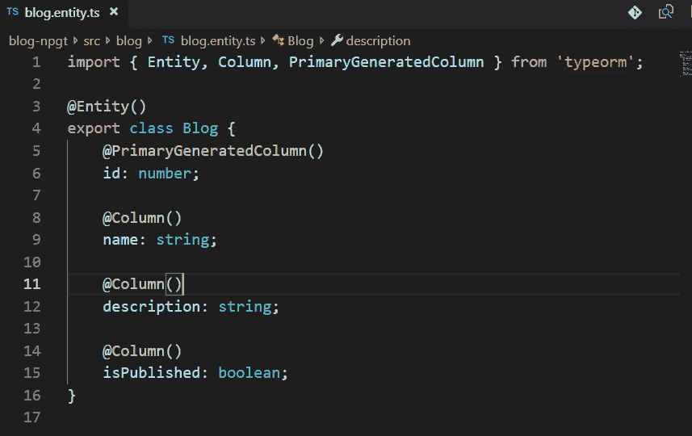
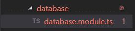
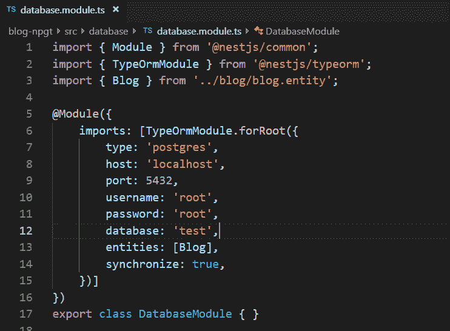
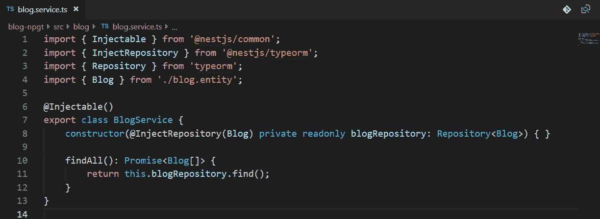
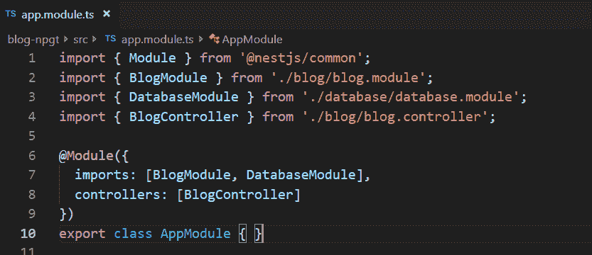

# 如何在 NestJS 中用 Postgres 设置 TypeORM

> 原文：<https://betterprogramming.pub/how-to-set-up-typeorm-with-postgres-in-nestjs-5575c949c05f>

## 查询和具有类型的对象


[活动创建者](https://unsplash.com/@campaign_creators?utm_source=unsplash&utm_medium=referral&utm_content=creditCopyText)在 [Unsplash](https://unsplash.com/s/photos/database?utm_source=unsplash&utm_medium=referral&utm_content=creditCopyText) 上拍摄的照片

NestJS 是一个有用的框架。今天我们要看看如何在 NestJS 中用 Postgres 设置 TypeORM。

但在深入细节之前，我们先回答几个问题。

# 什么是 NestJS？

NestJS 是一个用于构建高效、可伸缩的 Node.js 服务器端应用程序的框架。它使用渐进式 JavaScript，用 TypeScript 构建并完全支持 TypeScript。

NestJS 提供了开箱即用的应用程序架构，允许开发人员创建高度可测试、可伸缩、松散耦合且易于维护的应用程序。

# 定义类型

TypeORM 是一个对象关系映射器(ORM)，可以在 Node.js、浏览器和 Cordova 中运行，并且可以与 TypeScript 和 JavaScript (ES5、ES6、ES7)一起使用。

这背后的目标是通过 JavaScript 特性提供帮助，并帮助开发使用数据库的应用程序，从小型到大型。

# 为什么要使用 TypeORM？

我们选择 TypeORM 是因为它绝对是 Node.js 可用的成熟 ORM，而且它是用 TypeScript 编写的，在 NestJS 中运行得很好。

对于那些已经熟悉提到的其他技术以及 ORM 的功能的人，我很乐意帮助你尝试一下，看看为什么我喜欢使用 ORM 层。

所以让我们在 NestJS 中使用 TypeORM 来使用 Postgres。假设您已经安装了 NestJS 和 Postgres，我们需要安装所有的 TypeORM 依赖项:

```
npm i — save @nestjs/typeorm typeorm pg
```

一旦安装过程完成，首先，我们至少需要一个实体。

TypeORM 包支持存储库设计模式，因此每个实体都有自己的存储库。可以从数据库连接中获得存储库。

现在在博客目录中创建一个博客实体:



我们需要基于 TypeORM 包创建一个数据库模块。我们可以使用 Nest CLI 创建一个数据库模块。

例如:

```
**nest g mo database**
```

或者:

```
**nest generate module database**
```

然后，你会看到这样的东西。



在`database.module.ts`中，导入`TypeOrmModule`并提供以下内容:



`forRoot()`方法从`TypeORM`包中接受与`createConnection()`相同的配置对象。

`Blog`实体属于`blog`目录。这个目录代表`BlogModule`。您可以决定将模型文件保存在哪里。

让我们来看看`BlogModule`:


该模块使用`forFeature()`方法来定义哪些存储库应该在当前范围内注册。

现在，我们可以使用`@InjectRepository()`装饰器将`BlogRepository`注入到`BlogService`中。



不要忘记将`BlogModule`和`DatabaseModule`导入到根`AppModule`中:



# 结论

在本文中，我们学习了如何在 NestJS 应用程序中使用 Postgres 设置 TypeORM。

感谢您的阅读，希望这对您有所帮助。

更多细节可从官方的 [NestJS 文档网站](https://docs.nestjs.com/)获得。

[](https://dltlabs.medium.com/unit-testing-jest-with-nestjs-b5b043ac5598) [## 单元测试:与 NestJS 开玩笑

### NestJS 是一个强大的后端框架，受 Angular 的启发，在 TypeScript 上工作。NestJS 自带丰富的…

medium.com 数字实验室](https://dltlabs.medium.com/unit-testing-jest-with-nestjs-b5b043ac5598)