# 如何设置和使用 Jarvis——让您的生活更轻松的 CLI

> 原文：<https://betterprogramming.pub/how-to-set-up-use-jarvis-the-cli-that-makes-your-life-easier-54fa6d7e83b>

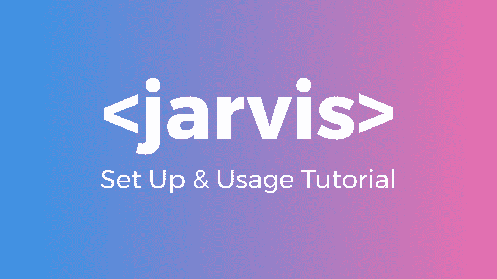

今天我们将一步一步地看看如何安装、设置和使用[贾维斯](https://github.com/willptswan/jarvis)。如果你不知道贾维斯是什么，那么你应该读一读我在[之前写的关于贾维斯是如何存在的故事](https://medium.com/swlh/building-a-cli-to-help-manage-github-accounts-react-projects-and-more-2755259be493)。

# **安装贾维斯**

让我们先来看看如何安装 Jarvis。这可以通过两种方式实现。第一种，也是我推荐的方式，是使用 NPM。如果你还没有安装 NPM，那么你可以去 [NodeJS](https://nodejs.org/en/) 网站安装。

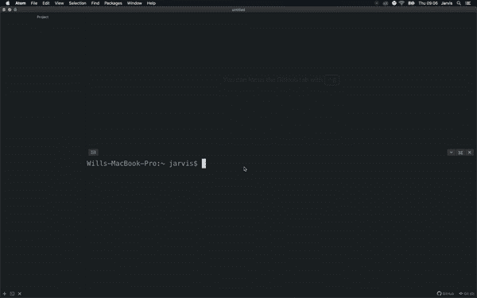

使用 NPM 安装贾维斯

用 NPM 安装贾维斯非常简单:

```
npm install -g @willptswan/jarvis
```

您可能会收到一条错误消息，称权限被拒绝。如果您看到这个，那么尝试运行前面有`sudo`的命令。

安装 Jarvis 的第二种方法是从 GitHub 克隆它。首先，您需要使用命令行导航到您的根目录。然后，克隆回购。在克隆了 repo 之后，转到 Jarvis 目录并链接它。

```
cd ~
git clone [https://github.com/willptswan/jarvis.git](https://github.com/willptswan/jarvis.git)
cd jarvis
npm link
```

一旦安装了 Jarvis，运行以下命令来验证安装:

```
jarvis version
```

如果这个命令显示了版本，那么您就可以开始设置 Jarvis 了。

# 陷害贾维斯

要设置 Jarvis 以便使用所有的特性，需要做三件事:添加 git 配置、添加 Google Cloud Platform 配置和添加 S3 配置。

## 添加 git 配置

让我们从添加 git 配置开始。目前，Jarvis 只支持 GitHub 帐户，所以我们将使用它。

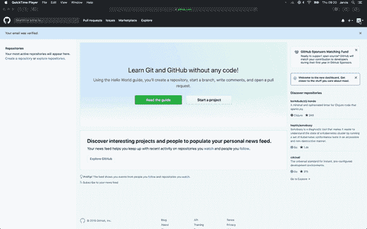

创建 GitHub 个人访问令牌

您需要做的第一件事是为您的 GitHub 帐户创建一个个人访问令牌。这将允许 Jarvis 将公共 SSH 密钥上传到您的帐户。Jarvis 目前唯一需要的范围是`admin:public_key`。请务必记下此令牌，因为您将无法再次查看它。

创建令牌后，运行以下命令:

```
jarvis config-new git
```

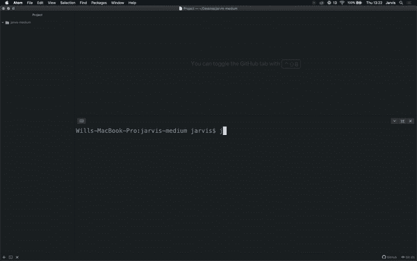

添加新的 git 配置

首先，您将被要求提供配置和 id。这可以是你想要的任何东西。在 Jarvis 确保配置 id 是惟一的之后，它会要求您输入您的 GitHub 用户名、您的电子邮件和您刚刚创建的个人访问令牌。

一旦 Jarvis 获得了所有需要的信息，它将创建 SSH 密钥，更新 SSH 配置，并将公共 SSH 密钥上传到您的 GitHub 帐户。接下来，Jarvis 将询问您是否想要激活这个配置。对于这个教程，我们会说没有。

## 添加 Google 云平台配置

要添加 GCP 配置，你需要安装谷歌的云 SDK。如果你使用谷歌云平台，那么你可能已经安装了它。如果你没有，你可以在[谷歌云](https://cloud.google.com/sdk/)网站上获得。一旦安装了 SDK 并准备好向 Jarvis 添加配置，运行以下命令:

```
jarvis config-new gcp
```

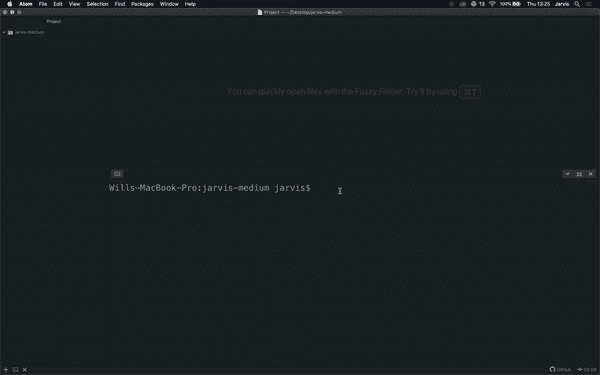

添加新的 GCP 配置

就像添加一个新的 git 配置一样，首先 Jarvis 会要求您提供一个配置 id。之后，它会询问你的 GCP 电子邮件和你想使用的 GCP 项目的名称。一旦你输入了所有的信息，谷歌的云 SDK 会要求你登录。就这么简单。

## 添加 S3 配置

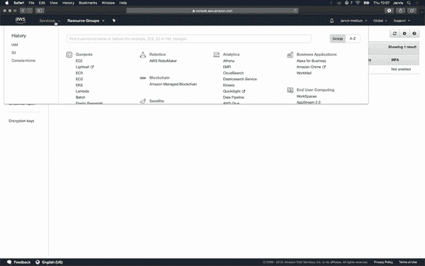

创建 AWS IAM 用户

要添加 S3 帐户，您需要创建一个新的 AWS IAM 用户。该用户只需要编程访问权限，并需要 S3 完全访问策略。记下 AWS 给你的密钥，因为你以后会用到它们。

创建新的 IAM 用户后，运行以下命令:

```
jarvis config-new s3
```

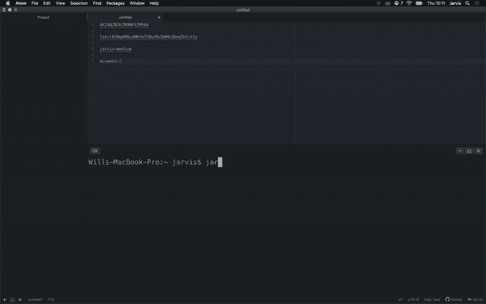

添加新的 S3 用户

像添加以前的配置时一样，首先会要求您输入配置的标识符。接下来，Jarvis 将询问您的 S3 存储桶所在的地区、您的访问密钥、您的秘密访问密钥以及您的 S3 存储桶的名称。一旦您输入了这些信息，Jarvis 将创建配置。

现在，您已经设置好了 Jarvis，并准备开始充分发挥它的潜力。

# 利用贾维斯

让我们从看一下 React 命令开始。首先，我们将看看如何用一个命令创建一个完整的样板 React 项目。

## 初始化反应

首先，为项目创建一个空文件夹，并在命令行中移动到该文件夹。这个项目还需要一个空的 GitHub repo，所以创建一个吧。完成之后，运行下面的命令，将`projectName`替换为项目的名称。

```
jarvis react-init projectName
```

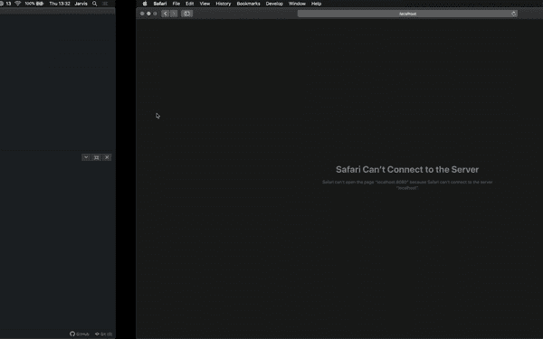

初始化 React 项目

Jarvis 要做的第一件事是初始化一个 git 目录。完成之后，它会询问您想要使用哪个 git 配置，以及您正在处理的 repo 的名称。然后它将激活 git 配置，这样就可以使用了。

接下来，Jarvis 将为项目创建所有的文件和文件夹。在这个过程的中途，它会询问项目是否将被部署到 Google App Engine。对于本教程，回答是。一旦创建了所有的文件和文件夹，Jarvis 将安装项目所需的所有 NPM 包。接下来，它将询问您是否想要运行测试，然后，它将询问您是否想要构建并运行项目。

现在你已经初始化了一个 React 项目，并准备开始创建酷的东西。

## 反应创建

接下来，让我们看看如何使用 Jarvis 创建一个 React 组件。这就像运行下面的命令一样简单。确保用您想给组件起的名字替换`ComponentName`。

```
jarvis react-create ComponentName
```

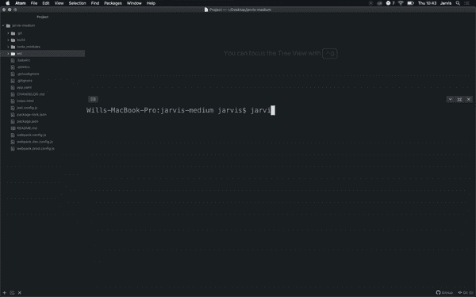

创建反应组件

创建一个 React 组件就是这么简单。Jarvis 创建的所有文件都包含了直接构建组件所需的所有内容。

## 反应部署

React 命令的最后一个是`react-deploy`。使用这个命令，您可以将项目部署到 Google App Engine，将 CSS & JS 包上传到 S3，并将更改推送到 GitHub，所有这些都在一个命令中完成。

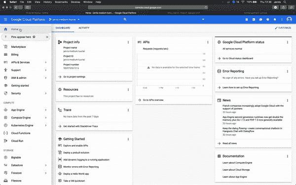

创建 Google App Engine 应用程序

您需要做的第一件事是确保您的 GCP 项目包含 App Engine 应用程序。如果没有，那么现在在 GCP 控制台中创建一个。

如果您最近使用了不同的 GCP 配置，那么您可能需要在运行 Jarvis react deploy 命令之前运行`gcloud auth login`。

```
jarvis react-deploy 1.0.0
```

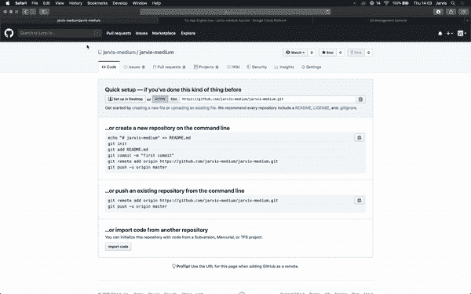

部署 React 项目

首先，运行测试和生产构建。然后会询问您当前活动的 S3 配置是否正确。如果是，那么`index.html`文件将被更新为生产 URL。在`index.html`更新后，您将被要求确认 git 配置是否正确。如果是正确的，那么所有的修改都会被推送到 GitHub。接下来，将询问您 GCP 配置是否正确。如果是，那么该项目将被部署到 Google App Engine。最后，生产 CSS & JS 包将被上传到 S3。一旦这一切都完成了，你的项目将是活的，并准备好被全世界看到和使用。

## 反应生成

如果您想在开发环境中运行您的项目，您所要做的就是运行:

```
jarvis react-build
```

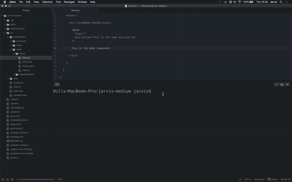

构建 React 项目

将询问您当前活动的 S3 配置是否正确。这样，如果已经构建了一个生产版本，`index.html`文件将被更新为开发设置。将会打开一个新的终端窗口，构建将会运行。您的文件将被监视，因此您不必每次进行更改时都重新构建。

## Git 拉

要从 GitHub 获取更改，只需运行:

```
jarvis git-pull
```

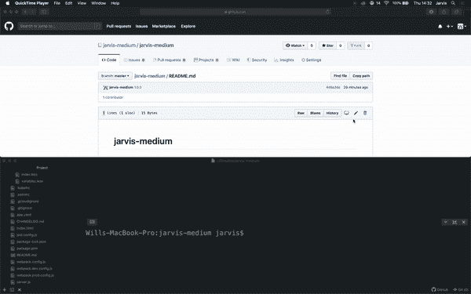

从 GitHub 中提取

Jarvis 将询问当前活动的 git 配置是否正确。如果是，那么更改将被正确提取。

## Git 克隆

如果您想要克隆一个存储库，运行下面的命令，用您想要克隆的存储库的名称替换`repoName`。

```
jarvis git-clone repoName
```

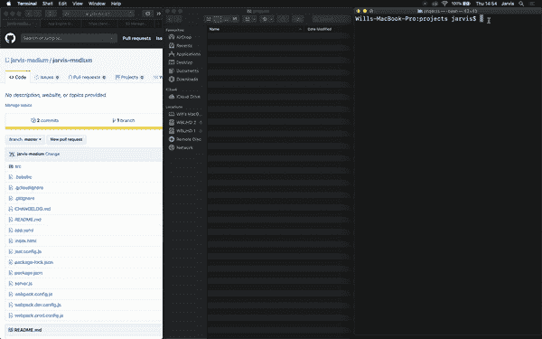

从 GitHub 克隆

就像使用`git-pull`一样，你会被询问当前的 git 配置是否正确。如果是，那么回购将被克隆。

## Git 推送

如果你想对 GitHub 进行修改，你有三个选择。首先，您可以通过运行以下命令来推送所有文件:

```
jarvis git-push 1.0.0
```

其次，您可以推送单个文件:

```
jarvis git-push 1.0.0 file.js
```

最后，您可以推送多个文件:

```
jarvis git-push 1.0.0 file1.js file2.js
```

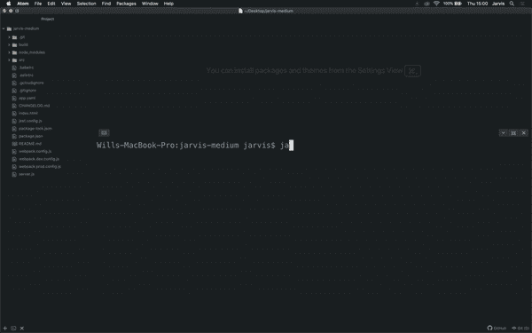

推送至 GitHub

将更改推送到 GitHub 时，会询问您当前的活动 git 配置是否正确。如果是，那么 Jarvis 将添加文件，用您传递的版本提交它们，然后推送它们。

## 配置开关

要在不同的配置之间切换，您需要做的就是运行下面的命令，用您想要切换的配置类型替换`type`。

```
jarvis config-switch type
```

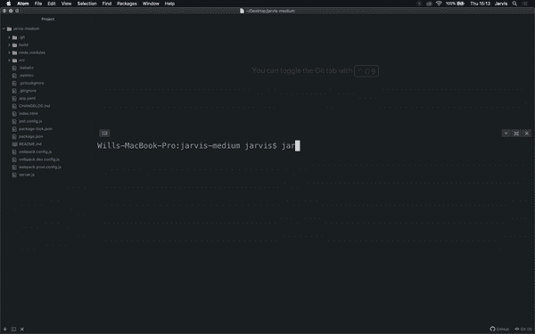

切换配置

然后 Jarvis 会问你想切换到哪个配置，它会切换到你选择的配置。

## 配置更新

更新配置很简单。就像切换配置一样，运行以下命令，替换`type`:

```
jarvis config-update type
```

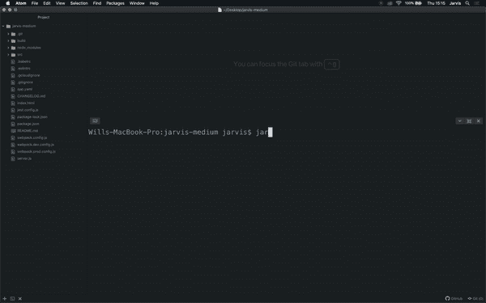

更新配置

Jarvis 将询问您想要更新哪个配置。一旦选择了要更新的配置，它就会要求为配置的每个属性提供新值。如果您不想更新某个特定的属性，那么您只需按 enter 键，该属性将保持不变。一旦您输入了所有的新属性，Jarvis 将询问您是否想要激活这个配置。

## 配置删除

要删除配置，运行以下命令，替换`type`:

```
jarvis config-delete type
```

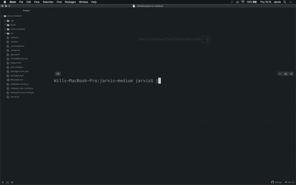

删除配置

将询问您想要删除哪个配置。然后 Jarvis 将检查您是否确定要删除配置。如果您确定，那么配置将被删除，Jarvis 将要求您激活一个新的配置。

## 网站打开和搜索

Jarvis 有一个方便打开网站的功能。为此，您只需运行:

```
jarvis site-open medium.com
```

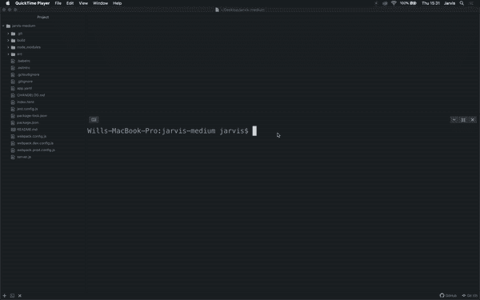

打开和搜索网站

你也可以使用 Jarvis 的一个速记网站:

```
jarvis site-open so (Stack Overflow)
jarvis site-open npm (NPM)
jarvis site-open cocoa (CocoaPods)
jarvis site-open g (Google)
jarvis site-open awe (Awesome)
jarvis site-open gh (GitHub)
```

如果你想搜索一个网站，你不能只粘贴任何网址。你必须用贾维斯的一个帮手:

```
jarvis site-search so (Stack Overflow)
jarvis site-search npm (NPM)
jarvis site-search g (Google)
jarvis site-search gh (GitHub)
```

# 结论

好了，现在你知道如何像专业人士一样安装、设置和使用 Jarvis 了。Jarvis 还很年轻，很多特性目前正在准备中，很快就会发布。随着这些特性的发布，我将会写一些关于如何使用它们的新教程。

GitHub:[https://github.com/willptswan/jarvis](https://github.com/willptswan/jarvis)

https://www.npmjs.com/package/@willptswan/jarvis:[NPM](https://www.npmjs.com/package/@willptswan/jarvis)