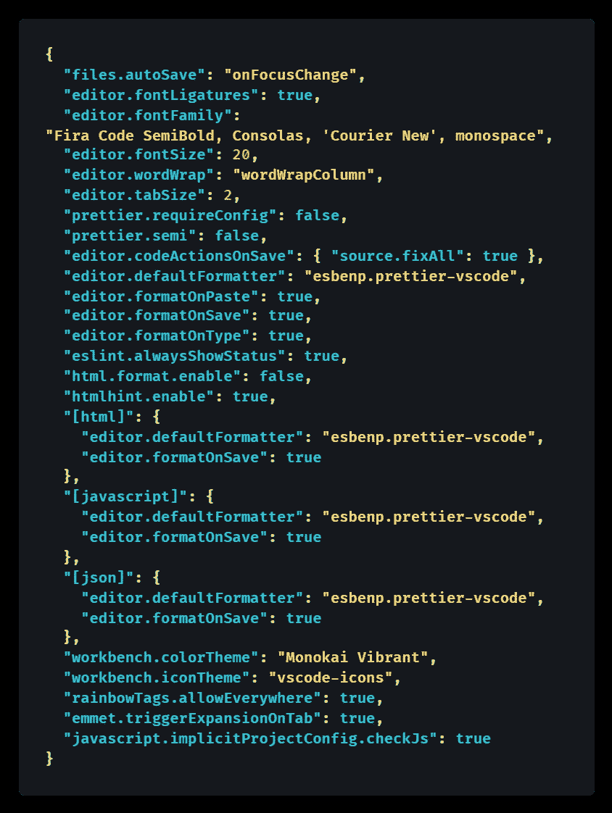
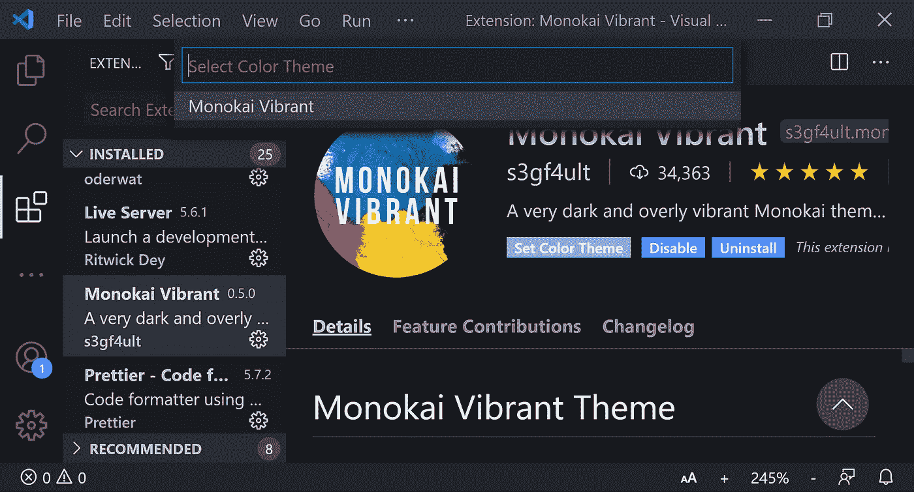
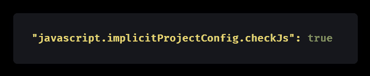
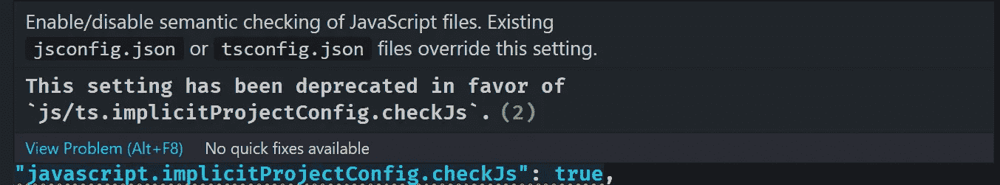

# 如何在短短 5 分钟内像专业人士一样设置 VS 代码

> 原文：<https://betterprogramming.pub/how-to-set-up-vs-code-like-a-pro-in-just-5-minutes-65aaa5788c0d>

## 初学者指南

[制作者 UX 设计工作室](https://unsplash.com/@weareprocreator?utm_source=unsplash&utm_medium=referral&utm_content=creditCopyText)在 [Unsplash](https://unsplash.com/s/photos/developer?utm_source=unsplash&utm_medium=referral&utm_content=creditCopyText) 上拍摄的照片

当你是一个# [代码新手](https://www.codenewbie.org/)从# [100DaysOfCode](https://www.100daysofcode.com/) 开始，你的 Visual Studio 代码设置可能还有很多需要改进的地方。以下是如何通过安装和配置一些重要的扩展、主题和附加组件，从零到专业的 web 开发人员。

专业 web 开发人员的 VS 代码与全新安装的区别在于扩展的使用，尤其是自动检测和修复代码中问题的代码格式化程序和 linters。

在为在线开源项目做贡献时，使用代码格式化器(通常更漂亮)和 linters(通常是 ESLint)往往是*必须的*。但是拥有它们通常是很棒的，即使你从来没有打算从事开源工作。

此外，一个好的主题使 VS 代码更容易使用，并且让它感觉像你自己的个人版本。除了主题之外，您还可以添加文件图标，让您一目了然地了解正在处理的文件类型。

但是，除非你开始使用[字体连字](https://en.wikipedia.org/wiki/Orthographic_ligature)，将普通代码符号(如`=>`和`!==`)转换成人类可读的版本，否则你看起来并不像一个真正的专家。另外，一个好的编程字体看起来很舒服！

在这个简短的教程中，您将使用[一个全新的 VS 代码安装](https://code.visualstudio.com/download)并在大约五分钟内将其变成一个超级强大的专业安装。

# 1.在 VS 代码中安装扩展

我将推荐 7 个必备扩展，另外还有 7 个可选扩展。当然，没有扩展是真正强制的——毕竟这是你的 VS 代码——但是每个人都应该使用代码格式化程序、linter 和主题。

可选扩展更多是为了您的生活质量。我建议你一次安装所有 14 个扩展，因为它们是免费和快速的。你可以随时禁用或卸载它们，只需在 VS 代码中点击几下。

首先，我将列出两个类别中的扩展，然后我将解释每个类别的用途——对于好奇的人来说，这是可选信息。

## 如何安装 VS 代码扩展

为 VS 代码安装扩展有两种方式，要么使用在线 [Visual Studio Marketplace](https://marketplace.visualstudio.com/) 或者在 VS 代码中使用它的等价物。

**从 web:** 单击下面文本中的扩展链接，在 Visual Studio Marketplace 中打开它；然后点击“安装”按钮。假设你已经安装了 VS 代码，点击“继续”然后你的浏览器会尝试打开一个`vscode`链接。从列表中选择“Visual Studio 代码”，然后选中“记住我对 vscode 链接的选择”并单击“打开链接”

**From VSCode:** 或者，通过单击左侧活动栏上的扩展图标在您的计算机上的 VS 代码中按名称查找扩展——它看起来像是一个个堆叠在一起的块。按名称搜索每个扩展，单击每个扩展的“安装”。

以下推荐的扩展按字母顺序出现。

## **强制延期**

[ESLint](https://marketplace.visualstudio.com/items?itemName=dbaeumer.vscode-eslint) ， [HTMLHint](https://marketplace.visualstudio.com/items?itemName=mkaufman.HTMLHint) ，[beauty—代码格式化程序](https://marketplace.visualstudio.com/items?itemName=esbenp.prettier-vscode)， [stylelint](https://marketplace.visualstudio.com/items?itemName=stylelint.vscode-stylelint) ，[Tailwind CSS Intellisense](https://marketplace.visualstudio.com/items?itemName=bradlc.vscode-tailwindcss)，[vs code—icons](https://marketplace.visualstudio.com/items?itemName=vscode-icons-team.vscode-icons)，以及一个主题。你只需要安装一个 VS 代码主题；我建议 [Monokai 充满活力的](https://marketplace.visualstudio.com/items?itemName=s3gf4ult.monokai-vibrant)，[一个 Monokai 主题，](https://marketplace.visualstudio.com/items?itemName=azemoh.one-monokai)或者[紫色的色调](https://marketplace.visualstudio.com/items?itemName=ahmadawais.shades-of-purple)。

## 可选扩展

[记录这个](https://marketplace.visualstudio.com/items?itemName=oouo-diogo-perdigao.docthis)、[缩进-彩虹](https://marketplace.visualstudio.com/items?itemName=oderwat.indent-rainbow)、[直播服务器](https://marketplace.visualstudio.com/items?itemName=ritwickdey.LiveServer)、[彩虹括号](https://marketplace.visualstudio.com/items?itemName=2gua.rainbow-brackets)、[彩虹荧光笔](https://marketplace.visualstudio.com/items?itemName=cobaltblu27.rainbow-highlighter)、[彩虹标签](https://marketplace.visualstudio.com/items?itemName=voldemortensen.rainbow-tags)、[vs code-颜料](https://marketplace.visualstudio.com/items?itemName=jaspernorth.vscode-pigments)。

## 每个推荐的 VS 代码扩展的描述

如果您只是想进行设置，并且不太关心刚刚安装了什么，那么请尽可能快地浏览这一部分！😂🧨💥

🔽**强制延期**🔽

*   [**ESLint**](https://marketplace.visualstudio.com/items?itemName=dbaeumer.vscode-eslint)ESLint 是一个用于 JavaScript 和 TypeScript 的[代码拦截器](https://en.wikipedia.org/wiki/Lint_(software))，它会在你编写代码时捕捉许多错误，而不是在你运行代码时。有必要为许多开源项目和现实生活中的工作场所做出贡献。
*   [**HTML hint**](https://marketplace.visualstudio.com/items?itemName=mkaufman.HTMLHint)HTML hint 是一个 HTML 的代码提示器，它捕捉了很多错误，尤其是那些全新的 web 开发人员容易犯的错误。
*   [**更漂亮—代码格式化程序**](https://marketplace.visualstudio.com/items?itemName=esbenp.prettier-vscode)每次保存时，更漂亮会自动格式化您的代码，包括缩进。通过与你的队友使用相同的[更漂亮的配置文件](https://prettier.io/docs/en/configuration.html)，你肯定会有完全相同的格式。这意味着您的 [Git](https://en.wikipedia.org/wiki/Git) 存储库不会有无意义的格式更改。
*   [**stylelint**](https://marketplace.visualstudio.com/items?itemName=stylelint.vscode-stylelint) stylelint 是一个流行的 linter。林挺，也称为*静态代码分析，*是一种你写代码时的自动化软件测试。如果您正在使用“模块 css”、实际的样式表(` . CSS `文件)或某种类型的“JavaScript 中的 CSS”(CSS-in-JS)解决方案，如 emotion 或 styled-components，我推荐使用 stylelint。如果你像我推荐的那样专门编写 [Tailwind CSS](https://tailwindcss.com/) ，就不需要 stylelint，但是你应该安装下面的下一个插件(Tailwind CSS Intellisense)。另外，添加[` appellister-plugin-tailwindcss `](https://github.com/tailwindlabs/prettier-plugin-tailwindcss)包到你的项目中，以便用 appellister 自动排序你的 Tailwind 类。
*   [**Tailwind CSS Intellisense**这个超级有用的扩展还提供了自动完成功能，这意味着除了林挺(弯曲的红色错误线)之外，“bg-red”还会提示“bg-red-50”、“bg-red-100”等。是啊！](https://marketplace.visualstudio.com/items?itemName=bradlc.vscode-tailwindcss)
*   [**VS Code-icons**](https://marketplace.visualstudio.com/items?itemName=vscode-icons-team.vscode-icons)VS Code-icons 是一个文件图标包，显示在 VS 代码内部，使区分您正在处理的文件类型变得更加容易。

🔽**虚拟代码主题**🔽

*   [**Monokai 充满活力**](https://marketplace.visualstudio.com/items?itemName=s3gf4ult.monokai-vibrant)Monokai 充满活力让我想起 8 位图形和色彩鲜艳的漫画。这是我喜欢的 VS 代码主题。
*   [**一个 Monokai 主题**](https://marketplace.visualstudio.com/items?itemName=azemoh.one-monokai)一个 Monokai 主题很好看。Monokai 主题有许多分支，包括一个名为 [Monokai Pro](https://monokai.pro/) 的付费版本。
*   **[VS 代码命令面板](https://medium.com/u/d8795cda25b6#_command-palette)(在 Windows 上使用键盘快捷键`Ctrl+Shift+P`或者在 Mac 上使用`Cmd+Shift+P`)。**
*   **在命令面板中键入“settings JSON”。**
*   **单击顶部的项目“首选项:打开设置(JSON)”**
*   **用下面我的文件替换你的`settings.json`文件。**

## **我推荐的`´settings.json´`文件**

**要复制粘贴我的`settings.json`文件，点击[查看原始代码](https://gist.github.com/DoctorDerek/3bfb3ef6f22b69750c8af542232efab1)，在浏览器中打开该文件作为 GitHub gist 你可以从那里复制文本。**

****

**[将原始代码](https://gist.github.com/DoctorDerek/3bfb3ef6f22b69750c8af542232efab1)视为 GitHub 要点**

**我还建议现在打开 VS 代码中的[设置同步来备份你的`settings.json`文件，尽管这完全是可选的，由你决定。](https://code.visualstudio.com/docs/editor/settings-sync)**

## **如何激活 VS 代码主题**

**在我上面的`settings.json`文件中，我使用了 [Monokai 充满活力的](https://marketplace.visualstudio.com/items?itemName=s3gf4ult.monokai-vibrant)主题。如果你想用别的东西，你可以编辑`settings.json`文件，但是我建议你手动切换到你的主题。下面是如何做到这一点:**

1.  **在扩展列表中点按主题(或其旁边的齿轮图标)。**
2.  **点按“设定颜色主题”**
3.  **会出现一个下拉菜单，上面写着“选择颜色主题”；点击你的主题名称，如下图所示:**

****

**德里克·奥斯汀博士截图[类型检查内置](https://medium.com/u/e5294c417caf#_type-checking-javascript)。通过在文件的第一行添加`[//@ts-check](https://code.visualstudio.com/docs/nodejs/working-with-javascript#_type-checking-javascript)`，你可以在任何 JavaScript 文件中使用它。以下设置与对所有文件进行设置相同。启用此设置后，您可以使用`[//@ts-ignore](https://code.visualstudio.com/docs/nodejs/working-with-javascript#_type-checking-javascript)`逐个文件地禁用它。**

****

**[查看原始代码](https://gist.github.com/DoctorDerek/fbdf39955ec08d0eb2f1f559e210ac6e)作为 GitHub 要点**

**请注意`javascript.implicitProjectConfig.checkJS`已被弃用，取而代之的是`js/ts.implicitProjectConfig.checkJS`:**

****

**2021 年 3 月 15 日更新；德里克·奥斯丁·🥳博士[提醒阅读器](https://medium.com/u/e5294c417caf#gistcomment-3613339)通知我 VS 代码的 TypeScript 设置的变化。如截图所示，现有的`jsconfig.json`或`[tsconfig.json](https://www.typescriptlang.org/docs/handbook/tsconfig-json.html)`文件将覆盖该设置。**

**😴 ***哇，烦了没？*** 谢天谢地，如果你使用了我的`settings.json`文件，你实际上已经设置好了 VS 代码。希望你喜欢！👍**

**文章的最后一部分是可选的。**

**我会谈到配置更漂亮，安装一个很酷的字体与字体连字，并在 VS 代码内部设置一个更好的终端(Windows 用户)。**

# **使用更漂亮的来删除分号(可选但推荐):**

**我支持在用 JavaScript 编程时关闭分号。由于 Ruby 不使用分号，我觉得它们没有必要。值得庆幸的是，无论您是否愿意使用分号，Prettier 都会自动为您在每一行添加或删除分号——不费吹灰之力。**

**在上面的`settings.json`文件中，我设置了一个全局更漂亮的设置:`"prettier.semi": false`。这相当于用`"semi": false`的设置让[有了一个更漂亮的配置文件](https://prettier.io/docs/en/configuration.html)(名为`[.prettierrc](https://prettier.io/docs/en/configuration.html)`)。**

**当与他人协作时，您应该使用更漂亮的显式配置文件，以使您的代码格式与他们的完全匹配。例如，如果你打开了别人的文件，并删除了他们所有的分号，他们可能会生你的气。**

**但是如果他们有一个包含条目`"semi": true`的`.prettierrc`文件，那么您的系统将自动使用他们的分号偏好。这变得有点高级了，这就是为什么它对于初学者指南来说是可选的——但是知道更漂亮的设置如何为协作工作是很好的。**

**我还要指出的是，在线开发工具 [CodeSandbox](https://codesandbox.io/) 在每个项目中都安装了 beautiful。每个 web 开发者都应该知道 Prettier 是如何工作的，即使你选择不使用它。**

# **添加 Fira 代码字体和字体连字(可选但推荐):**

**Fira Code 是一个很棒的免费字体，附带了一个叫做字体连字的东西。[字体连字](https://en.wikipedia.org/wiki/Orthographic_ligature)是替换其他字符的小图标。**

**对于编程来说，这意味着你的代码将变得更加易读。下面举个例子:Fira 代码会用`≠`代替`!=`。虽然您的计算机会显示连字，但文本实际上仍然包含`!=`。**

**`settings.json`文件已经假设您已经安装了 Fira 代码(特别是 Semi Bold 变体),并希望启用字体连字。如果你不想要这些东西，你可以跳过这一部分。**

**1.通过寻找[版本](https://github.com/tonsky/FiraCode/releases/)从[Fira 代码 GitHub 库](https://github.com/tonsky/FiraCode)下载 Fira 代码。**

**2.将字体(`.ttf`文件)提取到某个地方，比如你的桌面。**

**3.[Mac OS 和 Windows 的安装说明](https://github.com/tonsky/FiraCode)有所不同。**

**在 Mac OS 上，浏览到下载的`ttf`文件夹(如`\Downloads\Fira_Code_v5.2\ttf`)。选择所有字体文件；然后右键单击并选择“打开”(或等同于“用字体册打开”)。选择“安装字体”**

**在 Windows 10 上，浏览到下载的`ttf`文件夹(如`\Downloads\Fira_Code_v5.2\ttf`)。由于 Windows 安全预防措施，在安装之前，您需要[取消阻止每个字体文件](https://www.triveditech.com/how-to-block-unblock-untrusted-fonts-in-window-10/)。为此，右键单击每个字体文件，单击“属性”，然后选中“常规”选项卡底部“安全性”旁边的“解除阻止”。(见下面截图。)单击“确定”，然后您就可以实际安装字体了。对每个字体文件重复解锁过程(总共六次)。然后，要在 Windows 上安装字体，您需要选择所有的字体文件。右键单击选定的文件，然后选择安装。**

****

**德里克·奥斯汀博士截图**

**别忘了你可以改变 VS 代码中的字体设置。可以编辑`settings.json`文件，也可以正常打开 VS 代码设置，在搜索栏输入“font”。同样，您可以搜索“自动换行”**

# ****仅 Windows:安装 Cmder 作为您的 VS 代码终端(可选)****

**Mac 和 Linux 用户将获得开箱即用的出色代码终端体验，但 Windows 用户应该在这方面多走几步。我推荐你下载并安装 [Cmder](https://cmder.app/) ，一个神奇的代码终端。**

**当你去下载 Cmder 的时候，我建议你下载 Windows 版的 Git，它会自动把所有有趣的 [Git 工具](http://git-scm.com)安装到你的终端上，不需要进一步的配置。**

**一旦安装完毕，Cmder wiki 有[详细的说明](https://github.com/cmderdev/cmder/wiki/Seamless-VS-Code-Integration)用于在 VS 代码中将 Cmder 设置为您的终端。这需要几分钟的时间，但是您将拥有一个无缝的、专业的开发环境和一个内置的终端。**

# **结论:为初学者设置 VS 代码**

**我真希望在我第一次开始使用 VS 代码的时候就有这本指南。相反，在过去的一年里，我不得不从现实世界的工作、课程中编译这些设置，并且每天使用 VS 代码作为我的文本编辑器。**

**谢天谢地，因为我最近需要配置一台新电脑，所以你现在有了这本初学者指南，可以像专业人士一样设置 VS 代码。我希望这些扩展和设置对你有用。**

**我想对一个全新的软件工程师说的最后一件事是，老实说，一个图形程序(也称为 *GUI* )可以使 [Git](https://en.wikipedia.org/wiki/Git) 比从命令行做任何事情都容易得多。**

**我个人用的是 [GitHub 桌面](https://desktop.github.com/)，Windows 和 Mac 都有(但 Linux 没有)。如果您更愿意使用 GitHub 以外的主机作为您的 Git 库，那么请查看 Git GUI 程序的官方列表。**

****快乐编码！**😏🧠🆒😇🏆**

**德里克·奥斯汀博士是《职业规划:如何在 6 个月内成为 6 位数的成功程序员》一书的作者，这本书现在已经在亚马逊上出售。**