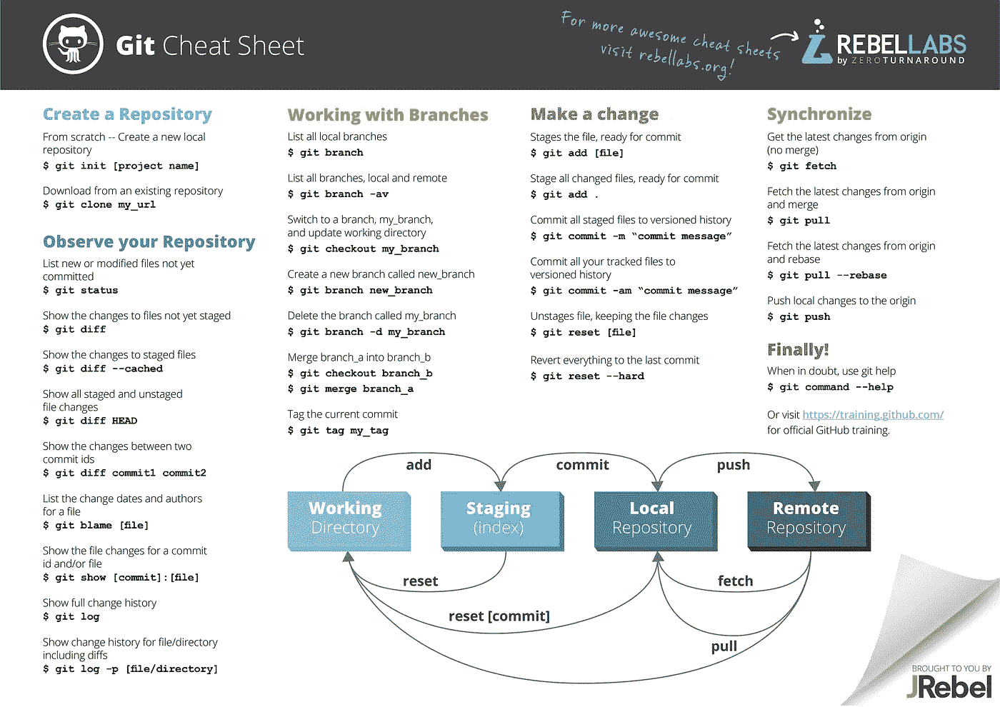
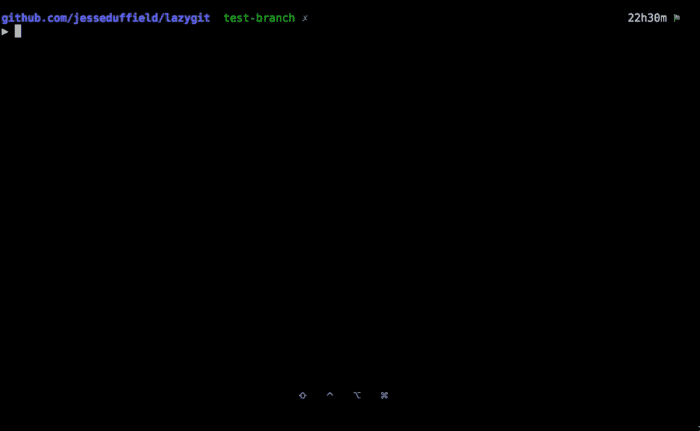
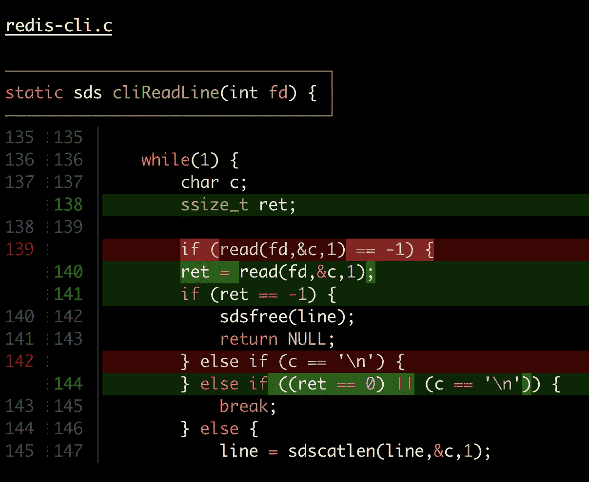
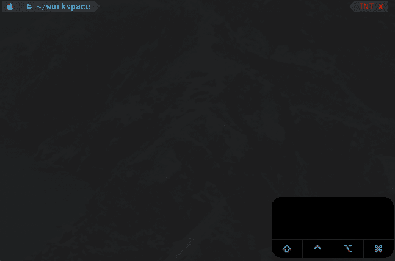
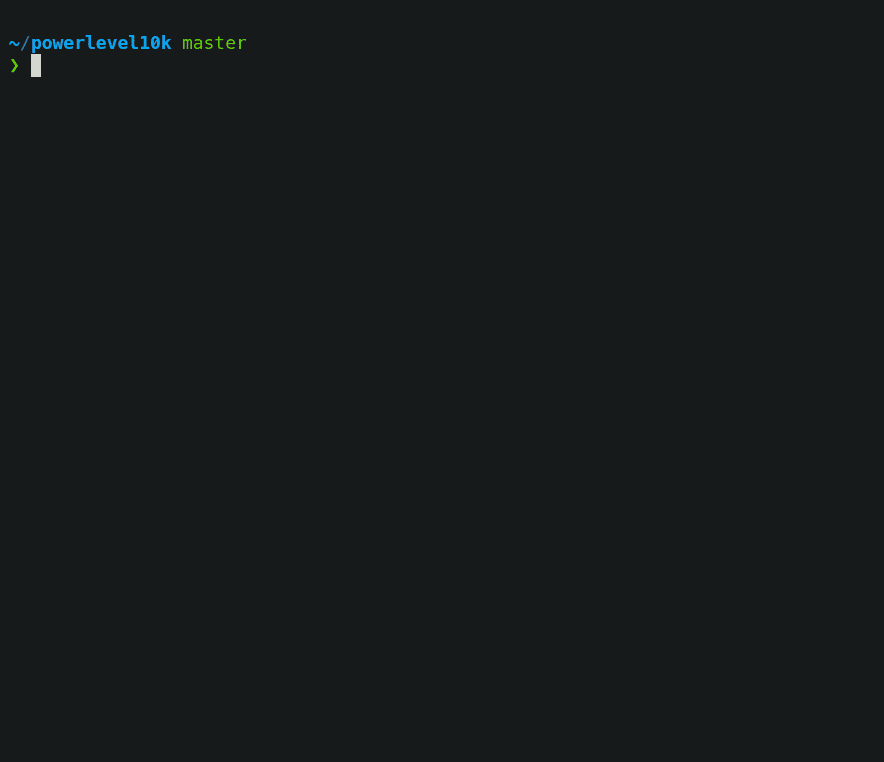
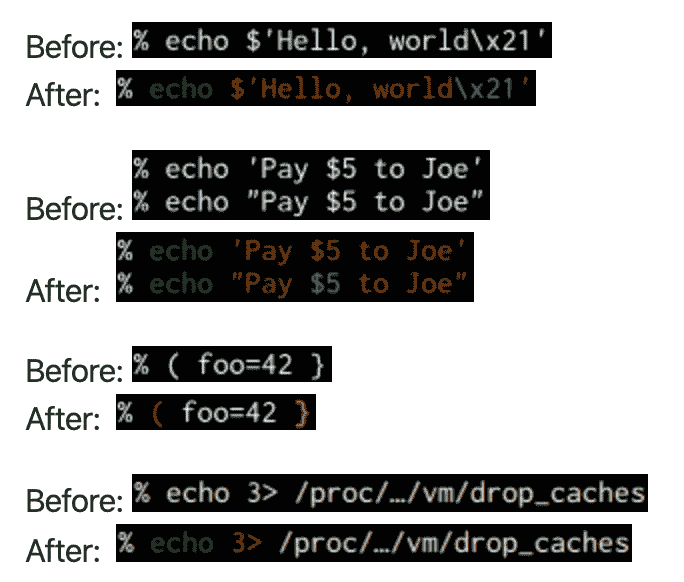
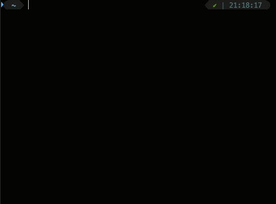
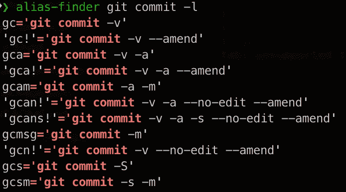
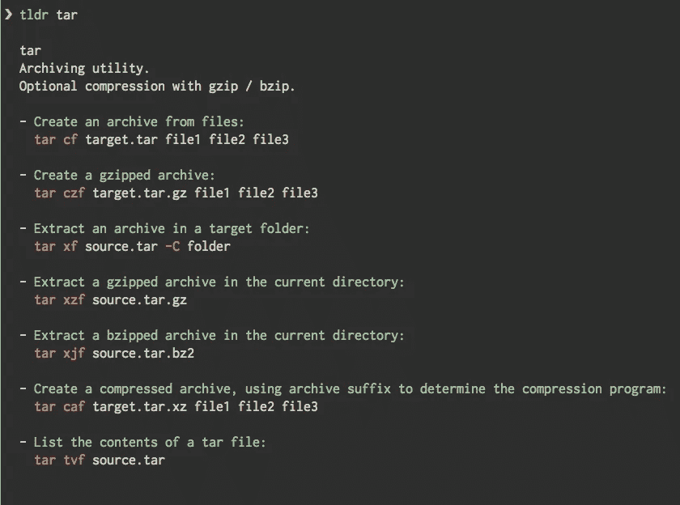

# 如何为 Web 开发设置 Mac

> 原文：<https://betterprogramming.pub/how-to-set-up-your-macbook-for-web-development-in-2021-a7a1f53f6462>

## 让您的 Macbook 为 web 开发做好准备的指南——工具、快捷方式、附件、提示和技巧等等


本·科尔德在 [Unsplash](https://unsplash.com?utm_source=medium&utm_medium=referral) 上拍摄的照片

我不时地寻找像这样的指南，看看其他人在用什么——我几乎总能学到一些新东西，让我作为开发人员的生活更轻松。

在这篇文章中，我回顾了一些工具、快捷方式、技巧和窍门，我认为它们对于一个高效的设置是必不可少的，希望对其他开发者有用。

# 目录

```
· [macOS Settings](#9732)
  ∘ [System preferences](#50f4)
  ∘ [Finder](#104c)
  ∘ [Screenshot](#c259)
· [macOS Shortcuts](#5b39)
· [Command-line Tools](#9018)
  ∘ [Homebrew](#f4ca)
  ∘ [iTerm2](#3ead)
  ∘ [Git](#15ad)
  ∘ [Lazygit](#bcb5)
  ∘ [Delta](#46ec)
  ∘ [Zsh](#a175)
  ∘ [Oh My Zsh](#d118)
  ∘ [Node.js](#7c00)
  ∘ [Docker](#ae6f)
  ∘ [tldr](#9c40)
  ∘ [htop](#138c)
  ∘ [fzf](#d084)
  ∘ [ripgrep](#4b0a)
  ∘ [lnav](#cd2d)
· [MacOS Applications](#5af9)
  ∘ [Amphetamine](#abe9)
  ∘ [Maccy](#4596)
  ∘ [Visual Studio Code](#250b)
  ∘ [Rectangle](#589f)
  ∘ [GIMP](#9c98)
  ∘ [Alfred](#a3e3)
  ∘ [Numi](#ded4)
· [Web Tools](#4f0e)
  ∘ [gifcap](#546b)
  ∘ [Clippy](#b507)
  ∘ [Graphviz Online](#28ec)
  ∘ [dbdiagram.io](#de1f)
  ∘ [uiGradients](#164a)
  ∘ [Get Waves](#ef93)
  ∘ [Create App](#6d27)
  ∘ [keycode.info](#1677)
  ∘ [Boxy](#5881)
  ∘ [Mastershot](#08d1)
· [Accessories](#297c)
  ∘ [iVANKY Dual USB-C Docking Station](#e135)
  ∘ [Boyata Laptop Stand](#a07b)
  ∘ [Keyboard and Mouse](#c0f8)
· [Tips and Tricks](#434d)
```

# macOS 设置

让我们从你可以对 macOS 和内置应用程序做的一些改变开始。

## 系统偏好设置

**键盘** `Keyboard > T️️ouch Bar Shows: F1, F2, etc. Keys`
`Keyboard> Press Fn key to: Show Control Strip`

这两个设置是关于 touch bar 的。作为一名开发人员，我发现自己比其他选项更经常使用 F 键(许多快捷键依赖于它们)——所以我更喜欢将它们作为默认选项。

**停靠** 

我经常使用 Spotlight ( **⌘空间**)或终端来启动应用程序，而不是 dock——很难证明将这样的显示空间专用于它是合理的。此外，您可以通过将鼠标移动到屏幕底部或按下 **⌃ F3** 来轻松访问它。

**触控板** `Point & Click > ️️☑️ Tap to click`

一旦你习惯了，点击比点击要快得多。

**无障碍** `Pointer Control > Mouse & Trackpad > Trackpad Options… > ️️☑️ Enable dragging`

通过启用触控板拖移，您将能够拖移文件、选择文本等。双击(并按住第二次点击)。

## 探测器

**首选项** `Preferences > Advanced > ☑️ Show all filename extensions`

**查看选项** `View > Show Path Bar
View > Show Status Bar`

**显示隐藏文件** 在终端输入`defaults write com.apple.Finder AppleShowAllFiles true`，或按 **⇧⌘** 。

## 屏幕上显示程序运行的图片

**更改截图保存位置
t5】通过 Spotlight search 或按下 **⇧⌘ 5** 打开截图应用，找到屏幕底部的`Options`菜单，然后选择`Save to`下的文件夹**

# macOS 快捷方式

这些是我用的最多的 mac 快捷键(我不会列出像⌘ C，⌘ V，⌘ Tab 等非常基础的。).如需更全面的列表，请点击[此处](https://support.apple.com/en-us/HT201236)。

**全系统**
聚光灯搜索: **⌘空间**
字符查看器: **⌃⌘空间**(快速查找表情符号和特殊字符)强制退出某 app: **⌥⌘ Esc** 锁屏: **⌃⌘ Q** 显示或隐藏 Dock: **⌃ F3** 或 **⌥⌘ D
【T31**

**截图** 打开截图 app: **⇧⌘ 5** 保存屏幕截图: **⇧⌘ 3** 保存一部分屏幕截图: **⇧⌘ 4** 保存一个窗口的截图: **⇧⌘ 4 +空格** 复制屏幕截图: **⇧⌃⌘ 3** 复制一部分屏幕截图:**⇧⌃⌘4**

****Finder** 打开主文件夹: **⇧⌘ H** 打开桌面文件夹。 **⇧⌘ D** 打开父文件夹: **⌘向上箭头** 转到上一个文件夹: **⌘ [**
转到下一个文件夹:显示或隐藏隐藏文件: **⇧⌘。****

# **命令行工具**

**现在是有趣的部分！这些是我向所有 web 开发人员推荐的命令行相关工具。**

## **[家酿](https://brew.sh/)**

**这是*的*包管理器。它允许您安装、卸载和更新命令行工具和 Mac 应用程序。**

**要安装它，请打开终端，并运行以下命令:**

```
/bin/bash -c “$(curl -fsSL [https://raw.githubusercontent.com/Homebrew/install/master/install.sh](https://raw.githubusercontent.com/Homebrew/install/master/install.sh))"
```

**在安装过程中，如果您还没有安装 Xcode 命令行工具，可能会要求您安装——只需按照屏幕上的说明进行操作。**

**为了确保你的系统准备好了，运行`brew doctor`。**

**你现在可以用`brew search`搜索包，并用`brew install`安装它们。你也可以用`brew list`列出已安装的软件包。**

**要更新软件包的本地注册表，您可以运行`brew update`，要将已安装的软件包升级到最新版本，请键入`brew upgrade`。**

**我建议不时运行`brew doctor`以确保一切正常，并运行`brew cleanup`以删除未使用的文件。**

## **[iTerm2](https://www.iterm2.com/)**

**这是终端应用程序的可选替换。它提供了许多真正有用的功能。下面我列出我最喜欢的几个。**

**要安装它，请打开终端(这是您最后一次需要它)，并运行以下命令:**

```
brew install --cask iterm2
```

**现在，可以用 iTerm2 替换 Dock 中的 terminal(如果有)。或者只需打开聚光灯( **⌘空间**)并输入 iTerm2。**

****热键窗口** 你可以在任何地方通过热键快速显示或隐藏 iTerm2 窗口。**

**`Preferences > Keys > Hotkey > ☑️ Show/hide all windows with a system-wide hotkey`**

**我推荐使用 **⌘ `** 作为热键。**

****单调性** 选择时复制，中击时粘贴，焦点跟随鼠标。**

**`Preferences > General > Selection > ☑️ Copy to pasteboard on selection`
`Preferences > Pointer > General > ☑️ Three-finger tap emulates middle click` `Preferences > General > Pointer > ☑️ Focus follows mouse`**

****禁用原生全屏** 通过禁用原生全屏，可以快速让 iTerm2 拿下整个屏幕，而不需要通常的全屏动画。**

**`Preferences > General > Window > ☐ Native full screen windows`**

**全屏快捷键: **⌘Return****

****分割窗格** 你可以将你的标签分成多个独立的窗格，并在它们之间快速切换。这与焦点跟随鼠标配合得非常好。**

**`Right Click > Split Pane Vertically`
`Right Click > Split Pane Horizontally`**

**我建议为这些动作创建新的键绑定:
`Preferences > Keys > Key Binding > +`**

****Shell 集成** 您可以在您的 Shell 和 iTerm2 之间实现更好的集成。**

**`iTerm2 > Install Shell Integration`**

**然后，将以下内容添加到您的`.zshrc`(关于 Zsh 的更多细节可以在接下来的章节中找到):`source ~/.iterm2_shell_integration.zsh`。**

**更多信息参见[文档](https://www.iterm2.com/features.html#shell-integration)。**

****个人资料设置** 请随意探索这些设置，并根据您的喜好配置您的个人资料。我建议尝试背景不透明和模糊。**

## **[Git](https://git-scm.com/)**

**最流行的版本控制系统。你可以用自制软件安装它:**

```
brew install git
```

**看看这个由 [JRebel](https://www.jrebel.com/blog/git-cheat-sheet) 写的小抄:**

****

## **[Lazygit](https://github.com/jesseduffield/lazygit)**

**git 命令的简单终端 UI。**

****

**当通过 CLI 使用 Git 时，这个工具将使您的工作效率提高 100%。它使得重置、存储、重命名和移动变得轻而易举。看看这个[视频教程](https://youtu.be/VDXvbHZYeKY)，看看你能用它做什么。**

**要安装它，请运行:**

```
brew install jesseduffield/lazygit/lazygit
brew install lazygit
```

## **[δ](https://github.com/dandavison/delta)**

**git 和 diff 输出的查看器。**

****

**要安装它，请运行:**

```
brew install git-delta
```

## **[Zsh](https://www.zsh.org/)**

**作为 macOS 自 Catalina 以来的默认 shell，Zsh 构建在 Bash 之上，提供了许多很酷的特性。**

**我推荐的第一件事是让 Homebrew 管理它的安装——打开 iTerm2，运行:**

```
brew install zsh
```

**为了将我们的默认 shell 更新为 Homebrew 的 Zsh，我们需要编辑 shell 的白名单:`sudo vim /etc/shells`。(如果你不喜欢 Vim，你可以通过运行`sudo open /etc/shells`来使用文本编辑。)**

**用`/usr/local/bin/zsh`添加新行，保存，关闭。**

**要更改默认 shell，运行:`chsh -s /usr/local/bin/zsh`。**

**重启终端，通过运行:
`echo $SHELL`来确认我们在正确的 Zsh 上。你应该看看`/usr/local/bin/zsh`。**

**现在，我们可以使用[的许多](http://zsh.sourceforge.net/Intro/intro_toc.html)功能。我最喜欢的是:**

****标签完成****

**按`TAB`完成一个命令:**

****

**命令完成**

**Zsh 将向您展示您可以使用的所有可用命令。如果您再次按下`TAB`，您将能够通过按下`TAB`或`RIGHT`和`LEFT`箭头在选项之间导航。按下`SPACE`或`RETURN`确认您想要的命令。**

**按`TAB`完成文件和文件夹名称:**

****

**文件和文件夹完成**

**如果您只键入一个子字符串，这就足够聪明了:`cd p/s<TAB>`扩展为`cd project/src`。**

****Globbing(又名文件名生成)** 仅列出当前目录下的文件:`ls *(.)`**

**仅列出当前目录及其子目录中的文件夹:`ls **/*(/)`**

**递归删除所有`.DS_Store`文件:`rm -rf **/.DS_Store`。(如果你想确定哪些文件会被删除，可以在运行命令前按`TAB`，Zsh 会展开模式)**

**您可以使用许多限定符来定位具有特定属性的文件。您可以通过运行`setopt extended_glob`来启用更复杂的功能。**

**[这里的](https://www.refining-linux.org/archives/37-ZSH-Gem-2-Extended-globbing-and-expansion.html)是递归匹配所有名称中没有大写字符或数字的普通文件的一个命令。它们对于所有者是可执行的，但对于世界上的其他人则不是。拥有者必须拥有 UID 1002，文件大小必须在 30MB 以上，并且必须在最近一个月内被修改:`ls -l **/([^A-Z[:digit:]])##(#q.x^X^u1002Lm+30mM-1)`**

**你可以在这里找到许多其他有用的提示。**

**以及我的键盘快捷键列表:**

**[](https://medium.com/@vdeantoni/boost-your-command-line-productivity-with-keyboard-shortcuts-4de2f6cbd069) [## 使用键盘快捷键提高您的命令行效率

### 使用键盘快捷键提升您的 CLI 技能

medium.com](https://medium.com/@vdeantoni/boost-your-command-line-productivity-with-keyboard-shortcuts-4de2f6cbd069) 

## [哦我的 Zsh](https://ohmyz.sh/)

Oh My Zsh 是一个社区驱动的框架，用于管理您的 Zsh 配置。它提供了数百个插件和主题，让配置 Zsh 变得轻而易举。

要安装 Oh My Zsh，请运行:

```
sh -c “$(curl -fsSL [https://raw.github.com/ohmyzsh/ohmyzsh/master/tools/install.sh](https://raw.github.com/ohmyzsh/ohmyzsh/master/tools/install.sh))"
```

我们可以通过运行`vim ~/.zshrc`或`open ~/.zshrc` 来配置 Zsh，如果你更喜欢 TextEdit 而不是 Vim 的话。你会看到 Oh My Zsh 增加了很多配置，你可以玩玩。如果你需要重置你的`.zshrc`，你可以在这里找到模板[。](https://github.com/ohmyzsh/ohmyzsh/blob/master/templates/zshrc.zsh-template)

我将在下面列出我的建议，但我强烈建议你稍后浏览可用的[主题](https://github.com/ohmyzsh/ohmyzsh/wiki/Plugins)和[插件](https://github.com/ohmyzsh/ohmyzsh/wiki/Plugins)。

主题[power level 10k](https://github.com/romkatv/powerlevel10k)是我选择的主题——它很快，它[真的很好地与 Git](https://github.com/romkatv/powerlevel10k#what-do-different-symbols-in-git-status-mean) 集成，它支持图标，[还有更多](https://github.com/romkatv/powerlevel10k#features)。

它有一个非常好的向导，可以在您第一次运行它时引导您完成配置:



Powerlevel10k 配置向导

我强烈推荐启用[瞬态提示](https://github.com/romkatv/powerlevel10k#transient-prompt)。

要使用 Homebrew 安装它，请运行:

```
brew install romkatv/powerlevel10k/powerlevel10k
```

并在你的`.zshrc` :
`source /usr/local/opt/powerlevel10k/powerlevel10k.zsh-theme`中添加下面一行

它将覆盖您设置为`$ZSH_THEME`的任何值。

重启 iTerm2，您应该会看到配置向导。以后可以用`p10k configure`再运行一次。

**Zsh 插件**

zsh-syntax-highlighting :它可以在输入命令时高亮显示命令。这有助于在运行命令之前检查它们，尤其是在捕捉语法错误方面。



zsh-语法-突出显示示例

要安装它，请运行:

```
brew install zsh-syntax-highlighting
```

并将下面一行添加到您的`.zshrc` :
`source /usr/local/share/zsh-syntax-highlighting/zsh-syntax-highlighting.zsh`

*   [zsh-autosuggestions](https://github.com/zsh-users/zsh-autosuggestions) :它根据你的历史记录和完成情况，在你输入命令时给出建议。


zsh-自动建议演示

要安装它，请运行:

```
brew install zsh-autosuggestions
```

并将下面一行添加到您的`.zshrc`:
:`source /usr/local/share/zsh-autosuggestions/zsh-autosuggestions.zsh`

*   [zsh-history-substring-search](https://github.com/zsh-users/zsh-history-substring-search):输入历史中任意命令的任意部分，然后按选择的键，如`UP` 和`DOWN` 箭头，循环匹配。



zsh-历史-子串-搜索演示

要安装它，请运行:

```
brew install zsh-history-substring-search
```

并将下面一行添加到您的`.zshrc` :
`source /usr/local/share/zsh-history-substring-search/zsh-history-substring-search.zsh`

如果你想在这个脚本中使用[zsh-syntax-highlighting](https://github.com/zsh-users/zsh-syntax-highlighting)，那么确保在加载这个脚本之前*加载它。*

此外，您需要映射您的箭头键。在源命令后添加以下*。*

```
bindkey '^[OA' history-substring-search-up
bindkey '^[OB' history-substring-search-down
```

**Oh My Zsh 插件** 以下插件由 Oh My Zsh 提供，就像其他插件一样[这里](https://github.com/ohmyzsh/ohmyzsh/tree/master/plugins)。要安装它，只需将其名称添加到您的`.zshrc`文件中的`plugins`数组。

例如，要安装所有推荐的插件:

```
plugins=(alias-finder brew common-aliases copydir copyfile docker docker-compose dotenv encode64 extract git jira jsontools node npm npx osx urltools vscode web-search z)
```

*   [alias-finder](https://github.com/ohmyzsh/ohmyzsh/tree/master/plugins/alias-finder) :该插件搜索已定义的别名，并输出任何与输入命令匹配的别名。这使得学习新的别名更加容易。
*   [brew](https://github.com/ohmyzsh/ohmyzsh/tree/master/plugins/brew) :插件为常用的 [brew](https://brew.sh/) 命令增加了几个别名
*   [常用别名](https://github.com/ohmyzsh/ohmyzsh/tree/master/plugins/common-aliases):这个插件为许多常用命令创建有用的快捷别名
*   [copydir](https://github.com/ohmyzsh/ohmyzsh/tree/master/plugins/copydir) :将当前文件夹的路径复制到系统剪贴板
*   [复制文件](https://github.com/ohmyzsh/ohmyzsh/tree/master/plugins/copyfile):将文件内容放入你的系统剪贴板，这样你就可以将它粘贴到任何地方
*   [docker](https://github.com/ohmyzsh/ohmyzsh/tree/master/plugins/docker) :这个插件为 [Docker](https://www.docker.com/) 增加了自动完成功能。
*   docker-compose :这个插件提供了 Docker Compose[和 Docker Compose](https://docs.docker.com/compose/) 的完成功能，以及一些常用的 Docker Compose 命令的别名
*   [dotenv](https://github.com/ohmyzsh/ohmyzsh/tree/master/plugins/dotenv) :当您`cd`进入项目根目录时，自动从一个`.env`文件加载您的项目环境变量
*   [编码 64](https://github.com/ohmyzsh/ohmyzsh/tree/master/plugins/encode64) :使用`base64`命令进行编码或解码的别名插件
*   [提取](https://github.com/ohmyzsh/ohmyzsh/tree/master/plugins/extract):这个插件定义了一个名为`extract`的函数，它提取你传递给它的存档文件，并且它支持多种存档文件类型
*   [git](https://github.com/ohmyzsh/ohmyzsh/tree/master/plugins/git) :提供了许多[别名](https://github.com/ohmyzsh/ohmyzsh/tree/master/plugins/git#aliases)和一些有用的[函数](https://github.com/ohmyzsh/ohmyzsh/tree/master/plugins/git#functions)
*   jira 对吉拉交互的 CLI 支持
*   jsontools:处理 JSON 数据的便捷命令行工具
*   [节点](https://github.com/ohmyzsh/ohmyzsh/tree/master/plugins/node):该插件增加了`node-docs`功能，可以打开 [Node.js](https://nodejs.org/) 文档中的特定部分
*   NPM:NPM 插件提供了补全功能，并添加了许多有用的别名。
*   [npx](https://github.com/ohmyzsh/ohmyzsh/tree/master/plugins/npx) :如果`npx`存在于你的`$PATH`中，这个插件会自动注册 npx 命令未找到处理程序
*   osx :这个插件提供了一些 macOS 工具
*   urltools :这个插件为 URL 编码和 URL 解码字符串提供了两个别名
*   [vscode](https://github.com/ohmyzsh/ohmyzsh/tree/master/plugins/vscode) :这个插件使得命令行和 VS 代码编辑器之间的交互更加容易
*   网络搜索:这个插件增加了使用谷歌、维基百科、必应、YouTube 和其他流行服务进行搜索的别名
*   z :这个插件定义了 z 命令[来跟踪你最常访问的目录，并允许你通过很少的击键来访问它们](https://github.com/rupa/z)

**别名** 常用命令可以用别名缩写。`alias tf=”tail -f”`让你可以运行`tf`而不是输入`tail -f`。

您可以向您的`.zshrc`添加任意多个别名。

像 Git 和 Common Alias 这样的插件添加了很多别名，会让你输入更少，但是要把它们都学会可能很难。这就是`alias-finder`插件的作用。

如果您想知道`git commit`有哪些别名:



“别名查找器”示例

您也可以在您的`.zshrc`中设置`ZSH_ALIAS_FINDER_AUTOMATIC=”true”`，使其在每个命令之前自动运行。

别名有三种类型:

*   *命令*别名:就像上面的`tf`例子一样
*   *全局*别名:在一行的任何地方被替换。例如，由 common-aliases 插件添加的`G`别名被替换为`| grep`。
    `ls G foobar` = > `ls | grep foobar`
*   *后缀*别名:这些是特殊的别名，当文件名作为命令传递时触发。比如:`alias -s pdf=acroread`在运行`file.pdf`时调用`acroread`。

命令别名也可以通过使用数组`$`来访问原始命令的参数:

```
loop() {
  for x in {1..$1}; do $@[2,-1]; done
}
```

该别名运行给定命令 *x* 次。例如:`loop 10 echo ‘hello’`会打印`hello` 10 次。

## [Node.js](https://nodejs.org/)

JavaScript 运行时建立在 Chrome 的 V8 JavaScript 引擎上。这是运行和构建 web 应用程序最流行的框架。

要安装它，请运行:

```
brew install node
```

如果需要管理多个需要不同版本 Node 的应用，我推荐 [nodenv](https://github.com/nodenv/nodenv) 。

## [码头工人](https://www.docker.com/)

Docker 允许你开发和交付叫做容器的软件包。容器是相互隔离的，捆绑了它们自己的软件、库和配置文件。

要安装它，请运行:

```
brew install --cask docker
```

你也应该看看 [lazydocker](https://github.com/jesseduffield/lazydocker) ，一个伟大的 docker 和 docker-compose CLI 工具。

## [tldr](https://github.com/tldr-pages/tldr)

一组简化的、由社区驱动的手册页。



tldr 示例

要安装它，请运行:

```
brew install tldr
```

## htop

它类似于 top，但允许您垂直和水平滚动，以便您可以看到系统上运行的所有进程，以及它们的完整命令行。

要安装它，请运行:

```
brew install htop
```

## [fzf](https://github.com/junegunn/fzf)

命令行模糊查找器。

我为 fzf 写了一篇专门的文章，看看吧:

[](https://medium.com/@vdeantoni/boost-your-command-line-productivity-with-fuzzy-finder-985aa162ba5d) [## 使用模糊查找器提高您的命令行效率

### 使用 Fuzzy Finder 提升命令行技能的提示和技巧

medium.com](https://medium.com/@vdeantoni/boost-your-command-line-productivity-with-fuzzy-finder-985aa162ba5d) 

要安装它，请运行以下两行:

```
brew install fzf
$(brew --prefix)/opt/fzf/install
```

它与 [fd](https://github.com/sharkdp/fd) 和 [bat](https://github.com/sharkdp/bat) 配合得非常好。

## [ripgrep](https://github.com/BurntSushi/ripgrep)

一个面向行的搜索工具，递归搜索你的当前目录中的正则表达式模式。默认情况下，ripgrep 会尊重您的`.gitignore`，并自动跳过隐藏文件/目录和二进制文件。

要安装它，请运行:

```
brew install ripgrep
```

## lnav

从终端观察和分析您的日志文件。

```
brew install lnav
```

# MacOS 应用程序

以上是我推荐的 macOS 应用。

## [安非他明](https://apps.apple.com/us/app/amphetamine/id937984704)

安非他命是一种 macOS 实用工具，可以在您定义的时间或情况下让您的 Mac 保持清醒。安非他命是高度可定制的，允许您在指定的时间内或满足条件时保持 Mac 清醒。

可以从 [App Store](https://apps.apple.com/us/app/amphetamine/id937984704) 安装。

## 梅西

macOS 剪贴板管理器

要安装它，请运行:

```
brew install maccy
```

## [Visual Studio 代码](https://code.visualstudio.com/)

目前最好的 web 开发 IDE/编辑器(当然是在我看来)。它有大量的扩展，速度很快，而且是开源的。

要安装它，请运行:

```
brew install --cask visual-studio-code
```

你可以在[Visual Studio market place](https://marketplace.visualstudio.com/vscode)中找到许多针对最流行语言和框架的优秀扩展。

## [矩形](https://rectangleapp.com/)

使用键盘快捷键或吸附区域在 macOS 中移动窗口和调整窗口大小。

我经常使用矩形——你应该掌握它的快捷方式。我使用的主要工具有:

左半部分: **⌥⌘向左箭头** 右半部分: **⌥⌘向右箭头** 上半部分: **⌥⌘向上箭头** 下半部分: **⌥⌘向下箭头** 中心窗口: **⌥⌘ C** 最大化窗口: **⌥⌘ F**

如果您有多个显示器，您会发现这些非常方便:

下一次显示: **⌃⌥⌘向右箭头
t34】上一次显示: **⌃⌥⌘向左箭头****

要安装它，请运行:

```
brew install --cask rectangle
```

[Divvy](https://mizage.com/divvy/) 和[磁铁](https://magnet.crowdcafe.com/)是窗户管理的好选择。

## [GIMP](https://www.gimp.org/)

一个功能丰富的图像编辑器，而且是免费的。

要安装它，请运行:

```
brew install --cask gimp
```

## [阿尔弗雷德](https://www.alfredapp.com/)

Alfred 是一款取代 Spotlight 的生产力应用。有免费版和付费版。

这更像是一个荣誉奖，因为我真的不再使用它了，因为 Spotlight 对我来说已经足够好了。但是如果你感兴趣，你可以试一试。

要安装它，请运行:

```
brew install --cask alfred
```

## [Numi](https://numi.app/)

一个漂亮的苹果计算器应用程序。

要安装它，请运行:

```
brew install --cask numi
```

# 网络工具

您可以直接从浏览器使用的免费网络工具。

## [gifcap](https://gifcap.dev/)

从屏幕录像创建动画 gif。

## [Clippy](https://bennettfeely.com/clippy/)

CSS 剪辑路径生成器。

## [Graphviz Online](https://dreampuf.github.io/GraphvizOnline)

以编程方式生成图表。

## [dbdiagram.io](https://dbdiagram.io/d/)

只需要写代码就可以画出 ER 图。

## [uiGradients](https://uigradients.com/)

梯度发生器。

## [获得电波](https://getwaves.io/)

生成 svg 波。

## [创建应用](https://createapp.dev/)

前端构建配置生成器。

## [keycode.info](http://keycode.info/)

按任意键获取 JavaScript 事件键码。

## [方方正正的](https://boxy-svg.com/app)

SVG 编辑器。

## 精彩镜头

视频编辑器。

# 配件

## [iVANKY 双 USB-C 扩展坞](https://www.amazon.com/gp/product/B08PP8HYR9?ie=UTF8&linkCode=ll1&tag=&linkId=29bbda84f834ef9ddb3e3450422d53d0&language=en_US&ref_=as_li_ss_tl)

将您的 MacBook Pro 的两个 USB-C 端口变成 12 个多功能端口，然后为您创建一个真正高效的工作站。

这个坞站提供了您可能需要的所有端口，包括一个以太网端口，如果您像我一样喜欢有线互联网连接的话。它还支持两个外部显示器，可以为 Macbook 和其他无线设备(硬盘、键盘、鼠标、电话等)充电。

## [鲍亚塔笔记本电脑支架](https://www.amazon.com/gp/product/B07HBQSCM3?ie=UTF8&linkCode=ll1&tag=vdeantoni02-20&linkId=ebd750910b040ad944a574837f159760&language=en_US&ref_=as_li_ss_tl)

这是一个非常坚固，易于调整的笔记本电脑支架，看起来也很棒！

## 键盘和鼠标

有数百种键盘和鼠标选项，但如果你想留在苹果的生态系统中，你应该购买[魔法键盘](https://www.amazon.com/gp/product/B016QO64FI?ie=UTF8&linkCode=ll1&tag=vdeantoni02-20&linkId=80126c93fa3b6891b56b2645868d96e8&language=en_US&ref_=as_li_ss_tl)和[魔法鼠标](https://www.amazon.com/gp/product/B016QO5YNG?ie=UTF8&linkCode=ll1&tag=vdeantoni02-20&linkId=00bff4add09ba58fcdc6636aa690ac50&language=en_US&ref_=as_li_ss_tl)。

*披露:以上链接为附属链接。*

# 提示和技巧

一些有用的提示。

*   我建议创建一个[点文件](https://dotfiles.github.io/)仓库来存储你的点文件。(`.zshrc`、`.gitconfig`等。).虽然，用别人的 dotfiles 不是个好主意，但是可以随便看看[矿](https://github.com/vdeantoni/dotfiles)做参考。
*   您可以使用 [npx](https://www.npmjs.com/package/npx) 运行 npm 包中的命令，而不需要 package.json。例如:`npx live-server`将在当前文件夹中运行 [live-server](https://www.npmjs.com/package/live-server) ，这是一个具有实时重新加载功能的开发服务器。
*   如果您注意到您的 shell 在向其中粘贴文本时速度很慢，您可能想要取消注释这一行(在您的`.zshrc` :
    `# DISABLE_MAGIC_FUNCTIONS=true`中删除`#`)。
*   Oh My Zsh 提供跨平台复制粘贴命令。您可以通过`clipcopy`和`clippaste`之间的管道(`|`)直接从/向您的终端复制/粘贴。

感谢阅读——我希望你今天学到了一些新东西。

保重，下次再见。**