# 如何用 GraphQL、Koa 和 MongoDB 建立一个强大的 API

> 原文：<https://betterprogramming.pub/how-to-setup-a-powerful-api-with-graphql-koa-and-mongodb-339cfae832a1>

## 构建 API 很有趣！

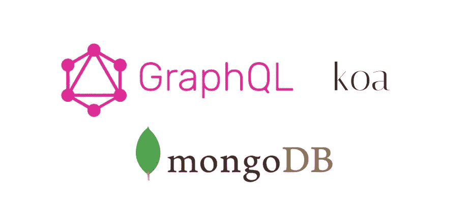

构建 API 很有趣！尤其是当您可以利用 Koa、GraphQL 和 MongoDB 等现代技术时。

[Koa](https://koajs.com/Koa) 是节点框架，就像 Express 是节点框架一样。我们将用 Koa 替换 Express，因为 Koa 在回调中使用 async/await 语法。

*注；*如果你是 API 的新手，我推荐你通读一下这本书以便开始使用。Kindle 版本[此处](https://amzn.to/2lFHNMM)。

# 入门指南

构建我们的 API 的先决条件是:

*   安装的节点
*   文本编辑器(我使用 Visual Studio 代码)
*   末端的
*   浏览器

如果你有你需要的一切，请继续-如果没有，请安装它们。

打开终端并创建一个节点项目，如下所示:

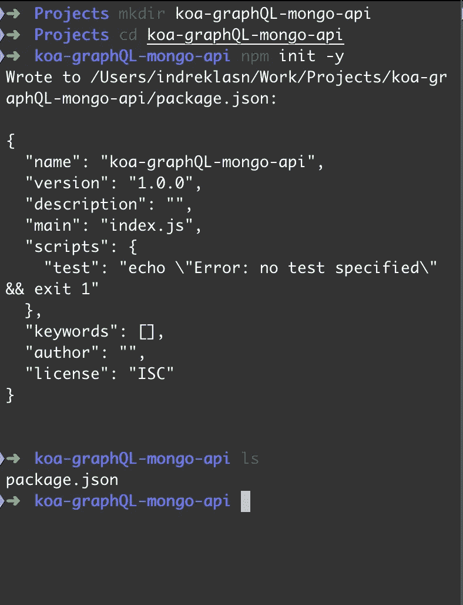

到目前为止，我们已经创建了项目文件夹，并初始化了一个新的节点项目。现在我们有了可用的 NPM 包，可以用来安装 Koa、Mongo 和 GraphQL。

让我们和 NPM 一起安装`koa`。

启动新的 Koa 服务器很简单。我们只需要一个包含以下内容的`server.js`文件:

从节点开始项目:


# 安装 GraphQL

我们需要两个包来用 Koa 设置 graph QL:`koa-mount`和`koa-graphql`

`npm i koa-mount koa-graphql`

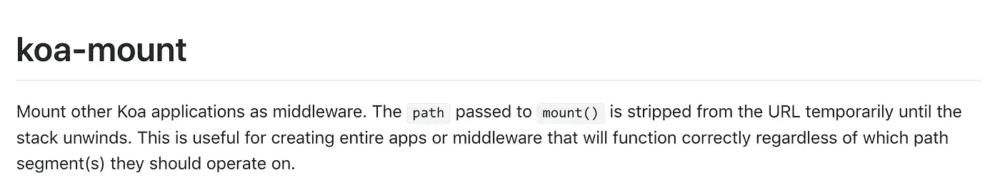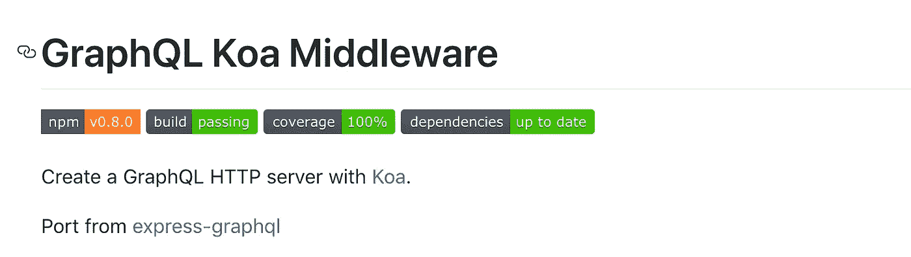

GraphQL 要求我们将初始模式传递给 GraphQL 服务器。让我们创建一个。

我们将 graphQL 模式放在`graphql/schema.js`

我们将初始的`Query`传递给`buildSchema`函数。

**注意**:`buildSchema`的参数是一个模板文字。如果你不熟悉这篇文章，我鼓励你看一看这篇文章。

现在我们可以将初始模式传递给我们的 GraphQL 服务器:

不要忘记导入`koa-mount`、`koa-graphql`，最后是`schema.js`

然后，如果我们转向`localhost:9000/graphql`:

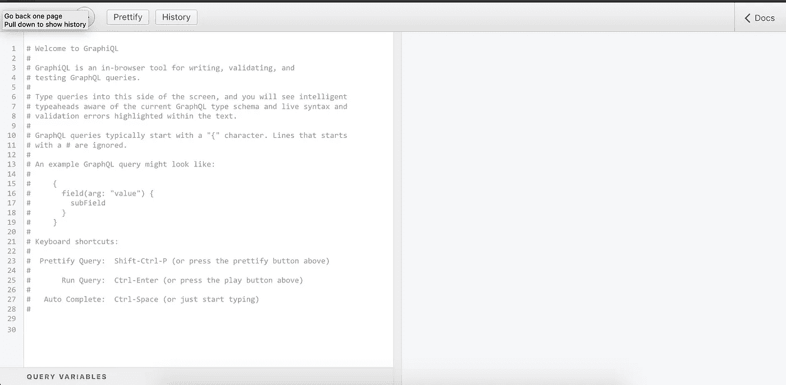

GraphQL——在前端查询 graph QL 的强大工具

瞧啊。初始设置完成。它还不是很有用——理想情况下，我们希望查询 GraphQL 将数据保存到我们的 MongoDB 并从那里读取。

# 设置 MongoDB

为了用 GraphQL 读写，我们需要一个读取的地方。这就是 Mongo 派上用场的地方。我们将从那里保存和读取我们的数据。

为了简单起见，我们将为 Mongo 使用一个云实例。前往[mlab.com](http://mlab.com/)并创建一个用户和一个 mongo 数据库。

# 创建 MongoDB 数据库

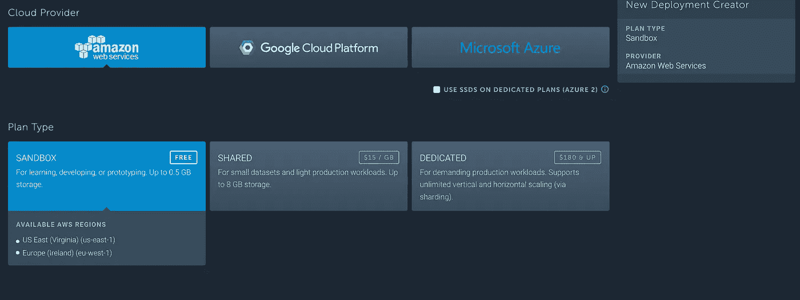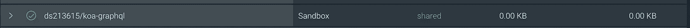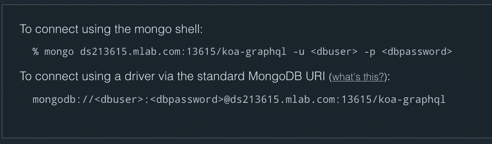

一旦创建了数据库，您将需要一个数据库用户。

# 创建 MongoDB 用户

点击用户选项卡，创建一个新的用户名和密码。

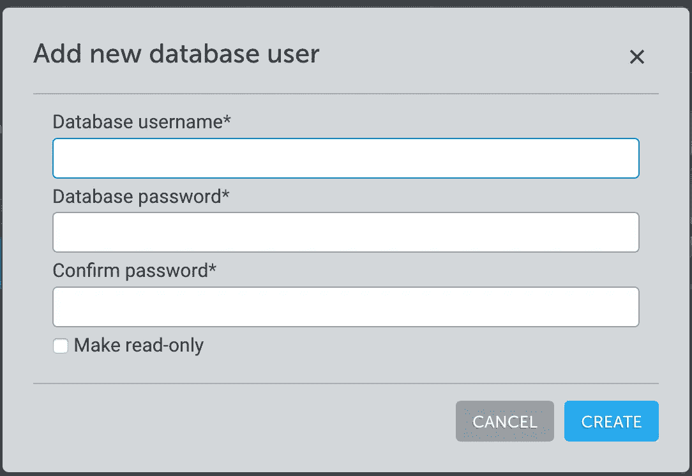

现在，您可以使用 mongoDB 搭配 Mongoose。您的数据库的远程 url 如下所示:

`mongodb://:@ds213615.mlab.com:13615/koa-graphql`

# 安装猫鼬

```
npm i mongoose
```

# 正在创建`database.js`文件

我们为数据库连接创建一个专用文件:

**注意**:确保使用数据库的用户名和凭证。

这段代码将尝试连接到远程 MongoDB。我们需要找个地方。

打开`server.js`和`require`，调用`initDB`方法。

如果我们做的一切都正确，我们的控制台应该会告诉我们连接成功。

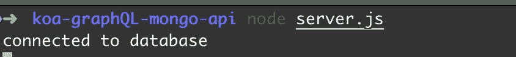

太棒了。

注意到不断刷新服务器有多烦人了吗？让我们用一个叫做`pm2`的包来解决这个问题。

[PM2](https://github.com/Unitech/pm2) 是 Node.js 应用程序的生产流程管理器，内置负载均衡器。它允许您永远保持应用程序的活力，在不停机的情况下重新加载它们，并简化常见的系统管理任务。

```
npm install pm2 -g
```

将名为`start`的脚本添加到我们的`package.json`中:

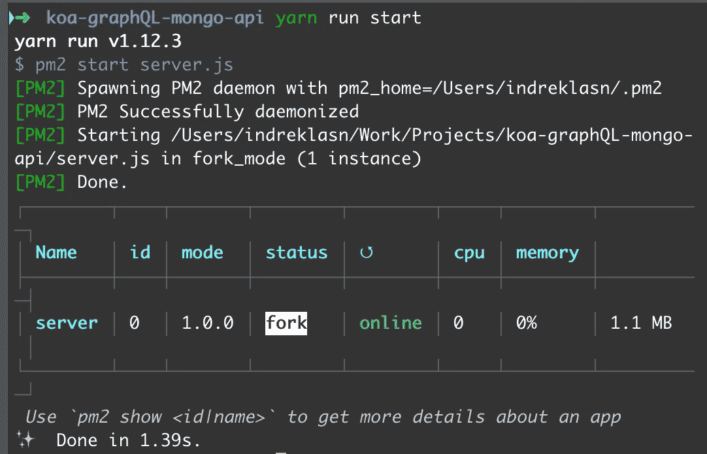

Pm2 在后台运行，解放了我们的终端。如果你想停止这个过程，只需运行`pm2 kill`。现在我们不必一直重启服务器，`pm2`会自动重启。

**注意** : `pm2 logs`向终端返回控制台日志语句。

# MongoDB 模型

如果您曾经使用过 Mongo，您会意识到 MongoDB 允许我们为数据创建模型。对于我们来说，这是一个构建数据外观的好方法。

在文件`gadgets.js`中为 MongoDB 模型创建一个文件夹

**注意**:在我们的模式中没有 ID 字段。这是因为 Mongoose 将默认为所有模式分配一个 ID。

很好，现在让我们添加一个集合和一些虚拟数据。集合名称必须以复数形式映射我们的小工具名称，在本例中为`gadgets`。

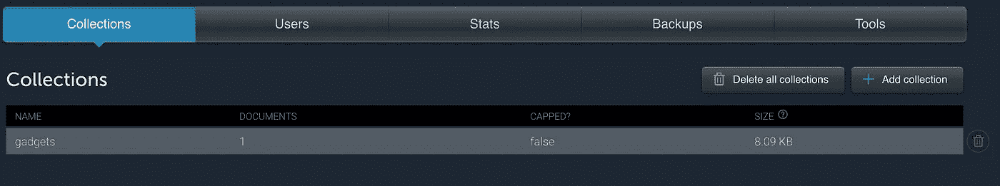

创建集合后，以 JSON 格式插入文档，如下所示:

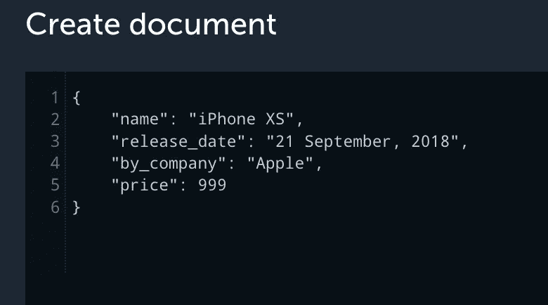

这就是 Mongo 的全部内容，现在让我们用 GraphQL 获取数据。

# GraphQL 查询

GraphQL 也要求我们创建类型——把它想象成计算机的指令。

`graphql/gadgetType.js`

注意，我们创建了一个 graphql 类型。在字段内部，我们可以指定给定类型的属性。

注意我们从 graphQL 中解构的`GraphQLObjectType`和`GraphQLObjectType`类型。这些是 graphQL 的基本类型。

创建 graphQL 类型还允许类型提示，我们将在创建查询时使用它。

我们需要做的最后一件事是重构我们的`schema.js`。我们想通过`id`查询一个小工具。

将`Gadget`型号、`gadgetGraphQLType` graphql 类型和`GraphQLSchema`、`GraphQLObjectType`、`GraphQLString`从 graphql 导入到`schema.js`

接下来，我们需要一个根查询。每个 GraphQL 查询都以花括号`{}`开始——这是根查询。

瞧啊。在字段内部，我们可以指定`gadget`查询。

请注意小工具查询中的三个属性:

*   type —这是查询的类型，在本例中为`gadgetGraphQLType`。
*   args —我们可以为 graphql 查询提供参数，比如:`gadgets(id: "1")`
*   解析-我们希望如何解析查询？查询完成后会发生什么？这里我们通过 id 返回小工具**型号**。

最后，导出它。

文件`schema.js`应该是这样的。

现在转到[http://localhost:9000/graph QL](http://localhost:9000/graphql)进行查询。

这是我们最终应该得到的结果:

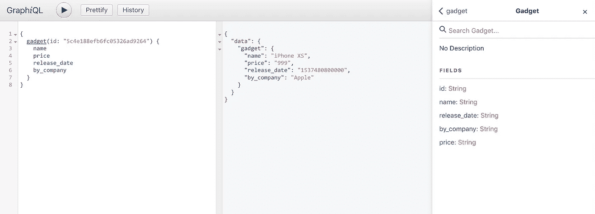

感谢阅读！❤ [源代码可以在这里找到。](https://github.com/wesharehoodies/koa-graphql-mongodb/tree/part-1)

[第二部分](https://medium.com/free-code-camp/how-to-set-up-a-powerful-api-with-graphql-koa-and-mongodb-crud-4459fc0720d4?source=---------12------------------) —我们将发现突变，以及如何使用 GraphQL 创建、删除、更新和读取 MongoDB 中的记录。