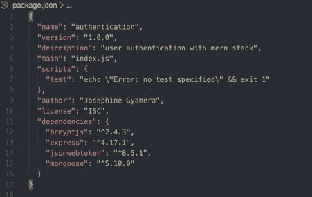
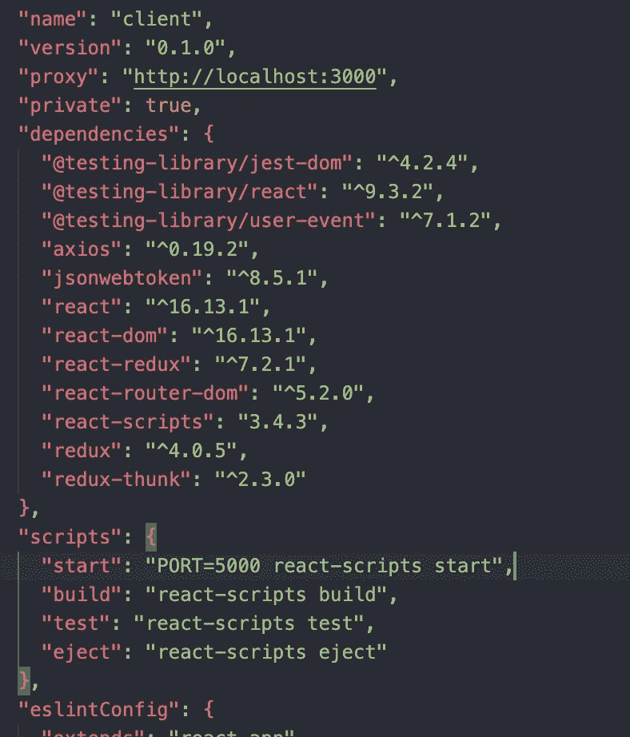
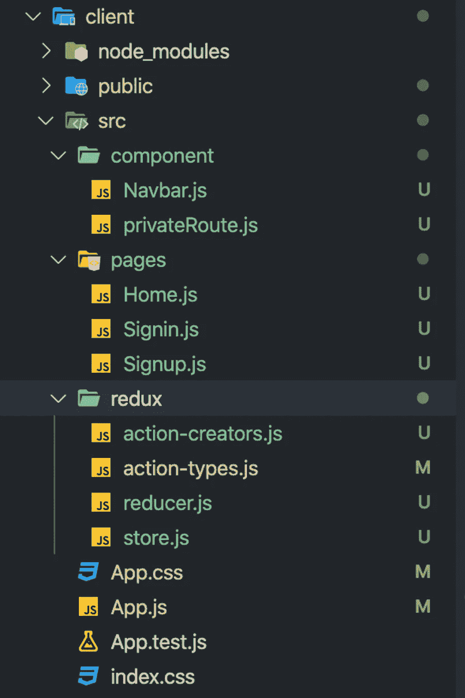

# 如何设置认证

> 原文：<https://betterprogramming.pub/how-to-setup-auth-on-backend-frontend-with-react-redux-express-mongoose-part-1-a50fc51fb531>

## 用 React，Redux，Express，和 Mongoose


背景照片由[负空间](https://www.pexels.com/@negativespace)在[像素](https://www.pexels.com/)上拍摄。

在努力理解身份验证的概念后，我认为与有相同问题的其他人分享这个过程会很好。

作为一名初级开发人员，“身份验证”这个词总是让我害怕。谢天谢地，我碰到了 [Redux](https://redux.js.org/) 和 React 用 JWT 和 [bcrypt.js](https://www.npmjs.com/package/bcryptjs) 进行认证。

在本教程中，您将学习如何从头开始在后端和前端创建用户身份验证。

我们将把本教程分为七个步骤:

1.  安装和设置
2.  编写我们的应用程序逻辑
3.  用邮递员测试应用程序
4.  前端的安装和设置
5.  处理冗余逻辑
6.  可选组件
7.  页

让我们开始吧！

*先决条件:这篇文章是为那些有 Express 和 Mongo DB 基础知识的人准备的(在 Mongoose 的帮助下)。*

# **步骤 1:安装和设置**

我假设你已经有了一个开发环境。

首先，我们需要安装一些将要在我们的应用程序中使用的包。在本文中，我将使用 npm 包管理器，但是也可以随意使用您选择的任何包管理器:

```
npm init -y
```

让我们为后端安装所有包:

```
npm install express mongoose bcryptjs jsonwebtoken
```

我将简要介绍一下我们安装的软件包:

*   [Jsonwebtoken](https://www.npmjs.com/package/jsonwebtoken) 允许您作为 JSON 对象在双方之间安全地传输信息。
*   [mongose](https://mongoosejs.com/)是 Node.js 和 MongoDB 的对象数据建模(ODM)库。
*   [Bcrpytjs](https://www.npmjs.com/package/bcrypt) 是一个密码哈希函数。
*   [Express](https://expressjs.com/) 是一个 [Node.js](https://nodejs.org/en/) 框架，接口稍微简单一些，用于构建后端。

如果一切顺利，您应该在您的`package.js`中看到这一点:



根目录中的 package.js 文件

现在，让我们设置我们的文件夹结构如下:


后端文件夹结构

# **第二步:编写我们的应用程序逻辑**

一切就绪后，让我们直接进入编码。我们将从在`app.js`文件中编写我们的应用程序逻辑开始。不要担心导入的文件。他们很快就会被创造出来！

*注意:如果你的 PC 上没有本地安装 MongoDB，可以使用云版本。请随意查看如何使用* [*官方文档*](https://docs.atlas.mongodb.com/getting-started/) *设置账户。*

app.js

接下来，我们将在`model/user.js`中的 Mongoose 的帮助下创建我们的用户模式:

model/user.js

现在，我们将进入后端的逻辑。在`services/user.js`中，我们将把我们所有的注册和签到逻辑:

services/user.js

您现在已经意识到我们导入了两个文件:`/keys`和`/util/signedToken.js`。在`/keys`中，您可以处理所有不能与公众共享的秘密密钥。我喜欢将签名的令牌分开，因为我可能在应用程序的其他部分需要它。您也可以决定在`service/user.js`进行:

util/signedToken.js

在`controller/user.js`文件夹中，我们将异步处理我们的服务并将一个 JSON 对象发送回我们的前端:

控制器/用户. js

让我们通过制作之前在`app.js`文件中导入的`router/auth.js`来完成我们的后端:

路由/验证. js

我们现在完成了我们的后端！让我们用 Postman 测试我们的 API。

# **第三步:用邮递员测试应用**

邮递员测试

这就把我们带到了后端的尽头。请随意以自己的方式使用样板文件。

让我们直接进入前端吧！

# **第四步**:前端**安装设置**

我们首先必须创建一个 React 应用程序并安装几个包:

```
npx create-react-app client
```

现在让我们安装前端所需的所有软件包:

```
npm install redux react-redux axios jsonwebtoken redux-thunk react-router-dom
```

我将简要介绍一下我们安装的软件包:

*   Redux 是一个可预测的 JavaScript 应用程序状态管理容器。
*   [Axios](https://github.com/axios/axios) 是一个 JavaScript 库，用于从 [Node.js](https://nodejs.org/en/) 发出 [HTTP](https://developer.mozilla.org/en-US/docs/Web/HTTP) 请求。
*   [Redux-thunk](https://www.npmjs.com/package/redux-thunk) 是一个中间件，允许你在 actions-creators 中返回函数，而不是返回一个动作。
*   [React-router-dom](https://reactrouter.com/web/guides/quick-start) 允许你的应用程序路由到不同的组件。

安装完成后，您应该在您的`package.js`中看到软件包。请注意，我将代理添加到了`package.js`中，并将通常的 react 端口(3000)更改为 5000。这是因为我在端口 3000 上运行我的后端。你可以在文档中读到更多关于这个[的内容。](https://create-react-app.dev/docs/proxying-api-requests-in-development/)



客户端/包. js

安装完我们的软件包后，我们将开始创建我们需要的所有文件夹和文件。您的应用程序文件夹结构应该如下所示:



前端文件夹结构

# **第五步** : **处理冗余逻辑**

在 Redux 文件夹中，我们将从定义我们的动作类型和创建者开始。我们将利用 Redux-thunk 来处理 API 获取，这被认为是一个副作用。另一种选择是使用[还原传奇](https://redux-saga.js.org/)。你可以把这个复制到你的`redux/action-types.js`和`action-creators.js`:

redux/action-type . js

redux/动作创作者

有了 Redux reducer，我们就能够利用之前的状态和动作来返回应用程序的下一个状态。在我的`reducer.js`中，我将用户的当前值设置为本地存储中一个未过期的令牌(使用`isValidToken`函数)。为此，我们将创建一个`redux/reducer.js`和我们的`redux/store.js`:

reducer/store.js

redux/store.js

让我们在客户端(前端)处理根目录中的`index.js`文件:

索引. js

完成这些后，让我们在`app.js`中处理路由。在这一部分，我们将使用反应路由器。不要担心来自组件和页面的导入。我们一会儿会处理它们。

App.js

在我们开始之前，让我们先处理一下我们的私有路由器。如果用户通过了身份验证，我们将允许他们访问某些路由，反之亦然。为此，我将在我们的组件文件夹中创建一个`privateRoute.js`:

component/privateRoute.js

# **第六步** : **可选组件**

可选:为了更容易地访问不同的路线，我将添加一个导航栏。我们不会在本文中讨论样式，但是我使用了[物化](https://materializecss.com/)框架来设计我的前端:

component/Navbar.js

# **第七步** : **页**

我们正接近项目的尾声。让我们进入激动人心的部分。我们现在将分派我们已经在 Redux 中定义的动作。哦，我们已经在`Navbar.js`中做过了。然后，我们将为此项目创建三个页面:注册、登录和成功页面(主页):

page/sign up . js

page/sign in . js

让我们用一个简单的`Home.js`页面来完成我们的应用程序，以测试我们之前创建的私人路线:

页面/Home.js

# 结论

这就把我们带到了教程的结尾。你可以在我的 [GitHub](https://github.com/Josephine19001/User-Authentication-Medium) 上找到代码库。

我希望这有所帮助。如果您有任何问题、建议或推荐，欢迎在下面评论。