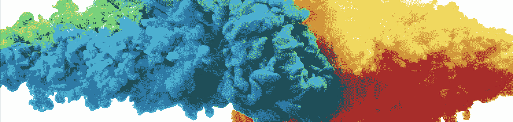
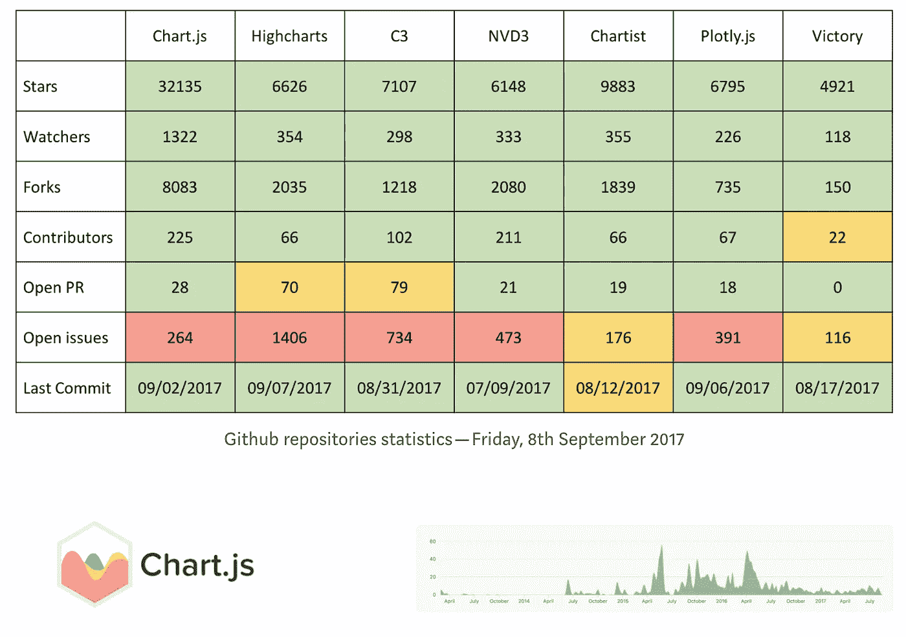
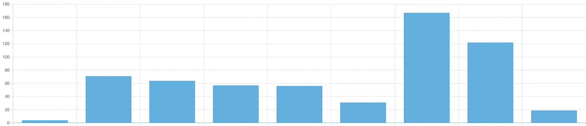
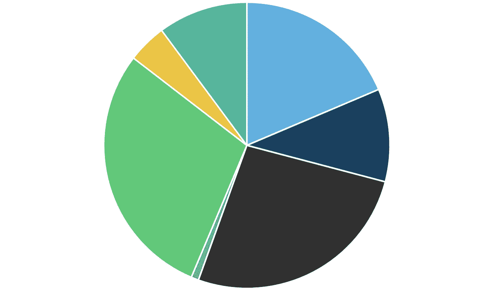
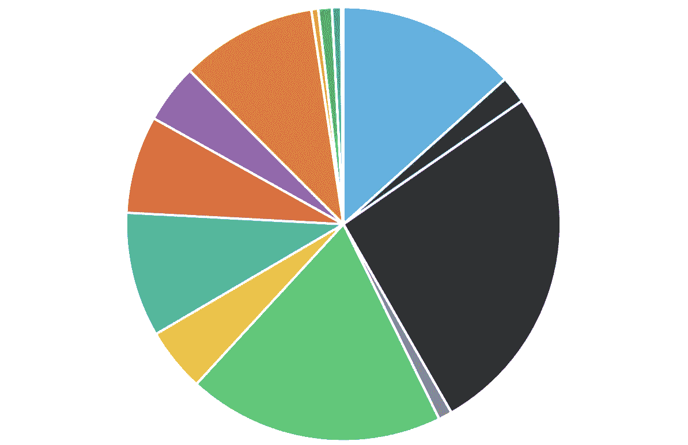

# 如何为 React 设置 Chart.js 并动态分配颜色

> 原文：<https://betterprogramming.pub/how-to-setup-chart-js-for-react-and-how-to-dynamically-allocate-colors-ae5faf7a45d3>



## 为什么应该使用 Chart.js 作为图表库——以及在使用时如何充分利用它

在这篇文章中，我将介绍:

1.  为什么使用 [Chart.js](https://www.chartjs.org) 对比竞争对手
2.  如何设置和安装 Chart.js
3.  如何为 Chart.js 准备数据
4.  如何为您的饼图动态分配颜色

# **为什么要用 Chart.js？**

说到图表库，你有很多选择。我选择了 [Chart.js](https://www.chartjs.org/) ，因为它拥有我需要的所有特性，是最流行的图表库，更新频繁，并且对 React 有很好的支持。如果你不确定该如何选择，我强烈推荐[这篇博客文章](https://blog.sicara.com/compare-best-javascript-chart-libraries-2017-89fbe8cb112d)，它以出色的视觉效果综合了不同图表库的主要优缺点。



[来源](https://blog.sicara.com/compare-best-javascript-chart-libraries-2017-89fbe8cb112d)

# 如何在 React 中使用 Chart.js

如果你还没有建立 Chart.js，我推荐你跟随这篇文章来完成这个过程。简而言之:

*   安装库

```
npm install react-chartjs-2 chart.js --save// ORyarn add react-chartjs-2 chart.js
```

*   导入和使用您想要的任何图表:

```
import {Bar} from 'react-chartjs-2';

< Bar data={...} />
```

# **如何准备你的资料**

注意到`data={...}`了吗？我们需要为 Chart.js 准备数据。

根据文档，Chartjs 希望您的数据如下所示:

```
data = {
  labels: ["January", "February", "March", "April", "May", "June", "July"],
  datasets: [{
    label: "My First dataset",
    backgroundColor: 'rgb(255, 99, 132)',
    borderColor: 'rgb(255, 99, 132)',
    data: [0, 10, 5, 2, 20, 30, 45],
  }]
}
```

*   `labels`将成为你的 X 轴标签
*   `datasets`是一组物体；Chart.js 可以同时显示多个数据集
*   `label`是每个数据集的标签
*   `borderColor`通常是单一颜色
*   `backgroundColor`可以是单个数据集的单色条形图或折线图。然而，对于包含多个数据集的饼图或折线图，你需要一组颜色。稍后将详细介绍。
*   `data`必须是一维数组

如果您从 REST API 获得 JSON 响应，或者从 GraphQL 端点获得一个对象数组，那么您将需要操作您的数据以获得一个整数的 1D 数组。

虽然在 vanilla JS 中可能，但我建议安装`lodash`以使您的代码在数据操作方面更简洁，使用:

```
npm install lodash --save
// OR
yarn add lodash
```

然后，您可以导入任何您想在 React 组件文件顶部使用的`lodash`函数，如下所示:

`import { groupBy, intersection } from lodash;`

因此，您的最终代码可能如下所示:

嘣！我们在渲染一张图表！它看起来像这样(但是标签在下面，标题在上面):



## 但是如果我们想要建立一个饼图呢？我们不希望馅饼的每一片都使用相同的颜色。

# 如何为包含多个数据集的饼图或折线图动态分配颜色

以下是我为饼图分配颜色的要求:

*   一次仅显示一个图表(用户将使用按钮来选择他们想要查看的图表)
*   分配给每个标签的颜色需要在不同的图表中保持一致。例如，“未知”在每个图表中需要是相同的颜色。
*   颜色可以跨图表重复使用，用于该图表的唯一标签，从而避免了使用大量唯一颜色的必要性。

我用几种不同的数据结构解决了这个问题，我将在下面解释原因:

## 使用了什么类型的数据结构，为什么？

*   `labelColors`和`usedColors`都是字典，所以我们不用遍历列表就可以快速查找标签的颜色
*   `usedKeys`是一个数组，它是`labelColors`和`labels`的交集——它表示当前图表中已经使用的颜色列表
*   `COLORS`是一个数组，因为颜色列表保持相同的顺序很重要，所以我们避免检查相同的颜色是否已经使用了多次。
*   `firstAvailColor`是一个整数，它代表`COLORS`中的第一个索引，当我们遍历在`labelColors`中还没有分配颜色的标签时，我们将在这里寻找一个新的颜色
*   `chartColors`是一个数组，因为它需要与`labels`的顺序相同，对应于其中存储的每种颜色。这是我们准备发送到 Chart.js

现在，您将获得标签在各报告中一致的图表，并重新使用当前报告中未分配的颜色。

例如，您的饼图可能看起来像这样(但是每种颜色都有一个图表标题和标签，我已经裁剪掉了):



今天到此为止！希望这对你有帮助。如果您有任何问题或反馈，请随时在下面发布。