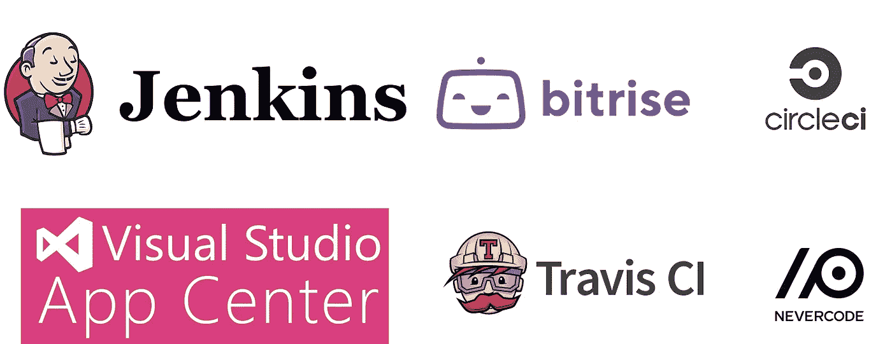
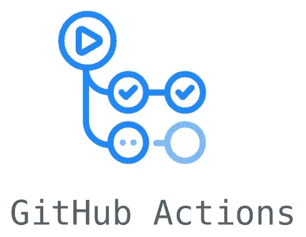
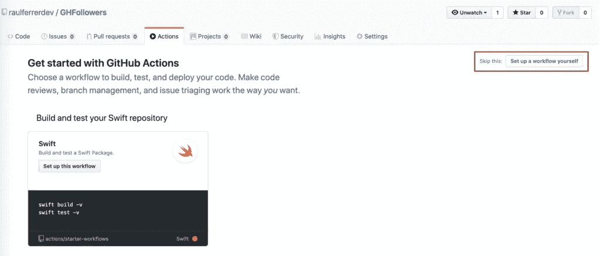
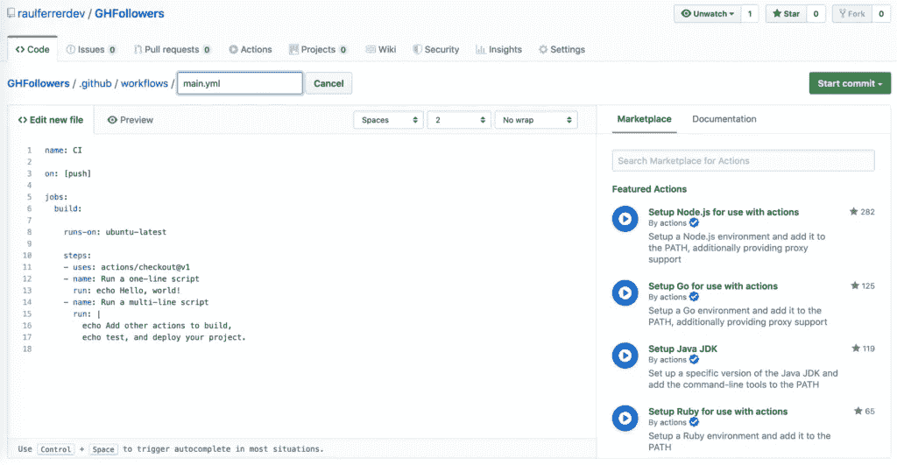
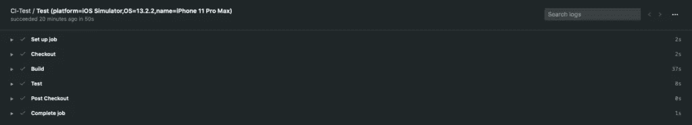
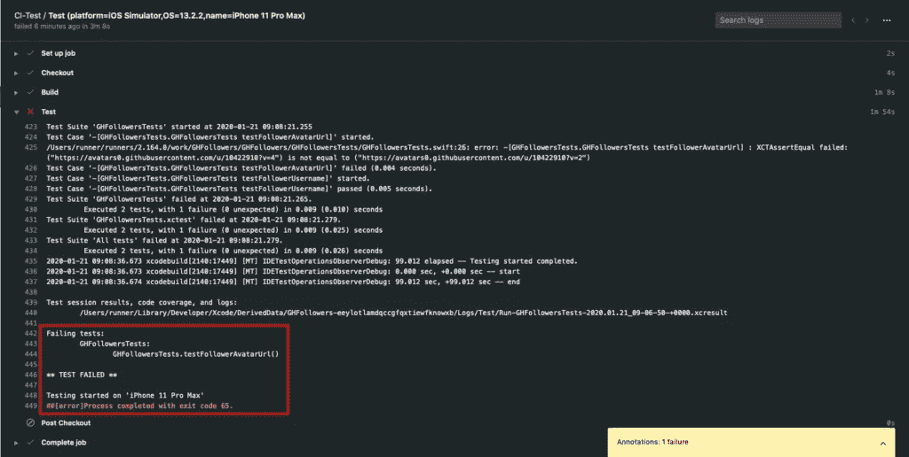

# 如何使用 GitHub Actions 为 iOS 设置 CI/CD(更新)

> 原文：<https://betterprogramming.pub/how-to-setup-ci-cd-a-swift-project-with-github-actions-31210592c14c>

## 推送至特定分支时执行操作


图片由 [Pxfuel](https://www.pxfuel.com/en/free-photo-jlbxz) 提供

[](https://raulferrer.dev)

我们来谈谈如何用 GitHub Actions 设置持续集成和持续交付(CI/CD)。但是等一下——CI/CD 是什么意思？

当不同的开发人员在一个应用程序中一起工作时，如果代码合并同时发生，就会出现许多问题:不同开发人员的代码之间的冲突、错误等。这一切都让这个过程变得缓慢。这就是 CI/CD 的用武之地。

# 持续集成

持续集成(CI)允许不同的开发人员频繁地上传和合并同一个存储库分支中的代码变更。一旦代码被上传，它将通过单元测试和集成测试自动验证(上传的代码和应用程序的其余组件)。如果出现错误，可以更简单地进行更正。

# 连续交付(CD)

在连续交付(CD)中，引入并通过 CI 流程的新代码会自动发布到生产环境中(这种实现可能需要人工批准)。我们的意图是，存储库代码总是处于允许在生产环境中实现的状态。

# 持续部署(CD)

在连续部署(CD)中，代码中经过前面两个阶段的所有更改都会自动在生产中实现。

# 执行 CI/CD 的工具

有许多工具可以配置和执行整个 CI/CD 流程:

*   [詹金斯](https://jenkins.io/):自由
*   [TravisCI](https://travis-ci.org/) :免费开源库
*   Nevercode :商用
*   CircleCI :商业版(有一个有限的免费版本)
*   商业版(有一个有限的免费版本)
*   [Visual Studio 应用中心](https://appcenter.ms/):商业版(有一个有限的免费版本)

[](https://medium.com/@RaulFerrer_dev/how-to-automatize-the-deployment-of-ios-applications-with-bitrise-c2ca95fa831a) [## 如何使用 Bitrise 自动部署 iOS 应用程序

### 节省大量开发时间

medium.com](https://medium.com/@RaulFerrer_dev/how-to-automatize-the-deployment-of-ios-applications-with-bitrise-c2ca95fa831a) 

[GitHub Actions](https://github.com/features/actions) 是执行 CI/CD 流程的新工具，[2018 年 10 月推出](https://github.blog/2018-10-17-action-demos/)，2019 年 8 月 beta 版上线，2019 年 11 月最终发布。GitHub Actions 也是付费的，虽然它有一个带有一些限制的免费版本。



# 在 iOS/Swift 项目中使用 GitHub 操作的示例

为了展示如何在 iOS 上的 CI/CD 过程中使用 GitHub 动作，我将使用[我自己的项目](https://github.com/raulferrerdev/GHFollowers)(基于 [Sean Allen](https://seanallen.co/) 课程)。

首先，我们进入 GitHub 项目并访问 Actions 选项卡:


我们进入一个屏幕，允许我们在预定义的工作流或建立我们自己的工作流之间进行选择。在我们的情况下，我们会选择建立我们自己的。



我们看到在名为`main.yml`的文件中有一个工作流，它在`.github/workflows/`中。我们可以用不同的工作流程创建不同的文件。



现在我们将改变文件的内容，这样一方面它执行应用程序，另一方面，它执行编程的测试。

## '名称'

这是我们工作流程的标签。

## “开”

GitHub 执行用`on`键定义的工作流——在我们的例子中，任何`push`事件。我们还可以定义一个特定的分支。例如，`devel`分支中的`push`事件:

```
on:
  push:
    branches:
    - devel
```

## 乔布斯的

每个工作流由一个或多个`jobs`组成。在我们的例子中，只有一个。

## “连续运行”

此参数包含将在其中执行代码的虚拟机的类型。在这种情况下，我们将使用`macos-latest`(查看不同类型的可用虚拟机)。

## “战略”和“矩阵”

一个`strategy`创建一个`matrix`环境，在其中执行工作。每个`matrix`允许我们建立一组不同配置的虚拟环境。在我们的例子中，我们设置了 iOS 模拟器，操作系统为 13.2.2，iPhone 11 Pro Max 设备为:

```
strategy:
        matrix:
          destination: ['platform=iOS Simulator,OS=13.2.2,name=iPhone 11 Pro Max']
```

多种配置的一个例子是:

```
strategy:
        matrix:
          destination: os: [ubuntu-latest, windows-latest, macOS-latest]
```

一个作业将在 ubuntu 上运行，另一个将在 windows 和 macOS 上运行。

## “步骤”

一个`step`是一系列的任务。在我们看到的例子中，第一步是检查存储库，以便工作流可以访问它。在这种情况下，这意味着`master`分支。

```
- name: Checkout
  uses: actions/checkout@master
```

第二步，在上面定义的环境中构建应用程序(`destination`):

```
- name: Build
    run: |
       xcodebuild clean build -project GHFollowers.xcodeproj -scheme GHFollowers -destination "${destination}" CODE_SIGN_IDENTITY="" CODE_SIGNING_REQUIRED=NO ONLY_ACTIVE_ARCH=NO
    env: 
      destination: ${{ matrix.destination }}
```

最后，在最后一步中，执行应用程序中创建的测试:

```
- name: Test
  run: |
          xcodebuild clean test -project GHFollowers.xcodeproj -scheme GHFollowersTests -destination "${destination}" CODE_SIGN_IDENTITY="" CODE_SIGNING_REQUIRED=NO ONLY_ACTIVE_ARCH=NO
  env: 
         destination: ${{ matrix.destination }}
```

当我们将代码上传到存储库时，这个工作流将会运行。如果我们再次访问存储库的“操作”( Actions)选项卡，我们可以看到工作流执行的时间列表。在这种情况下，如果没有发生错误，我们将获得以下内容:



我们可以证明当其中一个测试失败时会发生什么。通过更改其中一个测试，使其不符合要求，您将获得:



这里我们可以看到什么测试失败了。

# 结论

GitHub Actions 是 CI/CD 工具组中的新成员。它是最近才出现的，所以有必要看看它是如何与 TravisCI、Bitrise 或 Jenkins 等工具相抗衡的。