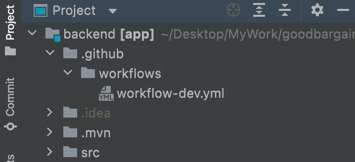

# 如何使用 Github 操作为您的项目设置 CI/CD

> 原文：<https://betterprogramming.pub/how-to-setup-ci-cd-for-your-project-using-github-actions-easily-d5a9c4968eec>

## (容易)

照片由[迈克·本纳](https://unsplash.com/@mbenna?utm_source=unsplash&utm_medium=referral&utm_content=creditCopyText)在 [Unsplash](https://unsplash.com/s/photos/pipeline?utm_source=unsplash&utm_medium=referral&utm_content=creditCopyText) 上拍摄

在本文中，我将向您展示如何通过简单的步骤设置 CI/CD 部署管道。我将在 AWS elastic beanstalk 上部署我的春靴项目。我的应用程序没有使用任何 Dockerization。

首先创建一个名为`.github`的新目录。当您将代码推送到 GitHub repo 时，GitHub 会自动检测这个目录中的所有`.yml`文件。

创建一个新文件`workflow-dev.yml`

在这个文件中，我们将为 CI/CD 管道编写说明

## 我们希望 CI/CI 渠道中包含什么？

**任务 1** :构建代码，这样我们就不会有任何编译错误

**任务 2** :生成您的代码的 jar 文件，该文件将被上传到您的 elastic beanstalk 实例

**任务三**:下载 jar 并上传到 elastic beanstalk

任务 4 :一旦 jar 部署完成，从 GitHub 存储中移除工件 jar。

我们将从下面的代码开始 yml 代码。

我们给出了我们管道的名称。接下来，我们将定义工作流运行的条件。如果你看到我们在`master`分支上使用`push`和`pull_request`条件。这意味着当有人将代码推送到主分支时，或者如果有人针对主分支创建拉请求，这个工作流将会运行。

接下来，我们将定义构建代码的`Task 1`。

如果您的代码正在使用任何私有库，而这些库需要您 maven 项目中的`settings.xml`中的一些凭证。您可以在 GitHub secret 中为您的 repo 创建这些值，并在构建代码时访问这些值。

接下来是生成工件 jar

只有当您将代码推送到`master`时，上面的步骤才会运行，因为在创建`pull_request`时，您不想生成 jar。上面的代码还会将生成的工件上传到 GitHub 存储中。

现在我们想下载 jar 并将其部署到 elastic beanstalk 实例。

如果你仔细观察，我们使用的是 GitHub 动作插件，名为**einaregilsson/beanstalk-deploy @ v 13**，它使用了一些我们定义的参数。在这里，我们需要设置一些关于我们的弹性 beanstalk 实例的信息，比如`application name, env name, region, etc`，您可以将您的 AWS 访问和密钥添加到 GitHub secret，并在您的管道中访问它。

最后一步是在部署代码后删除工件

以上将从 GitHub 存储中删除 jar。

**这是您的 CI/CD 管道的完整代码。**

希望这篇文章能帮助你快速建立你的 CI/CD 管道，这样你就可以专注于建设。

干杯！！