# 如何使用 React、CircleCI 和 GitHub 设置持续集成(CI)

> 原文：<https://betterprogramming.pub/how-to-setup-continuous-integration-ci-with-react-circleci-and-github-e0efd5040b03>

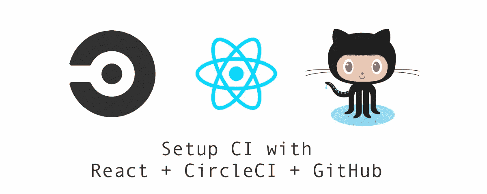

为了确保最高等级的代码质量，我们需要对每个提交/拉取请求进行多次检查。当您在团队中工作时，运行代码检查特别有用，并确保每个人都遵循最佳和最新的实践。

我们在谈论什么样的支票？首先，运行我们的单元测试以确保一切都通过，构建并捆绑我们的前端以确保构建不会在生产中失败，并运行我们的 linters 以执行标准。

在我目前的公司，我们在任何代码提交到存储库之前都要进行许多检查。

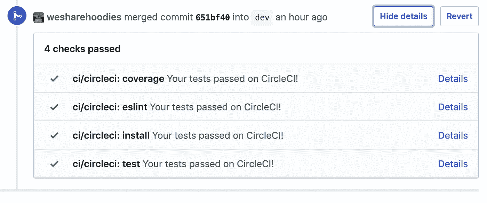

代码检查在[新](https://getnewly.com/)

CI 让我们可以自动运行代码检查。谁想在将代码推送到存储库之前运行所有这些命令呢？

# 入门指南

我选择 [CircleCI](https://circleci.com/) 是因为它慷慨的免费层，选择 [GitHub](https://github.com/) 是因为它的社区，选择 [React](https://reactjs.org/) 是因为它使用起来简单有趣。

# 创建 React 应用

创建您喜欢的 React 应用程序。为了简单起见，我使用 CRA。

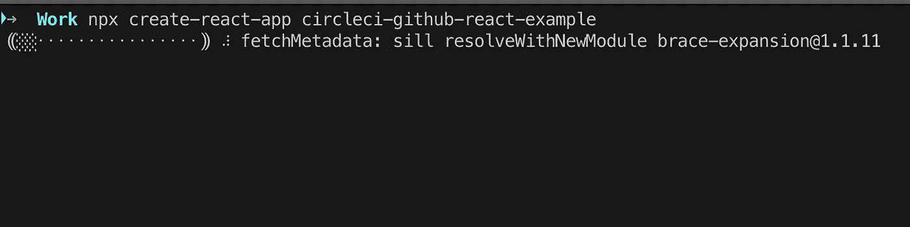

# 创建 GitHub 存储库

一旦你完成了 CRA，把代码推到你的 GitHub 库。

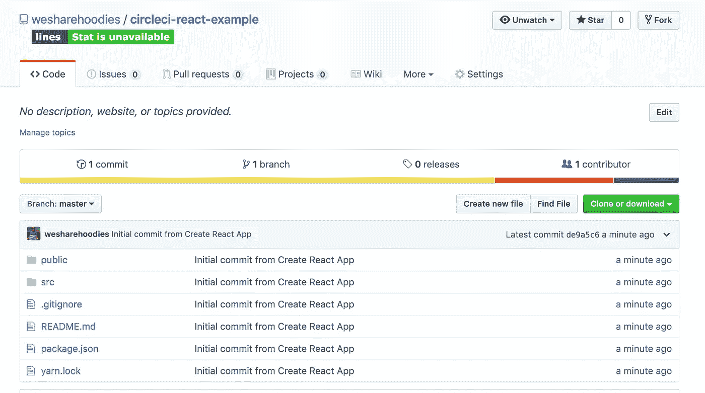

# 使用 CircleCI 设置配置项

如果你已经有一个 CircleCI 帐户，太好了！如果没有，[在这里创建一个](https://circleci.com/signup/)。

登录后，点击`Add Projects`。

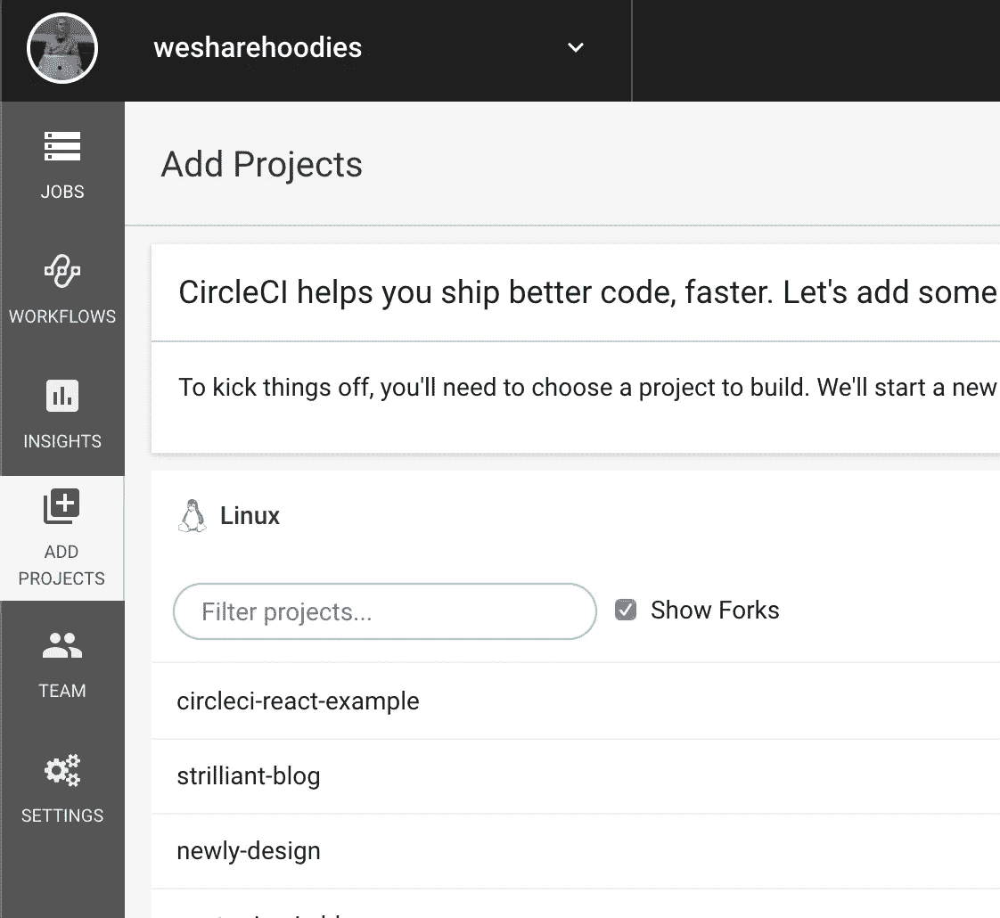

将项目添加到 CircleCI

找到您的存储库并点击`Set Up Project`。

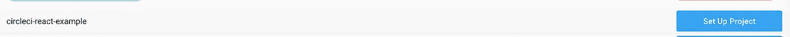

设置项目

现在我们应该看到一些说明。

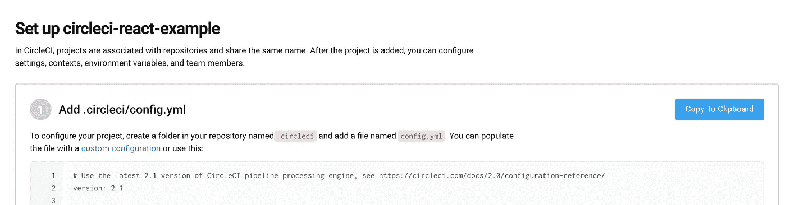

安装说明

很简单，让我们创建一个名为`.circleci`的文件夹，并将`config.yml`放在该文件夹中。

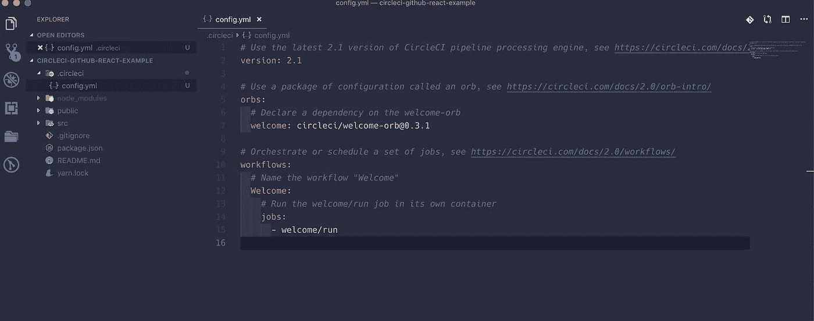

CircleCI config.yml

我们指定 CircleCI `version`、`orbs`和`workflows`。orb 是构建的可共享配置包。工作流是一组用于定义作业集合及其运行顺序的规则。

# 将代码推送到您的存储库

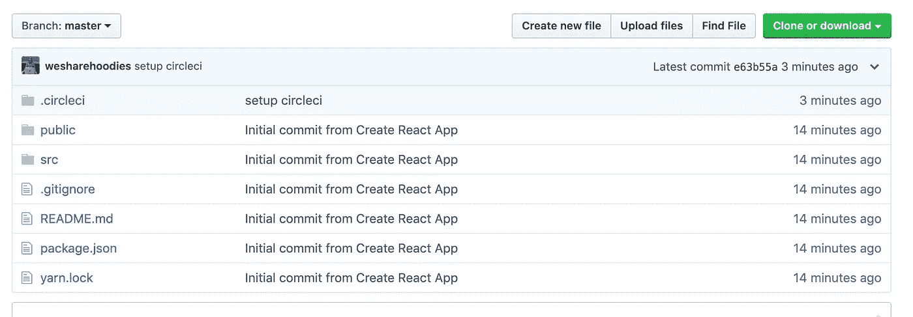

# 开始建造

回到 CircleCI 并按下`Start building`。

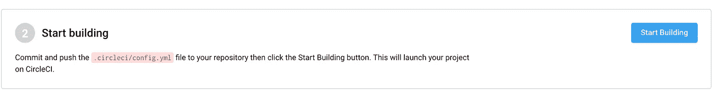

开始建设！

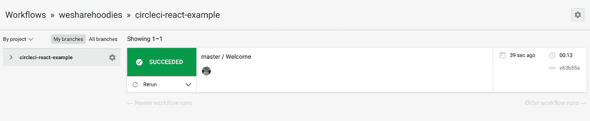

构建成功

如果您单击构建，您可以监视实际发生了什么。在这种情况下，欢迎球是一个演示，并没有做太多。

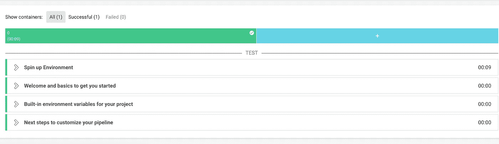

# 使用 React 设置 CircleCI

使用`config.yml`设置运行带有 React 的测试、lint 和构建检查。

在你推送了这段代码之后，给 orb 它需要的权限。

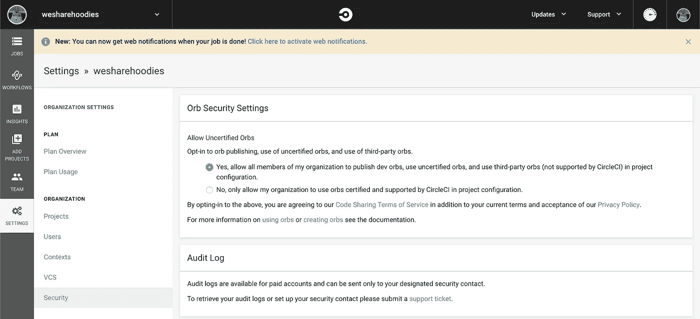

设置->安全->是，允许 orb

每个提交/PR 现在运行工作流作业。

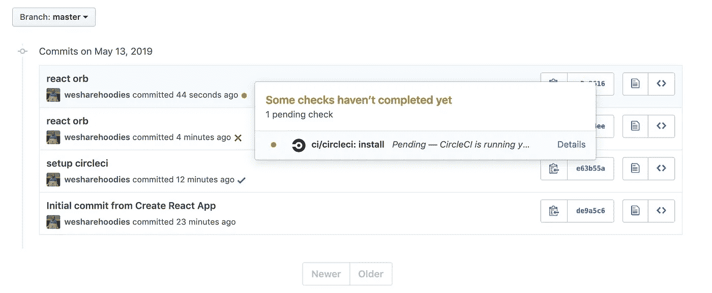

检查 CircleCI 以了解作业的进度。以下是 CircleCI 为每次提交所做的工作:

*   设置 React 项目。
*   运行 [ESLint](https://eslint.org/) 来检查代码的格式。
*   运行单元测试。
*   运行测试覆盖率。

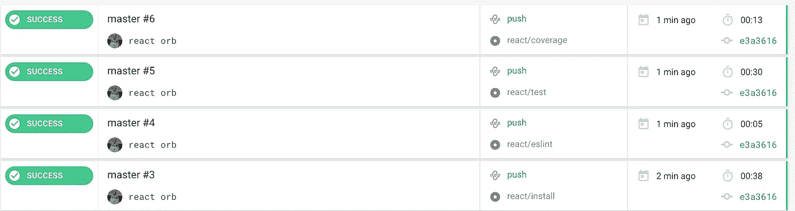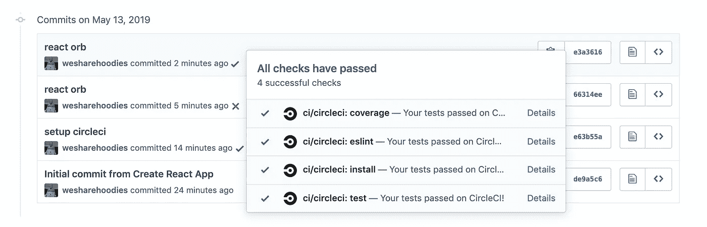

上述所有工作流作业必须成功，提交和构建才能成功。

现在，每个提交都有一个绿色、红色或黄色的勾号来指示状态！方便。

额外收获:如果你想了解更多关于安全性、可伸缩性和开发运营的最佳实践，我推荐这本书。它叫做“[*《devo PS 手册:如何在技术组织中创造世界级的敏捷性、可靠性和安全性》* s](https://amzn.to/2LQDOZG) ”，它在亚马逊上。

您可以在此处找到演示资源库:

 [## we share hoodies/circle ci-react-示例

### 在 GitHub 上创建一个帐户，为 wesharehoodies/circle ci-react-example 开发做出贡献。

github.com](https://github.com/wesharehoodies/circleci-react-example) 

感谢阅读！