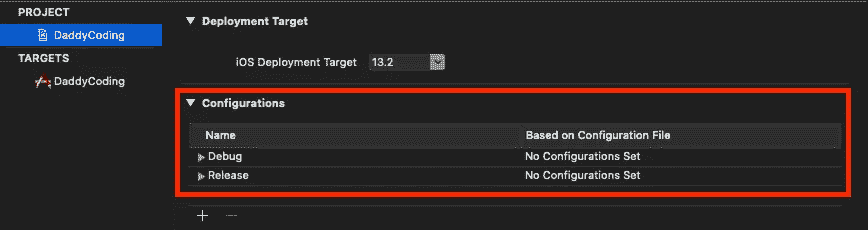
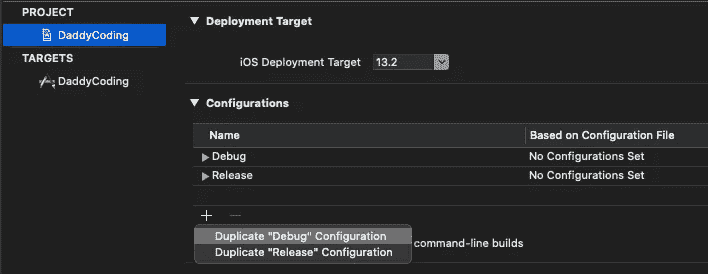
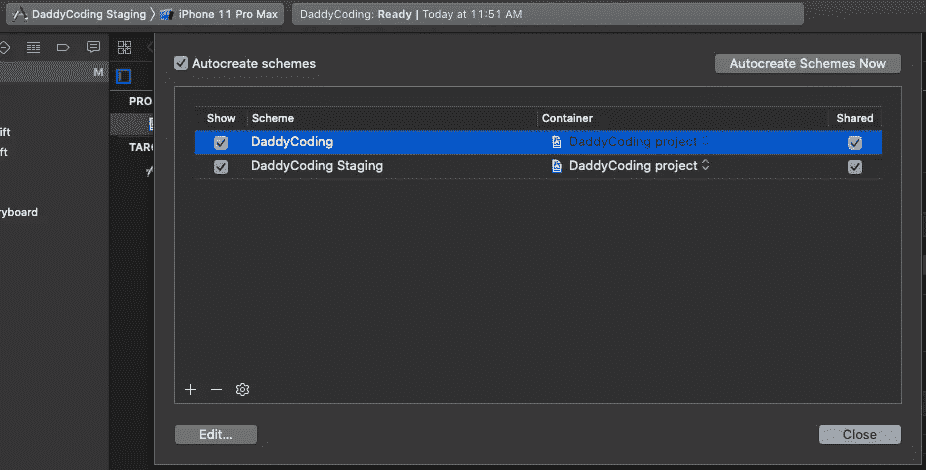
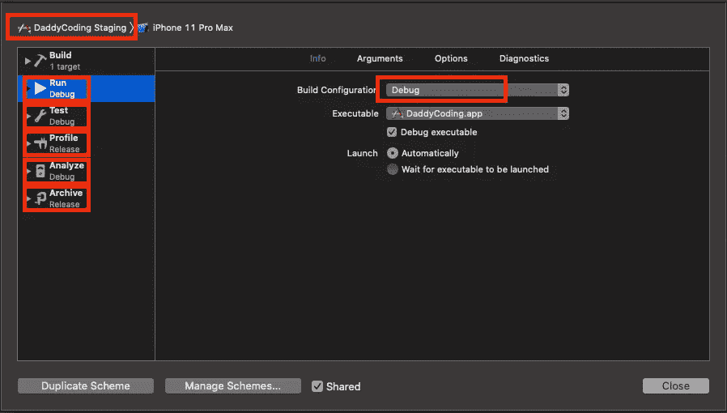
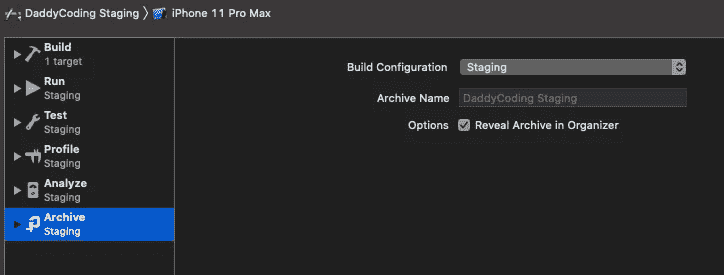
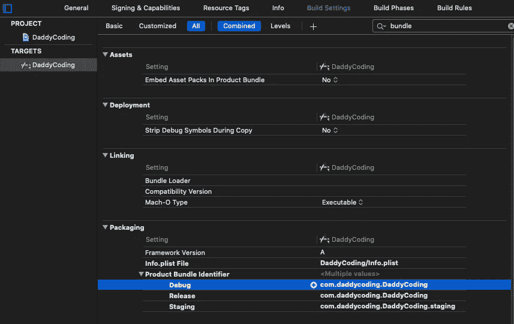
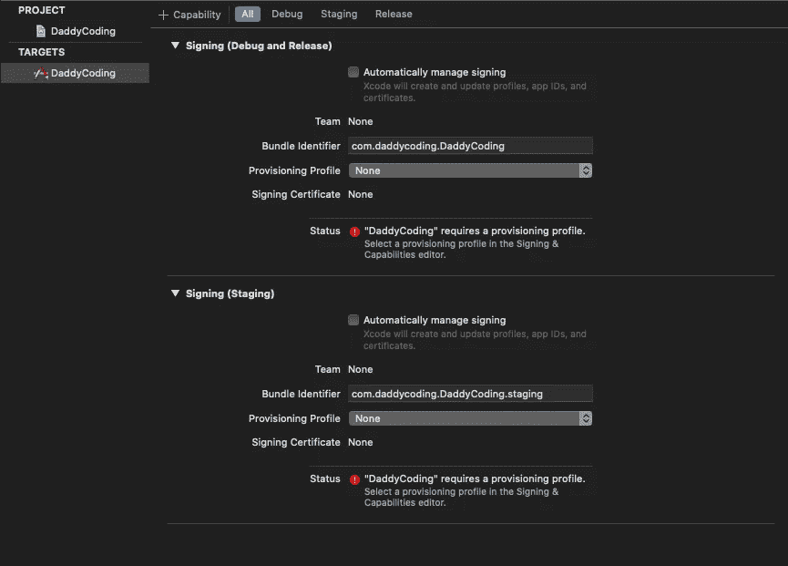
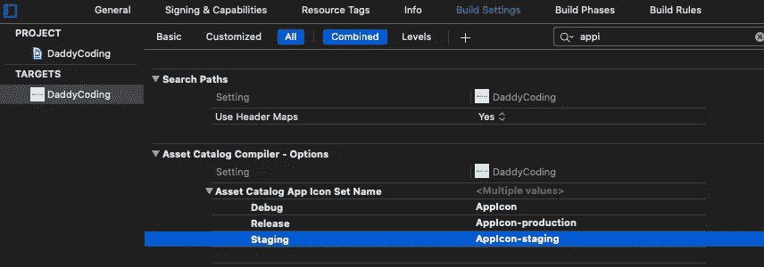
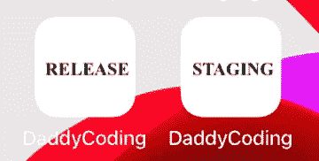

# 如何为您的应用程序开发设置不同的环境

> 原文：<https://betterprogramming.pub/how-to-setup-different-environments-for-your-apps-development-d9dcaa10c033>

## 超越调试和发布

照片由[桑德罗·卡塔琳娜](https://unsplash.com/@sandrokatalina?utm_source=unsplash&utm_medium=referral&utm_content=creditCopyText)在 [Unsplash](https://unsplash.com/s/photos/techno?utm_source=unsplash&utm_medium=referral&utm_content=creditCopyText) 拍摄

很多主流应用都有不止一个环境。Staging、Beta、Omega、Debug，或者你想给它们起什么名字，它们就像一个测试平台。质量保证工程师使用它们来运行健全性测试，在允许应用程序发布到生产之前，最大限度地减少应用程序中的错误。

# 先决条件

要跟随本教程，您需要:

*   对 Swift 的基本熟悉。
*   至少安装了 Xcode 10.0+版本。

# Xcode 配置

在您的 Xcode 上，您会注意到您的项目中目前有两个环境——调试和发布。默认情况下，当您运行和构建项目时，您处于调试环境中。但是当你把你的应用存档到 App Store 的时候，它会在发布环境中。

您将再复制一个环境，并将其命名为 Staging。您可以按照下图进行操作:

# Xcode 方案

接下来，进入“管理方案”(菜单栏->产品->方案->管理方案)，点击(+)创建一个附加方案，并将其命名为`DaddyCoding Staging`。现在你会注意到你有一个额外的计划。

您将编辑 DaddyCoding Staging 并修改一些构建配置。因为您从 Debug 复制，所以默认情况下它具有 Debug build 配置。您不希望这样—您希望它成为试运行构建配置。

编辑它们中的每一个，以确保它们都使用了临时构建配置。

# Xcode 产品捆绑标识符

请注意，每个环境使用不同的包标识符。例如，如果您的生产产品标识符是`com.daddycoding.DaddyCoding`，那么您的暂存应该是`com.daddycoding.DaddyCoding.staging`。

转到“构建设置”，并为不同的环境添加不同的包标识符。应该都是独一无二的。让`Debug`保持原样，因为我们不使用它。

# Xcode 签名

接下来，通过使用多个环境，建议始终取消选中**“**自动管理签名”，以便您可以控制将要使用的配置文件。

你会注意到有两个签名，包括`Release`和`Staging`。`Release`应该使用自己的唯一捆绑包标识符，如前所述，以及自己的供应配置文件。同样适用于`Staging`。

您可以在`developer.apple.com`中创建包标识符和配置文件。

# Xcode 应用程序图标

为了帮助您区分，您甚至可以为不同的环境创建不同的映像，这样您就可以知道您在哪个环境中。在这里，您将使用环境的名称创建两个不同的图像。

图像存储在`Assets.xcassets`中，命名为`AppIcon-production`和`AppIcon-staging`。

# 运行您的环境

您可以选择运行`Staging`或`Production`环境。无论哪种方式，应用程序图标应该看起来不同。

# 最佳实践

这种方法肯定有很多优点，您不必为不同的环境创建不同的目标。假设您的应用程序是一个区域性应用程序，在四个不同的国家有不同的名称，并且您有多个环境，仅这一项就将创建十个以上的目标，从经验来看，维护所有这些目标肯定不容易

最佳实践是让一个目标具有多种方案和配置。

# 从这里去哪里

如果这让你兴奋，并且你喜欢挑战自己，请随意查看我准备的其他一些帮助你提高的高级教程:

*   学习如何创建自己的日历。
*   [了解如何创建滑动分页菜单。](https://daddycoding.com/2020/04/19/ios-tutorial-paging-menu/)