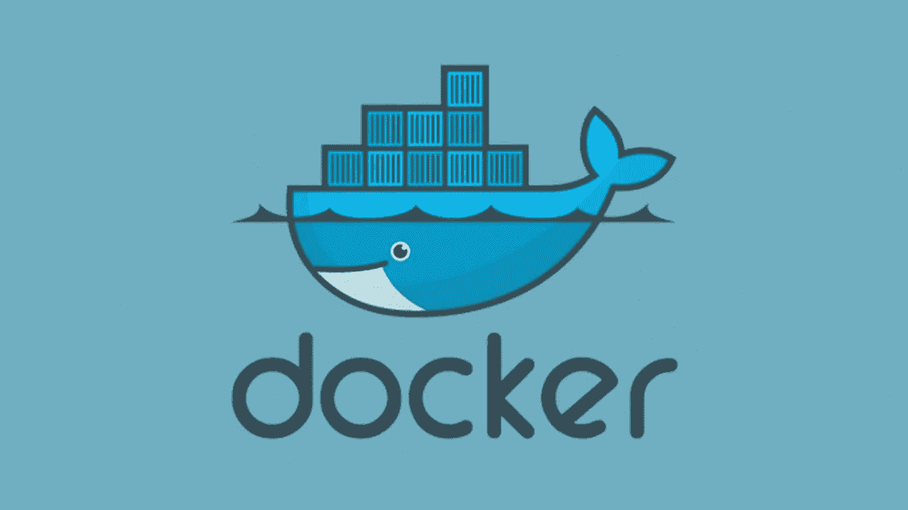
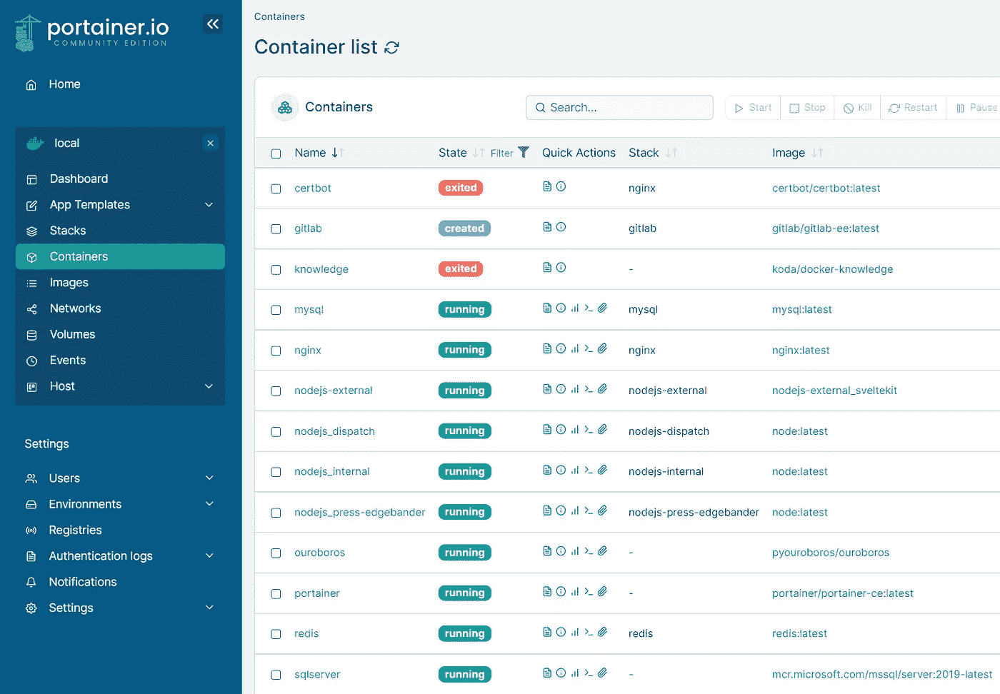
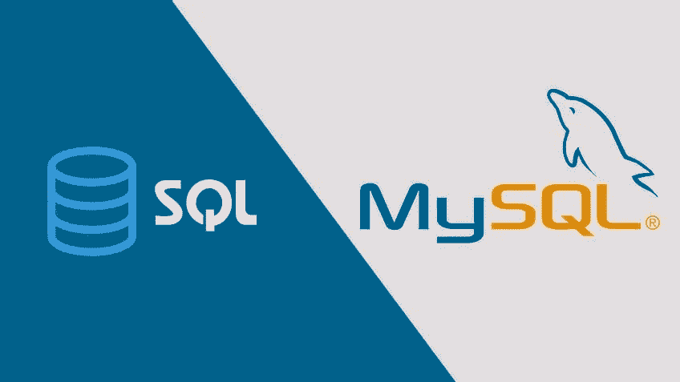

# 如何为小型企业设置 Docker

> 原文：<https://betterprogramming.pub/how-to-setup-docker-like-a-professional-f0ec833040e2>

## Docker 容器备份指南和设置它们的最佳实践



码头鲸和一些集装箱

# 环境

大多数设置通常都有一个 NAS 和应用服务器。在本指南中，我使用 Synology 的 NAS 和我首选的主机服务器操作系统 [Alpine](https://alpinelinux.org/) 。

要查看代码示例，请查看我的 [GitHub 库](https://github.com/Loizzus/EnterpriseDockerSetup)。

# Docker 和卷的问题

关于设置 Docker 的正确方法，有很多相互矛盾的信息。许多困惑来自 Docker 自己的文档；他们说，“[卷是在 Docker](https://docs.docker.com/storage/) 中保存数据的最佳方式。”在我寻找设置它的正确方法的过程中，这被证明是非常误导的。

我可以说 Docker 似乎没有一个通用的容器备份解决方案。如果您尝试从卷绑定挂载中复制数据，您将会遇到大多数容器的权限问题。同样，如果您尝试从您的 NAS 创建 SMB 或 NFS 装载，并将 docker 文件存储在其中，您将遇到权限问题(因为文件的所有者需要是每个容器中使用的用户，而该用户可能不在主机环境或您的 NAS 上)。

一旦您恢复备份，您的容器将无法以用户身份使用文件，并且对恢复的文件的权限将会更改。如果您使用 Docker 管理的卷，更改其中的文件会很困难。卷只是用来存储容器创建和使用的数据。您不应该直接与这些数据进行交互。

# 解决方案

实际情况是，在管理和备份每个容器的数据时，答案会因容器而异。我将列出一些我使用的容器以及我如何设置它们。

# 便携式集装箱

如果你不知道 Portainer，你应该使用它。当你不想记住命令行选项时，它是一个超级方便的工具来检查你的容器和执行基本任务。安装说明在这里。无需备份。



我的生产 Portainer 容器视图

# 杰基特索纳尔的 Plex(和下载站)

我使用 Plex 作为我的媒体中心，Sonarr 和 Jacket 确保我的电视节目总是有最新的剧集。这个媒体数据对我来说相对不重要。我不在乎备份。但是，我有很多，所以除了在我的 NAS 上，把它存储在任何地方都是不切实际的。


因此，这三个容器需要访问我的 Synology NAS 上的一个共享文件夹。过去，我使用 SMB 协议(`apk add samba-client`)，虽然速度够用，但我发现它太不可靠。我会时不时地让容器突然失去对挂载的某些权限，并且不能再删除文件，有时甚至根本不能写。我最终选择了 NFS，它在 Unix 系统之间工作得更好，因为它是为 Linux 设计的，解决了许多权限问题。

为了设置它，我按照 Synology 对服务器端的说明进行了操作。然后我按照[这些说明](https://www.hiroom2.com/2017/08/22/alpinelinux-3-6-nfs-utils-client-en/)在 Alpine 安装驱动器。

```
1\. Install nfs-utils package
$ sudo apk add nfs-utils
$ sudo rc-update add nfsmount
$ sudo rc-service nfsmount start

2.Mount NFS with mount.nfs
$ NFS_SERVER=drive.mydomain.nz
$ NFS_DIR=/volume1/Media
$ sudo mount -t nfs ${NFS_SERVER}:${NFS_DIR} /mnt/Media

3.Mount NFS on boot
$ echo "${NFS_SERVER}:${NFS_DIR} /mnt/drive nfs _netdev 0 0" | \
sudo tee -a /etc/fstab

4.If needed unmount
$ umount -f -l /mnt/Media.
```

你可以在这里找到我的 Docker 运行代码。(我需要将它转换成 Docker Compose，但是还没有开始使用):`[/Docker/containers/plex/](https://github.com/Loizzus/EnterpriseDockerSetup/blob/main/Docker/containers/plex/dockerRunScript.txt)`

设置后我遇到的唯一问题是，在启动时，容器会在 NFS 驱动器安装之前启动，导致所有容器出错，直到我重新启动它们。为了解决这个问题，我告诉 docker 服务在 NFS 服务之后启动，方法是将这个配置添加到 docker 服务配置文件的末尾:`/etc/conf.d/docker`

```
# Command added by admin to make Docker start after network drive has been mounted
rc_need="nfsmount"
```

# GitLab

GitLab 很容易设置。它的文档是我见过的 Docker 容器中最好的。要备份 Gitlab，您必须在容器内运行一个命令，这会创建一个备份文件。

然而，他们忽略了几个重要的文件(出于安全原因，我选择忽略)。无论如何，我在`[/Docker/containers/gitlab](https://github.com/Loizzus/EnterpriseDockerSetup/tree/main/Docker/containers/gitlab)`中创建了一个批处理脚本，你可以使用`crontab -e`自动执行它，它会自动将所有内容复制到你安装的驱动器上。

# MsSQL —微软 SQL

在`[/Docker/containers/mssql](https://github.com/Loizzus/EnterpriseDockerSetup/tree/main/Docker/containers/mssql)`中，您可以找到必须在主机操作系统上作为 cronjob 运行的脚本。该脚本在 MsSQL 容器中运行一个命令来创建备份，然后该脚本将备份从您的绑定装载拷贝到您的 NAS。

# 关系型数据库

对于这个脚本(在`[/Docker/containers/mysql](https://github.com/Loizzus/EnterpriseDockerSetup/tree/main/Docker/containers/mysql)`中)，我选择使用 MySQL dump 实用程序，我觉得它更加通用。它允许我从 Synology NAS 运行脚本，并远程连接到 MySQL 服务器来转储数据库。



# Ouroboros —容器更新程序

这只是一个很好的工具。它将容器更新到最新版本。

```
docker run -d --name ouroboros \
  -v /var/run/docker.sock:/var/run/docker.sock \
  -e LATEST=false \
  -e SELF_UPDATE=true \
  -e MONITOR="gitlab portainer sqlserver mysql knowledge docker_web_1 nodejs-internal" \
  -e CLEANUP=true \
  --restart unless-stopped \
  pyouroboros/ouroboros
```

# 知识库

```
docker pull koda/docker-knowledge
mkdir /var/lib/knowledge
chmod a+w /var/lib/knowledge

docker run -d \
-p 8085:8080 \
-v /var/lib/knowledge:/root/.knowledge \
--restart unless-stopped \
--name knowledge \
koda/docker-knowledge
```

# 节点. js

在我的例子中，Node 中没有太多需要备份的内容，因为我的数据都存储在数据库中。我不想保留 Node 创建的任何文件。如果我对节点代码进行了更改，我会使用 WinSCP 将它们复制到 bind mount 文件夹中，然后使用如下命令行:

```
$ cd /var/lib/nodejs
$ docker-compose down
$ docker-compose up -d
```

# NginX

这是使用 Docker 最重要的容器之一；它允许你在一台机器上托管多个网站。由于我更喜欢 Node.js 而不是 PHP，所以我不使用它的 PHP 功能。我让它托管静态网站，并充当应用程序代理。它会查看人们在被定向到服务器时正在寻找哪个主机名，以及流向相应容器的流量。通常，我在一个阿尔卑斯主机上有超过 6 或 7 个网站，没有任何问题，多亏了这个。


# 支持你的宗教信仰

将所有 Docker 文件备份到 Synology 后，找到一个好的云存储提供商，在 Hyper Backup 中设置它们，并配置一个备份任务，定期将所有内容上传到云中。