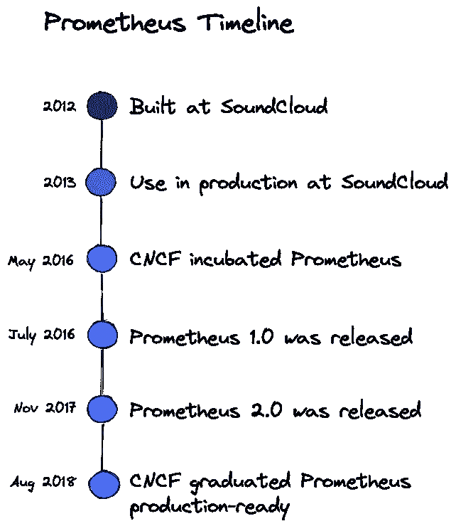
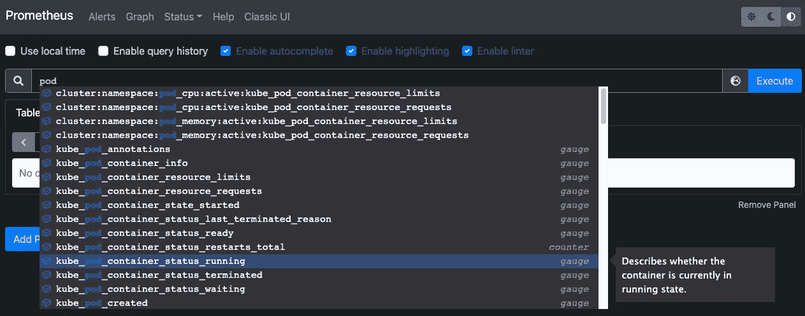
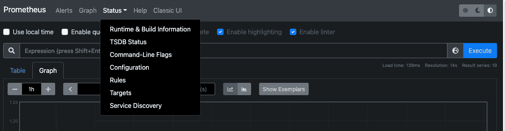
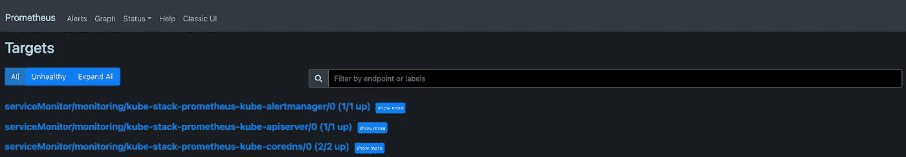
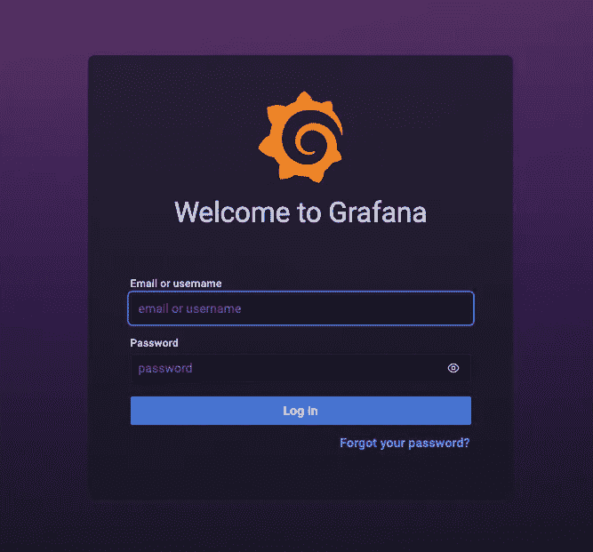
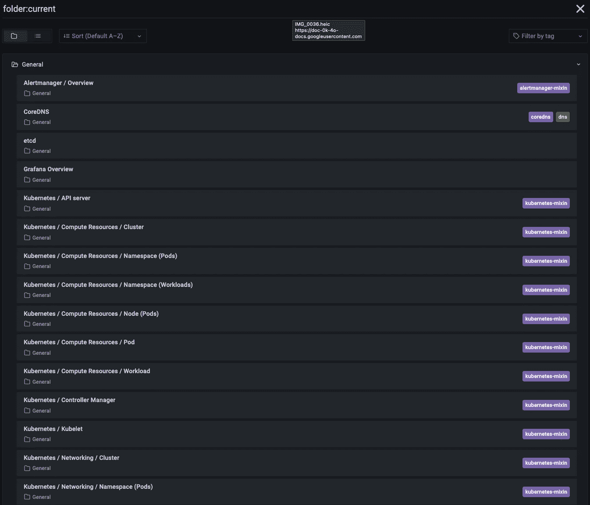
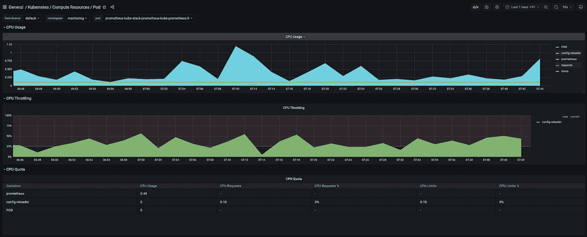

# 如何在 Kubernetes 上设置 Prometheus(操作员)和 Grafana 监控

> 原文：<https://betterprogramming.pub/how-to-setup-prometheus-and-grafana-monitoring-on-kubernetes-37d76c97dba0>

## 本教程向您展示了如何在 Kubernetes 上使用 Prometheus(操作员)和 Grafana 开始一个现代监控堆栈


照片由 [Matthijs van Schuppen](https://unsplash.com/@mattvs?utm_source=unsplash&utm_medium=referral&utm_content=creditCopyText) 在 [Unsplash](https://unsplash.com/photos/bwonz6tZpVA?utm_source=unsplash&utm_medium=referral&utm_content=creditCopyText) 拍摄

监控是 DevOps 最佳实践的关键支柱。这提供了关于平台性能和健康状况的重要信息。在 Kubernetes 和微服务这样的分布式环境中，更是如此。

Kubernetes 的一大优势是能够扩展您的服务和应用程序。当您接触到成千上万个应用程序时，手动监控它们或使用脚本是不可行的。您需要采用一个可扩展的监控系统！这就是普罗米修斯和格拉夫纳出现的地方。

Prometheus 将收集、存储并允许您利用您的平台指标。另一方面，Grafana 将插入 Prometheus，并允许您创建漂亮的仪表板和图表。

今天，我们将讨论 Prometheus 是什么，以及在 Kubernetes 上部署它的最佳方式——使用操作符。我们将看到如何用普罗米修斯和格拉夫纳建立一个监控平台。

本教程将为您提供一个具有可观察性的良好起点，并走得更远！

# 普罗米修斯

## 时间表

[Prometheus](https://prometheus.io/) 是 2012 年在 [SoundCloud](https://soundcloud.com/) 开发的一款用于事件监控和警报的免费开源应用。不久之后，许多公司和组织采用了它并做出了贡献。2016 年，[云原生计算基金会](https://www.cncf.io/) (CNCF)继 Kubernetes 之后孵化了普罗米修斯项目。

以下时间表显示了普罗米修斯项目的进展:



普罗米修斯项目时间表

## 概念

Prometheus 被认为是 Kubernetes 的默认监控解决方案，其灵感来自谷歌的 Borgman。它使用 HTTP 拉请求从应用程序和基础设施收集指标。目标是通过服务发现或静态配置发现的。通过中间网关也支持推送时间序列。


通过 HTTP 向 Prometheus 公开的指标示例

*普罗米修斯目标暴露的度量具有以下格式:* `<metric name>{<label name>=<label value>, ...}`

Prometheus 在时序数据库(TSDB)中记录实时指标，这带来了维度数据模型、操作简单性和可扩展的数据收集。它提供了 PromQL，一种灵活的查询语言来利用这种维度。

## 体系结构


来自[https://prometheus.io/](https://prometheus.io/)的普罗米修斯建筑

架构图显示 Prometheus 是一个多组件监控系统。普罗米修斯部署中集成了以下组件:

*   Prometheus 服务器抓取并存储时间序列数据。它还提供了一个用户界面来查询指标。
*   [客户端库](https://prometheus.io/docs/instrumenting/clientlibs/)用于检测应用程序代码。
*   [Pushgateway](https://github.com/prometheus/pushgateway) 支持从短期任务中收集指标
*   [出口商](https://prometheus.io/docs/instrumenting/exporters/)对于不直接使用普罗米修斯指标的服务。
*   [警报管理器](https://github.com/prometheus/alertmanager)处理基于触发器的实时警报

# 为什么选择普罗米修斯算子？

Kubernetes 提供了许多对象来部署您的应用程序:Pod、Deployment、Service、Ingress 等。这些是本机资源，由于它们是通用的，所以它们的行为不像最终的应用程序。Kubernetes 允许您通过自定义资源定义(CRD)创建自定义资源。

CRD 对象实现了最终应用程序的行为。这允许更好的可维护性并减少部署工作。使用[普罗米修斯算子](https://github.com/prometheus-operator/prometheus-operator)时，架构的每个组件都来自一个 CRD。这使得 Prometheus 的安装比传统的安装更简单。

在传统的 Prometheus 安装中，添加新的度量端点需要更新服务器配置。这允许注册一个新的端点作为收集指标的目标。Prometheus 操作员使用`Monitor`对象( [PodMonitor](https://github.com/prometheus-operator/prometheus-operator/blob/main/Documentation/api.md#podmonitor) 、 [ServiceMonitor](https://github.com/prometheus-operator/prometheus-operator/blob/main/Documentation/api.md#servicemonitor) )来动态发现端点并抓取指标。

使用 Prometheus 操作员可以为 Prometheus 的安装和维护赢得时间。它为您提供监视对象，以便在不更新 Prometheus 配置的情况下动态收集指标。

# 与操作员一起部署普罗米修斯

`kube-prometheus-stack`是 Kubernetes 清单、Grafana 仪表板和 Prometheus 规则的集合。它通过 Prometheus 使用操作员提供易于操作的端到端 Kubernetes 集群监控。

[](https://github.com/prometheus-community/helm-charts/tree/main/charts/kube-prometheus-stack) [## 头盔-海图/海图/库贝-普罗米修斯-主普罗米修斯-社区的堆栈/头盔-海图

### 安装 kube-prometheus 堆栈，它是 Kubernetes 清单、Grafana 仪表板和 prometheus 规则的集合…

github.com](https://github.com/prometheus-community/helm-charts/tree/main/charts/kube-prometheus-stack) 

这一系列可通过舵轮图获得和部署。您可以在一个命令行中部署监控堆栈。刚接触头盔？看一下[本教程](https://getbetterdevops.io/helm-quickstart-tutorial/)入门！

## 安装舵

```
$ brew install helm
```

## 创建专用的监视命名空间

在 Kubernetes 中，名称空间提供了一种在单个集群中隔离资源组的机制。我们创建一个名为`monitoring`的名称空间来准备新的部署:

```
$ kubectl create namespace monitoring
```

## 安装带舵的 kube-prometheus-stack

使用以下命令添加 Prometheus 图表存储库并更新本地缓存:

```
$ helm repo add prometheus-community https://prometheus-community.github.io/helm-charts 
$ helm repo update
```

使用 Helm 在名称空间`monitoring`中部署 kube-stack-prometheus 图表:

```
$ helm upgrade --namespace monitoring --install kube-stack-prometheus prometheus-community/kube-prometheus-stack --set prometheus-node-exporter.hostRootFsMount.enabled=false
```

`hostRootFsMount.enabled` *设置为* `false` *在 Mac 上 Docker 桌面工作*

CRD 现在安装在名称空间中。您可以使用下面的`kubectl`命令来验证这一点:

```
$ kubectl get -n monitoring crds                                                           
NAME                                        CREATED AT
alertmanagerconfigs.monitoring.coreos.com   2022-03-15T10:54:41Z
alertmanagers.monitoring.coreos.com         2022-03-15T10:54:42Z
podmonitors.monitoring.coreos.com           2022-03-15T10:54:42Z
probes.monitoring.coreos.com                2022-03-15T10:54:42Z
prometheuses.monitoring.coreos.com          2022-03-15T10:54:42Z
prometheusrules.monitoring.coreos.com       2022-03-15T10:54:42Z
servicemonitors.monitoring.coreos.com       2022-03-15T10:54:42Z
thanosrulers.monitoring.coreos.com          2022-03-15T10:54:42Z
```

下面是我们现在在名称空间中运行的内容:

```
$ kubectl get pods -n monitoring                                                                    
NAME                                                       READY   STATUS    RESTARTS   AGE
alertmanager-kube-stack-prometheus-kube-alertmanager-0     2/2     Running   0          2m36s
kube-stack-prometheus-grafana-6994bd6c69-h6s9z             3/3     Running   0          13h
kube-stack-prometheus-kube-operator-86667b5cdf-cqndt       1/1     Running   0          13h
kube-stack-prometheus-kube-state-metrics-fc9878699-dpgh6   1/1     Running   0          13h
kube-stack-prometheus-prometheus-node-exporter-vrjsl       1/1     Running   0          13h
prometheus-kube-stack-prometheus-kube-prometheus-0         2/2     Running   0          13h
```

该图表安装了 Prometheus components、Operator、Grafana 和以下出口商:

*   [普罗米修斯节点导出器](https://github.com/prometheus/node_exporter)公开硬件和操作系统指标
*   [kube-state-metrics](https://github.com/kubernetes/kube-state-metrics) 监听 Kubernetes API 服务器并生成关于对象状态的度量

我们与普罗米修斯和格拉夫纳的监控系统已经准备好了！

# 连接到普罗米修斯的网络界面

Prometheus web UI 可通过以下命令通过`port-forward`访问:

```
$ kubectl port-forward --namespace monitoring svc/kube-stack-prometheus-kube-prometheus 9090:9090
```

打开`[http://localhost:9090](http://localhost:9090)`上的浏览器标签，显示普罗米修斯网络用户界面。我们可以检索从出口商那里收集的指标:



Prometheus web UI 中的仪表板显示时间序列指标

转到“Status>Targets ”,您可以看到 Prometheus 服务器发现的所有指标端点:



普罗米修斯发现的度量端点在状态>目标菜单中可见



Prometheus 服务器发现的目标端点很少

# 连接到 Grafana

连接到 Grafana web 界面的凭证存储在 Kubernetes Secret 中，并以 base64 编码。我们用这两个命令检索用户名和密码:

```
$ kubectl get secret --namespace monitoring kube-stack-prometheus-grafana -o jsonpath='{.data.admin-user}' | base64 -d 
$ kubectl get secret --namespace monitoring kube-stack-prometheus-grafana -o jsonpath='{.data.admin-password}' | base64 -d
```

我们用以下命令创建到 Grafana 的`port-forward`:

```
$ kubectl port-forward --namespace monitoring svc/kube-stack-prometheus-grafana 8080:80
```

打开您的浏览器，进入 `[http://localhost:8080](http://localhost:8080)`并填写之前的凭证:



Grafana 登录界面

kube-stack-prometheus 部署提供了 Grafana 仪表盘:



提供的 Grafana 仪表板列表

这里我们可以看到其中一个展示了 Kubernetes pods 的计算资源:



显示 Kubernetes pod 计算资源的 Grafana 仪表板

好了，这就是你如何在库本内特斯上设置普罗米修斯和格拉法纳监控的。

感谢阅读！🙏我希望这篇文章是有帮助的。想了解更多关于 DevOps 的知识？看看下面更多类似的文章吧！⬇️

[](https://getbetterdevops.io) [## Getbetterdevops

### Getbetterdevops 是一个 devops 博客，帮助学习现代基础设施和云技术，如 Kubernetes…

getbetterdevops.io](https://getbetterdevops.io)