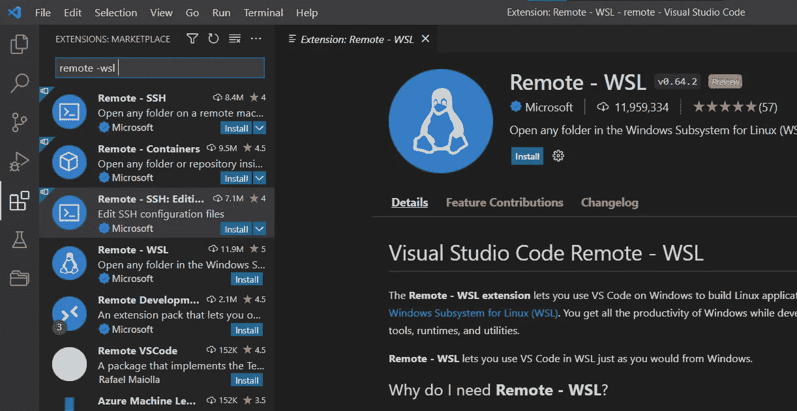
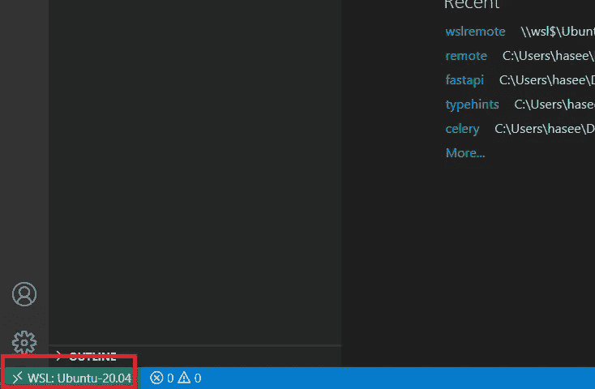
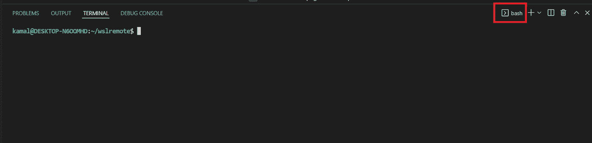

# 如何在 Windows 上设置远程 WSL 以实现无障碍开发？

> 原文：<https://betterprogramming.pub/how-to-setup-remote-wsl-for-hassle-free-development-on-windows-5ccbeb043961>

## 没有 Linux 没问题。了解如何从 Windows 直接在 Linux 中开发！


Photo by [復堯](https://unsplash.com/@fuyao4real?utm_source=ghost&utm_medium=referral&utm_campaign=api-credit) / [Unsplash](https://unsplash.com/?utm_source=ghost&utm_medium=referral&utm_campaign=api-credit)

在我之前的一篇[帖子](/make-your-code-2x-faster-with-this-simple-python-library-83d92bf29aec)中，我演示了一个叫做 Celery 的 Python 框架的使用。本教程依赖于使用一种叫做 Redis 的特殊数据库服务。然而，Redis 在 Windows 上没有得到官方支持，这使得 Windows 用户无法遵循该教程。我自己也是 Windows 用户，这是伴随我长大的操作系统。尽管有缺陷，我还是犹豫是否要转换到基于 Unix 的系统，如 MacOS 或 Linux。

但是必须有一种方法在 Windows 机器上实现可靠和一致的开发工作流。

确实有，这就是这篇文章的主题！

在这篇文章中，我们将在 Windows 计算机上的 Linux 环境中开发一个 Python 程序！我们将使用 *WSL* 和 VSCode 扩展: *wsl-remote* 来开发它。

# WSL

WSL 代表 Linux 的 Windows 子系统。本质上，WSL 允许 Windows 用户在他们的机器上运行 Linux 环境。由于是完整的 Linux 安装，所以可以使用`grep`、`ls`、`find`等 Linux 命令。

WSL 具有以下优势:

*   比传统虚拟机(VirtualBox)更快
*   避免双重引导 Linux 的麻烦
*   避免从硬盘启动 Linux 的麻烦
*   VSCode 通过扩展完全支持

# 安装 WSL

可以通过在 PowerShell 终端中运行以下命令来安装 WSL:

```
wsl --install
```

安装后，您可以在 Windows 搜索中搜索`Ubuntu`来启动它。Ubuntu 是默认安装的操作系统。终端应该会打开，它可能会要求您进行一些初始配置。按照提示做就行了。做完后，让窗户开着。

如果您面临任何问题或想要遵循官方指南，您可以遵循此链接[安装 WSL | Microsoft](https://docs.microsoft.com/en-us/windows/wsl/install#install) 。

# 安装 WSL-远程扩展

打开 VSCode，在扩展选项卡中搜索`remote - wsl`。
一旦找到，安装扩展。



远程— WSL 扩展

*remote-wsl* 扩展将 VSCode 连接到 wsl。它允许我们像在 Linux 计算机上开发一样使用 VSCode。这意味着 VSCode 中的集成终端将是一个 bash shell 实例😊。这也意味着像自动完成和林挺这样的 IDE 魔法可以完全按照预期工作，即使我们是在 WSL 内部开发。

您现在可以关闭 VSCode 窗口了。

# 让我们开始吧！

在 Ubuntu 终端中使用`mkdir`创建一个新目录。你爱怎么叫都行。我就叫它`wslremote`。所以:

```
mkdir wslremote
```

然后，使用以下命令将 cd 放入目录:

```
cd wslremote
```

之后，写`code .`(带句号。)来打开 VScode 中的目录。您可以接受提示并信任文件夹的所有者。

就是这样！

如果你查看窗口的左下方，你会看到 VSCode 连接到了 ***WSL: Ubuntu。***



连接到 WSL:Ubuntu

现在，您可以使用窗口顶部的“终端”选项卡打开新的集成终端。

您会注意到我们连接到 WSL 内部的 Bash 终端:



集成终端是一个 Bash shell 实例

我们现在可以在这里使用 Linux 命令。
继续使用`touch`创建一个名为`app.py`的 Python 文件。

从 VSCode 窗口左侧的文件资源管理器中打开该文件。

# 安装 Python 并执行

因为我们是在 WSL 内部开发，WSL 是一个独立的 Linux 环境，默认情况下它没有安装 Python。所以即使你在 Windows 电脑上安装了 Python，你也必须在 Ubuntu 上安装它。您可以通过在 Ubuntu 终端窗口中粘贴以下命令来安装 Python 和`pip`:

```
sudo apt update
sudo apt install python3 python3-pip
```

现在，您可以在 VSCode 的集成终端中运行以下命令来验证安装:

```
python3 --version
>> Python 3.8.10
```

我们现在可以在`app.py`文件中编写一个简单的 Hello World 应用程序:

```
print("Hello, World!")
```

这现在可以在集成终端内部执行:

```
python3 app.py
>> Hello, World!
```

# 远程容器和结论

本文中的例子非常简单，但是这种方法在使用基于 Unix 的框架(比如 Redis)的情况下非常有用。
它还可以帮助开发团队简化工作流程。尤其是在一些人使用 Windows 而另一些人使用基于 Unix 的操作系统的情况下。

还有一个*远程容器*扩展，允许用户直接在 Docker 容器中开发。

你为什么要这么做呢？

在运行程序之前，我们需要在 WSL 中安装 Python。使用 Docker，我们可以在容器的构建阶段指定要安装的 Python。所以有了扩展和相关的 Docker 文件，我们就可以开始开发和运行程序，而不必显式地安装 Linux 包。这再次改善和简化了工作流程。

这个帖子到此为止。

希望你学到了有用的东西！

*原载于*[*https:haseebkamal . com*](https://haseebkamal.com/remote-wsl/)*。*